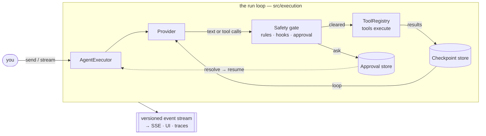

## What this is

Lousho is a library, not a service: `createAgent()` compiles an `AgentConfig` (model, instructions, tools, permissions, stores, hooks) into a runtime, and a *run* is one loop — the model emits text or tool calls, tools execute behind a safety gate, results feed back, and everything is checkpointed and emitted as events. Think of it as a **conveyor belt with a brake and a save button**: work moves around the loop automatically, a human can stop it at any tool call, and the whole belt can be powered off and restarted from the exact same spot.

## The mental model

Six nouns to hold while reading every page after this one:

| Noun | One line |
|---|---|
| **Run** | One `agent.send()`/`stream()`/`execute()` — start to `finishReason` |
| **Step** | One `provider.generate()` plus the tool calls it requests |
| **Checkpoint** | A saved step in the store — resume replays from it |
| **Gate** | The rules → hooks → `needsApproval` → permission-mode chain every tool call passes |
| **Store** | The `AgentStore` bundle: sessions, checkpoints, approvals, tokens |
| **Event stream** | The versioned JSON events every surface (SSE, UI, traces) reads |

## How it works

1. `agent.send(input)` enters `AgentExecutor.execute()` — everything needed is on `ExecuteOptions`; the executor is static and instance-free.
2. `prepareGenerateRequest` builds the model call; the provider turns `'openai/gpt-4o-mini'`-style specs into a real model through the provider layer (Vercel AI SDK, pi, OpenRouter, Ollama — or `mockModel` in tests).
3. The model replies with text or tool calls. Each tool call goes through the **gate**: permission rules → `preToolCall` hooks → the tool's own `needsApproval` → the permission-mode verdict — in that order, mode last and never un-denying.
4. `ask` doesn't wait in memory — `ApprovalGate` writes a durable record and the run *pauses*. `resume()` (possibly days later, another process) re-enters where it left off.
5. Cleared calls execute, results append in call order, and the turn + results are checkpointed — so a crash mid-batch resumes by *re-running the calls*, never by re-asking the model.
6. The loop ends on a text-only reply (`stop`), a pause, `maxSteps`, budget, abort, or error — every moment emitted on the event stream.

## The two control flows

The SDK deliberately ships two ways to sequence model work — pick by who owns the ordering:

- **The agent loop** — the model picks the next step every turn. Open-ended, bounded by `maxSteps`/`limits`/permissions. Most agents use this.
- **Flows** (`FlowBuilder`/`FlowExecutor`) — the harness owns the order; the model only fills `llmCall` nodes. Phase pipelines and "the order is the contract" work use this. Why both exist: [flow vs. loop](/design/flow-vs-loop).

## What hangs off the loop

| Subsystem | Contribution | Internals page |
|---|---|---|
| Permissions + approvals | Gate every tool call; pause durably on `ask` | [approvals](/core/approvals), [permission modes](/core/permission-modes) |
| Sessions | Multi-turn transcript, forking, pending-turn resume | [sessions](/state/sessions) |
| Storage | Sessions/checkpoints/approvals/tokens behind `AgentStore` | [storage stores](/state/storage-stores) |
| Memory + compaction | Scoped recall into the prompt; two-stage context pruning | [memory](/state/memory), [compaction](/state/compaction) |
| Tools | `defineTool`, registry, workspace, hosted, MCP, OpenAPI, tool search, code mode | [tool system](/tools/tool-system) |
| Composition | `task` sub-agents, `handoff`, flows, skills, agent dirs, `.claude/` loader | [compose](/compose/subagents) |
| Interfaces | routeHandler + SSE, UI bindings, channels, triggers, schedules, ACP, auth, OAuth | [server](/interfaces/server-and-routes) |
| Ship | `lousho` CLI, node-server/docker/worker builds, spec files, registry kits | [build targets](/ship/build-targets) |
| Typed decisions | `decide()` — the OpenAI Decisions API fast path for classify/route/score | [decisions](/providers/decisions) |

## Three properties that explain the codebase

- **Durability is structural, not optional.** Every step checkpoints into `AgentStore`. A paused approval is a stored fact, not an in-memory wait. → [durable execution](/core/durable-execution)
- **The model surface is swappable.** The loop only sees the shared generate/stream contract; provider specs resolve through `src/providers/`. → [provider architecture](/providers/architecture)
- **Everything observable is an event.** Runs emit versioned JSON events feeding SSE, UI bindings, the session client and traces — there is no separate "what happened" channel. → [streaming events](/core/streaming-events)
