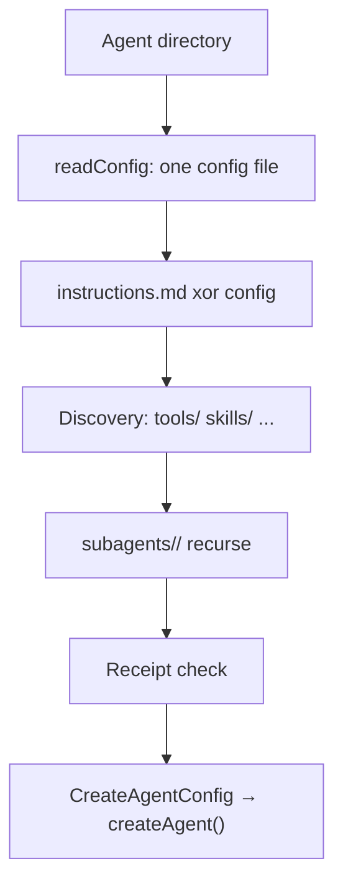

## What this is

An agent directory is a filesystem encoding of `createAgent()` options — like a `.env` file for
a whole agent: folders and files stand in for the arguments you'd pass in code. There is no
second runtime: `loadAgentDir()` reads the files, assembles a `CreateAgentConfig`, and calls
`createAgent()`; `resolveAgentDir()` stops one step earlier and hands you the config plus an
`AgentDirManifest` (a report of what was found). Loading *executes* the directory's code (`agent.ts`, `tools/*`), so only
trusted directories may be loaded.

## The mental model



Six nouns to hold: the **config file** (`agent.ts`/`.json`/`.yaml` — at most one), the
**instructions** (`instructions.md` xor a config field), the **discovered folders** (`tools/`,
`skills/`, `schedules/`, `channels/`, `memory/`), the **sub-agent dirs** (`subagents/<name>/`,
loaded recursively), the **receipt** (`lousho-registry.json` — what was installed, hashed), and
the **manifest** (a report of everything found).

## How it works

`resolveWith()` (`src/agentDir/loadAgentDir.ts`) resolves in order:

1. **Config** — `readConfig` finds the one config file among
   `agent.{ts,mts,js,mjs,cjs,json,yaml,yml}`; code files are imported via `importModule`,
   JSON/YAML parsed as data, then `validateConfig` checks keys — unknown keys fail with a
   `closest()` "did you mean" suggestion. `'engine'` is rejected at the top level (only valid
   under `subagents/`).
2. **Instructions** — `instructions.md` *xor* config `instructions` (both = error; neither =
   error). Then `instructions/<family>.md`: files are scanned sorted and the first whose stem
   (`openai`, `anthropic`, …) is *contained in the resolved model id* is appended as a prompt
   tail — the per-family instruction pattern coding harnesses use.
3. **Model source** — override → config → inherited from parent; a `provider/model` string can't
   ride along with a provider instance.
4. **Configured code** — `hooks`/`approve` config values may be paths (resolved inside the dir
   only, `.ts`→`.js` compiled siblings honored) or inline values; `store: { "dir": ... }` becomes
   a [`fileStore()`](/state/storage-stores) rooted in the agent dir.
5. **Discovery** — `tools/*.{ts,js,...}` (each may default- and named-export `defineTool()`
   tools), `skills/` (via [`loadSkills`](/compose/skills)), `schedules/`, `channels/`, `memory/`, and a root
   `auth.{ts,js}` for route auth (returned on `ResolvedAgentDir.auth`, not auto-mounted).
6. **Sub-agents** — `subagents/<name>/` recurses through `resolveWith()`; each needs a
   `description` (the parent model picks by it) and becomes a `delegate_to_<name>` tool calling
   the child's `send()`. With `"engine": "pi"` the dir becomes a [`piAgent()`](/compose/subagents)
   instead, landing in the parent's `subagents` map (the `task` tool): `cwd` is the *parent's* directory, `model`
   must be a `pi/<provider>/<model>` id (the prefix is stripped), and `permissions` gate Pi's own
   tool calls. A `subagents` override replaces discovery entirely — the files aren't even read.
7. **Receipt** — `verifyReceipt` (`registryEnforce.ts`) re-hashes every file
   `lousho-registry.json` recorded at install; `confineToolsToReceipt` then wraps each
   receipt-owned tool in its accepted [permission](/core/permission-modes) manifest (see
   [registry kits](/ship/registry-kits) for who writes it).

Overrides win over the directory at every point (`tools`/`skills` replace rather than merge;
`memory` merges by name with the override winning a clash).

## Under the hood

- The receipt envelope is enforced **in-process**: `exec`/`needsApproval` manifests force every
  call through approval, `network` confines `globalThis.fetch` during the call to declared hosts,
  `env` proxies `process.env` to declared names — both scoped by `AsyncLocalStorage` to the
  running tool call — and `requiresSandbox` tools get a narrowed adapter (`run()` refused without
  `exec`, `writeFile()` without `filesystem: "write"`).
- An `unattested` item — files modified or missing since install — warns and *always* asks,
  because a stale receipt must not silently certify changed code.
- `importModule` supports `withFreshImports` cache busting (`?t=<token>`, for `lousho dev`) and
  `explainImportError` names the TS-loader fix.
- `AgentDirOverrides` is `CreateAgentConfig` plus `approve`/`hooks` accepting `null` (strips the
  wiring; the file isn't even imported) and `piAgent` (merged into every `engine: 'pi'`
  sub-agent dir).

## In code

| Symbol | File | Role |
|---|---|---|
| `loadAgentDir` / `resolveAgentDir` | `src/agentDir/loadAgentDir.ts` | Directory → `createAgent()` / `CreateAgentConfig` + manifest |
| `readConfig` / `validateConfig` | `src/agentDir/readConfig.ts` + `validateConfig.ts` | Find the one config file; check its keys ("did you mean") |
| `loadTools` / `loadSchedules` / `loadChannels` / `loadMemory` / `loadAuth` | `src/agentDir/` | Per-folder loaders, all on the `loadDefaultExports` pattern |
| `listSubagentDirs` / `delegateTool` | `src/agentDir/subagents.ts` | `subagents/<name>/` → `delegate_to_<name>` tools |
| `verifyReceipt` / `confineToolsToReceipt` / `registryWarnings` | `src/agentDir/registryEnforce.ts` | `lousho-registry.json` attestation + tool confinement |
| `importModule` / `withFreshImports` | `src/agentDir/importModule.ts` | Dynamic import with `?t=` cache busting |

## Example

```ts
import { loadAgentDir } from '@lousho/build-ai-agent';

const agent = await loadAgentDir('./my-agent', { provider }); // overrides beat files
const { config, manifest } = await resolveAgentDir('./my-agent');
manifest.tools;      // discovered tool names
manifest.registry;   // attested/unattested receipt status
```

`loadAgentDir` reads `./my-agent`, assembles the config (the caller's `provider` wins over
anything the files declared) and returns a running agent. `resolveAgentDir` is the same pipeline
minus the `createAgent()` call — useful for tooling that wants to inspect `manifest` before
committing.

## Design decisions

- **The code API is the source of truth.** A directory produces the same `CreateAgentConfig`
  you'd write by hand; anything weird (an empty `instructions.md`, two config files, a bad
  sub-agent dir name — `^[a-zA-Z0-9_-]{1,50}$` since it becomes a tool name) fails at load with
  `LOUSHO_AGENT_DIR_INVALID` naming the file.
- **Manifests bind tools, not directories.** The guards can only intercept what JS can intercept:
  `fetch` and `process.env`. `http`/`net` traffic, the filesystem and module-scope references are
  outside the envelope — the install-time static check covers the visible forms, and this limit
  is documented rather than papered over.
- **`null` means strip, `undefined` means keep.** For `approve`/`hooks` the override
  distinguishes "leave the directory's wiring" from "remove it" — the difference between a test
  harness that approves everything and one that forgets to.
- **Pi dirs are peers, not children.** A `engine: 'pi'` sub-agent deliberately bypasses
  `delegate_to_*` and joins the parent's `task` surface so approvals pause the lead durably.

## Where next

- [Sub-agents](/compose/subagents) — `delegate_to_*` vs the `task` tool, and `piAgent()`.
- [Skills](/compose/skills) — the `skills/` loader.
- [Registry kits](/ship/registry-kits) — what writes `lousho-registry.json`.
- User docs: [Agent directories](https://lousho.com/agent-directories).
