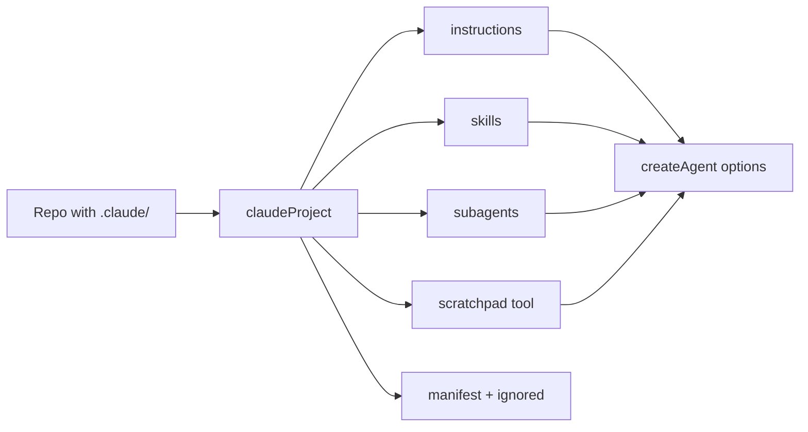

## What this is

Claude Code users already keep agent context in conventional places — `CLAUDE.md`,
`.claude/rules/`, `.claude/skills/`, `.claude/agents/`, `.claude/scratchpad/`. `claudeProject()`
reads that layout and returns a `ClaudeProject` object that spreads straight into `createAgent()`
— like an import wizard for a repo that was never written for this SDK. Unlike
[`loadAgentDir`](/compose/agent-directories),
**nothing in the directory executes**: every file is read as markdown data or YAML frontmatter —
the tool surface stays whatever the caller passes to `createAgent()`.

## The mental model



Five nouns to hold: the **conventions** (the fixed file/folder names), the **frontmatter** (YAML
at the top of a markdown file), the **`ClaudeProject`** (the spreadable result), the **manifest**
(the report of what loaded), and **`manifest.ignored`** (conventional files seen but not loaded).

## How it works

`claudeProject(dir, options)` (`src/claude/claudeProject.ts`) resolves `dir` (default
`process.cwd()`) plus its `.claude/` folder, then maps one function per convention:

1. **`CLAUDE.md` / `AGENTS.md`** → `instructions`. Both are concatenated when present; `AGENTS.md`
   gets a `## AGENTS.md` heading so its origin stays visible in the merged prompt.
2. **`.claude/rules/*.md`** → appended to `instructions`, one `## <filename>` section each, sorted
   by filename. Frontmatter is stripped (Claude Code treats rules as always-on); empty bodies are
   skipped. `rules: false` skips the folder.
3. **`.claude/skills/<name>/SKILL.md`** → `skills`, loaded by the shared
   [`loadSkills()`](/compose/skills) — the layout is identical, so no adapter exists.
4. **`.claude/agents/*.md`** → `subagents`. `parseAgentFile` requires frontmatter `name` and
   `description` (Claude Code's own contract) and a non-empty body, which becomes the sub-agent's
   `instructions`. `model` frontmatter selects that agent's model; otherwise the caller's
   `provider`/`model` applies — a file with neither throws `LOUSHO_CONFIG_INVALID` naming it.
   A `tools` frontmatter list is *recorded but not enforced*: Lousho
   [sub-agents](/compose/subagents) share the lead's tool registry, so narrowing is done with
   [permission rules](/core/permission-modes) instead. `agents: false` skips the
   folder.
5. **`.claude/scratchpad/`** → a `scratchpad` tool (`write`/`append`/`read`/`list` of `<name>.md`
   notes confined to that directory; note names match `^[a-z0-9][a-z0-9-_]{0,60}$`,
   case-insensitive). The directory is created on first write, so `scratchpad: true` can offer
   the tool before it exists.
6. **`.claude/commands/`, `settings*.json`, `mcp.json`** → listed on `manifest.ignored`, not
   loaded.

## Under the hood

- Everything is Node `fs` reads plus `parseYaml` on frontmatter — no `import()`, no
  `createAgent()` until `buildSubagent` constructs each sub-agent from *parsed data* with the
  caller's provider.
- `ClaudeProjectOptions` also carries `provider`/`model` for the `.claude/agents` sub-agents
  (their own `model` frontmatter wins).
- `ClaudeProjectManifest` reports `instructionFiles`, `rules`, `skills`, `subagents`,
  `scratchpad` and `ignored` — so tooling can show exactly what became what.

## In code

| Symbol | File | Role |
|---|---|---|
| `claudeProject` | `src/claude/claudeProject.ts` | Entry point; returns `{ instructions?, skills?, subagents?, tools?, manifest }` |
| `ClaudeProjectOptions` / `ClaudeProjectManifest` | `src/claude/claudeProject.ts` | Caller options and the "what loaded" report |
| `rootInstructionParts` / `ruleParts` | `src/claude/claudeProject.ts` | `CLAUDE.md`/`AGENTS.md` + rules → one `instructions` string |
| `parseAgentFile` / `buildSubagent` | `src/claude/claudeProject.ts` | `.claude/agents/*.md` frontmatter → `createAgent()` sub-agent |
| `loadClaudeSkills` | `src/claude/claudeProject.ts` | `.claude/skills` via the shared `loadSkills()` |
| `scratchpadTool` / `noteFile` | `src/claude/claudeProject.ts` | Confined `write`/`append`/`read`/`list` of `*.md` notes |

## Example

```ts
import { createAgent, claudeProject } from '@lousho/build-ai-agent';

const project = await claudeProject('./my-repo', { provider });
const agent = createAgent({ provider, ...project });

project.manifest.ignored;   // e.g. ['commands', 'settings.json']
project.manifest.subagents; // names built from .claude/agents/*.md
```

`claudeProject` scans the repo and returns spreadable options; the caller's `provider` supplies
the model for any `.claude/agents` file that doesn't set `model` in frontmatter. A
`.claude/agents/reviewer.md` like this becomes `subagents.reviewer`:

```markdown
---
name: reviewer
description: Reviews diffs for correctness
model: openrouter/openai/gpt-4o-mini
---

You review code ruthlessly. Report findings, never rewrite.
```

## Design decisions

- **Read as data, never executed.** This is the security boundary that separates `claudeProject`
  from `loadAgentDir`: a repo you don't trust is safe to scan because no file in `.claude/` is
  imported. Sub-agents are *built* from frontmatter strings, not loaded.
- **Ignored entries are reported, not dropped.** `manifest.ignored` names `commands`,
  `settings.json`, `settings.local.json` and `mcp.json` precisely because Claude Code users will
  wonder where they went — slash commands map conceptually to flows, and MCP config maps to
  `mcpServers`, but neither is translated automatically (silently mis-translating is worse than
  listing it).
- **`tools` frontmatter is advisory.** Claude Code sub-agents may declare a tool list; enforcing
  it would require a per-agent registry Lousho sub-agents don't have. It lands on the manifest as
  metadata.
- **Instructions compose by concatenation.** Rules become `## <file>` sections rather than
  separate messages so the merged `instructions` stays one system-prompt string — the same shape
  `createAgent({ instructions })` already takes.

## Where next

- [Agent directories](/compose/agent-directories) — the executing counterpart; contrast its trust model.
- [Skills](/compose/skills) and [Sub-agents](/compose/subagents) — where the loaded pieces land.
- User docs: [Claude Code projects](https://lousho.com/claude-projects).
