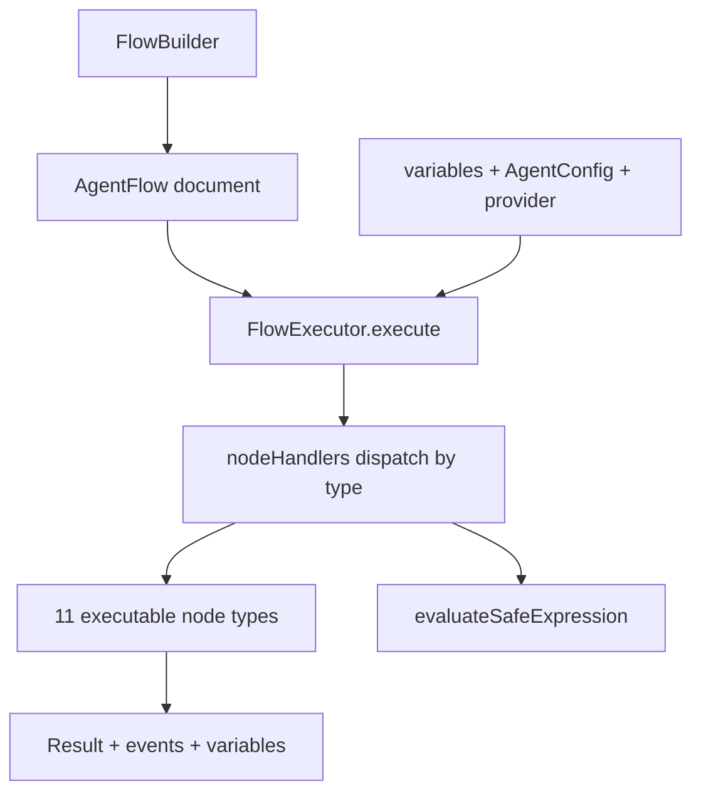

## What this is

A flow is a recipe written down up front: a fixed graph of steps — call the model, call a tool,
branch, loop — that runs exactly as declared instead of leaving step order to the model. Where an
agent run improvises, a flow executes. `FlowBuilder` produces an `AgentFlow` document (data, not
code); the static `FlowExecutor.execute(flow, context, onEvent?)` interprets it against a plain
agent config, a [provider](/providers/architecture) and a bag of variables.

## The mental model



Six nouns to hold: the **flow document** (`AgentFlow`, pure data), the **executor** (stateless,
static), the **variables bag** (`context.variables`, mutated as nodes write to it), the **node
type** (one handler per `type`), the **safe expression** (the condition language — no `eval`),
and the **events** (`step-start`/`step-complete`/`step-error` brackets).

## How it works

1. `FlowBuilder` (`src/flows/FlowBuilder.ts`) builds the document: `setCode`/`setName`/`setInputs`
   /`setFlow`/`addAgent` then `build()` — both `code` and `name` are required and input names must
   be unique.
2. `FlowExecutor.execute()` (`src/flows/FlowExecutor.ts`) wraps the run in an `invoke_workflow`
   span and shallow-copies `context.variables`, which every later node can read and write.
3. `executeNode()` dispatches each node through `nodeHandlers`, a `Map` of one handler per `type`
   (populated from `handlersByType`, so narrowing by `node.type` picks the right node shape).
   Every node runs inside a `flow.node {type}` span and a `step-start`/`step-complete`/
   `step-error` event bracket; `steps` in the result counts `step-complete` events.
4. The 11 executable node types:

   | `type` | Handler reads | Result |
   |---|---|---|
   | `sequence` | `steps[]` | last step's result |
   | `parallel` | `steps[]` | `Promise.all` results array — first rejection fails the flow |
   | `oneOf` | `options[]` (`{ condition?, step }`) | first matching option's step result; `null` if none; no `condition` = default |
   | `forEach` | `items`, `itemVariable`/`indexVariable` (default `item`/`index`), `step` | array of per-item results |
   | `evaluator` | `expression` | `evaluateSafeExpression` value |
   | `llmCall` | `prompt`, `model`, `temperature`, `maxTokens`, `outputVariable` | generated text; `agent.prompt` becomes the system message |
   | `toolCall` | `tool`, `arguments`, `outputVariable` | tool result; `requiresSandbox` tools route through `context.sandbox ?? NoopSandbox` |
   | `setVariable` | `variable`, `value` | the stored value |
   | `return`, `end` | `value` | the resolved value |
   | `throw` | `message` | throws `Error` (interpolated) |
5. Strings starting with `$` are variable references (`resolveValue`); `{{name}}` placeholders in
   prompts and arguments are text-spliced (`interpolate`).

## Under the hood

- **Two `{{var}}` dialects.** `interpolate()` replaces `{{name}}` via `/\{\{(\w+)\}\}/g` — flat
  keys only; `{{a.b}}` matches nothing and stays literal. But `oneOf` conditions and `evaluator`
  expressions go through `evaluateSafeExpression` with `bindPlaceholders: true`, where `{{name}}`
  binds as a *value* (never text-spliced) and `a.b[0]`, `.length`, `.includes()`,
  `.startsWith()`, `.endsWith()` are legal. A bad `oneOf` condition evaluates to `false`; a bad
  `evaluator` expression becomes [`LOUSHO_FLOW_EXECUTION_FAILED`](/core/errors).
- **No `eval`, ever.** `safeExpression` tokenizes, parses (recursive descent, `MAX_DEPTH` 64) and
  walks the AST itself. `constructor`/`__proto__`/`prototype` keys and globals are refused;
  non-comparison operators require primitives; methods are a three-name allowlist.
- **Two node vocabularies, one union.** `EditorStep = EditorShapeStep | RuntimeStep`
  (`src/types/flow.ts`). `EditorShapeStep` (`step`, `bestOfAll`, `condition`, `loop`,
  `uiComponent`, `tool`, plus `oneOf`/`forEach`/`evaluator` with editor fields like `branches`/
  `inputFlow`/`criteria`) is what visual editors emit; `RuntimeStep` is what the handlers read.
  Only `RuntimeStep` plus `sequence`/`parallel` execute — an editor-shape `oneOf` (`branches`)
  has no `options`, so it matches nothing and yields `null`; `loop` isn't in `nodeHandlers` at
  all and fails as `LOUSHO_FLOW_INVALID`. Retries are built as explicit `oneOf` ladders.
- **`return`/`end` produce values, not control flow.** Both resolve `value` and hand it to the
  parent node; an enclosing `sequence` keeps running and its *last* step wins. To actually stop a
  flow, `throw`, or put the remainder inside a `oneOf` branch.
- **The agent is data, not an instance.** `context.agent` is a plain `AgentConfig` — `prompt` is
  the `llmCall` system message, `settings.model` its fallback model. `isCreateAgentResult` (the
  `send` method check) rejects a real agent with `LOUSHO_CONFIG_INVALID` rather than silently
  dropping its instructions (LOU-R14); `FlowBuilder.addAgent` rejects it too.
- **Depth and sandbox are guarded.** `assertWithinDepthLimit` caps nesting at `maxDepth` (default
  100) — recursion through `sequence`/`parallel`/`oneOf`/`forEach` children, not flow re-entry —
  and `executeToolWithSandboxGuard` is shared with `AgentExecutor`, so a flow can't bypass
  `requiresSandbox` routing (the LOU-F fix). Separately, `inputs.ts` (`injectVariables`,
  `createDynamicZodSchemaForInputs`, `validateFlowInput`) targets a different agent-style flow
  format (`{ agent: 'sequenceAgent', input: ... }`) with `@var` substitution — `FlowExecutor`
  never reads it.

## In code

| Symbol | File | Role |
|---|---|---|
| `FlowBuilder` | `src/flows/FlowBuilder.ts` | Metadata builder → `AgentFlow` (`code`/`name` required) |
| `FlowExecutor` | `src/flows/FlowExecutor.ts` | Stateless static executor; `execute()` → `{ success, output, variables, steps, events, error? }` |
| `nodeHandlers` / `handlersByType` | `src/flows/FlowExecutor.ts` | One handler per node `type`; unknown types → `LOUSHO_FLOW_INVALID` |
| `interpolate` / `resolveValue` | `src/flows/FlowExecutor.ts` | `{{name}}` text splice (\w+ flat keys); `$name` variable reads |
| `evaluateSafeExpression` / `ExpressionError` | `src/flows/safeExpression.ts` | The condition/`evaluator` language — no `eval` |
| `validateFlow` / `isCreateAgentResult` | `src/flows/validators.ts` | Shape checks; reject `createAgent()` results |
| `injectVariables` / `validateFlowInput` | `src/flows/inputs.ts` | Separate agent-style flow format — unused by `FlowExecutor` |
| `EditorStep` / `RuntimeStep` / `EditorShapeStep` | `src/types/flow.ts` | The two node vocabularies, one union |

## Example

```ts
import { FlowBuilder, FlowExecutor, type EditorStep } from '@lousho/build-ai-agent/flows';

const steps: EditorStep = {
  type: 'sequence',
  steps: [
    { type: 'llmCall', prompt: 'Classify: {{message}}', outputVariable: 'category' },
    {
      type: 'oneOf',
      options: [
        { condition: "'{{category}}' === 'billing'", step: { type: 'return', value: 'billing' } },
        { step: { type: 'return', value: 'other' } }, // default: no condition
      ],
    },
  ],
};

const flow = new FlowBuilder().setCode('triage').setName('Triage')
  .addInput({ name: 'message', type: 'shortText', required: true })
  .setFlow(steps).build();

const result = await FlowExecutor.execute(flow, {
  agent: { name: 'triage', prompt: 'You triage support mail.' }, // plain AgentConfig
  provider,
  variables: { message: input },
});
```

The `sequence` runs its children in order. `llmCall` text-splices `{{message}}` into the prompt,
asks the provider, and stores the answer as `category`. Then `oneOf` evaluates each `condition`
with `evaluateSafeExpression` — `{{category}}` binds as a value, so quoting stays inside the
expression — and runs the first match; the optionless last option is the default. `result`
carries `output` (`'billing'` or `'other'`), the final `variables`, and the emitted `events`.

## Design decisions

- **Deterministic beats clever.** The step order is the document's, so a flow is auditable and a
  visual editor can round-trip it — the price is `EditorShapeStep`/`RuntimeStep` coexisting in
  one union.
- **No `eval`, ever.** A hand-written evaluator keeps `{{var}}` conditions honest at the cost of
  a small grammar.
- **Values, not control flow, from `return`/`end`.** Composition stays simple; early exit is
  expressed structurally (`oneOf`) or by failing (`throw`).
- **Shared seams.** Agent config, tool sandbox and provider are the same types an agent run uses,
  so flows can't drift into a second runtime.

## Where next

- [Flow vs loop](/design/flow-vs-loop) — why retries are `oneOf` ladders.
- [Streaming events](/core/streaming-events) — the `FlowExecutionEvent` surface.
- User docs: [Flows](https://lousho.com/flows).
