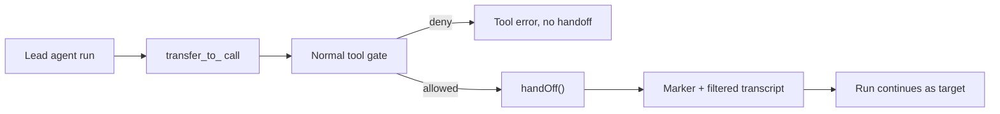

## What this is

A handoff passes the whole conversation to another `createAgent()` agent — like a support call
being transferred: the specialist picks up the same call history, and the first agent hangs up.
Where a [sub-agent](/compose/subagents) is a tool call whose result comes back to the lead, a handoff is a transfer:
the run continues as the target — its instructions, model, tools and skills — inside the same
`send()`/`stream()`, and in a session the target stays the active agent for later turns.

## The mental model



Six nouns to hold: the **handoff target** (a `createAgent()` agent), the **`transfer_to_<name>`
tool** (how the model asks), the **gate** (permissions/hooks decide like any tool), the
**marker** (`metadata.handoff = { from, to }` in the transcript), the **`inputFilter`** (what the
target sees), and **`maxHandoffs`** (the run's transfer budget, default 5).

## How it works

1. `createAgent()` calls `registerHandoffAgent()` (`src/handoffAgents.ts`), so every agent
   carries a `HandoffRegistration` — `name`, `description`, a `handoffs()` getter, a `resolve()`
   for its spec, and `runLevelOptions`. `checkHandoffs()` then enforces: every target is a
   `createAgent()` agent (a `remoteAgent()` is rejected — use it as a sub-agent), has a `name`
   and `description`, names and `transfer_to_<name>` tool names are unique, and no agent hands
   off to itself.
2. `handoffRunner()` builds the reachable graph per run — BFS over each node's `handoffs()`,
   names unique across it — and resolves `isEnabled` per target, producing `ResolvedHandoff[]`.
3. The executor offers each handoff as a `transfer_to_<name>` tool (`runTools`,
   `src/execution/handoffRun.ts`). Calls route through `handoffToolRegistry`, whose descriptor
   passes the *same gate as any tool call*: a [`deny`](/core/permission-modes) rule becomes a
   `kind: 'denied'` tool error and no handoff happens; `ask` pauses the run for
   [approval](/core/approvals) and the decided call then hands off; hooks may deny or rewrite
   args; the decision is audited.
4. `takeHandoffCalls()` honors only the *first* handoff call of a turn — the rest get
   `kind: 'not-run'` tool results — and `maxHandoffs` (default 5, `DEFAULT_MAX_HANDOFFS`) caps
   the run.
5. `handOff()` writes a tool result carrying `metadata.handoff = { from, to }`, appends a routing
   system note with the validated arguments, applies `inputFilter`, calls `onHandoff`, and
   rebuilds the run options for the target via `asTarget()`.

## Under the hood

- `activeAgentOf()` scans the transcript's last handoff marker, so session turns,
  `agent.resume()`, `session.resume()` and approval resolution all continue as the handed-to
  agent — the drift check compares against it too. The marker *is* the record of who is active;
  no separate "current agent" field exists to get out of sync.
- `asTarget()` merges configs: the target keeps its own agent/provider/tools/skills/sub-agents/
  reasoning, while the lead's guardrails and permission rules run *before* its own. Everything
  else — approval/checkpoint/token stores, hooks, `limits`, spend, `maxSteps` (counted across
  agents), signal, `output`, permission mode, principal — stays the run's.
- `warnRunLevelOptions()` logs one `console.warn` per target whose `approve`, `approvalStore`,
  `permissionMode`, `approvalTtlMs` or `store` will never be consulted after a handoff — no
  warning when the target *is* the lead (a hand back), where they do apply.
- `forgetApprovals()` drops `once()`-remembered approvals from the transcript so a grant never
  leaks into another agent's context.
- An `inputFilter` that drops everything throws `ConfigurationError` (`keep at least one`);
  `handoffFilters.removeToolCalls` keeps the marker itself so resume still recognizes the switch.

## In code

| Symbol | File | Role |
|---|---|---|
| `handoff` / `handoffFilters` | `src/handoffs.ts` | Public option objects; a bare agent in `handoffs` is `handoff(agent)` |
| `registerHandoffAgent` / `checkHandoffs` | `src/handoffAgents.ts` | `HandoffRegistration` tagging; per-agent validation |
| `handoffRunner` | `src/handoffAgents.ts` | Per-run BFS over the graph → `ResolvedHandoff[]` |
| `asTarget` / `warnRunLevelOptions` | `src/handoffAgents.ts` | Merge target spec with run options; warn on dropped options |
| `runTools` / `handoffToolRegistry` | `src/execution/handoffRun.ts` | Offer + gate `transfer_to_*` like a normal tool |
| `splitHandoffCalls` / `takeHandoffCalls` | `src/execution/handoffRun.ts` | Separate handoff calls; first-per-turn + `maxHandoffs` budget |
| `handOff` / `activeAgentOf` | `src/execution/handoffRun.ts` | Write the marker, filter the transcript, switch the run |
| `resumeHandoffCall` | `src/execution/resume.ts` | Carry out an approved `transfer_to_*` after a pause |

## Example

```ts
const billing = createAgent({ name: 'billing', description: 'Charges, refunds, subscriptions', model: 'openai/gpt-4o-mini', instructions: '...' });

const triage = createAgent({
  name: 'triage',
  model: 'openai/gpt-4o-mini',
  instructions: 'Route the user.',
  handoffs: [handoff(billing, { inputFilter: handoffFilters.removeToolCalls })],
});
```

`billing` is a normal agent; `triage` lists it as a handoff target, so the triage model's tool
list gains `transfer_to_billing`. When the model calls it, the call passes the permission gate,
`handOff()` records `{ from: 'triage', to: 'billing' }` in the transcript, the `inputFilter`
strips tool-call noise so billing sees a clean conversation, and the run keeps going — now with
billing's instructions, model and tools.

## Design decisions

- **Transfer, not delegation.** The handing-off agent never sees the target's answer; the
  transcript changes hands. Choose handoffs when a specialist should talk to the user; choose
  sub-agents when the lead needs a result back.
- **Gated like a tool, executed like a transfer.** Letting `transfer_to_*` flow through the
  normal gate means `permissions`, hooks and approval pause/resume work on handoffs for free —
  but its "result" is just the `{ transferred_to }` marker record.
- **Run-level options belong to the entry agent.** A target's approval config is never consulted
  after a handoff — one `console.warn` instead of silently dropping it.
- **Approvals don't cross a handoff.** `forgetApprovals()` drops `once()`-remembered approvals so
  a grant never leaks into another agent's context.
- **Resume keys on the transcript, not state.** The last `metadata.handoff` marker *is* who is
  active — nothing else can disagree with it.

## Where next

- [Sub-agents](/compose/subagents) — the delegation alternative, and `SubagentSpec` both mechanisms share.
- [Approvals](/core/approvals) and [Permission modes](/core/permission-modes) — the gate a handoff call passes.
- User docs: [Handoffs](https://lousho.com/handoffs).
