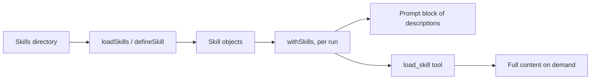

## What this is

A skill is a named bundle of instructions — `{ name, description, content }`, three strings and
no runtime. The problem it solves: an agent may need dozens of specialist playbooks, but pasting
them all into the system prompt makes every request pay for them. Skills are progressive
disclosure — like a library's card catalog: the model reads only a one-line description per
skill and calls the `load_skill` tool to fetch the full card it actually needs.

## The mental model



Five things exist: the **skill** (frozen data), the **prompt block** (the catalog lines the model
skims), the **`load_skill` tool** (the only door to `content`), the **tool registry** (cloned,
never mutated), and the **run** (where the wiring happens — not at `createAgent()` time).

## How it works

1. `defineSkill({ name, description, content })` (`src/skills/defineSkill.ts`) validates `name`
   against `/^[a-z0-9][a-z0-9-_]{0,63}$/` — file- and tool-name friendly — requires non-empty
   `description` and `content`, and freezes the `Skill`. Bad input is `LOUSHO_SKILL_INVALID`
   with a rename suggestion derived from the bad name.
2. `loadSkills(dir)` (`src/skills/loadSkills.ts`) scans a directory for two layouts that may be
   mixed: `dir/<name>/SKILL.md` (the Anthropic/open-harness convention — folders without a
   `SKILL.md` are skipped) and `dir/<name>.md`. Each file's YAML frontmatter must carry
   `description`; `name` is optional and defaults to the folder or file name. The result is
   sorted by name, so prompt order is deterministic.
3. At run start, `withSkills(agent, toolRegistry, skills)` delegates to `withPromptTool`, which
   clones the registry, registers `load_skill` (`createLoadSkillTool`), and appends an
   "## Available skills" block — `- name: description` per skill, plus the instruction to call
   `load_skill` first.
4. When the model calls `load_skill({ name })`, `execute` looks the name up in a `Map` and
   returns `skill.content` — landing in the transcript at the moment the model decided it needed
   it.

## Under the hood

- A missing or non-mapping frontmatter errors naming the file; a `description` that is absent or
  blank does the same. Duplicate skill names across files throw.
- An unknown `name` throws a [`toolFailure`](/core/errors) listing the valid names — the model
  reads it and retries, rather than the run failing.
- `load_skill` is annotated `readOnlyHint: true`, so it is callable in
  [`plan` mode](/core/permission-modes) — reading a skill changes nothing.
- If the agent already has a `load_skill` tool, `withSkills` throws `LOUSHO_SKILL_INVALID`:
  silently shadowing a user's tool is worse than failing loudly. Duplicate names across the
  `skills` array itself throw too.
- Skills resolve per run, not per agent — which is why `AgentExecutor.execute({ skills })` can
  attach skills to a one-off run and a `createAgent()` agent's skill set can be swapped without
  rebuilding it.

## In code

| Symbol | File | Role |
|---|---|---|
| `defineSkill` | `src/skills/defineSkill.ts` | Validates name/description/content; freezes a `Skill` |
| `loadSkills` | `src/skills/loadSkills.ts` | Reads `SKILL.md` / `<name>.md` + frontmatter, dedupes, sorts |
| `withSkills` | `src/skills/withSkills.ts` | Per-run wiring: collision check, then `withPromptTool` |
| `withPromptTool` | `src/skills/withSkills.ts` | Shared "one tool + one prompt block" helper (sub-agents reuse it) |
| `createLoadSkillTool` | `src/skills/withSkills.ts` | The `load_skill` tool — `Map` lookup returning `content` |

## Example

```ts
import { createAgent, defineSkill, loadSkills } from '@lousho/build-ai-agent';

const changelog = defineSkill({
  name: 'changelog',
  description: 'How to write a changelog entry',
  content: '# Changelog entries\n\nUse the imperative mood and link the PR.',
});

const agent = createAgent({
  provider,
  prompt: 'You are a release engineer.',
  skills: [changelog, ...(await loadSkills('./skills'))],
});
```

`defineSkill` makes one skill in code; `loadSkills` adds every skill file under `./skills`. The
agent's prompt gains `## Available skills` with one line each — not their bodies. When the model
asks `load_skill({ name: 'changelog' })`, the markdown comes back as a tool result.

## Design decisions

- **The prompt lists; the tool delivers.** Paying ~one line per skill per request instead of the
  whole corpus is the entire point; `content` never enters the prompt implicitly — it lands in
  the transcript only when the model asked for it.
- **Errors are self-correcting tool results.** An unknown name is a `toolFailure`, not a run
  failure — the model gets the valid list and retries.
- **Skill names are tool names.** Anything file-unsafe or uppercase is rejected at `defineSkill`
  time, not at call time.
- **A `load_skill` collision is config, not shadowing.** The run refuses to start rather than
  silently replace a user's tool.

## Where next

- [Agent directories](/compose/agent-directories) — `skills/` folders load through this same `loadSkills`.
- [Claude projects](/compose/claude-projects) — `.claude/skills/*/SKILL.md` reuse it unchanged.
- [Permission modes](/core/permission-modes) — why `load_skill` is read-only.
- User docs: [Skills](https://lousho.com/skills).
