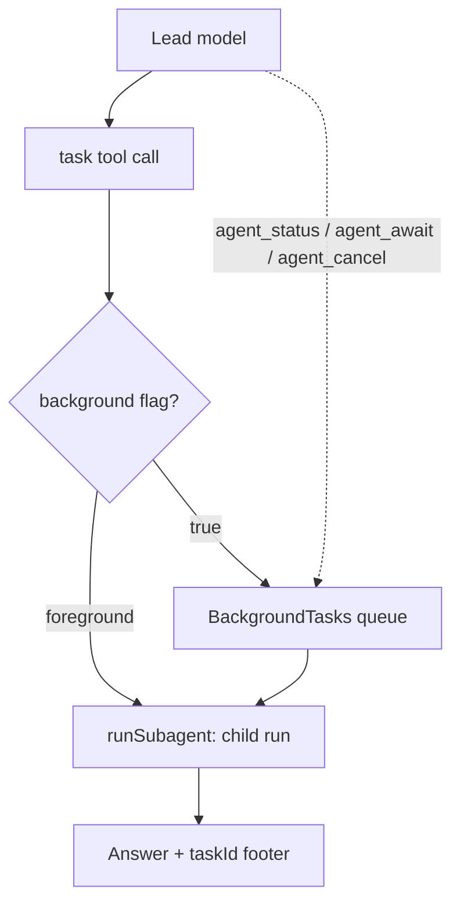

## What this is

A sub-agent is a separate agent the lead delegates work to — like a manager assigning a
self-contained ticket to a specialist who hands back one report. The `subagents` option gives a
lead agent ONE `task` tool to delegate with, plus a system-prompt block listing who it can call.
The point is context isolation: a child sees only the prompt the lead wrote, never the lead's
transcript, and pays for its own model, tools and steps while the lead pays only for the task
prompt and the final answer.

## The mental model



Five nouns to hold: the **`task` tool** (the single delegation surface), the **sub-agent spec**
(the child's run configuration), the **background queue** (`BackgroundTasks`, capped by
`maxConcurrent`), the **task session** (the child's transcript, resumable by `taskId`), and the
**approval pause** (`SubagentApprovalPause`, which pauses the *lead*).

## How it works

1. `createAgent()` calls `registerSubagent()`, so each child agent carries a `SubagentSpec` (or a
   per-prompt resolver) in a `WeakMap`. The `subagents` record maps names to `createAgent()`
   agents, `remoteAgent()`/`piAgent()` handles, or a `SubagentCatalog` (`list()`/`resolve()`).
2. At run start, `withSubagents()` (`src/subagents/withSubagents.ts`) validates the record
   (`assertSubagents`: every entry must be a `createAgent()` agent with a `description`), lists
   catalog summaries, and returns the agent unchanged when there are no sub-agents or the depth
   budget is spent (`subagentBudget()`, default `maxSubagentDepth` 1).
3. `withPromptTool()` appends the "Available sub-agents" block and registers `task`
   (`createTaskTool`) plus the three background tools. Inputs are never mutated — the registry is
   cloned.
4. The lead calls `task` with `{ agent, prompt, description, background?, taskId?, mode? }`. The
   `agent` argument is a zod `enum` over the listed names — the model literally cannot name a
   sub-agent that wasn't listed.
5. A foreground call runs the child through `runSubagent()` (`src/execution/delegation.ts`) with
   `[...history, { role: 'user', content: prompt }]` as its whole input; the result is the
   child's final text (or its `output` object as JSON) plus a footer
   `[sub-agent '<name>': N step(s), finish reason '...', taskId '...']`.
6. With `background: true` the run goes to `BackgroundTasks` (per lead run), which queues at
   `maxConcurrent` (default 3) and returns `{ taskId, status, agent }` immediately. The lead
   observes and steers the queue with `agent_status`, `agent_await` and `agent_cancel`.
7. At run end, `onRunEnd` cancels still-active tasks (or awaits them with
   `awaitBackgroundOnFinish`) and reports them on `result.backgroundTasks`.

## Under the hood

- Several `task` calls in one turn run in parallel — that is the fan-out mechanism; there is no
  separate parallel API.
- Non-`stop`/`length` finishes (abort, `max-steps`, `output-invalid`) become `toolFailure`s the
  model can read and retry — see `failureReason()`.
- Task sessions (`TaskSessions`, LOU-Y6) keep child transcripts by `taskId` so the lead can
  `resume` or `fork` a task. Records live in the lead's [SessionStore](/state/sessions) under
  `subagent-task-<sha256(scope + taskId)>` — hashed so ids never collide across lead sessions —
  behind a `lousho-subagent-task` header message; runs without a session keep them in a per-run
  `Map`.
- `remoteAgent()` (LOU-Y7) is a `RemoteSubagent` that POSTs the prompt to `<url>/chat` via the
  shared session client; a resumed task reuses its remote `sessionId`. It runs under its own
  server's permissions, so it is refused in [`plan` mode](/core/permission-modes), and its
  approval pause only propagates when the lead has an `approvalStore` (`pausable`).
- `piAgent()` adapts the Pi coding agent (`@earendil-works/pi-coding-agent`, lazy optional peer):
  each `task` call is one Pi session under the task's `sessionId`, and a `tool_call` extension
  handler gates every Pi tool call against the [`permissions`](/core/permission-modes) rules.
- A paused child throws `SubagentApprovalPause` (a
  [`PropagatingToolError`](/core/errors)), which unwinds to the executor and pauses the lead
  durably. A paused background task shows `awaiting-approval`;
  `agent_await` re-throws it as the lead's own pause (`pauseOnFirst`/`resumeAwaited`), and resume
  re-enters the same `agent_await` call with the suspended task's args.

## In code

| Symbol | File | Role |
|---|---|---|
| `registerSubagent` / `assertSubagents` | `src/subagents/withSubagents.ts` | Tag agents in a `WeakMap`; validate the `subagents` option |
| `withSubagents` | `src/subagents/withSubagents.ts` | Per-run wiring: prompt block, `task` + background tools, `onRunEnd` |
| `createTaskTool` | `src/subagents/withSubagents.ts` | The `task` tool — `agent` is a zod enum over listed names |
| `runSubagent` / `childOptions` | `src/execution/delegation.ts` | Shared delegation core; what the child inherits |
| `BackgroundTasks` / `withSubagentOptions` | `src/subagents/backgroundTasks.ts` | Queue at `maxConcurrent` (default 3); per-catalog options |
| `TaskSessions` | `src/subagents/taskSessions.ts` | Child transcripts keyed `subagent-task-<sha256(scope + taskId)>` |
| `remoteAgent` / `defineRemoteSubagent` | `src/subagents/remoteAgent.ts` | HTTP delegation over `POST <url>/chat` |
| `piAgent` | `src/subagents/piAgent.ts` | Pi-runtime sub-agent; `onceAllowed` after an approval |
| `SubagentApprovalPause` / `subagentBudget` | `src/execution/subagentRuntime.ts` | Pause propagation; depth budget (`maxSubagentDepth` 1) |

## Example

```ts
import { createAgent, withSubagentOptions, remoteAgent, piAgent } from '@lousho/build-ai-agent';

const lead = createAgent({
  provider,
  instructions: 'You coordinate research and coding.',
  subagents: withSubagentOptions(
    {
      researcher: createAgent({ provider, instructions: 'Research and cite.', description: 'Finds and summarizes sources' }),
      deployed: remoteAgent({ url: 'https://researcher.example.workers.dev', auth: token }),
      coder: piAgent({ cwd: projectDir, description: 'Edits code and runs tests', permissions: [ask(['edit', 'write']), allow('*')] }),
    },
    { maxConcurrent: 2, awaitBackgroundOnFinish: true }
  ),
});
```

The record lists three sub-agents of three kinds: a local `createAgent()` child, a deployed
`remoteAgent`, and a `piAgent` coding agent. `withSubagentOptions` caps the background queue at 2
concurrent tasks and makes the lead's run end wait for stragglers. The lead's prompt gains an
"Available sub-agents" block and a `task` tool whose `agent` argument only accepts `researcher`,
`deployed` or `coder`.

## Design decisions

- **Context isolation is the feature.** A sub-agent's input is exactly the prompt string; nothing
  else crosses. That is why delegation is a tool, not shared state.
- **One `task` tool, not N tools.** Tool count stays flat as sub-agents grow, and the names
  constrain the `agent` enum for free.
- **Approval pause is an exception, not a result.** Unwinding through `SubagentApprovalPause`
  pauses the lead durably — the decision survives restarts.
- **Remote ≠ local under permissions.** Pi has no "run the blocked call" API, so an approved
  decision re-opens the Pi session and lets that exact tool-name+args call through once
  (`onceAllowed`) while a decision prompt asks the model to re-issue it.
- **Inheritance is explicit, not ambient.** `childOptions()` lists what flows down: abort signal,
  exporter/span parent, hooks (tagged `ctx.subagent`), approval store, `toolConcurrency`,
  sandbox, principal, event listeners, usage roll-up — each only when the child doesn't set its
  own.

## Where next

- [Approvals](/core/approvals) — `SubagentApprovalPause`, the gate a child pauses through.
- [Sessions](/state/sessions) — the `SessionStore` task transcripts are keyed into.
- [Pi provider](/providers/pi) — the model side of `piAgent()`.
- User docs: [Sub-agents](https://lousho.com/sub-agents).
