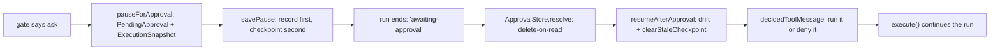

## What this is

An approval is what happens when a tool call needs a human's decision before it may run. It is not an in-memory wait: when a tool call's gate decides `ask`, the executor serializes enough of the run to restart it (`ExecutionSnapshot`) next to a `PendingApproval` record in an `ApprovalStore`, ends the `execute()` call with `finishReason: 'awaiting-approval'`, and *any* later call — same process, another process, days later — can `resumeAfterApproval()` to continue the run. Think of it like leaving luggage at a hotel concierge: the run checks out completely, hands over the bags (the snapshot) plus a claim ticket (the approval id), and whoever returns with the ticket — whenever — picks up where it stopped. Durability is the whole design.

## The mental model



Five nouns to hold: the **`PendingApproval`** (the decision waiting to happen), the **`ExecutionSnapshot`** (everything needed to restart the run), the **`ApprovalStore`** (where both live), the **`kind`** (`'tool'`, `'question'`, `'sign-in'` — what sort of pause it is), and the **decision** (approve or deny, resolved exactly once).

## How it works

1. **The gate says `ask`** (`A → B`). The tool-call gate sets `requiresApproval` (`needsApproval`, an `ask` permission rule, or a sub-agent suspension). The batch halts at the *first* such call — earlier calls' results are recorded, later calls become `remainingToolCalls` on the snapshot.

2. **Build the pause** (`B → C`). A `PendingApproval` is built: `id`, `toolCallId`, `toolName`, `args`, `agentId`, `createdAt`, optional `expiresAt` (from the `ask` rule's `ttlMs` or `approvalTtlMs`), `kind` (`'tool'` default, `'question'` for `ask_question`, `'sign-in'` for OAuth), `principal`. The `ExecutionSnapshot` captures `agent` (base — skills/sub-agents re-applied on resume), `currentMessages` (+ queued input), `steps`, `sessionId`, `remainingToolCalls`, `usage`, `agentFingerprint`, `principal`, `metadata`, and `subagent` when the pause came from a `task` call.

3. **Write it down, end the run** (`C → D`). `savePause` writes the **approval record first, checkpoint second**: a crash between the writes leaves a resumable `'in-progress'` checkpoint, never an `'awaiting-approval'` checkpoint naming a lost approval. Then `approval.requested` fires and the result resolves.

4. **A human decides** (`E`). `ApprovalStore.resolve(id)` is *delete-on-read* — an approval decides exactly once. `createAgentApprovals` wraps the store to track `pending` for `agent.approvals.list()`/`get()`, and its `approve` callback loop (`settle`) auto-decides pauses until the run finishes or returns `'defer'`/a sign-in kind it cannot decide. Expired pauses (`approvalExpired`) are force-denied at decision time — never run with a stale approve.

5. **Resume** (`F`). `resumeAfterApproval` → `resumeObserved`: `store.resolve(decision.id)` — unknown/claimed → `LOUSHO_APPROVAL_NOT_FOUND`; expired → treated as denied and `reportApprovalExpiry` audits it; `kind: 'sign-in'` → `signInDecision` re-checks the token store, re-parks the record and throws `SignInPendingError` if the user never signed in. `checkApprovalDrift` compares `snapshot.agentFingerprint` with the resuming agent (`onAgentDrift`); a refused resume puts the record back (`restorePause`, M10c). `clearStaleCheckpoint` deletes the pre-pause checkpoint under `snapshot.sessionId` (read first for `businessState`), so the follow-up `execute()` can't rehydrate stale state — then threading `sessionId`/`checkpointStore` through is safe (LOU-K5).

6. **Produce the paused call's result and continue** (`G → H`). `decidedToolMessage` produces the paused call's `tool` message: approved → `runApprovedToolCall` re-runs pre/post hooks (`resumedAfterApproval: true`, `approvedArgs` pins the args to what was approved — a hook can't smuggle different input) and executes under a span; denied → `rejectionOf` (`kind: 'denied'`/`'rejected'` per kind); `snapshot.subagent` → `resumeSubagentCall`; approved `transfer_to_*` → `resumeHandoffCall` (switch, not execute). `replaceToolResult` writes the message into the transcript; `closeUnlistedToolCalls` gives old snapshots' unanswered calls a `not-run` result; `continueResumedRun` calls `AgentExecutor.execute` with `skipSystemPromptInjection`, `initialSteps`, `initialUsage` — the turn's `remainingToolCalls` then run through the normal batch path (LOU-U7), and the run can pause again.

## Under the hood

The pause has two writes and two processes that may never meet — the invariants below are what keep that safe.

**Write ordering is the invariant.** Between the approval-record write and the checkpoint write, a crash leaves a plain resumable `'in-progress'` checkpoint — the *bad* direction (an `'awaiting-approval'` checkpoint referencing a record that was never written) is impossible by write order.

**Exactly-once without locks.** Between pause and resume, the store is the source of truth: `resolve` consuming the record on first read is what makes "decides exactly once" hold without any locking — a second `resumeAfterApproval` for the same id sees `LOUSHO_APPROVAL_NOT_FOUND` because the record is gone.

**Kinds share one machinery.** `'tool'`, `'question'` and `'sign-in'` differ only in how `describeApproval` describes them and how `resumeAfterApproval` settles them: a `'question'` pause carries the parsed `question` from the `ask_question` call, a `'sign-in'` pause re-checks the token store and can re-park the record (`signInDecision`), and a `'tool'` pause is a plain approve/deny on the call itself. The snapshot, the TTL check, the drift check and the replay path are identical for all three.

**Streaming resume.** `streamResumeAfterApproval` is the streaming twin of `resumeAfterApproval` — the resumed continuation emits its own `run.start`, and the paused tool call emits `tool.resume` rather than a second `tool.start` (see [streaming events](/core/streaming-events)).

## In code

| Symbol | File | Role |
| --- | --- | --- |
| `PendingApproval`, `ApprovalDecision`, `ExecutionSnapshot`, `ApprovalStore`, `ResolvedApproval`, `SubagentSuspension`, `describeApproval`, `approvalExpired`, `ASK_QUESTION_TOOL_NAME` | `src/execution/ApprovalGate.ts` | Pause types and gate |
| `InMemoryApprovalStore`; `StorageServiceApprovalStore` | `src/execution/InMemoryApprovalStore.ts`; `src/execution/ApprovalGate.ts` | Store implementations |
| `pauseForApproval`, `savePause`, `pauseForSignIn` | `src/execution/AgentExecutor.ts` | Pause side |
| `resumeAfterApproval`, `streamResumeAfterApproval`, `resumeRequest`, `ResumeExecuteOptions`; sub-agent resume | `src/execution/resume.ts`; `src/execution/resumeSubagent.ts` | Resume side |
| `createAgentApprovals`, `ApproveToolCall`, `AgentApprovals` | `src/createAgentApprovals.ts` | The `agent.approvals` facade |

## Example

```ts
const paused = await agent.send('Delete the old backups');
if (paused.finishReason === 'awaiting-approval') {
  const [request] = await agent.approvals.list();
  const result = await agent.approvals.resolve({ id: request.id, approved: true });
}
// Executor API:
// await resumeAfterApproval({ id, approved: true }, approvalStore, toolRegistry, provider, {}, checkpointStore);
```

`send` resolves with `'awaiting-approval'` instead of throwing. `list()` returns the pending record so a UI can render it; `resolve` hands the decision to `resumeAfterApproval`, which replays the paused call through hooks and continues the run.

The executor-level API beneath it takes the same two pieces — a decision (`{ id, approved }`) and the stores — because the machinery is identical: the approval record and snapshot live in the `ApprovalStore`, and the run's progress resumes through the `CheckpointStore`.

## Design decisions

- **Two stores, two concerns.** `ApprovalStore` (pause + snapshot) vs `CheckpointStore` (run progress): the approval is a *decision waiting to happen*, the checkpoint is *progress so far*. Writing approval first means the checkpoint never dangles a reference to a record that doesn't exist.
- **Delete-on-read `resolve`.** Exactly-once decisions without a distributed lock; the codebase explicitly accepts the same-sessionId concurrency assumption (see `clearStaleCheckpoint`'s comment) rather than adding locking to stores.
- **Snapshots store the unextended agent** (`baseAgentOf`) so resume re-runs `extendRunOptions` and picks up current skills/sub-agents/handoffs — consistent with the drift check comparing current config.
- **TTL is enforced at decision time, not pause time.** A durable store may be read by a different process long after `expiresAt`; making the *decision* expired-safe means no store needs sweeping (CHANGELOG: "draft today, approve tomorrow").
- **`'question'` and `'sign-in'` are kinds of the same mechanism.** `describeApproval` promotes an `ask_question` call into `kind: 'question'` + parsed `question`, so channels/UIs render one pending-decision shape instead of special-casing tool names.
- **`store`/approval config is run-level, not agent-level.** A handoff target's `approve`/`approvalStore`/`store` are ignored — `createAgent` warns once via `runLevelOptionNames` → `warnRunLevelOptions` (`src/handoffAgents.ts`), because the *run* owns its approval surface across agents (N6).

## Where next

- [Execution loop](/core/execution-loop) — where `pauseForApproval` fits in the batch.
- [Durable execution](/core/durable-execution) — the checkpoint half of the pause.
- [Permission modes](/core/permission-modes) — `ask` rules, `dontAsk`, and the resume-time `planModeRefusal`.
- [Hooks](/core/hooks) — `resumedAfterApproval` and the approved-args guarantee.
