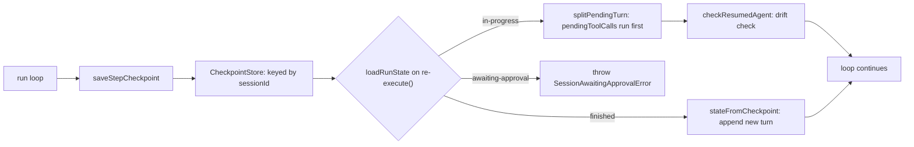

## What this is

Durable execution makes a run survive the process that hosts it. With `sessionId` + `checkpointStore`, a run serializes itself after every model response, after every recorded tool result, and at every terminal state. Re-calling `execute()` with the same `sessionId` — from this process or another — resumes unfinished runs at the exact transcript position, continues finished ones as a conversation, and refuses paused ones. Think of it like a video-game save file: the run saves constantly, so a crash means reloading — completed levels (recorded tool calls) stay completed, and you never re-watch a cutscene (the model is never re-asked for a turn it already made).

## The mental model



Five nouns to hold: the **checkpoint** (the serialized run), the **store** (`CheckpointStore` — where checkpoints live), the **status** (`'in-progress'` / `'awaiting-approval'` / `'finished'` — decides what resume does), **pending tool calls** (calls the model asked for that never got results), and the **fingerprint** (a hash of the agent's shape, checked on resume).

## How it works

1. **Write during the run** (`A → B → C`). `saveStepCheckpoint` writes after each model response *before* tools run (so a crash resumes by re-*running* tools, not re-*generating*), as each tool result's in-order prefix grows, on abort (`'in-progress'` — resumable), on pause (`'awaiting-approval'` + `approvalId`), and on finish (`'finished'`). Writes are serialized through `state.saving` — each save chains on the previous so a newer snapshot can never land before an older one. Queued un-applied input rides at the tail of `messages` so a crash doesn't lose it.

2. **Load on re-execute** (`D`). `loadRunState` calls `checkpointStore.load(sessionId)` and branches on `status`: `'awaiting-approval'` throws `SessionAwaitingApprovalError` (new input can't bypass a pending decision); `'finished'` → `stateFromCheckpoint` appends new input as the next turn with zeroed steps/usage/toolCalls; `'in-progress'` → restores everything, then `splitPendingTurn` separates the transcript into `messages`, `pendingToolCalls` (the last assistant turn's unanswered calls), and `queuedInput` (user messages held behind them).

3. **Finish what was pending** (`E`). `runAgentLoop` runs `pendingToolCalls` first — **the model is not called again for that turn** — then appends `queuedInput` and continues. A tool that was mid-flight when the process died runs again: **at-least-once**, so side-effecting tools should be idempotent (keyed on `toolCallId`) or approval-gated.

4. **Check the agent hasn't drifted** (`H`). `checkResumedAgent` compares the stored `agentFingerprint` against the current agent before any model/tool runs — detail under *Under the hood*.

5. **Continue normally** (`I`). From here the resumed run is indistinguishable from a fresh one: the loop, the gate, and the events are the same machinery.

## Under the hood

**What's saved** (`Checkpoint` in `src/execution/checkpoint.ts`): `agentId`, `sessionId`, `stepIndex`, full `messages`, `toolCalls`, `usage`/`stepUsage`, `finishReason`, `businessState` (opaque consumer data), `status`, `approvalId`/`approvalKind`, `agentFingerprint`, `runConfig` (dynamic-agent pinned config), `principal`, `metadata`. Status is `'in-progress'` | `'awaiting-approval'` | `'finished'`; absent on pre-U8 checkpoints, treated as `'in-progress'`.

**Drift.** With checkpointing on, `fingerprintOf` (instructions, model, tool names/schemas, hosted tools) is computed and stored; a resume (`checkResumedAgent`) compares `resumedFrom.fingerprint` to the current agent: `'warn'` (default) → `agent.drift` event + `console.warn`, `'error'` → `LOUSHO_AGENT_DRIFT`, `'ignore'` → skip. A pending call whose tool vanished always fails `LOUSHO_RESUME_TOOL_MISSING`. `runConfig` pins a dynamic agent's resolved `ctx`/model so resume re-resolves identically.

**Sessions.** `agent.session({ checkpointStore })` checkpoints each *turn* — not the whole conversation — under `sessionId = '<session>.turn-<n>'` (n = transcript length at turn start): `session.pending()` reports `'in-progress'`/`'awaiting-approval'` (with `approvalId`/`approvalKind` so the caller decides it first), `session.resume()` finishes an interrupted turn, `discardPending()` drops it. `AgentSession.resume` reuses the same executor machinery — the turn's checkpoint is its state — and a second `send()` while a turn is pending throws `LOUSHO_SESSION_TURN_PENDING` instead of silently queuing past it. Turn plumbing lives in `src/session/AgentSession.ts` (`SessionTurnCheckpoint`).

**Storage.** `LocalStorageCheckpointStore` keys records `checkpoints/{sessionId}.json` and rings `checkpoint-history/{sessionId}.json` (newest first to readers, oldest first internally — `newestFirst` flips at read). `memoryStore()`/`SqliteStore` implement the same `CheckpointStore` contract: `save`, `load`, `delete` (which also clears history unless `{ keepHistory: true }`), optional `history`. Resume-side helpers `clearStaleCheckpoint` and `markAwaitingApproval` live in `src/execution/resume.ts`.

**Fork/history.** Stores may implement `history()` (a bounded ring, default `DEFAULT_CHECKPOINT_HISTORY_LIMIT = 50`, `appendToRing`/`newestFirst`). `AgentExecutor.fork`/`forkSession` (`src/execution/fork.ts`) finds the `fromStep` entry (missing → `LOUSHO_CHECKPOINT_NOT_FOUND`), mints `<sessionId>.fork-<n>` unless `newSessionId` is given, applies a `ForkPatch` (`messages`, `businessState`, `toolResult` via `withToolResult`, `appendInput`), and saves a new session's `'in-progress'` checkpoint — replay a branch without mutating the original.

## In code

| Symbol | File | Role |
| --- | --- | --- |
| `Checkpoint`, `CheckpointStatus`, `CheckpointStore`, `CheckpointHistoryEntry`, `ForkOptions`, `ForkPatch`, `LocalStorageCheckpointStore`, `getCheckpointHistory`, `RUN_CONFIG_KEY`, `DEFAULT_CHECKPOINT_HISTORY_LIMIT` | `src/execution/checkpoint.ts` | Types, stores, history |
| `loadRunState`, `stateFromCheckpoint`, `freshState`, `saveStepCheckpoint`, `splitPendingTurn` | `src/execution/agentRunState.ts` (+ `src/execution/transcript.ts`) | Write/load path |
| `clearStaleCheckpoint`, `markAwaitingApproval` | `src/execution/resume.ts` | Resume interplay |
| `fingerprintOf`, `checkAgentDrift`, `AgentFingerprint`; `checkResumedAgent` | `src/execution/agentFingerprint.ts`; `src/execution/agentRunState.ts` | Drift detection |
| `forkSession` | `src/execution/fork.ts` | Branching a run |
| `SessionTurnCheckpoint`, `pending()`, `resume()`, `discardPending()` | `src/session/AgentSession.ts` | Session layer |

## Example

```ts
await AgentExecutor.execute({ agent, input: 'Book a table', provider, sessionId: 'chat-42', checkpointStore });
// crash / restart — same sessionId picks up where the checkpoint left off
await AgentExecutor.execute({ agent, input: [], provider, sessionId: 'chat-42', checkpointStore }); // resumes
const fork = await AgentExecutor.fork({ sessionId: 'chat-42', fromStep: 1, checkpointStore, patch: { appendInput: 'Use Celsius.' } });
```

The first call checkpoints as it goes. The second call — even in a different process — finds the `'in-progress'` record, finishes the pending tool calls, and continues. `fork` clones the step-1 checkpoint into a new session with extra input appended, leaving the original untouched.

## Design decisions

- **Checkpoint before tools, not after generation alone.** Saving the turn *pre-tools* means a crash mid-batch is indistinguishable from "ran out of time before tools": resume finishes the batch, and idempotency is the caller's contract. Recording results incrementally (in-order prefix) shrinks the re-run window to only un-recorded calls.
- **Serialized saves.** `state.saving` chains writes — a cheap ordering guarantee that prevents a stale checkpoint overwriting a fresher one when tool results land close together.
- **`awaiting-approval` is a wall.** Marking the checkpoint means `execute()` can't accidentally feed new input past a pending human decision — resume must go through `resumeAfterApproval`, which first *deletes* the stale checkpoint (LOU-K5) before re-enabling checkpointing for the remainder.
- **`businessState` is co-located, not interpreted.** The SDK stores it verbatim; a `null` vs `undefined` distinction (`=== undefined` inherits) is documented as the only way to clear it — an honest edge the type can't express.
- **At-least-once > exactly-once.** No attempt at distributed exactly-once: the contract is "make tools idempotent," which is what the ApprovalGate's snapshot + delete-on-read already assumes. Simpler store semantics, documented gap.
- **Principal/metadata frozen into the checkpoint** (N10b/R16): a resumed run acts as the original caller and its hooks see the original metadata — otherwise a different process's resume would change the run's identity mid-flight.
- **History is a ring, not a log.** Keeping only `DEFAULT_CHECKPOINT_HISTORY_LIMIT` entries bounds store growth to what fork realistically needs; the store contract keeps `history()` optional so non-forkable stores (no ring) still checkpoint fine — `forkSession` just refuses with `ConfigurationError`.
- **`CheckpointHistoryEntry` wraps, not embeds.** The entry adds `step`/`savedAt`/`status` metadata around the full `checkpoint`, so a fork entry is self-contained — no second load call needed to reconstruct the point-in-time state.
- **Queued input is part of the checkpoint.** Un-applied `enqueue()`/`steer()` messages ride at the tail of `messages` rather than in a side channel, so the crash window for user input is exactly the checkpoint-write gap — resume re-delivers them through `splitPendingTurn` like any other pending content.

## Where next

- [Approvals](/core/approvals) — the `'awaiting-approval'` status and snapshot handoff.
- [Run lifecycle](/core/run-lifecycle) — which terminal states write which status.
- [Execution loop](/core/execution-loop) — where `saveStepCheckpoint` is called.
- [Errors](/core/errors) — `LOUSHO_AGENT_DRIFT`, `LOUSHO_RESUME_TOOL_MISSING`, `LOUSHO_CHECKPOINT_NOT_FOUND`, `SessionAwaitingApprovalError`.
- [Streaming events](/core/streaming-events) — `agent.drift` and the events a resumed run emits.
