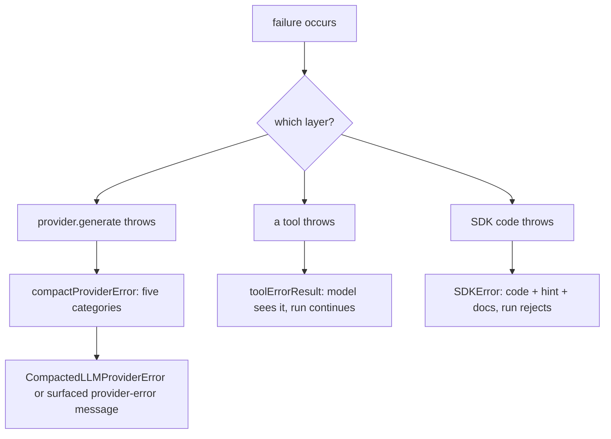

## What this is

Errors in this SDK are designed to be read by two audiences: the human holding `catch (error)` and the model reading a failed tool result. Nearly every error the SDK throws on purpose is an `SDKError` carrying a stable `code` (`LOUSHO_<AREA>_<NAME>`), a one-sentence `hint`, and a `docs` link — the message ends with a generated `[code] hint (docs)` line so an uncaught error is self-documenting. Think of the code like the error code on a boiler display: `E42` doesn't tell the whole story, but it always means the same part and the manual has a page for it — the `hint` and `docs` link are that page. Tool and provider failures use `appendHelp: false` so the model sees a clean message while `toString()` still renders the help line for humans.

## The mental model



Four nouns to hold: **`SDKError`** (the base class with `code`/`hint`/`docs`), **`ERROR_CODES`** (the registry every code lives in), **compaction** (shrinking whatever a provider threw into a categorized shape), and the **tool error result** (a failure expressed as transcript data instead of an exception).

## How it works

1. **Assemble the error** (`E → I`). `new SDKError(message, code, { hint?, docs?, cause?, appendHelp? })`: `errorHelp(code)` looks the code up in `ERROR_CODES` for a default hint and builds `docs` as `https://github.com/LinuxDevil/agent-sdk/blob/main/docs/errors.md#<code-lowercase>`. `withHelp` appends `\n[<code>] <hint> (<docs>)` to the message unless `appendHelp: false`. Fields: `code`, `hint`, `docs`, `detail` (the raw message without the help line), `cause`. `instanceof SDKError` uses a `Symbol.for('lousho.SDKError')` brand so it holds across duplicated SDK copies (LOU-D42) — the same trick as `HookRegistry`.

2. **Register the code.** `ERROR_CODES` (`src/utils/errorCodes.ts`) is the single source: every `code` maps to its hint, `errorDocsUrl` derives the anchor, and `src/utils/errorCodes.test.ts` asserts the table, the codes thrown in `src/`, and `docs/errors.md` sections stay in sync — codes are *stable API* (callers branch on `error.code`, never message text). `ErrorCode` is `keyof typeof ERROR_CODES`, so the compiler rejects a thrown code that was never registered; the `string & {}` union member still permits forward-compatible codes from newer SDK copies.

3. **Compact provider failures** (`C → F → G`). `provider.generate()` throws whatever the `ai`-SDK adapters throw — `APICallError`, `LoadAPIKeyError`, `RetryError` (unwrapped to `lastError`), or bare network errors. `compactProviderError` categorizes into five buckets (`'rate-limit'`, `'timeout'`, `'context-length-exceeded'`, `'auth-failure'`, `'unknown'`) using status codes + regex patterns over message/body, caps the message at 500 chars, and extracts `retryAfterMs` from 429 headers. The result is `CompactedLLMProviderError` (extends `LLMProviderError`, so `instanceof` still works; `.compacted` carries the full record, `.cause` the raw error).

4. **Or surface the failure to the model.** With `surfaceRetryableProviderErrors: true` and a model-actionable category (`isModelActionableProviderErrorCategory`), `providerErrorMessage` instead folds the compaction into the transcript as a tagged `[provider-error]` *user* message — a `tool` message would orphan without a matching `toolCallId` — and the loop retries; if `maxSteps` is then spent, `finishRun` rethrows `state.lastSurfacedProviderError` rather than reporting a fake stop. `isAbortError` and `isCassetteError` carve out cancellations (never compacted) and cassette mismatches (test-fixture failures, kept typed).

5. **Turn tool failures into results** (`D → H`). A tool that throws becomes `toolErrorResult({ toolName, error, kind })` — appended to the transcript as the call's result so the model sees it and can retry; the run continues. Only exceptions explicitly marked via `PropagatingToolError`/`markPropagating` are rethrown past the result machinery.

## Under the hood

**Tool error shape.** The result is `{ error: name, toolName, message (≤2000 chars, no stack), kind, toolCallId? }`. `ToolErrorKind` names *why*: `'execution'`, `'validation'`, `'not-found'`, `'rejected'`, `'not-run'`, `'mcp'`, `'sandbox'`, `'denied'` — covering rule denials, approval rejections, never-run calls and schema mismatches.

**Retry helpers sit upstream of compaction.** `isRetryableError`, `isNetworkError`, `getRetryDelay` (`errors.ts`) classify failures for the executor's provider-fallback path — they inspect `statusCode`/codes on whatever the adapter threw, which is why compaction sits *downstream*: the raw error drives retry decisions, the compacted one is what callers see.

**Executor-thrown codes worth knowing:** `LOUSHO_APPROVAL_STORE_MISSING` (pause with no `approvalStore`), `LOUSHO_SESSION_AWAITING_APPROVAL` (`SessionAwaitingApprovalError` — `execute()` on a paused session), `LOUSHO_CONFIG_MISSING_PROVIDER/AGENT/INPUT`, `LOUSHO_CONFIG_INVALID` (bad `permissionMode`, `toolConcurrency`, drifted principal), `LOUSHO_AGENT_DRIFT`, `LOUSHO_RESUME_TOOL_MISSING`, `LOUSHO_APPROVAL_NOT_FOUND`, `LOUSHO_BUDGET_EXCEEDED`, `LOUSHO_GUARDRAIL_TRIPPED`, `LOUSHO_RUN_ALREADY_ITERATED`, `LOUSHO_CHECKPOINT_NOT_FOUND`.

## In code

| Symbol | File | Role |
| --- | --- | --- |
| `SDKError`, `SDKErrorOptions` | `src/utils/sdkError.ts` | Base error — deliberately in `utils/`, not `execution/errors.ts`, so browser bundles (`src/ui`, React/Vue/Svelte) can throw it without pulling the `ai` peer |
| `ERROR_CODES`, `ErrorCode`, `errorHelp`, `errorDocsUrl`, `ERROR_DOCS_URL` | `src/utils/errorCodes.ts` (sync test: `errorCodes.test.ts`) | The code registry |
| `AgentExecutionError`, `ToolExecutionError`, `LLMProviderError`, `SessionAwaitingApprovalError`, `ConfigurationError`, `ValidationError`, `TimeoutError`, `RateLimitError`, `CompactedLLMProviderError` | `src/execution/errors.ts` | Execution subclasses (`BudgetExceededError` in `budget.ts`, `GuardrailError` in `ioGuardrails.ts`) |
| `compactProviderError`, `CompactedProviderError`, `CompactedProviderErrorCategory`, `isModelActionableProviderErrorCategory`, `isAbortError`, `isCassetteError` | `src/execution/errors.ts` | Provider-error compaction |
| `compactGenerateError`, `providerErrorMessage`, `shouldSurfaceToModel` | `src/execution/generateStep.ts` | Where compaction meets the loop |
| `toolErrorResult`, `ToolErrorKind`, `ToolErrorResult` | `src/execution/toolErrors.ts` | Tool failures as transcript results |
| `PropagatingToolError`, `toolErrorMessage`, `markPropagating` | `src/execution/propagatingToolError.ts` | Opt-out of the result path |

## Example

```ts
try {
  await agent.send('hi', { sessionId: 'chat-42' });
} catch (error) {
  if (error instanceof SDKError && error.code === 'LOUSHO_SESSION_AWAITING_APPROVAL') {
    console.error(error.hint);   // "Resolve the pending approval first..."
    console.error(error.docs);   // errors.md#lousho_session_awaiting_approval
    console.error(error.detail); // message without the [code] line
  } else if (error instanceof CompactedLLMProviderError && error.compacted.category === 'rate-limit') {
    // retryAfterMs-driven backoff
  }
}
```

Branch on `code` (stable) not on `message` (improves over time). `instanceof` narrows to the subclass; `error.compacted` carries the full categorized record for provider failures.

## Design decisions

- **Stable codes > message matching.** Messages get clearer over time; `error.code` is the contract. `docs/errors.md` is the public table and `errorHelp` links straight to it — one registry serves error objects, docs, and tests.
- **`appendHelp: false` for model-visible errors.** `ToolExecutionError`/`LLMProviderError`/`TimeoutError`/`RateLimitError` keep `.message` clean because the model sees it (tool result, `[provider-error]` fold) — a help line would be prompt noise; humans still get it via `toString()`.
- **`detail` alongside `message`.** The appended help line is display chrome; `error.detail` preserves the programmatic message so consumers don't have to strip it.
- **Five categories, not fifty.** Compaction exists so callers (or the model) can *act* — retry, shrink context, fail auth fast — so the taxonomy is behavioral, not exhaustive; `unknown` is the safe default, not a failure of classification.
- **Compaction is the same `{error}` family as tool results** deliberately (see the `CompactedProviderError` comment): one recognizable shape whether the tool or the provider failed.
- **Plain-`Error` exceptions** (`PropagatingToolError`, `WorkspaceError`, `McpToolError`, `AuthError`, `CronExpressionError`, `DecryptionError`) stay code-free on purpose — they're either model-visible tool errors or hard stops where a code adds nothing (docs/errors.md).
- **Subclasses are convenience, `code` is identity.** `ConfigurationError`, `SessionAwaitingApprovalError` et al. exist so `instanceof` reads naturally, but every one carries a registered `LOUSHO_*` code — two ways to catch, one way to switch.

## Where next

- [Execution loop](/core/execution-loop) — where throws vs tool-results diverge.
- [Run lifecycle](/core/run-lifecycle) — `finishReason: 'error'` and `runFailed` paths.
- [Approvals](/core/approvals) — `LOUSHO_APPROVAL_NOT_FOUND`, expiry denials.
- [Durable execution](/core/durable-execution) — drift and missing-tool resume errors.
