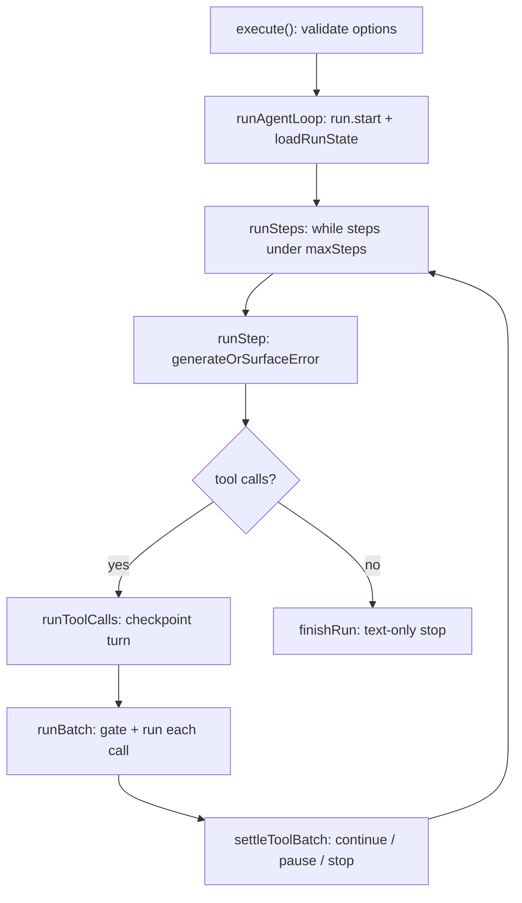

## What this is

The execution loop is the heart of the SDK: the code that asks the model for a response, runs whatever tools the response requests, feeds the results back, and repeats until the model has nothing left to ask for. Everything else in these docs — checkpoints, approvals, events — exists to serve this loop. Think of it like a conversation referee: it passes notes between the model and the tools, keeps the score, and blows the whistle when the exchange is over or someone needs a human's permission.

`AgentExecutor.execute()` is a static, instance-free entry point: everything a run needs arrives on `ExecuteOptions`, and the loop itself is a private pipeline on the class. One *step* is one `provider.generate()` call plus the tool calls that response asks for; the loop repeats until the model replies with text only, an early-exit condition (approval pause, abort, budget, guardrail) fires, or the step budget runs out.

## The mental model



Five nouns to hold: the **step** (one model call plus the tool calls it asks for), the **run state** (`AgentRunState` — transcript, usage, pending calls), the **gate** (the checks each tool call must pass before it runs), the **batch** (the scheduler that runs one step's calls), and the **checkpoint** (the snapshot the loop writes so a crash can resume).

## How it works

1. **Open the run** (`A`). `execute()` validates the three required options (`provider`, `agent`, `input`) up front so missing fields fail with a named `ConfigurationError` rather than a `TypeError` deep in the loop. `observeRun()` attaches the run's event sink (`RUN_EVENTS` symbol key) so every later stage reports through one channel, and `withSpan` wraps the whole run in an `invoke_agent` span. `runWithEnd` starts the `limits` budget (`startBudget` may wrap `signal` with the `maxDurationMs` timer) and calls `extendRunOptions`, which composes skills, sub-agents, tool search, code mode, the plan-mode paragraph and the `output` instruction onto the agent before the loop sees it.

2. **Enter the loop** (`B`). `runAgentLoop` emits `run.start`, builds the tool list (`runTools` adds one tool per handoff), loads state via `loadRunState` (fresh, or rehydrated from a checkpoint — see [durable execution](/core/durable-execution)), checks agent drift on resume, and runs input guardrails. If a rehydrated transcript ends in unanswered tool calls (`state.pendingToolCalls`), `runPendingToolCalls` finishes them *before* any new model call — a resume never re-asks the model for a turn it already made.

3. **Iterate steps** (`C`). `runSteps` loops `while (state.steps < maxSteps)`. Each iteration: `stopBeforeStep` aborts if `signal` fired or stops if `budget.check` tripped; `state.steps++`, then `applyQueuedInput` appends anything `run.enqueue()`/`steer()` left.

4. **Generate** (`D`). `runStep` → `generateOrSurfaceError`: `prepareGenerateRequest` builds `GenerateOptions` (tools filtered by deferral and by plan mode for hosted tools), runs `onLLMRequest` and `preGenerate` hooks; `generateInSpan` calls the provider inside a `chat` span, then `onLLMResponse` and `postGenerate`. Usage is recorded (`recordStep`), output guardrails check the text, and `assistantTurn()` pushes the assistant message (keeping signed reasoning blocks for the next request).

5. **Checkpoint, then batch** (`E → F → G`). With tool calls, `runToolCalls` checkpoints the turn **before any tool runs**, then `runBatch` schedules the calls. Each call walks the gate (`prepareToolCall` in `toolCallExecution.ts`): `onToolCall` → parse + schema-validate args → `preToolCall` hooks (may `deny`, supply `{ result }`, or rewrite `{ input }`, re-validated) → permission rules (`checkPermission` → allow/deny/ask) → tool guardrails → the tool's own `needsApproval` → permission-mode verdict, applied last and never un-denying. A cleared call runs via `executeToolWithSandboxGuard`; `postToolCall` hooks may replace the result; `onToolResult` fires from a `finally`.

6. **Settle, then decide** (`H`, or `E → I`). `settleToolBatch` decides: continue the loop, abort, rethrow the first fatal error, pause for sign-in or approval, settle sub-agent suspensions, or hand off. A text-only reply instead ends the loop through `checkOutput` → `finishRun`.

## Under the hood

**The batch's ordering guarantees** (`runToolBatch`, `src/execution/toolBatch.ts`). Calls start in call order, each only after the previous call's *gate* resolved — so the first approval-needing call is known before anything after it starts. Concurrency slots come from `Limiter` (`toolConcurrency`, default `'unbounded'`). Results are appended to the transcript in call order as the completed prefix grows, and each grown prefix is checkpointed.

**Abort and handoff semantics.** On abort, finished calls keep their results and the rest get `kind: 'not-run'` results. Handoff calls are split out (`splitHandoffCalls`) and gated but never executed — a cleared one switches the run's options (`state.switched`) and the loop continues as the target agent.

**Step outcomes.** `runStep` returns `'continue'` (another iteration), `'stop'` (text-only reply → `checkOutput` → `finishRun`), `'steered'` (the model call was aborted by `run.steer()`; retry with the new input), or an `ExecutionResult` for an early end.

## In code

| Symbol | File | Role |
| --- | --- | --- |
| `AgentExecutor.execute` / `.stream` / `.fork` | `src/execution/AgentExecutor.ts` | Static entry points |
| `runAgentLoop` → `runSteps` → `runStep` | `src/execution/AgentExecutor.ts` | The loop pipeline |
| `generateOrSurfaceError`, `runToolCalls`, `runBatch` | `src/execution/AgentExecutor.ts` | Step body: model call, checkpoint, batch |
| `loadRunState`, `saveStepCheckpoint`, `pushToolResult`, `pushAbortedBatchResults`, `toExecutionResult` | `src/execution/agentRunState.ts` | Per-run mutable state |
| `prepareGenerateRequest`, `generateInSpan` | `src/execution/generateStep.ts` | Model-call half of a step |
| `runToolCall`, `prepareToolCall`, `settleToolCall` | `src/execution/toolCallExecution.ts` | Per-call gate |
| `runToolBatch`, `Limiter` | `src/execution/toolBatch.ts` | Concurrency scheduler |

## Example

```ts
import { AgentExecutor } from '@lousho/build-ai-agent/executor';

const result = await AgentExecutor.execute({
  agent,
  input: 'Compare the three cities',
  provider,
  toolRegistry,
  toolConcurrency: 2,      // Limiter: at most two tools in flight
  maxSteps: 10,            // runSteps stops after ten iterations
  signal: AbortSignal.timeout(60_000),
});

// result.finishReason: 'stop' | 'tool_calls' | 'awaiting-approval' |
// 'aborted' | 'max-steps' | 'budget-exceeded' | 'guardrail' | 'output-invalid' | 'error'
```

The call resolves when the loop exits — a text-only reply (`'stop'`), a pause (`'awaiting-approval'`), or one of the limits — with the full transcript on `result`.

## Design decisions

- **Checkpoint before tools, results in call order.** The model's turn is saved before its first tool runs, so a crash mid-batch resumes by *running the calls*, never by re-generating. Results append in model order (not completion order) so the next provider request is deterministic — a correctness requirement for replay and cassettes.
- **Gate-then-start ordering.** Starting call *n+1* only after call *n*'s gate settled makes "the first call that needs approval stops the batch" cheap and exact; it also means an approval never starts behind a later side-effecting call.
- **`lastSurfacedProviderError`.** With `surfaceRetryableProviderErrors`, a compacted provider failure becomes a user message and costs a step; if `maxSteps` is then exhausted, `finishRun` rethrows that error instead of returning a hollow result whose `finishReason` would lie about a real model stop.
- **Instance-free statics.** No executor object to construct or leak: per-run state lives in `AgentRunState`, and cross-run identity is `sessionId` + stores, which is what makes durable resume a data problem rather than an object-lifetime problem *(inferred rationale; consistent with the LOU-U8 comments)*.

## Where next

- [Run lifecycle](/core/run-lifecycle) — the start-to-settle state machine around this loop.
- [Approvals](/core/approvals) — what `pauseForApproval` stores and how resume re-enters.
- [Streaming events](/core/streaming-events) — the sink the loop reports through.
- [Durable execution](/core/durable-execution) — the checkpoint writes inside the loop.
