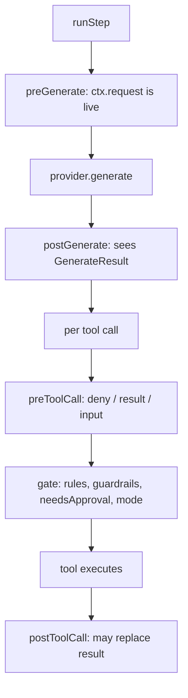

## What this is

`AgentHook`s are named, ordered plugins that run at four fixed points — `preToolCall`, `postToolCall`, `preGenerate`, `postGenerate` — receiving *live* references to what the executor is about to use (the args object, the messages array, the `GenerateOptions` request). Think of them like middleware in a web framework: every call passes through the registered functions in order, and each can inspect, mutate, or short-circuit it — except here the "requests" are model calls and tool calls, and the context objects are the real thing, not copies. They are the mutation-capable counterpart to `onLLMRequest`/`onToolCall`-style callbacks, which only observe.

## The mental model



Five nouns to hold: the **hook** (a named plugin object with some of the four methods), the **registry** (`HookRegistry` — ordered storage), the **context** (`ctx` — live references plus run metadata), the **outcome** (what a `preToolCall` returns: `{ deny }`, `{ result }`, `{ input }`, or nothing), and the **subagent tag** (`ctx.subagent` — set when the hook fires inside a delegated run).

## How it works

1. **Register.** `HookRegistry` is a branded class (`instanceof` survives cross-copy SDK loads, LOU-D42) with a `ToolRegistry`-mirroring API (`register`, `registerMany`, `get`, `has`, `list`, `unregister`, `clear`, `size`). `register` on a duplicate `name` replaces with a `console.warn`. All `runXxx` methods iterate `this.hooks` in registration order, awaiting each — a later hook sees earlier mutations.

2. **Wrap the model call** (`B`, `D`). `preGenerate(ctx)` fires in `prepareGenerateRequest` and sees the built `GenerateOptions` (`ctx.request`, live — pushing a message or changing `temperature` affects the call); `postGenerate(ctx, result)` fires in `generateInSpan` and sees the `GenerateResult`. `ctx.emit(event)` injects `compaction.start`/`compaction.done` events into the run's stream when a sink exists — the only hook-authored events.

3. **Intercept each tool call** (`F`). `preToolCall(ctx)` runs inside `prepareToolCall` *after* arg parsing/validation, *before* permission rules → guardrails → `needsApproval` → permission mode. `ctx.args` is the live parsed-args object. Returns: nothing (continue — in-place mutation still applies), `{ deny: reason }` → `kind: 'denied'` tool error + audited hook denial via `reportHookDenial`, `{ result }` → call skipped, result stands (`replacedByHook` recorded), `{ input: args }` → re-validated against the tool schema then used; later hooks see the new `ctx.args`. The first `deny`/`result` stops the pre-hook sequence (`PreToolCallDecision.stop`); `input`s chain (`inputBy` names collected).

4. **Settle** (`I`). `postToolCall(ctx, result)` runs inside `settleToolCall` after the call settles (success, tool error, or approval-required). Returning `{ result }` rewrites what the model sees and sets `replacedByHook` on the outcome/message/`tool.done` event; the hook is skipped for `requiresApproval`/`subagent`/`signIn` outcomes.

5. **Re-fire on resume, inherit into sub-agents.** Paused calls re-run their hooks on resume, and delegated runs get a cloned registry — both detailed under *Under the hood*.

## Under the hood

Three mechanisms matter beyond the basic firing points: the shape of `ctx`, what resume does to hooks, and what delegation does to them.

**Context fields.** `toolCallId`, `toolName`, `args`, `toolCall`, plus `agentId`, `agentName`, `sessionId`, `messages` (live), `metadata`, `principal`, `subagent`, `resumedAfterApproval`.

**Approved-call re-fire.** `resumeAfterApproval` re-runs `preToolCall`/`postToolCall` for the paused call with `ctx.resumedAfterApproval = true` and `approvedArgs` = the args the human approved; `runPreToolHooks` compares the post-hook args by `stableStringify` and refuses with `kind: 'validation'` if a hook tried to change them — a hook cannot alter what was approved. Stateful hooks (counters, loop guards) skip the re-fire with `if (ctx.resumedAfterApproval) return;`.

**Sub-agents.** `hooksForSubagent` clones the parent's registry, wrapping each method to tag `ctx.subagent` (name/depth/toolCallId/parent chain via `nestSubagent`) and `markPropagating` any thrown error so it halts the *whole* run, not just the child. Handoff calls pass through the same pre/post hooks via `resumeHandoffCall`/`settleHonoredHandoff` — a post-hook can even rewrite the routing result the target reads.

**Throwing hooks.** A throw propagates out of `runXxx` and rejects the whole run via `execute()` — it is never converted into a `toolErrorResult` the way a tool's own throw is. The rationale is under *Design decisions*.

## In code

| Symbol | File | Role |
| --- | --- | --- |
| `AgentHook`, `HookRegistry`, `HookContext`, `ToolCallHookContext`, `ToolCallHookResult`, `GenerateHookContext`, `PreToolCallOutcome`, `PostToolCallOutcome`, `PreToolCallDecision`, `SubagentInfo`, `HookEventPayload` | `src/execution/hooks.ts` | Types + the registry |
| `toolHookContext`, `runPreToolHooks`, `hookStopOutcome`, `hookInputFailure` (`runPostToolHooks` private) | `src/execution/toolCallExecution.ts` | Tool-call integration |
| `hooks.runPreGenerate` / `runPostGenerate` call sites (`generateHookContext` private) | `src/execution/generateStep.ts` | Model-call integration |
| `resumedHookCall`, `runApprovedToolCall`, `resumeHandoffCall`, `replaceHandoffResultByHook` | `src/execution/resume.ts` | Resume re-fire, handoff hooks |
| `hooksForSubagent`, `decorateHook`, `nestSubagent` | `src/execution/delegation.ts` | Sub-agent inheritance |

## Example

```ts
const guard: AgentHook = {
  name: 'guard',
  preToolCall(ctx) {
    if (ctx.toolName === 'shell') return { deny: 'Use workspace tools instead' };
    if (ctx.toolName === 'search') return { input: { ...ctx.args, limit: 10 } };
  },
  postToolCall(_ctx, result) {
    return typeof result.result === 'string' ? { result: result.result.slice(0, 2000) } : undefined;
  },
};
const agent = createAgent({ provider, instructions, tools, hooks: [guard] });
```

The hook does three things: `shell` calls are denied before the gate even runs (the model sees a `kind: 'denied'` result); `search` calls get a rewritten `input` that is re-validated against the tool schema; and every string result is truncated to 2000 chars by `postToolCall`, stamped `replacedByHook` so audit and events can tell it apart from the tool's own output.

## Design decisions

- **Live references, not snapshots.** The file-level comment is explicit: hooks get the actual `args`/`messages`/`request` so `redact-pii` mutating `ctx.args` or `inject-context` pushing a message *actually changes the run*. Snapshots would make hooks observers.
- **Throws propagate.** A throwing hook rejects the run (out of `runXxx` → `execute()`): hooks are trusted control-plane code, and silently swallowing would defeat them. Contrast with a *tool's* own throw → `toolErrorResult` the model sees.
- **Outcomes as data, not exceptions.** `{ deny }`/`{ result }`/`{ input }` let hooks settle a call without raising — the executor converts them to the same `toolErrorResult`/`replacedByHook` machinery as rule denials, keeping audit and events uniform.
- **`approvedArgs` pinning.** Resume re-running hooks re-opens the mutation surface; pinning to the approved args closes the "approve X, run Y" hole (LOU-X3.2).
- **Registry mirrors `ToolRegistry`.** Deliberately parallel API so hook management feels identical to tool management.

## Where next

- [Execution loop](/core/execution-loop) — where hooks sit relative to the gate.
- [Permission modes](/core/permission-modes) — modes apply after hooks; hooks can't be mode-overridden.
- [Approvals](/core/approvals) — `resumedAfterApproval` and `approvedArgs` on resume.
- [Streaming events](/core/streaming-events) — `replacedByHook` and `ctx.emit` surfaces.
