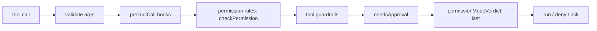

## What this is

A permission mode (`PermissionMode = 'default' | 'plan' | 'acceptEdits' | 'dontAsk'`) is a named bundle of "how cautious should the agent be" that callers can switch at runtime — plan mode refuses everything except reads, `acceptEdits` stops asking about file edits, `dontAsk` refuses anything that would pause. It is a *preset over the existing gate*, not a separate system: rules, guardrails and `needsApproval` run exactly as without a mode, and the mode's verdict is applied **last**, to calls nothing else denied — so a mode can refuse or auto-approve, but never un-deny. Think of it like the drive-mode selector in a car: Eco and Sport change how willing the engine is, but the brakes work identically in every mode — a mode can only make the agent more restrictive, never override a veto. It is read fresh per tool call, so switching mid-run takes effect on the next call.

## The mental model



Five nouns to hold: the **gate** (the pipeline every tool call walks, in `gateToolCall`), the **mode** (the preset), the **verdict** (what the mode contributes, applied last), a **read-only tool** (what plan mode still allows — `readOnlyHint` or a marked built-in), and the **audit entry** (`PermissionDecisionEntry` — the record of what was decided and why, emitted as a `permission.decision` event).

## How it works

The diagram is the gate pipeline — the mode is simply its last stage.

1. **Walk the gate in order** (`A → F`). `prepareToolCall` → `gateToolCall` (`src/execution/toolCallExecution.ts`) evaluates: arg validation → `preToolCall` hooks → permission rules (`checkPermission`, first match wins) → tool guardrails → `needsApproval`. A denial at any stage stops the pipeline.

2. **Apply the mode last** (`G`). `applyPermissionMode` inside `gateToolCall` calls `permissionModeVerdict`, which runs only when `mode !== 'default'` and the call survived earlier checks: `plan` denies unless `isReadOnlyTool(tool)` — `metadata.mcp.annotations.readOnlyHint === true`, or a built-in in the `planModeTools` WeakSet (`allowInPlanMode` marks `ask_question` and `task`); `dontAsk` denies only calls that would otherwise pause (`requiresApproval`); `acceptEdits` *approves* (skips the pause) only when `tool.metadata.editsFiles === true`; `default` changes nothing. Unknown tools (`tool === undefined`) keep their normal not-found error.

3. **Record the outcome** (`H`). A denial yields `deniedGate(toolCall, '<mode> mode', reason)` — a `kind: 'denied'` `toolErrorResult` — and stamps the audit entry `decision: 'deny'`/`'allow'`, `reason`, `mode` on the `PermissionDecisionEntry` reported by `reportPermission` (event + `onPermissionDecision`). A hook deny or rule deny is never overridden.

4. **Hint the model.** `extendRunOptions` prepends `PLAN_MODE_INSTRUCTION` to the system prompt when the run *starts* in plan mode — the mode alone silently denies tools; the paragraph tells the model to describe rather than call.

5. **Propagate to what the gate can't reach.** Three surfaces need the same policy through different levers — provider-side hosted tools (filter the request), sub-agents (inherit the lead's mode), and approval resume (re-check the current mode) — each detailed under *Under the hood*.

## Under the hood

The gate is the simple part; the interesting machinery is everywhere a per-call verdict cannot reach — provider-side tools, child agents, resumed runs, and mid-run switching.

**Hosted tools.** The provider executes `hostedTools` inside the request — no per-call gate can deny them — so `hostedToolsInMode` *filters the request* in plan mode: only `web_search`/`file_search` (`READ_ONLY_HOSTED_TYPES`) are sent; `codeInterpreter`/`hostedTool` are withheld. Recomputed per model call, so a mid-run switch is honored at the next `provider.generate()`.

**Sub-agents.** `inheritPermissionMode(lead, own)` resolves per call: the lead's mode while it isn't `'default'`, else the child's own — except a child's own `'plan'` always wins. Sub-agent calls still inherit the parent's `permissions` rule list first, so a stricter parent stays stricter in both layers.

**Resume.** `planModeRefusal` (`src/execution/resume.ts`) re-checks at approval-resume time: a call approved *before* a switch to plan mode is denied rather than run — the human's decision can't bypass the current mode. The refusal arrives as a normal `kind: 'denied'` tool result, so the resumed run continues and the model sees the denial like any other.

**What the four modes do, precisely.** `'default'` leaves the gate untouched; the other three only ever *act on survivors* — a call that passed every earlier check. That is why the ordering invariant matters: the mode sees the gate's final answer and may tighten it (deny) or absorb its pause (approve), and both are one-way.

**Audit.** Mode verdicts land in the audit trail like every other gate decision: the `PermissionDecisionEntry` records `decision`, `reason` and `mode`, and `reportPermission` emits it as a `permission.decision` event plus the `onPermissionDecision` callback — so a `'<mode> mode'` reason in the log means a mode denial, distinct from a rule deny or a hook deny.

**Switching.** `session.setPermissionMode(mode)` validates via `assertPermissionMode` (a bad value throws `LOUSHO_CONFIG_INVALID`, like a bad mode on `createAgent` or `send`), stores it on the session, and hands every subsequent turn a *getter* (`currentPermissionMode`) so `permissionModeOf` reads the live value per tool call — including a paused turn continued by `agent.approvals.resolve()`. `onPermissionModeChange` receives `{ sessionId, from, to, at }`. The mode is not persisted with the transcript — a restored session starts in `'default'` unless its options set one.

## In code

| Symbol | File | Role |
| --- | --- | --- |
| `PermissionMode`, `PermissionOptions`, `PermissionDecisionEntry.mode` | `src/execution/permissions.ts` | The types |
| `permissionModeOf`, `assertPermissionMode`, `permissionModeVerdict`, `allowInPlanMode`, `hostedToolsInMode`, `inheritPermissionMode`, `planModeRefusal`, `PLAN_MODE_INSTRUCTION`, `PLAN_MODE_REASON`, `DONT_ASK_REASON` | `src/execution/permissions.ts` | Mode machinery (`isReadOnlyTool` is private) |
| `applyPermissionMode` inside `gateToolCall` | `src/execution/toolCallExecution.ts` | Where the verdict lands |
| `AgentSession.setPermissionMode`, `currentPermissionMode`, `onPermissionModeChange` | `src/session/AgentSession.ts` | Runtime switching |
| `runLevelOptionNames`, `warnRunLevelOptions` | `src/createAgent.ts`, `src/handoffAgents.ts` | Mode as run-level (handoff-immune) option |

## Example

```ts
const session = agent.session({ permissionMode: 'plan' });
await session.send('Plan the refactor.');      // writes denied; model describes instead
session.setPermissionMode('acceptEdits');      // onPermissionModeChange fires
await session.send('Apply it.');               // editsFiles tools run without asking
```

The session starts in plan mode: write-capable tool calls come back as `kind: 'denied'` results and the model narrates a plan instead (the `PLAN_MODE_INSTRUCTION` paragraph told it to). Flipping to `acceptEdits` mid-session takes effect on the next tool call — nothing needs restarting, because the mode is a live getter read per call. Note that `dontAsk` would behave differently here: instead of approving edit tools it would *deny* anything that would have paused, so the run never stalls waiting on a human.

## Design decisions

- **Last-in-gate placement.** Making the mode a verdict on survivors (rather than a rule prepended to `permissions`) means `plan`/`dontAsk` cannot accidentally *allow* what a `deny` rule or `needsApproval` refused — presets compose safely with user rules.
- **Function-typed `permissionMode`.** `permissionModeOf` accepts `PermissionMode | (() => PermissionMode)` and calls it per tool call — the cheap way to make `session.setPermissionMode` affect an already-running turn without shared-mutable-state plumbing.
- **Read-only by declaration, not name.** `isReadOnlyTool` trusts `readOnlyHint` (MCP tool annotations, built-ins) over name matching — honest but trust-based: the docs warn it's "the server's word, not a guarantee."
- **Hosted tools filtered at request build.** Since no in-process gate exists for provider-run calls, plan mode's only lever is withholding non-read-only hosted tools from `GenerateOptions` — a different mechanism for the same policy.
- **Run-level, like approvals.** `permissionMode` is in `runLevelOptionNames`: a handoff target's mode is ignored (warned once) because the run's approval/permission surface must be consistent across agents — mixing modes mid-run would make audit entries ambiguous.
- **`approve` outcomes narrow, never widen.** `acceptEdits` can only *skip* a pause the gate already computed (`requiresApproval`); it does not touch `denied` gates, so a tool's own `needsApproval: 'deny'` outranks the mode — modes are presets, not overrides.

## Where next

- [Approvals](/core/approvals) — `ask` rules, TTL, and what `dontAsk` refuses.
- [Hooks](/core/hooks) — `preToolCall` outcomes run *before* the mode verdict.
- [Run lifecycle](/core/run-lifecycle) — `permission.decision` events and audit entries.
- [Durable execution](/core/durable-execution) — mode and drift checks on resume.
