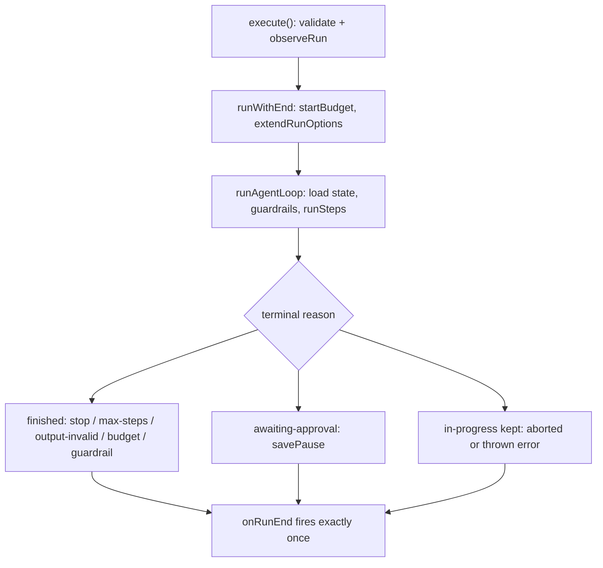

## What this is

A run is the lifetime of one `AgentExecutor.execute()` (or `resumeAfterApproval()`) call: it opens an `invoke_agent` span, iterates steps, and ends in exactly one `finishReason`. Think of it like a phone call — there is a dial (validation and setup), a conversation (the step loop), and exactly one way the call hangs up (the `finishReason`), and the call log entry is written no matter how it ended. Sessions sit above this — an `AgentSession` runs each user message as its own run with a shared transcript — so everything on this page describes a *single-turn* run.

## The mental model



Four nouns to hold: the **run** (one `execute()` call, open to settle), the **finishReason** (the single word describing how it ended), the **budget** (`limits`, `sessionBudget`, `maxDurationMs` — checked at step boundaries), and the **input queue** (user input that arrives mid-run).

## How it works

1. **Open** (`A → B`). `execute()` → `observeRun` (attaches the event sink) → `withSpan('invoke_agent')` → `runWithEnd`: `startBudget(options.limits, options.sessionBudget, options.signal)` composes the run and session limit scopes and, when `maxDurationMs` is set, an `AbortController` whose timer aborts with a `BudgetExceededError` reason; `extendRunOptions` composes the agent surface.

2. **Run** (`C`). `runAgentLoop` loads state (fresh or rehydrated), freezes `options.principal`/`options.metadata` from what was loaded, checks drift, and runs input guardrails before anything else. `stopBeforeStep` re-checks `signal` and `budget.check(usage, steps)` before every model call — the loop only ever *leaves* through a step boundary or an early-exit `ExecutionResult`.

3. **Close** (`D → E/F/G`). Exactly one of eight terminal reasons (`ExecutionFinishReason`) — the full table lives under *Under the hood*. A model end writes a `'finished'` checkpoint; a pause writes `'awaiting-approval'` + `approvalId`; an abort or a thrown error keeps the last `'in-progress'` state.

4. **Settle** (`H`). `onRunEnd` is guaranteed exactly once in the `finally`: `{ result }` on resolve — for *any* finishReason, including `'aborted'`, `'awaiting-approval'` and `'max-steps'` — or `{ error }` on reject.

## Under the hood

**The eight terminal reasons** (`ExecutionFinishReason`):

| `finishReason` | Produced by | Checkpoint status |
| --- | --- | --- |
| model's own (`'stop'`, `'length'`, `'tool_calls'`, `'content_filter'`, `'error'`) | `finishRun` after a text-only reply | `'finished'` |
| `'awaiting-approval'` | `pauseForApproval` → `savePause` | `'awaiting-approval'` + `approvalId` |
| `'aborted'` | `abortRun` (`signal` fired; a provider `AbortError` counts as the abort, never a failure) | `'in-progress'` (resumable) |
| `'max-steps'` | `outOfSteps` — the budget ran out mid-continuation | `'finished'` |
| `'output-invalid'` | `checkOutput` — `output` schema failed after one repair step | `'finished'` |
| `'budget-exceeded'` | `stopForBudget` — `limits`/`sessionBudget` tripped (or throws `BudgetExceededError` under `onExceeded: 'throw'`) | `'finished'` |
| `'guardrail'` | `stopForGuardrail` (or throws `GuardrailError` under `onTripped: 'throw'`) | `'finished'` |
| thrown error | any rejection: hook, provider, `PropagatingToolError` → `runFailed` → `error` + `run.done('error')` events | last `'in-progress'` state kept |

`'aborted'` is a *resolve*, not a rejection — deliberate, so callers get the partial transcript. `maxSteps` defaults to 10 (`maxStepsOf`); `limits.maxSteps` replaces it as the cap when set alone.

**Mid-run input** (`InputQueue` in `src/execution/inputQueue.ts`: `push`, `steer`, `startCall`, `callOutput`, `startBatch`, `endPhase`, `take`, `close`). It feeds `run.enqueue()`/`run.steer()`/`send(input, …)` mid-turn: queued messages join the transcript at the next safe point (after the current tool results, before the next model call) via `applyQueuedInput`. `steer()` aborts the in-flight model call through `startCall`'s controller *only until it first emits* (`callOutput` flips on the first `text.delta`/`tool-call`); after that it degrades to a queue. Unapplied input rides at the tail of every checkpoint so a crash loses nothing.

## In code

| Symbol | File | Role |
| --- | --- | --- |
| `AgentExecutor.execute` → `runWithEnd` → `runAgentLoop` → `runSteps` | `src/execution/AgentExecutor.ts` | Open → run → loop |
| `finishRun`, `abortRun`, `stopForBudget`, `stopForGuardrail`, `savePause`, `outOfSteps` | `src/execution/AgentExecutor.ts` | Terminal paths |
| `startBudget`, `maxStepsOf`, `budgetOfAbort`, `BudgetExceededError` | `src/execution/budget.ts` | Limit scopes and the max-duration timer |
| `ExecutionFinishReason`, `ExecutionResult` | `src/execution/AgentExecutor.ts` | The outcome types |
| `InputQueue` | `src/execution/inputQueue.ts` | Mid-run input plumbing |
| `AgentSession` turn plumbing | `src/session/AgentSession.ts`; `src/createAgentApprovals.ts` | Session-level runs; approval-bound continuation |

## Example

```ts
const controller = new AbortController();
const run = AgentExecutor.stream({ agent, input: 'Draft the report', provider, signal: controller.signal });

for await (const event of run) {
  if (event.type === 'text.delta') process.stdout.write(event.text);
}
const result = await run.result; // 'stop' | 'aborted' | 'awaiting-approval' | ...
```

`stream` returns the same run shape: iterate events as they arrive, then `await run.result` for the one `finishReason`. Calling `controller.abort()` resolves — not rejects — with `'aborted'`.

## Design decisions

- **Abort resolves.** Cancellation is a user action, not a failure — `result.finishReason === 'aborted'` plus the transcript so far is more useful than an exception, and a checkpointed abort is resumable (LOU-V1).
- **Budget checks sit at step boundaries** (before each model call, and after one that asked for tools) except `maxDurationMs`, which needs a timer to interrupt in-flight work; the abort reason is a `BudgetExceededError` so `abortRun` can route it to `stopForBudget` instead of a plain `'aborted'`.
- **`onRunEnd` in `finally`.** One settle hook for every outcome — including results that resolve with pause/abort reasons — avoids the classic "success path only" cleanup bug (LOU-Y4.2).
- **`run.start`/`run.done` exactly once.** The sink drops a second top-level `run.start` (a streamed resume emits its own) and closes on `run.done` — event consumers can treat the pair as brackets.
- **A failed run keeps its last `'in-progress'` checkpoint.** Rejection is not an end state for durability: `execute()` again with the same `sessionId` resumes the unfinished run.

## Where next

- [Execution loop](/core/execution-loop) — what happens inside one step.
- [Approvals](/core/approvals) — the `'awaiting-approval'` end state and resume.
- [Durable execution](/core/durable-execution) — how terminal states map to checkpoint statuses.
- [Streaming events](/core/streaming-events) — the `run.start`→`run.done` envelope.
