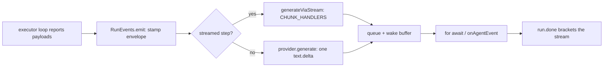

## What this is

Every run reports through a single event system: the executor loop calls a `RunEventSink` interface (passed on options under the `RUN_EVENTS` symbol), and the sink turns those reports into `AgentEvent`s — versioned, JSON-safe, seq-numbered — delivered to a `for await` consumer, `onAgentEvent` listeners, or both. Think of it like the telemetry bus on a spacecraft: instruments keep reporting readings into one channel whether or not ground control is listening — the mission doesn't change either way. `agent.stream()`, `execute({ onAgentEvent })`, `session.stream()`, `resumeAfterApproval` streaming and sub-agent events all flow through this one channel in `src/execution/agentRun.ts`.

## The mental model



Five nouns to hold: the **sink** (`RunEventSink` — the reporting interface), the **payload** (`AgentEventPayload` — an event minus its envelope), the **envelope** (`runId`, `seq`, `timestamp`, `v`), the **`AgentRun` handle** (buffer + `result` promise), and the **subagent tag** (the marker events from child runs carry).

## How it works

1. **Wire the sink** (`A`). `observeRun(options, run)` attaches a sink: the existing `options[RUN_EVENTS]` (a `stream()` run) or a fresh `RunEvents` when `onAgentEvent` listeners exist. It then wraps the run so `run.done` (resolve) or `error` + `run.done('error')` (reject) are emitted exactly once. With no sink and no listeners the run reports nothing — zero overhead.

2. **Assemble the event** (`B`). The loop reports payloads (`AgentEventPayload` = event minus envelope); `RunEvents.emit` stamps `runId`, monotonic `seq` (0-based, gapless), ISO `timestamp`, `v: AGENT_EVENT_SCHEMA_VERSION`, and `subagent` when the event came through `sink.forSubagent(info)`. Values go through `toJsonValue` (JSON round-trip; `undefined`→`null`, unserializable → string) so events survive SSE/WebSocket verbatim.

3. **Report the model call** (`C → D` or `E`). `sink.generate()` obtains a model step: `generateViaStream` when the provider can stream (`canStream` = has `stream()` and `supportsStreaming`), else `provider.generate()` with the whole text as one `text.delta`. `streamModelCalls: false` forces the latter even on streamed runs; `execute()` *without* iteration streams model calls too (M9 default). Streamed chunks map via `CHUNK_HANDLERS` (`text-delta`, `tool-call`, `reasoning-*`, `hosted-tool-*`, `finish`, `error`) and reassemble into the same `GenerateResult` the loop uses — streaming is a reporting detail, not a different model call.

4. **Report tool calls, then deliver** (`F → G`). `toolStart`/`toolSettled` bracket every tool call, generator-tool yields become `tool.partial`, and events held by `heldUntil` wait on the input-guardrail verdict — all landing in the same unbounded `queue` + `wake` buffer (each mechanism detailed under *Under the hood*). The consumer drains it via `for await` or `onAgentEvent` listeners.

5. **Close the stream** (`H`). `run.start` opens the stream, `run.done` ends it — exactly once each — and `run.result` settles independently so the outcome is awaitable even if nothing iterated.

## Under the hood

The density lives in five mechanisms — what tool events carry, the run brackets, held output, the handle's buffer semantics, and how sub-agents join the stream.

**Tool events.** `toolStart` records a start timestamp per call (keyed by `toolStartKey` = subagent chain + call id, since ids collide across runs); `toolSettled` emits `tool.done` (`result`, `durationMs`, `replacedByHook`) or `tool.error`. `tool.resume` replaces a second `tool.start` for a call continued after approval — every call has exactly one `tool.start` across a pause. Generator tools' yields become `tool.partial` (per-call `index` from 0, JSON-encoded, never in the transcript). A successful `todo_write` result triggers a `todo.updated` brand check. Hosted provider tools arrive through `onHostedToolCall`/`onHostedToolResult` with `executedBy: 'provider'`.

**Run brackets.** `run.start` carries `agentName`/`agentId`; `run.done` carries `finishReason` (or `'error'` when the run failed), the final `text`, and `usage`/`object` when there is one — a listener that never touches `run.result` can still rebuild the outcome. Rejects flow through `error` *then* `run.done('error')` so iterators see a complete stream even on failure.

**Held output (N5b).** When parallel input guardrails race the first model call, `heldUntil(hold)` buffers the step's `text.delta`/`reasoning`/hosted events until the verdict: released in order on pass, dropped on trip — the model's output never reaches listeners before its input was cleared.

**AgentRunImpl.** `startAgentRun` builds the handle: a `queue` + `wake` promise drains to `for await`; `result` settles independently (never unhandled); `enqueue`/`steer` delegate to the `InputQueue`. There is **no backpressure** — events buffer unboundedly until read. Breaking out of iteration aborts the run (`controller.abort`, `finishReason: 'aborted'`); a second iteration throws `LOUSHO_RUN_ALREADY_ITERATED`.

**Sub-agents.** `forSubagent(info)` returns a sibling sink tagging events with `subagent` (`name`, `depth`, `toolCallId`, `parent` chain); a sub-agent's own `run.start`/`run.done` are swallowed so only the top-level run brackets the stream.

## In code

| Symbol | File | Role |
| --- | --- | --- |
| `RunEventSink`, `RUN_EVENTS`, `observeRun`, `startAgentRun`, `streamResumed`, `runEventsOf`, `partialSink` | `src/execution/agentRun.ts` | The channel: wiring, sink, handle |
| `AgentEvent`, `AgentEventPayload`, `AGENT_EVENT_SCHEMA_VERSION` (= `1`), `AgentEventOf` | `src/execution/agentEvents.ts` | The wire protocol |
| `generateViaStream`, `canStream`, `reportReasoning`, `StepSink` | `src/execution/streamStep.ts` | Streamed model calls → events |
| `AgentRun` interface (`runId`, `result`, `enqueue`, `steer`) | `src/execution/agentRun.ts` | The consumer-facing handle |

## Example

```ts
const run = AgentExecutor.stream({ agent, input: 'Weather in Paris?', provider, toolRegistry });
for await (const event of run) {
  if (event.type === 'text.delta') process.stdout.write(event.text);
  if (event.type === 'approval.requested') console.log('paused:', event.toolName, event.approvalId);
}
const { finishReason } = await run.result;
```

Each iteration yields one `AgentEvent` in `seq` order; `text.delta` carries model text as it streams, and `approval.requested` announces a pause. Breaking out of the loop aborts the run (`finishReason: 'aborted'`), and a second `for await` over the same handle throws `LOUSHO_RUN_ALREADY_ITERATED`. `run.result` resolves independently of iteration, so awaiting it after the loop is always safe.

## Design decisions

- **One sink, not callback sprawl.** LOU-D41 replaced per-callback wiring with a single internal channel: every report site in the loop calls `runEventsOf(options)?.x()`, and whether anyone listens is decoupled from *what* is reported.
- **Versioned JSON, not objects.** `AgentEvent` carries no `Error`, no functions, no `undefined` fields — it can cross a wire or a test boundary unchanged. `v` bumps only on breaking changes to *existing* events; new types/fields are additive (docs/stream-events.md is the public mirror, kept in sync by a test).
- **`seq` gapless per run** gives consumers a cheap ordering/completeness check without timestamps.
- **Approval events belong to the top-level run.** A sub-agent's pause is reported by the parent run that actually pauses (`subagent`-less `approval.requested`), because only that run's lifecycle stops.
- **`tool.resume` instead of a second `tool.start`** (LOU-R17): keeps "one call = one start" true for UIs counting active tools, at the cost of one extra event type.
- **Abort-on-break.** An abandoned `for await` means "stop spending tokens" — the consumer owns the run's lifetime *(inferred; matches `AgentRunImpl`'s controller wiring)*.
- **Chunks reassemble into `GenerateResult`.** Streaming and non-streaming runs converge on the same result type before the loop continues, so step accounting, usage and tool extraction have exactly one implementation — the wire format is a reporting detail.
- **No backpressure, unbounded buffer.** Events outlive their reader — `run.result` works even if nothing iterates — at the cost of memory for chatty streams; the trade favors "a listener can attach late" over flow control *(inferred)*.

## Where next

- [Execution loop](/core/execution-loop) — the reports the sink receives.
- [Run lifecycle](/core/run-lifecycle) — `run.start`/`run.done` bracketing and finish reasons.
- [Approvals](/core/approvals) — `approval.requested` and the streamed resume (`tool.resume`).
- [Hooks](/core/hooks) — `ctx.emit` lets generate hooks inject `compaction.*` events.
