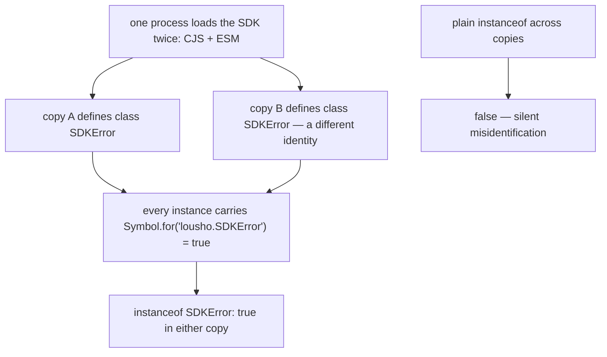

# Entry Point

`src/utils/brand.ts` (`instanceOfBranded`, LOU-D42) and the brand sites: `Symbol.for('lousho.SDKError')` on `SDKError` (`src/utils/sdkError.ts`), the same pattern on `HookRegistry`; private `unique symbol` keys `RUN_EVENTS` (`src/execution/agentRun.ts`), `PROVIDER_EVENTS` (`src/providers/providerEvents.ts`), `TOOL_DEFERRAL`, `CODE_MODE`; the `globalThis` slot `lousho.providerInterceptor`; the non-enumerable `lousho.todoList` result brand (`src/tools/built-in/todo.ts`); `WeakSet`/`WeakMap` marks in `remoteAgent`/`handoffAgents`.

# Background

## Rationale

The SDK ships both CJS and ESM bundles, and one process can end up loading both (or two nested copies of the package). When that happens, each copy defines its own `class SDKError` — two different class identities for the same class — so TypeScript's structural typing and `instanceof` both fail. Think of a brand like a wax seal: two printing presses produce letters on different letterhead, but a seal pressed with a shared signet proves the letter came from us, whichever press made it. The SDK needs that kind of mark — a way to recognize "an object I made" that survives duplicated copies.

## Problem Statement

How does the SDK reliably identify its own objects — errors, hook registries, hidden option channels, remote-agent products — when two copies of the package may be live in one process, without polluting the public type surface or adding runtime cost?

## Business Value

`error instanceof SDKError` and internal channels keep working in real-world bundling (dual formats, nested deps) — the failure mode without brands is silent misidentification, which is worse than a crash.

# Goal

### Primary Goal

Every object the SDK must re-recognize carries a runtime mark appropriate to who must share it — `Symbol.for` for cross-copy identity, `Symbol()` for unforgeable internal channels, `globalThis` symbols for process-wide seams, `WeakSet`/`WeakMap` for unspoofable membership.

### Secondary Goals

- Compile-time surface stays clean: no branded-id nominal types; `sessionId` is a plain `string`, validated at boundaries by `assertSessionId` (ids become file names).

# Scope

## This project is for

- Runtime identity marks for values the SDK produces and re-recognizes; the private-channel mechanism for options objects.

## This project is not for

- Nominal/branded *id* types (`SessionId = string & {__brand}`) — deliberately absent; brands solve runtime recognition, boundary validation solves id correctness. A `name` check appears exactly once (`isCassetteError`) and only as fallback alongside the branded `instanceof`.

# Solution

Five forms, chosen by who must share the mark:

| Mark | Scope | Use |
|---|---|---|
| `Symbol.for` + `Symbol.hasInstance` | cross-copy | `SDKError`, `HookRegistry` — base-class `instanceof` via `instanceOfBranded`; subclasses keep default check |
| `Symbol()` unique symbol | one copy, invisible | `RUN_EVENTS`, `PROVIDER_EVENTS`, `TOOL_DEFERRAL`, `CODE_MODE` on public options — unforgeable, invisible to spread/`JSON.stringify` |
| `Symbol.for` on `globalThis` | process-wide | `lousho.providerInterceptor` — CJS and ESM bundles must see the same one |
| Non-enumerable `Symbol.for` property | recognizable, hidden | `lousho.todoList` result brand → emits `todo.updated`; `JSON.stringify` never sees it |
| `WeakSet`/`WeakMap` | membership | remote-agent products, handoff registrations — membership can't be faked by a lookalike |

## The picture



# Other Solutions

- **Plain `instanceof`** — rejected: two copies = two class identities; the dual-package hazard.
- **`error.name`/`constructor.name` checks** — rejected: minification renames them, anything can fake them.
- **Compile-time nominal types** — rejected for ids: buys nothing at runtime, forces casts on every consumer, can't fix cross-copy identity. *(Inference: no branded-id types exist anywhere in `src/`.)*
- **`Symbol.for` for private channels** — rejected: a registered symbol is reachable by anyone who knows its name — precisely what internals must not be.

## Challenges

- The brand is a prototype getter, so a foreign copy's `ConfigurationError` passes `instanceof SDKError` but not `instanceof ConfigurationError` — fine-grained branching uses `error.code` anyway.
- `Symbol.for` brands are spoofable by a determined consumer — they guard *accidental* identity loss; `WeakSet` marks cover the cases where forgery matters.
- `unique symbol` channels are per-copy — an options object from copy A can't smuggle its hidden field into copy B's call; accepted because the channels are internal.

# Implementation considerations

- **New error classes get the brand free** via `SDKError`'s inherited getter; a *new cross-copy class* needs hand-wired `Symbol.for` + `instanceOfBranded` (copy `HookRegistry`).
- **Serialization**: `unique symbol` fields are invisible to object spread and `JSON.stringify` — anything that must serialize options can't see them.
- **Dual-format awareness**: any change to the CJS/ESM build boundary is where a new copy gets introduced.

## Example

```ts
// src/utils/sdkError.ts — the cross-copy pattern
const SDK_ERROR_BRAND = Symbol.for('lousho.SDKError');
export class SDKError extends Error {
  static [Symbol.hasInstance](v: unknown) {
    return instanceOfBranded(this, SDKError, SDK_ERROR_BRAND, v);
  }
  get [SDK_ERROR_BRAND](): true { return true; }
}
```

## Where next

- [Errors](/core/errors) — where `Symbol.for('lousho.SDKError')` earns its keep
- [Build targets](/ship/build-targets) — the dual `dist/` outputs that create the second copy
- [Streaming events](/core/streaming-events) — `RUN_EVENTS`/`PROVIDER_EVENTS` as sinks
