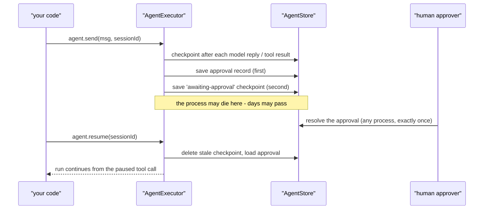

# Entry Point

The `store` option on `createAgent({ store })` — one `AgentStore` (`src/storage/agentStore.ts`) bundling four contracts: `SessionStore` for transcripts, `CheckpointStore` for run progress, `ApprovalStore` for paused approvals, `OAuthTokenStore` for tokens. Implementations: `memoryStore()` (in-memory), `fileStore()`, `SqliteStore` (`src/storage/`), `KVStore`/`kvCheckpointStore` for Workers (`src/deploy/`). Parts left out default to in-memory transcripts and approvals and *no* checkpoints — durability starts when you pass a store. Inside a run, `src/execution/checkpoint.ts` writes a `Checkpoint` after every tool-requesting model response, after every tool result, and on abort/pause/finish. Resume entry: `agent.resume(sessionId)` → `src/execution/resume.ts` → `resumeAfterApproval()`.

# Background

## Rationale

Agents pause for humans — and a human approval can legitimately take *days*. If a pause is just a promise sitting in memory, a deploy or crash in between silently turns "waiting for approval" into "lost the run". Think of it like a save file in a game: without one, switching off the console erases everything since the last level. Durability is a correctness property of the pause, not a convenience.

## Problem Statement

For a pause to survive, the run's full working state — transcript, `stepIndex`, `usage`, `businessState`, `status`, `approvalId`, `agentFingerprint`, `runConfig`, `principal`, `metadata` — has to live outside the process and be reloadable by a *different* process days later, so an approval resolved over HTTP can continue the exact run that produced it.

## Business Value

Makes human-in-the-loop a production feature rather than a demo one: server restarts, deploys and horizontal scaling stop being run-killers. It's also the SDK's differentiator — "no hosted runtime" only works if durability ships *with* the library instead of requiring an orchestrator service.

# Goal

### Primary Goal

A run paused for approval — or crashed mid-batch — resumes correctly from a different process, using only `sessionId` + a pluggable store; zero in-memory state is required to resume.

### Secondary Goals

- Store implementations stay swappable (memory/file/SQLite/KV) behind one contract, so the same agent runs in tests and on Workers.
- Adding a field to `Checkpoint`/`PendingApproval` never breaks loading of older records (backward-compatible persistence).

# Scope

## This project is for

- Resuming runs across processes and restarts; recovering a crashed run to its last committed step; approvals that outlive the process; a bounded history of past checkpoints per session.

## This project is not for

- Distributed locking or multi-writer coordination on a `sessionId` — the same-sessionId concurrency assumption is accepted.
- Schema guarantees on `businessState` — it's explicitly unvalidated JSON (checkpoint.ts).
- Idempotent side effects — a paused tool re-executes on resume; idempotence is the tool's contract, not the store's.

# Solution

Checkpoints commit at fixed points in the loop: after a model response requesting tools, after each recorded tool result, on abort/pause/finish (`checkpoint.ts`). Ordering matters at the pause boundary: the **approval record is written first, the checkpoint second** — a reader that sees the checkpoint can always find the approval ([approvals](/core/approvals)). Approvals are *claim-on-read* (`wx` claim files, `resolved_at` transactions, KV get+delete) so two processes can't both resolve one. `resumeAfterApproval()` deletes the stale pre-pause checkpoint before re-entering `execute()` so resumption can't rehydrate it (LOU-K5). A caller stumbling onto a paused session gets `SessionAwaitingApprovalError` carrying `sessionId`/`approvalId`/`approvalKind` (`src/execution/errors.ts`).

## The picture



# Other Solutions

- **In-memory runs, persistence bolted on later** — rejected: retrofitting would thread `save`/`load` through executor, session layer and approval gate simultaneously; the seams are identical either way, so they were store-shaped from the start.
- **External workflow engine (Temporal-style)** — rejected: makes a service mandatory for basic multi-turn work, contradicting "runs in your own Node process".
- **One store interface for everything** — rejected: an approval is a decision-waiting (delete-on-read `resolve()`), a checkpoint is progress-so-far (overwrite `save()`); different lifecycles get different interfaces.

## Challenges

- `Checkpoint` payloads must survive `JSON.stringify`/`JSON.parse` — constrains what fields can hold.
- Resume re-executes unanswered tool calls — crash semantics push idempotence onto tool authors; partial `tool.partial` output is lost.
- `store` is a **run-level** option: after `handoff()` the run keeps the entry agent's stores — `createAgent` warns once when a target built its own (`runLevelOptionNames`, N6).

# Implementation considerations

- **Persistence migrations**: every new `Checkpoint`/`PendingApproval` field must load on old records ("absent on older checkpoints" comments mark the boundary).
- **Sub-agent pauses**: a run paused inside a sub-agent snapshots enough to re-extend the agent on resume.
- **Testing**: contract tests (`checkpointHistory.contract.test.ts`, `sessionFork.contract.test.ts`) run the same semantics against every store impl — a new store must pass them.
- **Monitoring**: checkpoint writes are the durability signal; a run that checkpoints without finishing is either paused or dead — `agent.drift` events flag drift on resume.

## Example

```ts
const agent = createAgent({ provider, store: new SqliteStore('./.lousho/jobs.db') });
try {
  await agent.send('Book a table for 2', { sessionId: 'chat-42' });
} catch (error) {
  if (error instanceof SessionAwaitingApprovalError) {
    await agent.approvals.resolve({ id: error.approvalId!, approved: true });
  }
}
await agent.resume('chat-42'); // after a crash mid-run
```

## Where next

- [Durable execution](/core/durable-execution) — checkpoint lifecycle and resume semantics
- [Storage stores](/state/storage-stores) — the four implementations and their trade-offs
- [Build targets](/ship/build-targets) — KV stores on Workers
