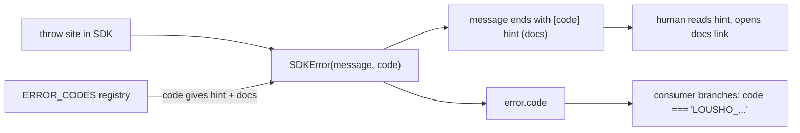

# Entry Point

`SDKError` (`src/utils/sdkError.ts`) — the class every intentional SDK throw uses — and the `ERROR_CODES` registry (`src/utils/errorCodes.ts`), the single source of truth mapping each `LOUSHO_<AREA>_<NAME>` code to a fix `hint` and a `docs` link into `docs/errors.md#<code>`. The subclass layer lives in `src/execution/errors.ts` (`AgentExecutionError`, `ToolExecutionError`, `SessionAwaitingApprovalError`, …; it also re-exports `SDKError`). Consumers see the surface as `error.code` / `error.hint` / `error.detail` and branch on `code`.

# Background

## Rationale

An uncaught error is the SDK's most-read interface — it's what every user sees first when something breaks, and a bare stack trace wastes that moment. Think of it like a car's diagnostic port: the scanner reports a stable code (`P0301`) the mechanic can look up in a manual, instead of a vague description that reads differently every time the manual is reworded. A coded error converts "something failed" into "here's exactly what to fix".

## Problem Statement

Consumers need to *handle* failures programmatically (branch on what went wrong) while humans need to *fix* them (what to do). Message text can't serve either reliably — it improves over time, and "improves" means "changes", which breaks anyone matching on it. What is needed instead is a handle that never changes plus prose that is free to: a stable code for `if (error.code === …)`, and a hint + link written for the person reading it.

## Business Value

Lower support burden and better DX: every thrown error self-documents its fix and a docs link. Greppable string codes let bug reports and logs correlate to a single stable identifier across versions.

# Goal

### Primary Goal

Every SDK-thrown error carries a stable `code` + one-sentence `hint` + docs link; consumers branch on `code`, never on message text; a registry↔source↔docs sync test makes adding a throw without a code impossible.

### Secondary Goals

- Model-facing errors stay terse (`appendHelp: false` strips the hint line from `message` while `toString()` keeps it for humans).
- `instanceof SDKError` holds across duplicated CJS/ESM copies via the `Symbol.for` brand ([branded types](/design/branded-types)).

# Scope

## This project is for

- Errors the SDK throws on purpose — every deliberate `throw` goes through `SDKError` with a registered code.
- The `compactProviderError` five-category reduction of whatever a provider throws (same `{error: string}` family as tool-error results so the model sees one shape, LOU-T4).
- Subclasses that carry structured fields next to the code (`MissingPeerDependencyError.installCommand`, `SessionAwaitingApprovalError.approvalId`).
- The sync tests that keep registry entries, throw sites and `docs/errors.md` sections in lockstep.

## This project is not for

- Errors that are already structured results — `PropagatingToolError` (control flow), `WorkspaceError`/`McpToolError` (tool results), `CronExpressionError`, `DecryptionError` stay code-free on purpose.
- `AuthError` — a 401/403 the caller's app surfaces to its user, not a fixable SDK condition.

# Solution

Each `SDKError` carries `code`; the registry maps code → `{ hint, docs }`; `message` ends with `[code] hint (docs)` unless `appendHelp: false`. `error.detail` exposes the raw message without the help line, so consumers don't have to parse it back off. `src/utils/plainErrors.test.ts` fails if new SDK code throws a literal `Error` — the few grandfathered sites are listed there with reasons. `SDKError` lives in `utils` (not `execution/errors.ts`) so browser entries can throw it without pulling the `ai` peer.

## The picture



One throw produces two surfaces at once: `error.code` for `catch` branches, the help line for whoever reads the log.

# Other Solutions

- **Subclass-only taxonomy** — rejected: "catch `ConfigurationError`" says *where*, not *what to do*; `LOUSHO_CONFIG_MISSING_PROVIDER` vs `LOUSHO_CONFIG_INVALID` need different fixes from the same class. Subclasses remain for fields (`MissingPeerDependencyError.installCommand`).
- **Message matching** — the explicit anti-goal; docs tell consumers to branch on `code` because text may change.
- **Enum/numeric codes** — rejected: string codes are greppable and survive serialization into events and logs.

## Challenges

- Codes are forever: renaming one breaks consumers' `catch` blocks — names are chosen carefully (`LOUSHO_OUTPUT_INVALID` is reserved even though it reports as a `finishReason`, not a throw).
- `appendHelp: false` splits the surface: `error.message` (model-facing, bare) vs `String(error)` (human-facing, with hint) — logging the former shows less than the latter.
- A `code` not in the registry still compiles (the constructor accepts `string` beyond the `ErrorCode` union) but yields no `hint`/`docs` — the sync test, not the type, closes that gap.

# Implementation considerations

- **Every new throw is a three-part change**: pick a code, write a hint, add a `docs/errors.md` section — the sync test enforces all three.
- **When adding errors meant for the model** (tool/provider failures), pass `appendHelp: false` so `message` stays token-clean.
- **Serialization**: codes survive into events/logs/traces where the Error object itself doesn't.
- **Browser entries**: `SDKError` must stay free of `ai`-SDK imports — that's why it lives in `utils`, so `src/ui` and the React/Vue/Svelte entries can throw it.
- **Default code**: `new SDKError(msg)` without a code falls back to `LOUSHO_GENERIC_ERROR` (sdkError.ts) — a valid escape hatch, but a real code is what consumers can branch on.

## Example

```text
ConfigurationError: createAgent: no model configured. Do one of the following: ...
[LOUSHO_CONFIG_MISSING_PROVIDER] Pass a model string such as
createAgent({ model: 'openai/gpt-4o-mini' }), a provider instance, or set
LOUSHO_MODEL or a provider API key. (…/docs/errors.md#lousho_config_missing_provider)
```

## Where next

- [Errors](/core/errors) — the classes, compaction categories, propagation
- [Branded types](/design/branded-types) — the cross-copy `instanceof` mechanism
- [Docs pipeline](/quality/docs-pipeline) — the registry sync tests
