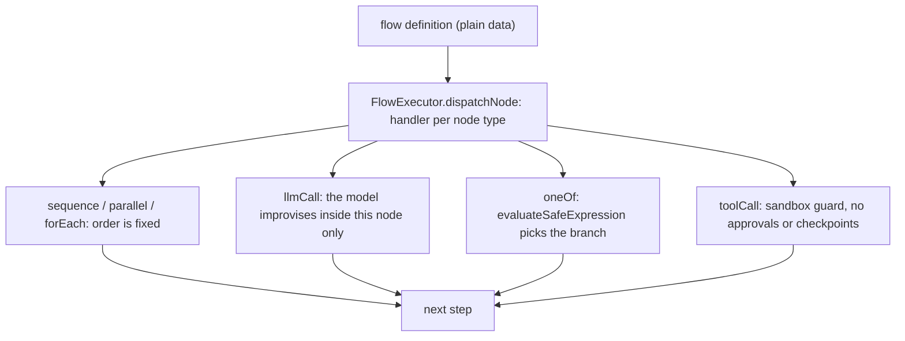

# Entry Point

Two executors: `AgentExecutor` (`src/execution/AgentExecutor.ts`) — the model-driven tool loop behind `createAgent`/`send`/`stream` — and `FlowExecutor` (`src/flows/FlowExecutor.ts`) + `FlowBuilder`/`validators.ts`, reached via `examples/*` and spec/kit composition. The type split is declared in `src/types/flow.ts` (`EditorShapeStep` vs `RuntimeStep`); conditions run through `evaluateSafeExpression` (`src/flows/safeExpression.ts`).

# Background

## Rationale

Two different jobs need sequencing: "let the model improvise within bounds" (open-ended tool work) and "the order is the contract" (phase pipelines, routing, fan-out). Think of it as taxi versus train: the agent loop is a driver who picks each turn as they go; a flow is a rail line — the track is fixed, and the model only fills the cars (`llmCall` nodes). One mechanism can't serve both — a loop can't guarantee ordering, and a deterministic graph can't improvise.

## Problem Statement

When a pipeline is known in advance, the model must not be able to skip the verify phase, reorder spec→plan→implement, or forget the merge after a parallel fan-out (`examples/phase-pipeline`, `examples/waves`). But most agent work is genuinely open-ended and needs the loop.

## Business Value

Deterministic orchestration is what makes phase/wave patterns *guarantees* rather than prompt suggestions — the difference between "the model usually verifies" and "the harness runs verify". It's the machinery behind the phase-engineering example and any order-critical pipeline.

# Goal

### Primary Goal

Two composable control flows: `AgentExecutor` for model-driven turns bounded by `maxSteps`/`limits`/permissions, and `FlowExecutor` for deterministic graphs where the model only fills `llmCall` nodes — with no overlap in responsibility.

### Secondary Goals

- Flow definitions from untrusted editors run without `eval`/`new Function` (safe-expression grammar).
- Flows stay embeddable: a flow runs under a plain `AgentConfig` (`isCreateAgentResult` rejects a live agent — LOU-R14), so it composes inside agents, not the other way.

# Scope

## This project is for

- The `RuntimeStep` set: `sequence`, `parallel`, `oneOf`, `forEach`, `llmCall`, `toolCall`, `setVariable`, `evaluator`, `return`, `end`, `throw` — 11 node types with total handlers.
- Flow definitions as plain data — a serializable step tree a visual editor or registry can produce, never executable code.

## This project is not for

- Durable or human-gated work inside a flow — `toolCall` nodes go through the sandbox guard but *not* approvals/hooks/checkpointing; that work belongs to the loop.
- Runtime `loop`/`condition`/`uiComponent`/`bestOfAll` nodes — `EditorShapeStep` types exist for visual editors but have no handler; a `loop` reaching `dispatchNode` throws `LOUSHO_FLOW_INVALID`.

# Solution

`FlowExecutor` is static and instance-free: a per-type handler map dispatches nodes, emitting `step-start`/`step-complete`/`step-error` events and OTel `flow.node`/`chat`/`execute_tool` spans; tool calls route through `executeToolWithSandboxGuard`. Two deliberately different interpolation regimes: prompts/tool args use flat `{{var}}` substitution (regex `\{\{(\w+)\}\}`, `toString()`, missing → `''` — dumb and predictable because output is model input); `oneOf`/`evaluator` conditions use `evaluateSafeExpression` — a recursive-descent evaluator, no host code, allowlists `includes`/`startsWith`/`endsWith`, binds `{{name}}` as *values* (a variable containing `x' === 'x' || 'a` is data, not injection). `return`/`end` resolve a value but don't early-exit — `executeSequence` runs every step; branching is expressed by `oneOf`, never by bailing.

## The picture



Every node reduces to a value the next step consumes; `oneOf` is the only node that chooses between paths.

# Other Solutions

- **Prompting the loop into compliance** — rejected: "always verify after editing" is a suggestion the model follows most of the time; a `oneOf` chain makes it structural. Guaranteed ordering is the whole reason flows exist.
- **Loops inside the executor** — rejected: a `loop` node would let an untrusted definition run unboundedly; repetition goes through `forEach` over known items, open-ended work through the agent loop. *(Inference: keeping "run until condition" graphs out of the executor keeps every run finite modulo `forEach` counts and the `maxDepth` guard, default 100.)*
- **`return` as early-exit control flow** — rejected: every node is a value-producer; `oneOf` is the only brancher, which is why routing flows put `return` inside options.
- **`eval`/`new Function` for conditions** — rejected: flow definitions come from untrusted editors/registries; the safe-expression grammar rejects `constructor`/`__proto__`/globals/assignment.

## Challenges

- Editor/executor duality: a node in `EditorShapeStep` but not `RuntimeStep` fails at *run* time — the editor must lower it.
- Two syntaxes: `{{var}}` flat text vs expression grammar; `{{check.feedback}}` can't resolve (`\w+` no dots) — nested values go through `$` references/`setVariable`.
- The executor predates store/session machinery — bridging is examples-level today (`phase-pipeline` orchestrates agents *around* flows).

# Implementation considerations

- **Adding a node type**: handler in `FlowExecutor` + `RuntimeStep` type + validator — and decide whether it's editor-shape or runtime.
- **Untrusted input**: conditions/variables are bound as values, never pasted into expression text; `maxDepth` (100) bounds recursion.
- **No durability**: flows emit events and spans but no checkpoints — a crashed flow restarts, it doesn't resume.

## Example

```ts
{ type: 'oneOf', options: [
  { condition: "check.startsWith('PASS')", step: reportPhase },
  { step: { type: 'sequence', steps: [retryImpl, checkAgain] } },
]}
```

## Where next

- [Flows](/compose/flows) — node reference, events, executor internals
- [Execution loop](/core/execution-loop) — the model-driven alternative
- [Phase engineering](/techniques/phase-engineering) — the pattern flows exist for
- [Typed decisions](/design/typed-decisions) — what feeds `oneOf` conditions
