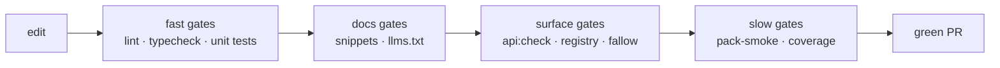
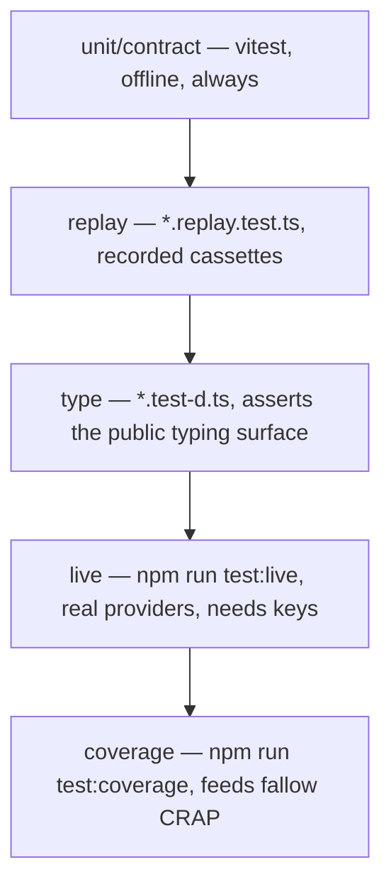

## What this is

The repo is protected by a pipeline of checks — some fast (lint, typecheck), some structural (API surface drift, docs snippet verification), some slow (pack-smoke, full coverage). Running them locally in the same order CI does means you fail fast, close to the change. Think of it as a set of increasingly expensive bouncers: talk to the cheap ones at the door before the expensive ones inside.

## The mental model



## Setup

```bash
git clone https://github.com/LinuxDevil/agent-sdk.git
cd agent-sdk
npm install          # Node >= 22.19
npm run typecheck    # tsc --noEmit
npm test             # vitest, fully offline (mockModel + cassettes)
```

## The gate loop

CI runs these in order; run them locally in the same order to fail fast:

| Command | What it catches |
|---|---|
| `npm run lint` | ESLint incl. `no-explicit-any` |
| `npm run typecheck` + `npm run typecheck:tests` | src and test/type-test compile |
| `npm test` | Unit + contract suites (offline) |
| `npm run docs:llms:check` | `llms.txt`/`llms-full.txt` freshness — run `npm run docs:llms` after touching `docs/**`, `README.md`, or `examples/*/README.md` |
| `npm run api:check` | Public-API surface drift — run `npm run api:update` after touching exports |
| `npm run docs:verify-snippets` | Every ` ```ts ` block in `docs/` type-checks against `src/`; non-`no-run` snippets also execute |
| `npm run fallow` | Dead code, duplication, complexity/CRAP gates |
| `npm run pack-smoke` | npm pack → install → ESM/CJS import → CLI smoke |

The last two are slow; everything before them takes under a minute.

## Test tiers



- **Unit/contract** — `vitest run`; deterministic, no keys needed.
- **Replay** — `*.replay.test.ts` replays recorded provider cassettes.
- **Live** — `npm run test:live` hits real providers when `OPENROUTER_API_KEY`/etc. are set (`vitest.live.config.ts` merges `.env` into `process.env`). Use it to re-validate provider behavior; it re-records cassettes.
- **Type tests** — `*.test-d.ts` assert the public typing surface.
- **Coverage** — `npm run test:coverage` regenerates `coverage/`; fallow's CRAP scores consume it, so stale coverage can produce phantom findings.

## Changing code that ships

<Steps>
  <Step title="Write a failing test">Suite conventions live next to the code (`*.test.ts` colocated).</Step>
  <Step title="Implement">Keep the run loop and store contracts intact.</Step>
  <Step title="Public API change?">`npm run api:update`, eyeball the diff, and check docs snippets if user-facing.</Step>
  <Step title="Doc change?">Every ` ```ts ` block must typecheck standalone; `no-run`/`no-verify` fences exist for fragments.</Step>
  <Step title="Regenerate">`npm run docs:llms` if any user-facing doc or README changed.</Step>
  <Step title="Changelog">Entry under `## [Unreleased]`.</Step>
</Steps>

See [adding a feature](/contribute/adding-a-feature) for the full checklist.
