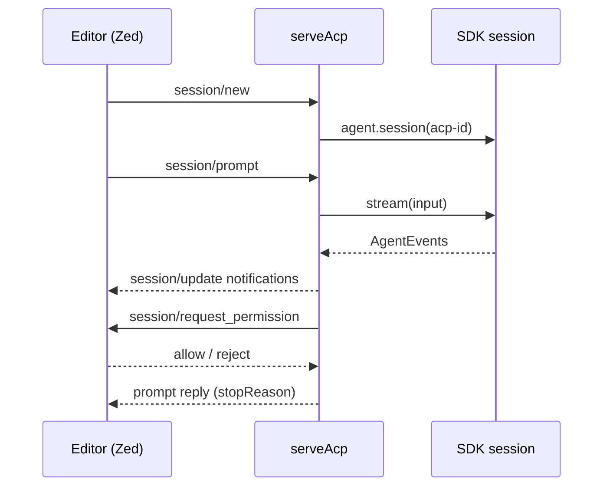

## What this is

`serveAcp()` (`src/acp/serveAcp.ts`) serves an agent over the [Agent Client Protocol](https://agentclientprotocol.com) v1 — the protocol editors like Zed use to embed a coding agent, the same role LSP plays for language servers. The wire format is JSON-RPC 2.0 — every message is one JSON object with `method`/`params`/`id`, one per line (NDJSON). The server is transport-independent: it reads lines from `options.input` and hands outgoing lines to `options.write`; `lousho acp` (`src/cli/acp.ts`) wires those to stdin/stdout and forces `console.*` to stderr, because stdout must carry nothing but protocol frames.

## The mental model



Hold three nouns: the **dispatch loop** (one line in, one reply out), the **session map** (`sessions: Map<acpSessionId, { sdk, abort?, question? }>` — one ACP session is one SDK session), and the **waiting map** (`waiting: Map<requestId, resolve>`) for reverse-direction requests — the agent asking the *client* a question.

## How it works

1. `initialize` answers `{ protocolVersion: 1, agentCapabilities: { loadSession: false, promptCapabilities: text-only }, authMethods: [] }`.
2. `session/new` creates one SDK session (`agent.session({ id: 'acp-<newId>' })`), so prompts share history. `cwd`/`mcpServers` are ignored — the agent's own config owns both.
3. `session/prompt` joins `text` blocks and `resource_link` blocks (as Markdown links) into plain input (`promptText`); anything else is dropped, and an all-empty prompt fails `-32602` (JSON-RPC's "invalid params" code). `turn()` runs it; the reply is `{ stopReason }`.
4. During the run, `relay()` maps each `AgentEvent` through the `UPDATES` table into `session/update` notifications: `text.delta` → `agent_message_chunk`, `reasoning.delta` → `agent_thought_chunk`, `tool.start` → `tool_call` (`in_progress`, `rawInput: args`), `tool.resume`/`tool.done`/`tool.error` → `tool_call_update` (`in_progress`/`completed`/`failed`). Sub-agent events produce no update — they stay inside their parent's tool call.
5. A tool-approval pause (`approval.requested`, kind `tool`) becomes `session/request_permission` — a reverse RPC: `request()` sends it with an id and parks the resolver in `waiting` until the client's response arrives (an abort fabricates `outcome: cancelled`). The chosen `allow`/`reject_once` option drives `agent.approvals.streamResolve()`, and its events stream back through the same `relay`.
6. `session/cancel` (a notification — no `id`, no reply) aborts the session's `AbortController`; the in-flight prompt resolves `cancelled`.
7. When `input` ends, in-flight prompts are aborted and the loop settles.

## Under the hood

The pause loop in `turn()` handles the three approval kinds differently:

- **Tool approval** → `permit()` sends `session/request_permission`. After a cancel, the decision runs under the aborted signal so the approval still settles.
- **`kind: 'question'`** → `ask()` emits the question (with numbered options) as an `agent_message_chunk`, ends the turn with `stop`, and remembers the `approvalId`; the *next* `session/prompt` is routed to `approvals.streamAnswer` instead of `session.stream`.
- **`kind: 'sign-in'`** → `signIn()` shows the link, then loops `permit()` ("I've signed in") → `streamResolve(approved: true)` → `awaitSignInGate`: approving before the OAuth callback lands returns `pending` and the client is asked again; reject resolves `approved: false` and relays the cancellation.

Error mapping: a JSON parse failure is `-32700` (parse error); an unknown method `-32601` (method not found); a handler failure becomes `-32603` (internal error) whose `data.code` is extracted from the `LOUSHO_*` marker in the message (`toRpcError`). `stopReason` maps via `STOP_REASONS` — `max-steps`→`max_turn_requests`, `budget-exceeded`/`length`→`max_tokens`, `guardrail`/`content_filter`→`refusal`, `aborted`→`cancelled`, else `end_turn`. A run ending in `error` throws `LOUSHO_AGENT_EXECUTION_FAILED` as an RPC error.

## In code

| Symbol | File | Role |
| --- | --- | --- |
| `serveAcp(agent, { input, write, store? })` | `src/acp/serveAcp.ts` | The protocol loop; runs until `input` ends, then aborts in-flight prompts and settles. |
| `runAcp`, `parseAcpArgs` | `src/cli/acp.ts` | The CLI: `lousho acp <spec.yaml\|spec.json\|agent-dir\|agent.ts> [--model provider/model]`; loads the target like `lousho chat`. |
| `UPDATES`, `STOP_REASONS`, `PERMISSION_OPTIONS` | `src/acp/serveAcp.ts` | The three lookup tables that are the whole protocol mapping. |
| `relay`, `permit`, `ask`, `signIn`, `turn` | `src/acp/serveAcp.ts` | Event forwarding and the three pause-kind handlers. |

## Example

```bash
# Serve an agent directory to Zed:
lousho acp ./my-agent --model openai/gpt-4o
```

```json
// Zed settings.json — register the agent as a custom server the editor launches
{ "agent_servers": { "My agent": { "type": "custom", "command": "npx", "args": ["lousho", "acp", "/path/to/my-agent"] } } }
```

```ts
// Embedded (tests, other transports): feed lines in, collect lines out.
import { serveAcp } from '@lousho/build-ai-agent';

const out: string[] = [];
await serveAcp(agent, {
  input: (async function* () { yield* ['{"jsonrpc":"2.0","id":1,"method":"initialize","params":{}}']; })(),
  write: (line) => out.push(line),
});
```

`input` is any `AsyncIterable<string>` — a test feeds an array, the CLI feeds `readline` over stdin — so the protocol code never sees a socket.

## Design decisions

- **NDJSON, no LSP-style framing.** ACP is one JSON object per line; `serveAcp` takes `AsyncIterable<string>` precisely so transports stay outside the protocol.
- **One ACP session = one SDK session.** History, pending turns and (with `store`) durability come free from `AgentSession`; `loadSession: false` because the SDK's resume model doesn't map onto ACP's *(inferred)*.
- **Approvals are agent→client requests, not updates.** `request()`/`waiting` implement the reverse direction so an editor's native approve/deny UI works unchanged.
- **A question is a turn boundary, not a pause inside one.** ACP has no "answer" primitive; ending the turn and routing the next prompt to `streamAnswer` fits the editor's mental model — the question is just agent output, the reply is just user input.
- **Sign-in re-asks rather than blocking.** The link is shown, "allow" means "I've signed in", and `awaitSignInGate` detects the not-yet-signed-in `SignInPendingError` so the prompt loops until the callback lands or the user cancels.
- **`store` defaults to the agent's own.** Pass an explicit `AgentStore` when ACP transcripts should live somewhere else (e.g. a throwaway memory store).

## Where next

- [Server and routes](/interfaces/server-and-routes) — the HTTP sibling of this protocol surface.
- [Approvals](/core/approvals) — `streamResolve`/`streamAnswer` and the three pause kinds.
- [OAuth](/interfaces/oauth) — the `awaitSignInGate` loop `signIn()` drives.
- [Sessions](/state/sessions) — what one ACP session maps to.
