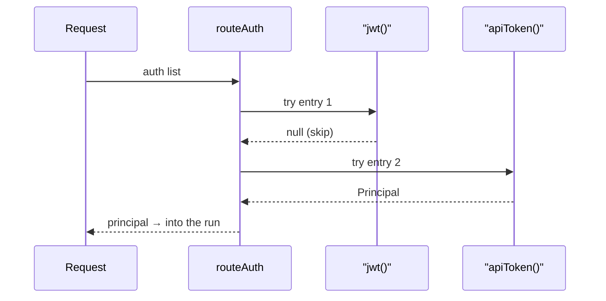

## What this is

`@lousho/build-ai-agent/auth` (N10a) answers two questions per request: *may it call* and *who is it*. A route gets an ordered list of `AuthFn` entries — bouncers standing in a line, each either waving the request through with an identity or stepping aside. The identity is a `Principal`: `{ id, type: 'user'|'service', authenticator, issuer?, claims? }`. That principal rides into the run and is what tools, permission rules, memory scopes and OAuth credential owners see. Everything is Web Crypto / Fetch only — no `node:*`, no dependencies — so the same helpers run on Node, Workers and edge routes.

## The mental model



Hold three nouns: the **auth list** (ordered `AuthFn`s), the **principal** (the identity an accepted request carries), and the **challenge** (the `WWW-Authenticate` hint a 401 sends back).

## How it works

1. `routeAuth(request, auth)` walks the list in order. Each entry returns a `Principal` (accept — later entries are not asked), `null`/`undefined` (skip to the next), or throws `AuthError` (stop the walk with its 401 or 403).
2. If every entry skips, the answer is one generic `401` carrying one `WWW-Authenticate` header per distinct challenge (`Bearer`, `Basic realm="…"`). Bodies never say which check failed.
3. An entry that throws anything else, or returns a non-principal, is a bug: `500`, generic body, `console.error`.
4. The accepted principal flows into `handleChatFetch`, which puts it on `session.stream`/`send`/`approvals.streamResolve` — see [Server and routes](/interfaces/server-and-routes).

## Under the hood

**The built-in entries** (`basic.ts`, `jwt.ts`, `oidc.ts`):

- `basic({ users })` — HTTP Basic auth (a `user:password` pair sent base64 in a header). Credentials are NFC-normalized, every configured user/password is hashed to SHA-256 and compared with no early exit — an unknown user costs the same as a wrong password. `users` may be a map or a function. Principal: `{ id: user, type: 'user', authenticator: 'basic' }`.
- `apiToken(token, { id? })` — a shared bearer token (a secret sent as `Authorization: Bearer …`), constant-time compared; principal `{ id: options.id ?? 'api-token', type: 'service', authenticator: 'api-token' }`. A bare `auth: '<token>'` string in `serveFetch`/`createRouteHandler` becomes this.
- `anonymous()` — explicit open access, so "no auth" is a choice, not an omission.
- `jwt(options)` — verifies a JWT, a signed JSON token (`header.payload.signature`) sent as a bearer token. `verifyJwt` parses it, refuses `alg: none`, unconfigured algorithms and `crit` headers, takes `source.keys(kid)` candidates filtered by `fits()` and capped at 5, verifies via Web Crypto, then checks claims.
- `oidc(options)` — `jwt()` whose keys come from the issuer's OIDC discovery document (`<issuer>/.well-known/openid-configuration` — a JSON file advertising the issuer's endpoints and key URL).

**JWT key safety is structural.** One `jwt()` takes exactly one key source — `secret`, `publicKey` or `jwksUrl` (JWKS is a JSON document of public keys an issuer publishes for rotating signers). `fits()` binds each allowed algorithm to the key's family (`HS`/`RS`/`ES`), so a token header can never turn an RSA/EC public key into an HMAC secret — the classic "algorithm confusion" attack — and a JWKS never yields an HMAC key. `exp` is required, `nbf`/`iat` honored, `iss`/`aud` checked when configured; clock tolerance is 60 s default, 300 max; RSA keys under 2048 bits are refused. `jwksKeySource` caches a key set for 10 minutes, refetches at most every 30 s (an unknown `kid` cannot force a fetch storm) and drops a set stale over 1 h. `oidc()` additionally requires the discovered document's `issuer` to equal the configured one and `jwks_uri` to be https (http only on localhost), retries discovery failures at most every 30 s, and ignores `jku`/`x5u`/`jwk` token headers — every key URL comes from configuration or the discovered document, never from the token.

**Where the principal goes** (N10a/N10b): `RunConfigContext` (the `model`/`instructions`/`tools` functions), `MemoryScopeContext`, `ctx.principal` in tools, `needsApproval`/`when` contexts, hooks, `PendingApproval.principal`, and in-process sub-agents (remote ones are not told). Channels set it from the verified sender (`inbound.principal`); the approvals route records the *decider* as `ctx.approval.by` without swapping the run's principal. The principal is frozen before user code sees it, is stored in checkpoints and snapshots — a resumed run keeps its caller; continuing as another principal is `LOUSHO_CONFIG_INVALID` — and never appears in events, spans or error messages.

## In code

| Symbol | File | Role |
| --- | --- | --- |
| `Principal`, `AuthFn`, `AuthResult`, `AuthChallenge`, `AuthError` | `src/auth/types.ts` | The contract: `{ id, type, authenticator, issuer?, claims? }`. |
| `routeAuth(request, auth)` | `src/auth/routeAuth.ts` | Runs the ordered list → `{ ok: true, principal }` or `{ ok: false, response }`. |
| `jwt(options)`, `verifyJwt`, `jwksKeySource`, `claimsPrincipal` | `src/auth/jwt.ts` | Bearer-JWT verification: `secret` / `publicKey` / `jwksUrl` (exactly one), claim checks, JWKS caching. |
| `oidc(options)` | `src/auth/oidc.ts` | `jwt()` whose keys come from the issuer's discovery document. |
| `basic(options)`, `apiToken(token)`, `anonymous()` | `src/auth/basic.ts` | HTTP Basic, a shared bearer token, explicit open access. |
| `bearerToken`, `sameDigest`, `sameSecret`, `sha256`, `isTrustedKeyUrl` | `src/auth/encoding.ts` | Constant-time compares and base64url plumbing shared by the helpers. |

## Example

```ts
import { createRouteHandler } from '@lousho/build-ai-agent';
import { jwt, apiToken, basic } from '@lousho/build-ai-agent/auth';

export const { GET, POST } = createRouteHandler(agent, {
  auth: [
    jwt({ jwksUrl: 'https://auth.example.com/.well-known/jwks.json', issuer: 'https://auth.example.com', audience: 'agent-api' }),
    apiToken(process.env.CI_TOKEN!, { id: 'ci' }),           // a service principal for automation
    basic({ users: { ops: process.env.OPS_PASSWORD! } }),     // break-glass, HTTPS only
  ],
});
```

Order matters: `routeAuth` tries `jwt()` first, so a CI request carrying no JWT is *skipped* (not rejected) and falls through to `apiToken`. The first principal wins.

```ts
// In agent config, the accepted principal is on the run:
createAgent({
  instructions: ({ principal }) => `You are helping ${principal?.id ?? 'a guest'}.`,
  tools: [myTool], // a tool sees ctx.principal; needsApproval/permission `when` get it too
});
```

## Design decisions

- **Skip, don't fail, for a bad credential.** Built-in helpers return `null` on any mismatch, so an ordered list composes (`jwt()` per issuer, then `apiToken` for CI). Only `AuthError` short-circuits, and the outer 401 is deliberately generic — a probe learns nothing about which check it hit.
- **Algorithm confusion is prevented structurally**, not by configuration discipline: `fits()` binds algorithms to the key's `kty`/`crv`, and the key-set path is RSA/EC-only. Same for key provenance — the JWKS URL is configuration, full stop.
- **Misconfiguration fails at construction** (`LOUSHO_AUTH_CONFIG_INVALID`): an empty secret, a malformed PEM, `algorithms` that don't fit the key, `audience` missing without `allowAnyAudience`. A helper that could never accept anything is a start-up error, not a silent 401 factory.
- **Two principals per run, deliberately.** The run's principal is fixed for its whole life — a restart, a resume, an approval by a different user all keep it; the approver is recorded separately. An approver can never launder someone else's grant.
- **`anonymous()` exists so "open" is a choice.** `createRouteHandler` with no `auth` warns once in production; an explicit `anonymous()` entry says the openness is intended.
- **Channels reuse the module.** `teamsChannel` verifies Bot Framework JWTs through `oidc()`/`verifyJwt` — one verifier, several callers.

## Where next

- [OAuth](/interfaces/oauth) — `principal.id`/`issuer` map to the `TokenOwner` a user credential is stored under.
- [Server and routes](/interfaces/server-and-routes) — where `routeAuth` runs in the request lifecycle.
- [Channels](/interfaces/channels) — `inbound.principal` from verified senders; the approver principal on decisions.
- [Approvals](/core/approvals) — `ctx.approval.by`, `PendingApproval.principal`.
