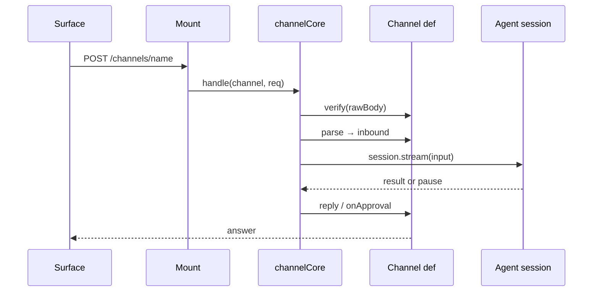

## What this is

A **channel** adapts one inbound surface — a Slack event, a Discord interaction, a signed webhook — to the session API, the way a power adapter lets one plug fit many sockets. It answers three questions: is this request really from that surface (`verify`), which conversation does it belong to (`parse` → `sessionKey`), and how does the reply or a pause go back (`reply`, `onApproval`). All shared machinery — serialization, pause bookkeeping, restart-safe decisions, error policy — lives in `channelCore.ts`; `mountChannels.ts` (Node) and `fetchChannels.ts` (Workers) are transport plumbing over it.

## The mental model



Hold four nouns: the **channel definition** (functions plus config, no state), **channelCore** (the pipeline and all the bookkeeping), the **mounts** (per-host HTTP plumbing), and the **session** (each conversation maps to `<channel>:<sessionKey>`).

## How it works

`handle(channel, approvalId, req, respond)` runs one request:

1. **Verify** — `channel.verify(req)` returns `boolean` or `{ ok, reason? }`. `false` → `401 { error: 'Unauthorized' }`; the `reason` is logged, never sent. `req.rawBody` is the exact request bytes (`readRawBody`, 1 MB cap) because signatures are checked over them, not over re-serialized JSON.
2. **Parse** — returns a `ChannelInbound` (`{ sessionKey, input, metadata?, principal?, replyTo, event? }`), a `ChannelDecision` (`{ decision, inbound?, approver? }` for a button click), or `null` — acknowledge without a turn (a bot echo, a Slack retry). `parse` gets `respond` (answer early — Slack demands an ack within ~3 seconds) and a `ChannelContext` (`approval(id)`, `sessionId(sessionKey)`, `hasSession`, `pendingQuestion`), so the channel keeps no state of its own.
3. **Turn** — `channelSessionId()` maps the conversation to `agent.session({ id, store }).stream(input, { principal, metadata })`. Turns of one session are serialized through a per-session promise tail (`serialized`).
4. **Reply** — `finish()` calls `channel.reply` with the result; a paused turn goes to `onApproval` (default: `reply` with `approvalPrompt` — the question, the sign-in link, or `Approve <tool> <args>? (approval id: …)`), and `{ channel, inbound, sessionId }` is stashed in `paused` keyed by approval id.

A decision arrives two ways: `POST <base>/<name>/approvals/:id` with `{ approved, note? }` or `{ answer }`, or a `ChannelDecision` from `parse` (a button click). `decide()` resolves the pause in the session's queue. If the clicking surface names its conversation (`decision.inbound`), the decision survives a restart: with checkpointed sessions `bindToSession` requires that conversation's pending turn to wait on exactly this approval, of the matching kind (`answer` ↔ `question`), and `resume()` binds it via `SessionAwaitingApprovalError`. A click on the wrong conversation, a replayed id, or a sign-in pause is refused with `LOUSHO_APPROVAL_NOT_FOUND` (404 while the request is open).

## Under the hood

Approvals carry identity both ways (N10a/N10b). `inbound.principal` — built only from data `verify` vouched for — is the **run's** principal. The `approver`, the clicking user, becomes the **decision's** principal (`{ id, type: 'user', authenticator: <channel name> }`), surfaced as `ctx.approval.by` and audited via `onDecision`. An approver never gains the starter's identity.

Built-in verification, per surface:

| Channel | Check |
| --- | --- |
| `webhookChannel`, `httpChannel` | `checkWebhookAuth` — HMAC over the raw body, bearer, or custom. HMAC is a keyed hash: the sender proves it holds the shared secret. Shared with `WebhookTriggerAdapter`. |
| `slackChannel` | `checkSlackSignatureWeb` — Web Crypto HMAC over `v0:{ts}:{body}` with a 5-minute freshness window; Block Kit Approve/Deny buttons encode the starter (`encodeApprovalRef`). |
| `discordChannel` | Ed25519 interaction signatures — a public-key scheme: Discord signs `timestamp + rawBody`, the channel verifies with Discord's public key. |
| `teamsChannel` | The Bot Framework JWT via the auth module's `oidc()`/`verifyJwt`, with `serviceurl` pinned to the activity's `serviceUrl`. |
| `githubChannel` | `X-Hub-Signature-256`; `/approve <id>` comments. |
| `telegramChannel` | The `secret_token` header, compared in constant time. |

Other invariants: the ack boundary defines the error policy — `guard()` tracks whether `respond` fired (`answered` WeakSet), so a failure before the ack throws to the host (→ 500) while one after goes to `onError` plus a best-effort `reply('Sorry, that request failed.')`. Session ids are derived (`<name>:<sessionKey>`, sanitized to `[A-Za-z0-9_-]` with a `cyrb53` hash suffix when needed), so `hasSession`/`pendingQuestion` work from the store alone. `pendingQuestion` hands out an `ask_question` id at most once (`claimed` set + session serialization). `continueChannelSignIn` (N9b) continues a turn paused on sign-in after `GET /oauth/callback` stores the token.

## In code

| Symbol | File | Role |
| --- | --- | --- |
| `defineChannel(def)` | `src/channels/defineChannel.ts` | Validates `name` (`[A-Za-z0-9_-]{1,64}`); types `Channel`, `ChannelRequest`, `ChannelInbound`, `ChannelDecision`, `ChannelContext`. |
| `channelCore(agent, channels, options)` | `src/channels/channelCore.ts` | The host-agnostic pipeline: `handle()` and `resolveApproval()`. No `node:*` import. |
| `mountChannels(agent, channels, { store?, basePath?, onError?, onDecision? })` | `src/channels/mountChannels.ts` | `node:http`: `POST <basePath>/<name>` and `POST <basePath>/<name>/approvals/:id`; resolves `false` for non-routes. |
| `mountFetchChannels` | `src/channels/fetchChannels.ts` | Same routes on Fetch, with `ctx.waitUntil` keeping a turn alive past the ack. |
| `channelSessionId`, `approvalPrompt`, `toChannelRequest` | `src/channels/defineChannel.ts` | Session id derivation, default pause text, host-request adapter. |
| `httpChannel`, `webhookChannel`, `slackChannel`, `discordChannel`, `telegramChannel`, `githubChannel`, `teamsChannel` | `src/channels/*Channel.ts` | The built-in surfaces. |
| `createInstallationTokens` | `src/channels/githubAppAuth.ts` | GitHub App RS256 JWT → installation token, cached per installation until 5 min before expiry (Web Crypto only). |
| `continueChannelSignIn` | `src/channels/channelCore.ts` | After the OAuth callback stores a token, continues the paused channel turn. |

## Example

```ts
import * as http from 'node:http';
import { createAgent, mountChannels, slackChannel, webhookChannel, memoryStore } from '@lousho/build-ai-agent';

const store = memoryStore(); // share the agent's store so sessions persist with it
const agent = createAgent({ instructions: 'You are helpful.', provider, store });
const channels = mountChannels(agent, [
  slackChannel({ signingSecret: process.env.SLACK_SIGNING_SECRET!, botToken: process.env.SLACK_BOT_TOKEN! }),
  webhookChannel({
    secret: process.env.WEBHOOK_SECRET!,
    principal: (body) => {                          // only set from verified data
      const source = (body as { source?: string })?.source;
      return source ? { id: source, type: 'service', authenticator: 'webhook' } : undefined;
    },
  }),
], { store, onDecision: ({ decision, approver, channel }) => audit(decision, approver, channel) });

http.createServer((req, res) => void channels(req, res).then((ok) => ok || res.writeHead(404).end())).listen(3000);
// POST /channels/slack              — events + button clicks
// POST /channels/webhook            — HMAC-signed hooks, one-shot sessions (or body's sessionKey)
// POST /channels/slack/approvals/<id> — out-of-band decision
```

`mountChannels` returns a handler that resolves `false` for non-channel paths, so it composes inside a bigger `node:http` server. `onDecision` is the audit hook — it fires when a button click names who decided.

## Design decisions

- **Channels own no state.** `paused` maps, session tails and `ChannelContext` live in `channelCore`; a channel definition is functions plus config. That is what makes `mountFetchChannels` a pure adapter and keeps channels testable without HTTP.
- **The ack boundary defines the error policy.** Surfaces like Slack must be answered within seconds, so once the ack is sent "the turn failed" can no longer be an HTTP status — it becomes `onError` plus a failure reply.
- **Sessions are derived, not stored.** `<name>:<sessionKey>` means a restart doesn't lose the mapping, and `hasSession` answers "was this thread already a session" from the store alone.
- **`principal` only from verified data.** `ChannelInbound.principal` is documented as "set it only from data `verify` vouched for" — a signed Slack payload can name `user.id`; an unsigned webhook cannot. `metadata` is explicitly unauthenticated.
- **Pending questions are claimed once.** Two racing messages cannot both answer the same question.
- **Deprecated trigger adapters delegate here.** `WebhookTriggerAdapter` reuses `webhookChannel()` for auth and parsing — one HMAC/bearer implementation, one place to fix.

## Where next

- [Triggers and schedules](/interfaces/triggers-and-schedules) — `webhookAuth`/`slackSignature` helpers and what the deprecated adapters became.
- [Server and routes](/interfaces/server-and-routes) — `readRawBody`, `serveFetch`, and `afterSignIn`/`continueChannelSignIn`.
- [Auth](/interfaces/auth) — `Principal`, `approver` vs. run principal, `oidc()` reused by Teams.
- [OAuth](/interfaces/oauth) — the sign-in pause a channel turn can wait on.
- [Sessions](/state/sessions) — the session store and checkpoint recovery decisions rely on.
