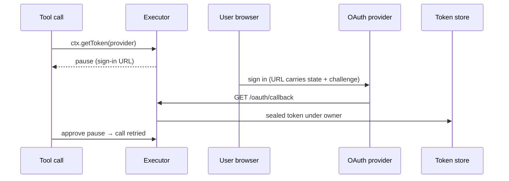

## What this is

OAuth is how a tool gets permission to call a third-party API *as the user*: instead of a password, the user signs in on the provider's site and the app receives a token. This module covers the two halves of that (N9a + N9b): `AgentStore.tokens`, an `OAuthTokenStore` keyed by provider and credential owner, and the flow that fills it — a tool calls `ctx.getToken(provider)`, a missing token throws `SignInRequired`, and the executor turns it into a durable `kind: 'sign-in'` pause carrying the authorization URL. The callback route stores the token; approving the pause runs the tool call again. No token, verifier or code ever reaches an event, error message or log line.

## The mental model



Hold four nouns: the **provider** (`defineOAuthProvider` — endpoints, client credentials, scopes), the **owner** (who a token belongs to: `{ owner: 'app' }` or `{ owner: 'user', principalId, issuer? }`), the **pending sign-in** (a sealed record keyed by `state`), and the **sealed store** (encrypted tokens over a backend of opaque strings).

## How it works

1. A tool calls `ctx.getToken(provider)`. `tokenOwnerFor` picks the owner — `{ owner: 'app' }` for an app credential, or the run's principal mapped by `signInOwner` (`LOUSHO_OAUTH_PRINCIPAL_REQUIRED` when a `'user'` provider meets a run with no principal).
2. A fresh token (over 60 s from expiry) is returned. An expiring one with a refresh token is exchanged (`grant_type: 'refresh_token'`), stored, returned; a failed refresh deletes the record. No usable token → `SignInRequired` (user credential) or `LOUSHO_OAUTH_APP_SIGNIN_REQUIRED` (app credential — the operator signs it in; a chat user is never asked). No token store at all → `LOUSHO_OAUTH_STORE_MISSING`, marked propagating so it stops the run instead of becoming a tool result.
3. The executor catches `SignInRequired` — checked by `error.name` (`LoushoSignInRequired`), because bundling can split class identity — and pauses with `kind: 'sign-in'` and `signIn: { provider, displayName, url }`. The URL comes from `startSignIn`: 32 random bytes each for a PKCE verifier and a `state`, `code_challenge`/`S256` on the URL, and a `PendingSignIn` (`{ provider, owner, codeVerifier, redirectUri, approvalId?, data: { sessionId } }`) sealed under `putPending(state, …, SIGN_IN_TTL_MS)` — 10 minutes.
4. The user signs in; the provider redirects to `GET /oauth/callback?state&code` (see [Server and routes](/interfaces/server-and-routes)), which calls `agent.oauth.complete()` → `completeSignIn`.
5. `takeOwnPending` removes the `state` record **once** — unknown, used or expired → `LOUSHO_OAUTH_STATE_INVALID`. If an authenticated principal is completing a sign-in made for a *different* user, the record is put back for its remaining TTL and refused.
6. `tokenRequest` POSTs the code exchange to the provider's `tokenUrl` (`client_secret_post` default, `client_secret_basic` supported; the PKCE `code_verifier` comes from the pending record) and `tokens.set(provider, pending.owner, token)` stores it. A provider `error` parameter instead records outcome `'declined'`.
7. The callback does **not** continue the run. `ctx.afterSignIn`/`continueChannelSignIn` resume a channel turn; other surfaces approve the pause (`approvalId`) to retry the tool call — `awaitSignInGate` turns a premature approve into 409/`pending` instead of a failed stream.

PKCE — proof key for code exchange — deserves one sentence: the app puts a *hash* of a random secret on the authorization URL and presents the secret itself at the code exchange, so an intercepted redirect URL is useless without the verifier that never left the server.

## Under the hood

**Owners and keys.** `tokenStoreKey` renders an owner as `<provider>|app` or `<provider>|user|<issuer>|<principalId>` with each component percent-encoded, so a `|` in an id cannot collide; the mapping is injective and stable. `signInOwner(principal)` maps route auth's principal → `{ owner: 'user', principalId, issuer }` — the token store's identity is the auth module's identity.

**The cipher** (`TokenCipher`/`SealedTokenStore`): AES-256-GCM — authenticated encryption, meaning decryption also proves the bytes weren't tampered with — via Web Crypto, a fresh 12-byte IV per write, stored as `v1.<b64 iv>.<b64 ciphertext>`. The record key is the AAD (additional authenticated data — bytes that are verified but not encrypted), so a ciphertext copied to another record fails `LOUSHO_TOKEN_DECRYPT_FAILED`. Keys come from `tokenKey` or `LOUSHO_TOKEN_KEY` (comma-separated, newest first): writes seal under the first key, `open` tries each in order — rotation is additive. No key configured → `LOUSHO_TOKEN_KEY_MISSING` on use; `generateTokenKey()` makes one. `list()` returns `OAuthTokenInfo` metadata only — never token values. `getClient`/`setClient` hold dynamically registered clients (N9c MCP) in the same sealed space. `SealedTokenStore` wraps a `SealedRecordBackend` of opaque strings, so `fileStore`, `SqliteStore` and `KVStore` each supply ~30 lines of storage.

**Leak hygiene.** `handedOut` tracks every token given to a tool during a call; `redactHandedOutTokens` rewrites them to `[REDACTED]` inside results and `tool.partial` snapshots. `requireAuth()` is `getToken`'s harder sibling: it throws `SignInRequired` with `revoke: true`, and `settleSignInRequired` deletes the refused token before the pause. Errors name calls and statuses, never material.

## In code

| Symbol | File | Role |
| --- | --- | --- |
| `defineOAuthProvider(options)` → `OAuthProvider` | `src/oauth/defineOAuthProvider.ts` | Validated, frozen provider config; registered per-process so `agent.oauth.complete()` finds a sign-in's provider. |
| `getToken`, `requireAuth`, `settleSignInRequired`, `SignInRequired`, `SignInPendingError`, `isSignInRequired` | `src/oauth/signIn.ts` | The tool-facing read; `SignInRequired` pauses the run. |
| `startSignIn`, `completeSignIn`, `signInRequest`, `signInOwner`, `SIGN_IN_TTL_MS` | `src/oauth/signIn.ts` | The authorization-code + PKCE flow. |
| `awaitSignInGate(events)` | `src/oauth/signInPending.ts` | Peeks at a decision stream's first event: `SignInPendingError` → `{ pending: true }` (the route answers 409). |
| `redactHandedOutTokens` | `src/oauth/signIn.ts` | Scrubs any token a tool returned in its result. |
| `createAgentOAuth` → `agent.oauth` | `src/oauth/agentOAuth.ts` | `complete`, `signInUrl`, `mcpSignInUrl` — callback completion, app sign-in links, MCP-server OAuth (N9c). |
| `OAuthTokenStore`, `OAuthToken`, `TokenOwner`, `PendingSignIn`, `OAuthTokenInfo` | `src/oauth/types.ts` | The `tokens` part of `AgentStore`. |
| `SealedTokenStore`, `SealedRecordBackend`, `cleanToken`, `tokenInfo` | `src/oauth/sealedTokenStore.ts` | Encryption + validation over a backend of opaque sealed strings. |
| `TokenCipher`, `generateTokenKey`, `TokenKeyInput` | `src/oauth/tokenCipher.ts` | AES-256-GCM via Web Crypto; `LOUSHO_TOKEN_KEY`. |
| `tokenStoreKey`, `ownerFromKey`, `isValidState`, `assertToken`, `assertPendingInput` | `src/oauth/tokenStoreKey.ts` | Stable, injective record keys. |
| `MemoryTokenStore` | `src/oauth/memoryTokenStore.ts` | `memoryStore()`'s plain in-process tokens. |

## Example

```ts
import { defineOAuthProvider, createAgent, fileStore } from '@lousho/build-ai-agent';

export const github = defineOAuthProvider({
  name: 'github',
  displayName: 'GitHub',
  credentialOwner: 'user',                 // one token per signed-in principal
  authorizationUrl: 'https://github.com/login/oauth/authorize',
  tokenUrl: 'https://github.com/login/oauth/access_token',
  clientId: process.env.GITHUB_CLIENT_ID!,
  clientSecret: process.env.GITHUB_CLIENT_SECRET,
  scopes: ['repo'],
  redirectUri: 'https://agent.example.com/api/agent/oauth/callback',
});

const agent = createAgent({
  store: fileStore('./.lousho', { tokenKey: process.env.LOUSHO_TOKEN_KEY }), // required: the tokens part
  tools: [defineTool({
    name: 'list_issues', /* ... */
    execute: async (args, ctx) => {
      const token = await ctx.getToken(github);   // pauses with a sign-in link when absent
      return fetchIssues(token.accessToken);       // return the API answer, not the token
    },
  })],
});

// Operator, one-off for an app-owned provider:
console.log(await agent.oauth.signInUrl(appProvider));
// Callback lands on GET /oauth/callback; then approve the pause:
const { approvalId } = await agent.oauth.complete({ state, code });
if (approvalId) await agent.approvals.resolve({ id: approvalId, approved: true });
```

`ctx.getToken` is the whole public surface a tool sees — either a token or a pause. `agent.oauth.complete` is what the callback route calls; `signInUrl` is the operator's entry point for `'app'` providers.

## Design decisions

- **`credentialOwner` is the pivot.** `'user'` (default): one token per signed-in principal, requires a run principal, pauses for the user. `'app'`: one credential for everyone, signed in by the operator via `agent.oauth.signInUrl(provider)` (which refuses user providers); a missing app token is an operator error, never a chat user's prompt.
- **The provider registry is per-process.** `defineOAuthProvider` registers by name so `completeSignIn` — running in a different request or route than the paused run — can resolve the exchange endpoints; an unknown provider fails `LOUSHO_OAUTH_TOKEN_EXCHANGE_FAILED`.
- **Single-use, TTL'd `state` replaces route auth on the callback.** A browser redirect can't carry the API token; protection is that `state` is 256-bit, 10-minute, take-once — and it binds the owner, so a link forwarded to another authenticated user is refused.
- **`SignInRequired` by name, not `instanceof`.** Two bundled copies of the SDK (agent + host) must still interop, so `isSignInRequired` checks `error.name` and `isOAuthProvider(provider)`.
- **Defense in depth on leaks.** Tokens handed to a tool are tracked and redacted inside results and partial snapshots; errors never contain material.
- **No pause for app credentials.** `settleSignInRequired` returns `{ error }` for `owner: 'app'` — a chat turn can't fix it, and asking would train users to click through someone else's consent.

## Where next

- [Auth](/interfaces/auth) — where `principal` comes from; the `TokenOwner` mapping.
- [Server and routes](/interfaces/server-and-routes) — `/oauth/callback`, `awaitSignInGate`'s 409, `afterSignIn`.
- [Channels](/interfaces/channels) — how a sign-in pause is rendered (ephemeral Slack message, Discord follow-up, never a public GitHub comment) and continued.
- [Approvals](/core/approvals) — the `kind: 'sign-in'` pause mechanics.
- [Storage stores](/state/storage-stores) — `OAuthTokenStore` backends and `tokenKey`.
