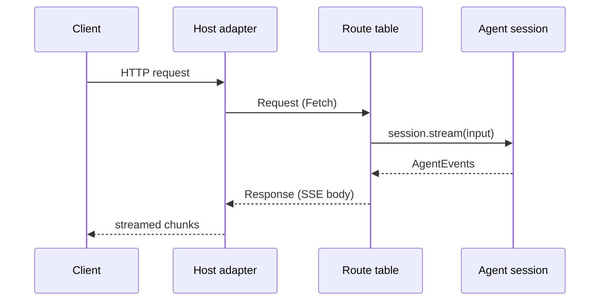

## What this is

The session API is the HTTP front door to an agent: `POST /chat` starts a turn and streams its progress back as SSE — Server-Sent Events, a one-way stream where the server pushes `data:` lines over an HTTP response that stays open. The whole API is written once on the standard Fetch API (`Request` in, `Response` out) in `src/server/fetchRoutes.ts`, and thin adapters bolt it onto each host — like one kitchen serving every dining room in a hotel.

## The mental model



Three things exist: the **route table** (`ROUTES` in `fetchRoutes.ts`, the kitchen), the **adapters** (`chatRoutes.ts` for `node:http`, `routeHandler.ts` for framework route files, the Cloudflare Worker's `fetch()` — the dining rooms), and the **client** (`sessionClient.ts`, which speaks the same protocol from the other side).

## How it works

1. A host hands every request to the table: `handleChatFetch(request, ctx)` matches method and path against `ROUTES`; a non-route resolves `undefined` so the host can serve its own. `ctx.agent()` is read per request, so `lousho dev` can swap the agent on reload.
2. `serveFetch` wraps the table for deployment: `GET /health` answers `ok` open, the `auth` list runs (see [Auth](/interfaces/auth)), and the accepted principal flows into the matched route.
3. `POST /chat` with `{ sessionId, input }` opens `agent.session({ id })` and streams `session.stream(input)` as SSE. The deprecated `{ message }` body answers plain JSON with a `Deprecation: 'true'` header.
4. `POST /chat/:sessionId/approvals/:id` takes `{ approved, note? }` or `{ answer }`; the continuation streams as SSE. 404 when nothing is pending; 409 `LOUSHO_SIGNIN_PENDING` when a sign-in pause is approved before the user signed in (`awaitSignInGate` reads the stream's first event first).
5. `GET /oauth/callback` matches under any path prefix and is never behind bearer auth — a browser redirect carries no token, so the single-use `state` parameter is the credential (see [OAuth](/interfaces/oauth)). It calls `agent.oauth.complete()`, answers a small escaped HTML page, and `ctx.afterSignIn` (e.g. `continueChannelSignIn`) can continue a paused channel turn.

## Under the hood

SSE framing is `sseResponse()`: each `AgentEvent` is one `data: <json>\n\n` frame and the stream ends with `event: done\ndata: {}`. A mid-stream failure becomes `error` + `run.done` events via `errorEvents()` — a run always terminates in-band, never by closing early. Abort is bidirectional: the request's `signal` or a cancelled response body aborts the run.

Request bodies are capped at 1 MB (`MAX_BODY_BYTES`) and drained past the cap, so a slow client cannot deadlock the connection before the 413 arrives. The exact bytes matter: the channels layer shares `readRawBody` because signatures are checked over raw bytes, never re-serialized JSON.

`createRouteHandler` adds two things on top of the table. `stripBase()` cuts `basePath` (default `/api/agent`) off the pathname. `hookRoute()` remaps the `useLoushoAgent` wire shape: `POST <base>` `{ input, sessionId? }` becomes `POST /chat` (a fresh `newId()` when no `sessionId`), and `POST <base>/approvals/:id` becomes `POST /chat/hook/approvals/:id` — the literal session id `hook`, because the lookup goes through `agent.approvals` and the session is only a vehicle. With `uiMessageStream: true`, `POST <base>/ui` accepts `{ messages: UIMessageLike[], id? }` and answers an AI SDK UI message stream; with `id` it runs under `agent.session({ id })` and takes `lastUserOnly` input.

`sessionClient.ts` is the mirror image: `runRemoteTurn` POSTs `{ sessionId, input }` to `<url>/chat` and `fold()`s the stream into a `SessionTurnSummary` — counting `step.done`s, collecting `tool.start`/`tool.resume` calls, keeping the last `approval.requested` and the final `run.done`. 401 becomes `LOUSHO_REMOTE_UNAUTHORIZED`, anything else `LOUSHO_REMOTE_REQUEST_FAILED`, and the bearer token is scrubbed from every error message.

`uiMessageStream.ts` maps `AgentEvent` → the AI SDK's UI message chunks: `run.start`→`start`, `step.start`/`step.done`→`start-step`/`finish-step`, `text.delta`→`text-start`/`text-delta`/`text-end` (one open text part, tracked in `MapState`), `tool.*`→`tool-input-*`/`tool-output-*` (`tool.partial` → `preliminary: true` output), `approval.requested`→`data-lousho-approval`, `todo.updated`→`data-lousho-todos`, `run.done`→`finish` with `messageMetadata: { runId, loushoFinishReason, usage }`. `fromUIMessages` goes the other way: text parts → text, `image/*` file parts → images, other files → file parts.

Approval recovery is checkpoint-driven: `recoverApproval()` asks `session.pending()` whether a checkpointed turn waits on this approval id, then `resume()` binds it (via `SessionAwaitingApprovalError`) — so a decision taken after a restart lands in the right transcript.

## In code

| Symbol | File | Role |
| --- | --- | --- |
| `handleChatFetch(request, ctx, principal?)` | `src/server/fetchRoutes.ts` | The route table; `undefined` for a non-route so the host can serve its own. |
| `serveFetch(request, ctx, auth?)` | `src/server/fetchRoutes.ts` | The whole deployed API: `/health` open, auth check, then routes. |
| `handleChatRequest`, `relayFetch`, `readRawBody`, `sendJson`, `sendFailure` | `src/server/chatRoutes.ts` | `node:http` adapter: streams `IncomingMessage` → `Request`, writes `Response` chunk by chunk. |
| `createRouteHandler(agent, { basePath?, auth?, uiMessageStream? })` | `src/server/routeHandler.ts` | `{ GET, POST, handler }` for `app/api/agent/[[...path]]/route.ts`-style files; no framework and no `node:*` import. |
| `createDeployedServer`, `createDeployedAgent`, `storeFromEnv` | `src/deploy/nodeServer.ts` | The built node server: channels first, then `serveFetch`; schedules start on `listening`, stop on `close`. |
| `runRemoteTurn`, `resolveRemoteApproval` | `src/server/sessionClient.ts` | The one client for the API (behind `remoteAgent()` / `remoteTarget()`); folds SSE into a `SessionTurnSummary`. |
| `toUIMessageStream`, `toUIMessageStreamResponse`, `fromUIMessages` | `src/server/uiMessageStream.ts` | AI SDK `useChat` bridge. |

## Example

```ts
// app/api/agent/[[...path]]/route.ts — Next.js App Router
import { createRouteHandler } from '@lousho/build-ai-agent';
import { jwt } from '@lousho/build-ai-agent/auth';
import { agent } from '@/lib/agent';

export const { GET, POST } = createRouteHandler(agent, {
  basePath: '/api/agent',
  auth: [jwt({ jwksUrl: 'https://auth.example.com/.well-known/jwks.json', audience: 'agent-api' })],
  uiMessageStream: true, // also serves POST /api/agent/ui for useChat
});
```

`createRouteHandler` returns route-file exports — no framework import, no `node:*`, so the file bundles for edge runtimes too. `auth` is the ordered list [Auth](/interfaces/auth) walks per request; `uiMessageStream` exposes the chunk shape the AI SDK's `useChat` posts and reads.

```ts
// A client of the same API (what remoteAgent() uses internally):
import { runRemoteTurn } from '../server/sessionClient';

const summary = await runRemoteTurn(
  { url: 'https://agent.example.com', auth: () => getToken() },
  { sessionId: 's-1', input: 'Summarise the queue.', label: 'rollups' },
);
// → { sessionId, text, finishReason, toolCalls, steps, usage, approval?, object? }
```

`runRemoteTurn` POSTs the turn, folds the SSE stream back into one summary object, and scrubs the bearer token from any error it throws.

## Design decisions

- **Fetch-first, adapt at the edge.** `fetchRoutes.ts` imports no `node:*`, so the same file serves Node, Workers and route files; `chatRoutes.ts` and `routeHandler.ts` are pure adapters. This is why the Worker target (`runtime.worker.ts`) is ~0 duplicated logic.
- **Errors before streaming are HTTP errors; errors during streaming are events.** `failureResponse` maps `PayloadTooLargeError`→413, `SyntaxError`→400, else 500. Once SSE starts, the client sees `error`/`run.done` — one code path for live and resumed runs.
- **The OAuth callback bypasses auth on purpose.** A browser redirect carries no API token; the 256-bit single-use `state` is the credential. `callbackPrincipal` still runs the auth list so an authenticated completer's identity is recorded — but only a non-anonymous result is used.
- **`uiMessageStream` imports nothing from `ai`.** The chunk types are structural copies — the peer may be AI SDK v4, which has no UI message stream — and nothing from `node:*`, so it runs on Workers.
- **No-auth production warning.** `createRouteHandler` warns once per process when `auth` is unset in `NODE_ENV=production` (`warnOpenInProduction`); an open route is a deliberate choice that must be visible.

## Where next

- [UI bindings](/interfaces/ui-bindings) — the reducer and runner that consume this SSE.
- [Auth](/interfaces/auth) — the `auth` list shape and `Principal` this route hands to runs.
- [OAuth](/interfaces/oauth) — what `/oauth/callback` completes.
- [Channels](/interfaces/channels) — the sibling surface that shares `readRawBody` and the approvals model.
- [Streaming events](/core/streaming-events) — the `AgentEvent` schema inside the frames.
