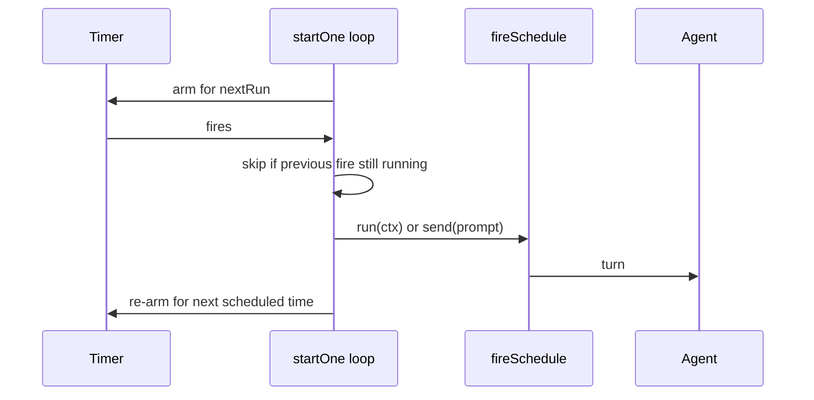

## What this is

This page covers the two ways something *wakes* the agent without a user typing first. **Schedules** fire on a cron expression — a five-field time pattern like `0 9 * * MON-FRI` ("09:00, Monday to Friday"), or a shortcut like `@daily`. **Trigger adapters** are the older, deprecated generation (`src/triggers/`, the `@lousho/build-ai-agent/triggers` subpath): a `TriggerAdapter` owns a wake-up mechanism — an HTTP listener, a cron timer, a Slack subscription — and calls `onEvent`. Channels replaced adapters for inbound requests and `defineSchedule` replaced `CronTriggerAdapter`; the shared cron parser and auth helpers in `src/triggers/` still serve both generations.

## The mental model



Hold three nouns: the **schedule definition** (`defineSchedule` — one cron plus exactly one of `prompt` or `run(ctx)`), the **runner** (`startSchedules`, one armed timer per schedule), and the **legacy adapter** (`listen(agent, onEvent) → { stop() }`).

## How it works

1. `defineSchedule({ cron, timezone?, name?, prompt | run })` validates at definition time — a bad expression or missing/extra action fails with `LOUSHO_SCHEDULE_INVALID` at load, not at first fire. `parseCronExpression(expr, timeZone?)` produces a `CronSchedule` with `nextRun(after)`.
2. `startSchedules(agent, schedules, { now?, setTimer?, onError? })` arms one timer per schedule (`startOne`), always aimed at `nextRun` computed from now — recomputed each cycle so nothing drifts.
3. When the timer fires, the loop re-arms for the *next* scheduled time first, then fires: `run({ agent, firedAt, name })` for a `run` schedule, or `agent.send(prompt, { sessionId? })` for a prompt schedule (`fireSchedule`).
4. If the previous fire is still running, the new fire is skipped and reported to `onError` — a slow run never piles up duplicates. Fires missed while the process was suspended are skipped, not replayed.
5. `stop()` cancels every timer; timers are `unref`'d so a scheduler alone never keeps the process alive.
6. On Cloudflare Workers there is no long-lived timer: `handleScheduled(agent, schedules, controller, ctx)` matches the firing trigger by `controller.cron` (normalized whitespace) and runs inside `ctx.waitUntil` — prompt schedules under session `schedule-<name>` so runs are readable back from the store.

## Under the hood

**Cron math** (`cronExpression.ts`): `nextRun` extracts fields via `Intl.DateTimeFormat`, so timezones and DST are handled explicitly — a wall time that doesn't exist (spring forward) is skipped that day; a repeated wall time (fall back) fires once when the hour field is restricted. The semantics are classic Vixie cron: when both day-of-month and day-of-week are restricted, a day matching *either* fires. Parsing fails fast on impossible schedules (`0 0 31 2 *` never matches a real date within a 10-year scan). Delays beyond `setTimeout`'s ~24.8-day limit (`MAX_DELAY_MS = 2^31 − 1`) are chained.

**The adapter contract** (`types.ts`): `listen(agent, onEvent)` starts the mechanism and returns a `TriggerHandle` whose `stop()` is the one required lifecycle — a webhook needs its listener torn down, a cron its timer cleared. `agent` (the `RunnableAgent` `{ send(message) }` shape) and `onEvent` are deliberately separate: a simple caller wires `onEvent` as `agent.send`, while a host with checkpointing wraps it. `reply()` is optional because reply semantics differ — a webhook's reply *is* the still-open HTTP response, cron has no caller (results go to a constructor-supplied `onResult` sink), Slack replies over a separate channel.

**Webhook auth** (`webhookAuth.ts`): `checkWebhookAuth(auth, req, rawBody)` returns `undefined` or a short reason (`'signature mismatch'`, `'stale timestamp'`) — safe to log, never containing secret material, and it never throws. HMAC mode signs the raw body (`x-signature-256: sha256=<hex>` by default; header/algorithm/prefix configurable); with `timestampHeader` it signs `${timestamp}.${body}` and rejects requests outside `toleranceSeconds` (default 300) — replay protection. All comparisons hash both sides to equal length before `timingSafeEqual`. `assertValidWebhookAuth` fails at construction on configs that could never authenticate. `slackSignature.ts` reimplements Slack's scheme on Web Crypto (`isFresh`, `precheckSlackSignature`, `checkSlackSignatureWeb`) so Workers verify too.

**Wiring**: `createDeployedServer(agent, { schedules })` starts them on `listening` and stops on `close`; `resolveAgentDir()` collects `schedules/*.ts` default exports; `specSchedules` converts a spec's `triggers` field (`{ type: 'cron', cron, input, name?, timezone? }`) into `DefinedSchedule[]`; `loadAgentDir()` does not start them — the host does.

## In code

| Symbol | File | Role |
| --- | --- | --- |
| `TriggerAdapter`, `RunnableAgent`, `TriggerContext`, `TriggerHandle` | `src/triggers/types.ts` | The contract: `listen(agent, onEvent) → { stop() }`, optional `reply(channel, message)`. |
| `TriggerRegistry`, `globalTriggerRegistry` | `src/triggers/TriggerRegistry.ts` | Name → adapter map; mirrors `ToolRegistry`'s API 1:1. |
| `WebhookTriggerAdapter`, `CronTriggerAdapter`, `SlackTriggerAdapter` | `src/triggers/adapters/` | **Deprecated.** Webhook delegates auth+parsing to `webhookChannel()`; cron is superseded by `defineSchedule`. |
| `checkWebhookAuth`, `verifySlackSignature`, `WebhookAuth` | `src/triggers/webhookAuth.ts` | `node:crypto` verification; never throws — returns a log-safe reason. |
| `isFresh`, `precheckSlackSignature`, `checkSlackSignatureWeb` | `src/triggers/slackSignature.ts` | The same Slack scheme on Web Crypto (no `node:*`), so Workers verify too; `crypto.subtle.verify` is constant-time. |
| `parseCronExpression` → `CronSchedule` | `src/triggers/cronExpression.ts` | Dependency-free 5-field cron + `@hourly`/`@daily`/`@weekly`/`@monthly`/`@yearly`; `CronExpressionError` names the field. |
| `defineSchedule`, `isDefinedSchedule` | `src/schedules/defineSchedule.ts` | `{ cron, timezone?, name? }` plus exactly one of `prompt` or `run(ctx)`; `LOUSHO_SCHEDULE_INVALID` on misuse. |
| `startSchedules` | `src/schedules/startSchedules.ts` | In-process runner; returns `{ stop() }`. |
| `fireSchedule`, `scheduleName` | `src/schedules/fireSchedule.ts` | One fire: `run(ctx)` or `agent.send(prompt)`. |
| `handleScheduled` | `src/schedules/scheduled.ts` | Cloudflare Workers `scheduled()` handler. |
| `specSchedules` | `src/schedules/specSchedules.ts` | AgentSpec `triggers` → `DefinedSchedule[]`. |

## Example

```ts
import { defineSchedule, startSchedules } from '@lousho/build-ai-agent';

const schedules = [
  // A prompt schedule: sends the text to the agent each weekday at 09:00 Paris time.
  defineSchedule({ cron: '0 9 * * MON-FRI', timezone: 'Europe/Paris', prompt: 'Summarise yesterday.' }),
  // A run schedule: full control — the callback decides what a fire does.
  defineSchedule({
    name: 'cleanup',
    cron: '@daily',
    run: async ({ agent, firedAt }) => { await agent.send(`Clean up, as of ${firedAt.toISOString()}.`); },
  }),
];

const running = startSchedules(agent, schedules, {
  onError: (err, { name }) => metrics.scheduleFailed(name, err),
});
// deployed: createDeployedServer(agent, { schedules }) starts/stops them with the server
```

```ts
// Verifying a raw webhook by hand (same code webhookChannel() uses):
import { checkWebhookAuth } from '@lousho/build-ai-agent/triggers';

const reason = await checkWebhookAuth(
  { type: 'hmac', secret: process.env.WEBHOOK_SECRET!, timestampHeader: 'x-timestamp' },
  req, rawBody, // rawBody: the exact request bytes — signatures cover them
);
if (reason) { log.warn('rejected', { reason }); res.writeHead(401).end(); }
```

## Design decisions

- **`TriggerHandle.stop()` exists because adapters keep something running** — the doc comment in `types.ts` is explicit: a `DeploymentAdapter`'s lifecycle is build-time; a trigger's is runtime. That asymmetry is the whole reason the handle type exists.
- **`agent` and `onEvent` are separate parameters**, so "trigger fires → agent runs" needs zero plumbing while a host like Agent Forge can inject checkpointing and abort control through `onEvent`.
- **Channels replaced triggers for inbound requests.** Triggers had no sessions, no approvals on the surface, no restart-safe decisions; `webhookChannel()` absorbed the webhook adapter's auth/parse.
- **Verification helpers never throw and never echo secrets.** A rejected request is a generic 401 plus an internal reason string; `timingSafeEqual` compares digests so the signature's length doesn't leak. Slack's checks are split (`precheckSlackSignature` shared, HMAC per-platform) so Node and Workers share one scheme.
- **Schedules are fail-fast and non-overlapping.** Validation happens in `defineSchedule`, at load time; overlap policy is skip-and-report rather than queue, because a slow `prompt` run shouldn't pile up duplicates *(inferred: the alternative — queueing — would replay stale work)*.
- **Everything is injectable for tests.** `now`, `setTimer`, `onError`, `fetch`, clocks — adapters and schedulers take their time and I/O as parameters; tests never sleep.

## Where next

- [Channels](/interfaces/channels) — what replaced the adapters for inbound surfaces.
- [Server and routes](/interfaces/server-and-routes) — `createDeployedServer` lifecycle (`listening`/`close` → `startSchedules`/`stop`).
- [Durable execution](/core/durable-execution) — checkpointing that makes channel questions/approvals survive restarts.
- [Agent directories](/compose/agent-directories) — `schedules/` and `triggers` spec fields.
