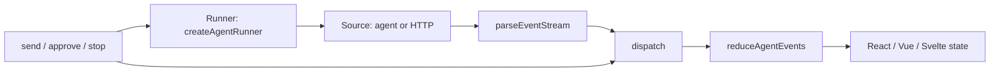

## What this is

The UI bindings turn an agent run into chat state a framework can render: messages, a status (`idle`/`streaming`/`awaiting-approval`/`error`), a pending approval, usage and todos. Every rule for folding the run's event stream into that state lives once in `src/ui/` as a *reducer* — a pure function `(state, event) → new state`, the pattern Redux popularized — plus a runner for the side effects. The React hook, Vue composable and Svelte store in `src/react`, `src/vue` and `src/svelte` only keep that state in their framework's reactive primitive.

## The mental model



Hold four nouns: the **reducer** (pure state transitions), the **runner** (opens streams, posts decisions), the **source** (an in-process agent or a remote URL), and the **shell** (the framework primitive that triggers re-render).

## How it works

1. `send(input)` dispatches `ui.send`: the reducer appends the user bubble (`describeInput` renders multimodal input as text plus `[image]`/`[file]` markers) and flips `status` to `streaming`.
2. The runner opens a stream. Local mode: `agent.stream(input)`, or a cached `agent.session({ id })` — one per `{ agent, sessionId }` pair, so the conversation persists. Remote mode: `POST { input }` to `source.url`.
3. A remote response goes through `parseEventStream`, which reads `AgentEvent`s back from the body in SSE framing (`data:` lines) or NDJSON — newline-delimited JSON, one object per line — and skips unknown lines.
4. Each `AgentEvent` is dispatched into `reduceAgentEvents`: `text.delta`/`reasoning.delta` append to the last assistant `UIMessage` (created lazily), `tool.start`/`resume`/`done`/`error` drive a `UIToolCall`, `approval.requested` fills `pendingApproval`, `todo.updated` replaces `todos`, `run.done` settles `status` and records `usage`.
5. `approve`/`reject`/`answer` dispatch `ui.decide` optimistically, then the runner resolves the pause — `agent.approvals.streamResolve`/`streamAnswer` locally, `POST { approved, note }` to `${approvalsUrl}/${approvalId}` remotely (`relayContinuation` also accepts an older server's `ApprovalOutcome` JSON) — and streams the continuation through the same dispatch.
6. `stop()` aborts the run's `AbortController`; the reducer sees `ui.stopped` and returns to `idle`. Unmount and dispose paths call `stop`, never `reset` — `reset()` clears history, a remount must not.

## Under the hood

- `AgentUIState` is `{ messages, status, pendingApproval, error, usage, todos, lastEvent }`; `status` derives from `run.done`'s `finishReason` (`settledStatus`).
- Each `send`/`decide` runs under a fresh `AbortController`; once a newer run starts, the old one's `emit` is dropped (`controller === mine`), so a superseded stream cannot corrupt the state.
- Sub-agent events don't bubble: an event carrying `subagent` only updates `lastEvent`, except `approval.requested`, which still pauses the UI — a sub-agent's pause is still the user's decision. The same rule holds in `sessionClient.fold` and `uiMessageStream`.
- `tool.partial` stores a live snapshot only while the call is `running`; a `tool.error` carrying `ToolRejectedError` settles the call as `rejected` — a reviewer's "no", not a failure.
- `ui.resumed` folds a legacy JSON `ApprovalOutcome`; `ui.error`/`ui.stopped`/`ui.reset` cover transport failure, abort and clearing. Without `approvalsUrl` the remote binding cannot decide pauses — `pendingApproval` is then the owner's problem.
- The todo view is derived, not stored: `todoView` walks `state.todos` into `{ todos, counts, current, progress }` — `current` is the `in_progress` item, else the first `pending` one.
- The React shell is `useReducer(reduceAgentEvents)` plus one runner instance, with `useEffect` stopping the run on unmount. Vue keeps state in a `shallowRef`, re-exposes each field as a `ComputedRef`, stops on `onScopeDispose`, and `unref`s `MaybeRef` inputs per turn. Svelte's `loushoAgent` implements `subscribe(run) → unsubscribe` by hand — no `svelte` import, so it works on Svelte 4 and 5 — and the last unsubscribe stops the run.

## In code

| Symbol | File | Role |
| --- | --- | --- |
| `reduceAgentEvents(state, event)` | `src/ui/reducer.ts` | Pure `(AgentUIState, AgentEvent \| AgentUIAction) → AgentUIState`. |
| `initialAgentUIState`, `AgentUIState`, `AgentUIAction`, `UIMessage`, `UIToolCall`, `UIPendingApproval` | `src/ui/reducer.ts` | The shared state shape and the local `ui.*` actions. |
| `createAgentRunner(host)` | `src/ui/agentRunner.ts` | The commands: `send`, `stop`, `approve`, `reject`, `answer`, `reset`. `host` supplies `source()`, `options()`, `state()`, `dispatch()`. |
| `LocalAgentSource` / `RemoteAgentSource`, `LoushoAgentOptions` | `src/ui/agentRunner.ts` | In-process run vs. `POST { input }` to a deployed session API. |
| `parseEventStream(response)` | `src/ui/parseEventStream.ts` | Reads `AgentEvent`s back from a response body — SSE or NDJSON; unknown lines skipped. |
| `todoView(todos)` | `src/ui/todos.ts` | Counts, current item and progress from the agent's todo list. |
| `useLoushoAgent`, `useTodos` | `src/react/` | `useReducer(reduceAgentEvents)` + one runner instance. |
| `useLoushoAgent`, `useTodos` | `src/vue/` | State in a `shallowRef`, fields as `ComputedRef`s. |
| `loushoAgent`, `loushoTodos` | `src/svelte/` | A hand-rolled store; imports nothing from `svelte`. |

## Example

```tsx
// React — remote mode against the session API (see Server and routes)
import { useLoushoAgent, useTodos } from '@lousho/build-ai-agent/react';

const agent = useLoushoAgent({ url: '/api/agent' }, { approvalsUrl: '/api/agent/approvals' });
const { progress, current } = useTodos(agent);
// agent.status, agent.messages, agent.pendingApproval; agent.send/stop/approve/reject/answer
```

The `source` says where runs go; `approvalsUrl` is where decisions go. `useTodos` derives the plan view from the same state.

```ts
// Vue — the source may be a ref; a changed url applies to the next turn
import { useLoushoAgent } from '@lousho/build-ai-agent/vue';

const { messages, status, send } = useLoushoAgent(computed(() => ({ url: apiBase.value })));
```

```ts
// Svelte — no svelte import; $store syntax works via subscribe
import { loushoAgent, loushoTodos } from '@lousho/build-ai-agent/svelte';

const agent = loushoAgent({ agent: myAgent, sessionId: 'demo' }); // local agent, or { url }
const plan = loushoTodos(agent);
```

## Design decisions

- **One reducer, three shells** (LOU-D15, LOU-P2, LOU-P3). The event→state mapping is where the subtlety lives (pause kinds, partial snapshots, sub-agent filtering); framework code is only lifecycle and reactivity. A fix or a new event type lands once, in `src/ui`.
- **The reducer is pure and synchronous.** No I/O, no timers — it works identically in `useReducer`, a `shallowRef`, a Svelte store and tests (`reducer.test.ts` exercises it with no framework).
- **Optimistic decide, streamed continuation.** `ui.decide` flips the call's status immediately; the real state arrives from the streamed continuation — the user sees a response the moment they click.
- **Abort is the cancellation primitive, not state.** `stop()` aborts the controller; the reducer only records `ui.stopped`. Cancellation is an `AbortSignal`, so transport and local runs behave the same.
- **`loushoAgent` imports nothing from `svelte`.** The store contract is a one-function interface; implementing it by hand keeps the entry dependency-free and version-agnostic.

## Where next

- [Server and routes](/interfaces/server-and-routes) — the `POST <base>` / `POST <base>/approvals/:id` wire the remote mode talks to.
- [Streaming events](/core/streaming-events) — the `v: 1` event schema the reducer consumes.
- [Approvals](/core/approvals) — what `pendingApproval`, `approve`/`reject`/`answer` decide.
- [OAuth](/interfaces/oauth) — `pendingApproval.signIn` (`kind: 'sign-in'`) and the "I've signed in" approve loop.
