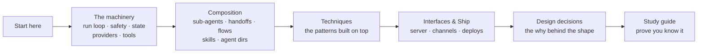

This site documents the **internals** of [`@lousho/build-ai-agent`](https://github.com/LinuxDevil/agent-sdk): the TypeScript SDK for agents that run in your own Node process — tool calling, MCP, sessions that survive a restart, human approvals, and OpenTelemetry. No hosted runtime.

The [user docs](https://lousho.com/introduction) teach *using* the SDK. These pages teach *changing* it: every subsystem's entry points, control flow, and the design decisions a contributor needs before touching the code.

## Who this is for

A contributor who has never seen this codebase — possibly never seen agent internals at all. Every page assumes zero prior knowledge: each one opens with what the thing *is* in plain words and an analogy, shows a diagram, walks it step by step, and only then dives into the files. If you can read TypeScript, you can start anywhere.

## How the site is organized

- **Start here** — the map and the dev loop ([architecture](/architecture), [repo map](/repo-map), [dev workflow](/dev-workflow))
- **The machinery** — one page per module: the run loop, safety gates, state, providers, tools
- **Composition** — how agents combine: sub-agents, handoffs, flows, skills, directories
- **Techniques** — the prompting/context/workflow catalog mapped to the machinery
- **Interfaces & Ship** — how the outside world reaches an agent, and how it deploys
- **Design decisions** — ADR-style pages following the tech-design template
- **Study guide** — the checklist, glossary and self-check that prove onboarding worked

## Reading order

<Steps>
  <Step title="Architecture">
    The ten-minute map: how a user message becomes model calls, tool calls, approvals, checkpoints and streamed events.
  </Step>
  <Step title="Repo map + dev workflow">
    Where each subsystem lives under `src/`, and the local gate loop (`typecheck`, `vitest`, `docs:verify-snippets`, `fallow`, `api:check`) that CI enforces.
  </Step>
  <Step title="Your subsystem's page">
    One page per module — read the mental model and walkthrough, then open the listed source files.
  </Step>
  <Step title="Design decisions">
    The six load-bearing choices: durable-by-default, error codes, branded types, peer strategy, typed decisions, flow-vs-loop.
  </Step>
  <Step title="Study guide">
    Close the loop — answer every question cold before your first PR.
  </Step>
</Steps>

## How pages are written

Every page follows the same skeleton — **What this is** (plain words + analogy) → **The mental model** (a diagram + the nouns to hold) → **How it works** (a numbered walkthrough matching the diagram) → **Under the hood** → **In code** → **Example** → **Design decisions** → **Where next**. The convention itself is documented at [writing internals docs](/contribute/writing-docs) — new pages must follow it.
