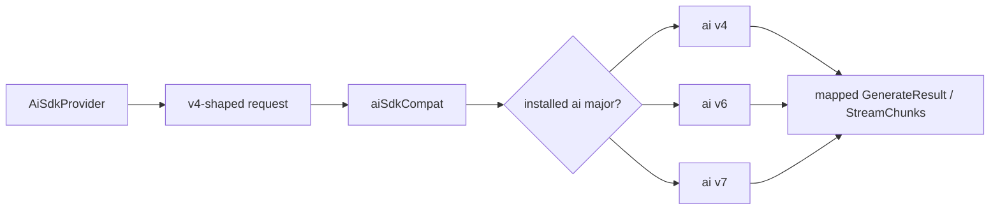

## What this is

The SDK supports three majors of the Vercel **AI SDK** — `ai` `^4.3.19 || ^6.0.0 || ^7.0.0` — and two of `zod` (`^3.25.76 || ^4.0.0`), as peer dependencies, simultaneously (`ai` 5 is deliberately not supported). Each major renames request fields, response fields and stream parts.

Rather than branching per major, `AiSdkProvider` always builds the **v4-shaped** request, and `src/providers/aiSdkCompat.ts` is the translator: it converts the request on the way in and the response/stream on the way out — one code path to maintain, majors differ only at the wire boundary (LOU-D26/D27). Think of it as a power adapter: the SDK always speaks v4, the adapter reshapes the plug for whichever wall socket is installed.

## The mental model



Four nouns: the **v4 shape** (the one internal request), the **detector** (`aiMajorOf`), the **request map** (`toModernRequest`), and the **response map** (parts, usage, finish reasons back into our types).

## How it works

1. An `AiSdkProvider` subclass produces `AiSdkCallSettings` — always the v4 shape (SDK-owned structural types, not v4's `CoreMessage` types, per LOU-D28a).
2. `compatGenerateText(ai, settings, options)` / `streamCompat(ai, settings, options)` first ask `aiMajorOf(ai)` which major is installed.
3. On v4 the settings go out as-is (minus hosted tools); on v6/v7 `toModernRequest()` translates them (details below).
4. `ai.generateText`/`streamText` runs; the response is mapped back — usage fields, finish reasons, hosted-tool parts — into `GenerateResult`/`StreamChunk`s.

## Under the hood

- **Detection by exports, not versions.** `isModernAi(ai)` is `'stepCountIs' in ai` (exported from v5 on) — `in`, not a property read, because vitest module mocks throw on missing exports. `aiMajorOf` then uses `registerTelemetry` (the v7 name; v6 has `registerTelemetryIntegration`) to separate 6 from 7. Export-sniffing survives bundlers and aliased installs (`ai-v6`/`ai-v7` dev deps are real packages injected as `AiSdkModule` in tests).
- **Request mapping (`toModernRequest`).** `CoreMessage` parts → `ModelMessage` parts via `MODERN_PARTS`: `tool-call.args` → `input`; `tool-result.result` → `output` (`json`/`text`, `error-json`/`error-text`); `image` parts → `file` parts (v5+ deprecates `image`); `reasoning`/`redacted-reasoning` → `reasoning` parts with Anthropic signature/redacted data moved into `providerOptions.anthropic`; elsewhere `mimeType` → `mediaType`. `maxTokens` → `maxOutputTokens`; `maxSteps: 1` → `stopWhen: stepCountIs(1)`; `tools` → `{ name: { description, inputSchema } }` with no `execute`; `experimental_output` → an `output` object whose parsers pass the text through; system-in-messages needs `allowSystemInMessages: true` on v7.
- **Response mapping.** Usage reads `inputTokens`/`outputTokens`/`totalTokens` on v6/7 (`inputTokenDetails.cacheReadTokens`, `outputTokenDetails.reasoningTokens`) vs `promptTokens`/`completionTokens` plus `providerMetadata` keys on v4 (`cachedPromptTokens`, `cacheReadInputTokens`, `reasoningTokens`). Finish reasons map through `FINISH_REASONS`; unknown → `'error'`. Provider-executed calls become `hostedToolCalls`, never `toolCalls`; url `source` parts attach to the hosted call they follow.
- **Stream mapping.** `PART_CHUNKS` is a per-part-type table: `text-delta` (v6/7 `text`, v4 `textDelta`), `reasoning*` → `reasoning-delta`/`reasoning-end`, `tool-input-start`/`-delta` accumulate arguments for calls v6/v7 may only partially stream (emitted at `finish` if no `tool-call` arrived), `tool-result`/`tool-error` of `providerExecuted` calls are held so following `source` parts ride along on `hosted-tool-result`. An `error` part throws its error; `abort` throws the signal's reason. Final-value promises (`text`, `usage`, …) are wrapped in `handled()` so unread ones can't reject unhandled.
- **zod 3/4** (`src/utils/zodCompat.ts`, used by both request paths): a zod 4 / Standard-JSON-Schema goes through `schemaToJsonSchema()` (`z.toJSONSchema`, draft-7); a raw JSON-Schema object is wrapped in `ai.jsonSchema()` (v4's `asSchema` would feed it to the zod converter and crash on `._def.typeName`); zod 3 keeps the `ai` converter. Validation always uses the schema's own `~standard.validate`/`safeParse`.

**The pairing matrix** (`providerSpec.ts` / `package.json` peers — `aiMajorPeers.test.ts` asserts they agree):

| `ai` | `@ai-sdk/openai` / `@ai-sdk/anthropic` | Ollama package | zod |
|---|---|---|---|
| `^4.3.19` | `^0.0.42 \|\| ^1.0.0` | `ollama-ai-provider@^1.2.0` | 3 or 4 |
| `^6.0.0` | `^3.0.0` | `ollama-ai-provider-v2@^2.0.0 \|\| ^3.0.0` | 3 or 4 |
| `^7.0.0` | `^4.0.0` | `ollama-ai-provider-v2@^4.0.0` | 3 or 4 |

`ollama-ai-provider-v2` itself peers on zod 4 (`ZOD4_NOTE`); `@earendil-works/pi-ai` pairs with no `ai` major — the same `1.0.3` pin applies on all three. A `PeerPairing` carries both `range` (what install hints/`lousho init` use) and `accepts` (what `lousho doctor` accepts).

## In code

| Symbol | File | Role |
|---|---|---|
| `compatGenerateText()` | `src/providers/aiSdkCompat.ts` | One `generateText()` on either shape → `GenerateResult` |
| `streamCompat()` | `src/providers/aiSdkCompat.ts` | One `streamText()`; `fullStream` → `StreamChunk`s |
| `isModernAi()` / `aiMajorOf()` | `src/providers/aiSdkCompat.ts` | Export-sniffing major detection |
| `toModernRequest()` / `PART_CHUNKS` | `src/providers/aiSdkCompat.ts` | Request and stream-part mapping tables |
| `schemaToJsonSchema()` | `src/utils/zodCompat.ts` | zod 3/4 + raw JSON Schema → JSON Schema |
| `peerInstallCommand()` / `findPeerPairing()` | `src/providers/providerSpec.ts` | Install hints and `lousho doctor` data |
| `loadOptionalPeer()` | `src/providers/optionalPeer.ts` | `import()` wrapper → `MissingPeerDependencyError` |

## Example

```ts
// installCommandFor picks the range paired with the installed ai major:
// ai 7 + missing @ai-sdk/openai  →  MissingPeerDependencyError
//   installCommand: 'npm install @ai-sdk/openai@^4.0.0'

// fromAiSdk() rejects a model built for the wrong major:
fromAiSdk(openaiV1Model) // on ai 7: ConfigurationError 'ai 7 is installed'
```

The pairing table is why the error can name a version: the same `PeerPairing` data that drives `lousho doctor` produces the `npm install` line in the hint.

## Design decisions

- **Build v4, translate at the boundary.** One internal request shape means subclasses and tests never see three majors — the cost is a mapping layer that must be maintained per new major.
- **Pairing table is data, not code.** `aiSdkPeer()`/`OLLAMA_PEERS`/`PI_PEERS` in `providerSpec.ts` drive the peer-ranges test (`aiMajorPeers.test.ts` asserts package.json matches), every install hint, and `lousho doctor` mismatch flags.
- **Peers matrix CI exists because types lie across majors.** One `peers` job, five real installs — `ai4-zod4`, `ai6-zod3`, `ai6-zod4`, `ai7-zod3`, `ai7-zod4` — each run through `tsc`, `test:types`, both builds and vitest (`aiMajor.testkit.ts` exposes `installedAiMajor` so tests skip what can't apply, e.g. the v4-only `MockLanguageModelV1` shapes). zod-4 jobs on ai 6/7 add `ollama-ai-provider-v2`, exercised by `ollamaV2.contract.test.ts` against a fake Ollama server.
- **`ollama-ai-provider-v2` needs zod 4.** The `ZOD4_NOTE` travels inside `PeerPairing.note` into the missing-peer error, so the hint says `npm install zod@^4.0.0` instead of failing cryptically.

## Where next

- [Model selection](/providers/model-selection) — where the pairing table also powers spec resolution.
- [Provider architecture](/providers/architecture) — the `AiSdkProvider` base that feeds this layer.
- [Reasoning](/providers/reasoning) — `providerOptions` and reasoning parts, both mapped here.
