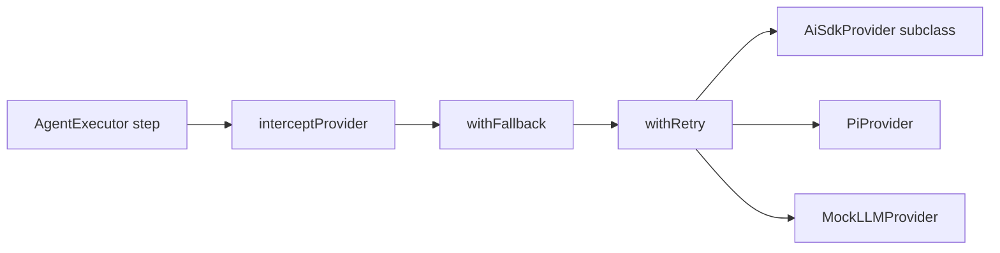

## What this is

A **provider** is an adapter: it plugs a model vendor (OpenAI, Anthropic, a local Ollama, …) into one socket the rest of the SDK understands. That socket is `LLMProvider` (`src/providers/llm.ts`): `generate()` and `stream()` plus a few capability questions (`supportsTools()`, `supportsStreaming()`, `getModels()`, optional `supportsHostedTool()`).

Four built-ins (`openai`, `anthropic`, `openrouter`, `ollama`) are thin adapters over the Vercel **AI SDK** (an npm package named `ai` that already wraps those vendors behind one TypeScript API); `pi` adapts `@earendil-works/pi-ai`; `mock` returns canned answers for tests. Everything else — the executor, cassettes, retries — only ever sees the `LLMProvider` contract, so it neither knows nor cares which vendor is on the wire.

## The mental model



Four nouns: the **contract** (`LLMProvider`), the **registry** (name → factory), the **adapters** (one class per vendor family), and the **wrappers** (interception, fallback, retry — themselves providers, so they compose).

## How it works

1. `AgentExecutor` routes every model call through `generateInSpan()` (`src/execution/generateStep.ts`), which passes the provider through `interceptProvider()` (`src/providers/interception.ts`) — a passthrough by default, swapped for cassette providers by `lousho eval`.
2. `withFallback([p1, p2, …])` (`src/providers/resilience.ts`) is the outermost wrapper: on failure it retries the call on the next provider.
3. `withRetry(provider)` sits inside it, applying backoff, `retryOn` classification and `provider.retry` events.
4. The innermost object is the real adapter: an `AiSdkProvider` subclass builds a v4-shaped request and hands it to `aiSdkCompat.ts`, which calls `ai.generateText`/`streamText` on the installed major; `PiProvider` turns its nested spec into `pi-ai`'s `compat.completeSimple`/`streamSimple`; `MockLLMProvider` replays canned responses.

## Under the hood

- **Registry with lazy built-ins (LOU-R1).** `LLMProviderRegistry` (same file) is a static `register(name, factory)` / `create(name, config)` / `has()`. On a miss, `create()` calls `ensureBuiltinProviders()` first, so built-ins resolve from any import path — deep imports, `lousho dev`/`chat`/`acp`, generated deploy servers — not just through `src/index.ts`.
- **Shared adapter.** `AiSdkProvider` (`src/providers/aiSdkProvider.ts`) is the abstract base the four `ai` providers and `fromAiSdk()` share. It does message conversion (`toCoreMessages`: assistant tool-call turns → `tool-call` parts, `tool` messages → `tool-result` parts linked by `toolCallId`, multimodal parts on user messages), tool conversion (`convertTools`, with a placeholder `execute` — real execution is the executor's job), and builds a v4-shaped `AiSdkCallSettings`.
- **No provider package at module scope.** Subclasses load `@ai-sdk/openai`, `@ai-sdk/anthropic`, `ollama-ai-provider(-v2)` lazily via `loadOptionalPeer()` inside a `lazyValue()` on first `createModel()`. A missing one surfaces as `MissingPeerDependencyError` (`LOUSHO_PEER_MISSING`) with the exact `npm install` command for the installed `ai` major.
- **The compat boundary.** `compatGenerateText()` / `streamCompat()` in `aiSdkCompat.ts` send the one v4-shaped request on the installed `ai` major (4, 6 or 7). See [ai-sdk compat](/providers/ai-sdk-compat).
- **Acyclic registration (LOU-R27).** `llm.ts` imports `builtinProviders.ts`; provider classes only `import type` from `llm.ts`; `providerSpec.ts` receives the registry as an argument. Nothing in the registration path imports `llm.ts` back, so `import { createAgent }` works under true ESM.
- **Resilience is a provider.** `withRetry` and `withFallback` return `LLMProvider`s, so they compose with specs, mocks and `fromAiSdk()`. `createAgent()` resolves string models with `maxRetries: 0` (the `ai` SDK's own retries off) and wraps with `withRetry({ maxRetries: 2 })` — one retry layer, not two (`resolveModelSource`, `src/createAgent.ts`). Retries/fallbacks report through a symbol-keyed listener on the request (`providerEvents.ts`) as `provider.retry` / `provider.fallback` events.
- **One interception hook.** `generateInSpan()` routes every call through `interceptProvider()`, so `lousho eval --record/--replay` covers top-level runs, streamed steps, sub-agents and approval resumes with one hook stored on `globalThis` (both bundle builds share it).
- **`undefined` usage, never zeros.** Providers that report nothing leave `GenerateResult.usage` unset; the executor then estimates and marks the run `usage.estimated`. Zeros would look reported.
- **`maxSteps`/`stopWhen` is pinned to 1.** Tool execution happens in `AgentExecutor`, not inside the SDK call — every provider call is exactly one model turn.
- **Errors compacted once.** Provider errors are normalized by `compactProviderError()` (`src/execution/errors.ts`) into `CompactedLLMProviderError`; `withRetry`'s default `retryOn` reads that classification (rate limits/timeouts/5xx retryable, auth/invalid-request not).

## In code

| Symbol | File | Role |
|---|---|---|
| `LLMProvider` | `src/providers/llm.ts` | The contract: `generate()`/`stream()` + capability questions |
| `LLMProviderRegistry` | `src/providers/llm.ts` | Name → factory map; `create()` lazily registers built-ins |
| `resolveProvider()` | `src/providers/resolveProvider.ts` | `'provider/model'` string → configured instance ([model selection](/providers/model-selection)) |
| `AiSdkProvider` | `src/providers/aiSdkProvider.ts` | Abstract adapter over the `ai` SDK; subclasses for openai/anthropic/openrouter/ollama |
| `PiProvider` | `src/providers/pi/PiProvider.ts` | The non-`ai` adapter ([pi](/providers/pi)) |
| `withRetry()` / `withFallback()` | `src/providers/resilience.ts` | `LLMProvider` → `LLMProvider` decorators |
| `setProviderInterceptor()` | `src/providers/interception.ts` | The single seam `lousho eval` swaps cassettes into |
| `generateInSpan()` | `src/execution/generateStep.ts` | The one routing point for every model call |

## Example

```ts
import { LLMProviderRegistry, resolveProvider, withRetry, withFallback } from '@lousho/build-ai-agent';

// Build two providers from spec strings; each resolves its env key itself.
const primary = withRetry(resolveProvider('openai/gpt-4o-mini'), { maxRetries: 3 });
const backup = withRetry(resolveProvider('anthropic/claude-3-5-haiku-latest'));

// Fallback is itself a provider: pass it anywhere an LLMProvider fits.
const provider = withFallback([primary, backup]);

// A custom provider is just the interface:
LLMProviderRegistry.register('mine', (config) => new MyProvider(config));
```

`resolveProvider` turns each spec into a configured adapter; `withRetry`/`withFallback` wrap them like layers of an onion — the outermost layer is what the executor sees.

## Design decisions

- **One request shape internally.** Providers build the `ai` v4 request shape and `aiSdkCompat` maps it for newer majors — one code path to maintain, majors differ only at the wire boundary.
- **Optional peers, always lazy (LOU-D10/D19).** Importing the SDK loads zero provider packages; a missing one fails with an install hint, not a bare `MODULE_NOT_FOUND`.
- **`undefined` usage, never zeros** — see Under the hood; zeros would masquerade as reported usage.
- **Retry wrappers, not provider code.** Retries/fallbacks live outside adapters so mocks, specs and `fromAiSdk()` get them for free — at the cost of an extra provider-shaped layer around every call.
- **Errors compacted once** — every adapter's error taxonomy normalizes to `CompactedLLMProviderError`, so `withRetry` and callers classify one shape.

## Where next

- [Model selection](/providers/model-selection) — how `'provider/model'` strings and env vars resolve.
- [ai-sdk compat](/providers/ai-sdk-compat) — the v4/v6/v7 + zod 3/4 compatibility layer.
- [pi](/providers/pi) — the non-`ai` provider and its nested spec space.
- [recordReplay](/quality/record-replay) — the consumer of the interception seam.
