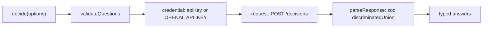

## What this is

`decide()` (`src/decisions/decide.ts`) calls the OpenAI **Decisions API** — `POST {baseURL}/decisions` — a purpose-built endpoint that evaluates shared input against typed questions and returns calibrated answers roughly 10× faster than a Responses turn.

Where a provider answers "write me text" (and maybe "call this tool"), `decide()` answers "is this a refund request?", "which team should handle it?", "how urgent is it?" — structured *questions in, probability distributions out*. It is the fast path for the typed-decision pattern (route / gate / score) and **deliberately bypasses the provider layer** entirely: no `LLMProvider`, no registry, no spec string.

## The mental model



Four nouns: the **questions** (`DecisionQuestion` union), the **credential** (key + baseURL), the **single POST** (`request()`), and the **validated answers** (`responseSchema` → `DecisionAnswer` union).

## How it works

1. `validateQuestions()` runs first: at least one question, unique non-empty `name`s, `choice` needs ≥ 1 `choices`, `score` needs ≥ 2 `levels` — all `LOUSHO_CONFIG_INVALID`.
2. Credential: `options.apiKey ?? process.env.OPENAI_API_KEY`; missing → `LOUSHO_PROVIDER_MISSING_API_KEY`.
3. `request()` POSTs `{ model: options.model ?? 'gpt-6-luna', input, questions }` to `${baseURL}/decisions` (trailing slashes trimmed) with a Bearer header, on `options.fetch ?? globalThis.fetch`. The caller's `signal` and `AbortSignal.timeout(timeoutMs)` (default 30 s) are merged with `AbortSignal.any`.
4. `parseResponse()`: non-OK → `LOUSHO_PROVIDER_RATE_LIMITED` on 429 else `LOUSHO_PROVIDER_REQUEST_FAILED` (body truncated to 300 chars in the message); OK → the body is `safeParse`d by a zod `discriminatedUnion('type')` (`responseSchema`) — probabilities bounded `[0,1]` — and a malformed body is `LOUSHO_PROVIDER_REQUEST_FAILED` naming the first issue.
5. Abort/timeout on fetch → `LOUSHO_OPERATION_TIMEOUT`; other fetch throws → `LOUSHO_PROVIDER_REQUEST_FAILED` with `cause`.

## Under the hood

- **Question types** (union `DecisionQuestion`): `PredicateQuestion` (yes/no → `PredicateAnswer` with `probability`), `ChoiceQuestion` (pick one → `ChoiceAnswer` with `choice`, per-option `probabilities`, `confidence`), `ScoreQuestion` (rate on levels → `ScoreAnswer` with `score` = probability-weighted level index, `probabilities`, `confidence`). A fourth answer type, `RefusalAnswer`, covers the endpoint declining.
- **Input is message-shaped but narrow.** `DecisionInputMessage` accepts `input_text` and inline-base64 `input_image` parts only — no hosted URLs, no `file_id`.
- **Injectable everything.** `model`, `apiKey`, `baseURL`, `fetch`, `signal`, `timeoutMs` are all `DecideOptions` fields — tests never touch the network (`decide.test.ts` injects `fetch`), and `baseURL` supports compatible endpoints. `decide()` reads `globalThis.fetch` per call.
- **Exported from the package root** (`src/index.ts` → `decisions/index.ts`); `decide()` is the only function the module ships.

## In code

| Symbol | File | Role |
|---|---|---|
| `decide()` | `src/decisions/decide.ts` | The whole public surface |
| `DecideOptions` | `src/decisions/decide.ts` | `input`, `questions`, injectable `model`/`apiKey`/`baseURL`/`fetch`/`signal`/`timeoutMs` |
| `validateQuestions()` | `src/decisions/decide.ts` | Client-side validation before any request |
| `request()` | `src/decisions/decide.ts` | The POST + merged abort signal |
| `parseResponse()` / `responseSchema` | `src/decisions/decide.ts` | Status-code mapping + zod `discriminatedUnion('type')` |
| `DecisionQuestion` / `DecisionAnswer` | `src/decisions/decide.ts` | The question/answer type unions |

## Example

```ts
import { decide } from '@lousho/build-ai-agent';

const { answers } = await decide({
  input: 'I was charged twice for my order.',
  questions: [{
    type: 'choice', name: 'route', instructions: 'Which team handles this?',
    choices: [
      { value: 'billing', description: 'Payments, invoices, refunds.' },
      { value: 'shipping', description: 'Delivery and tracking.' },
    ],
  }],
});
// answers[0] = { type: 'choice', name: 'route', choice: 'billing',
//                probabilities: [...], confidence: 0.93 }

// In tests: inject fetch so nothing touches the network.
await decide({ input: 'x', questions: [...], fetch: async () => new Response('{"answers":[]}') });
```

The question list is the whole interface — you describe *what* you want decided, not *how* to prompt for it, and get back a distribution you can threshold, not prose you must parse. Each answer echoes its question's `name`, so `answers` lines up with `questions` by construction.

## Design decisions

- **Not a provider.** The Decisions endpoint is a separate REST surface from chat completions — it takes `input` + `questions`, not `messages`, returns typed distributions instead of text, and serves one beta model (`gpt-6-luna`). Wrapping it as `LLMProvider` would force a generate/stream contract it doesn't have (no tool loop, no prose, no finish reasons that fit). It also can't route through OpenRouter for the same reason.
- **zod-validated answers.** The response is parsed with `responseSchema` before returning — a beta surface can change shape, and a calibrated `probability` outside `[0,1]` is a bug worth failing on, not passing through.
- **Error codes reuse the provider taxonomy.** Missing key, rate limit, request failure and timeout map onto `LOUSHO_PROVIDER_*`/`LOUSHO_OPERATION_TIMEOUT` so callers and `lousho doctor`-style diagnostics treat it like any model call.
- **Client-side validation is cheap and early.** Bad `questions` fail before the request is built — no wasted beta-endpoint call.
- **`AbortSignal.any` composes caller and timeout.** One merged signal covers both `signal` and `timeoutMs` aborts; either reason maps to `LOUSHO_OPERATION_TIMEOUT` since both are indistinguishable from the caller's side.

`decide()` and `createAgent({ output })` answer different questions — see the comparison table in `docs/decisions.md` ("When to use what") before reaching for either.

The client is intentionally small: one function, one POST, one schema check. Everything else — retries, cassettes, provider abstraction — lives in the provider layer it skips, which is why adding it here would be the wrong trade.

## Where next

- [Structured output](/providers/structured-output) — the schema-driven alternative when you need your own JSON shape on any provider.
- [Provider architecture](/providers/architecture) — what `decide()` deliberately bypasses.
- User docs: `docs/decisions.md` (question-design guidance, "when to use what").
