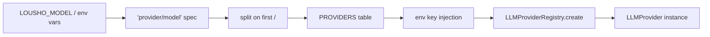

## What this is

`createAgent({ model: 'openai/gpt-4o-mini' })` takes a short string and somehow ends up with a configured OpenAI client, an API key, and a model id. This page is the machinery in between, in `src/providers/providerSpec.ts`.

Three different questions are answered in three different places: **which provider** (the `'provider/model'` spec or a `provider:` instance), **which credential** (a per-provider env var), and **which model id reaches the wire** (`agent.settings.model` > provider's `defaultModel` > the provider's built-in default).

## The mental model



Four nouns: the **spec** (the `'provider/model'` string), the **provider table** (`PROVIDERS`, one row per vendor), the **env var** (where the credential comes from), and the **registry** (which builds the actual instance).

## How it works

`resolveProviderSpec()` is the pipeline — `resolveProvider('openai/gpt-4o-mini')` is a one-line wrapper over it, and `createAgent({ model })` calls it from `resolveModelSource()` (`src/createAgent.ts`) with `{ maxRetries: 0 }` and `caller: 'createAgent'` (the caller argument only prefixes error text).

1. A spec arrives — from `model:`, or from `modelFromEnv()`: `LOUSHO_MODEL` wins, else the first provider whose env var is set, in `PROVIDERS` order.
2. **Split on the first `/`**: everything after it is the model id, slashes included (`pi/openrouter/openai/gpt-4o-mini` keeps `openrouter/openai/gpt-4o-mini` as pi's nested model spec).
3. Unknown prefix → `LOUSHO_PROVIDER_UNKNOWN` with the closest match suggested (`closestMatch`).
4. The entry's env var is read and injected into `config.apiKey`/`config.baseURL` — except `pi` (`envForInfoOnly`), which resolves each nested provider's env itself.
5. Missing required key → `LOUSHO_PROVIDER_MISSING_API_KEY`, unless `LOUSHO_EVAL_CASSETTES` is `replay`/`auto` — then an `uncalledProvider()` wrapper keeps `name`/`defaultModel` but rejects any real call (a cassette may answer everything).
6. `LLMProviderRegistry.create()` builds the provider; a `MODULE_NOT_FOUND`/`ERR_MODULE_NOT_FOUND` is rethrown as `LOUSHO_PEER_MISSING` with an install hint per `ai` major (`installHintPerMajor`).

## Under the hood

**The provider table** (`PROVIDERS`, `providerSpec.ts`) is the single source of truth, in env-detection order:

| Prefix | Env var | Injected as | Required | Peer per `ai` major | Env default model |
|---|---|---|---|---|---|
| `openai` | `OPENAI_API_KEY` | `config.apiKey` | yes | `@ai-sdk/openai` 0.0.x/1.x · 3.x · 4.x | `gpt-4o-mini` |
| `anthropic` | `ANTHROPIC_API_KEY` | `config.apiKey` | yes | `@ai-sdk/anthropic` 0.0.x/1.x · 3.x · 4.x | `claude-3-5-sonnet-latest` |
| `openrouter` | `OPENROUTER_API_KEY` | `config.apiKey` | yes | `@ai-sdk/openai` (same package) | `openai/gpt-4o-mini` |
| `ollama` | `OLLAMA_BASE_URL` | `config.baseURL` | no (local default) | `ollama-ai-provider` (ai 4) / `-v2` (ai 6/7) | `llama3` |
| `pi` | `OPENROUTER_API_KEY` | **not injected** (`envForInfoOnly`) | no | `@earendil-works/pi-ai` | `openrouter/openai/gpt-4o-mini` |

- **Why pi's env var is not injected.** `OPENROUTER_API_KEY` belongs to one *nested* pi provider; injecting it into a `pi/anthropic/...` config would send the wrong credential. Pi resolves each nested provider's env itself ([pi](/providers/pi)). It's also listed last so plain `openrouter` wins env detection.
- **Per-call model precedence.** `resolveModel()` (`src/execution/generateStep.ts`) sets `GenerateOptions.model` to `agent.settings.model || provider.defaultModel`; a provider left without either falls back to its own `fallbackModel` inside `AiSdkProvider.defaultModel`. Nothing hard-codes a model (`modelSelection.test.ts` pins this). With `withFallback()`, the call's `model` goes only to the first provider and only when it differs from the wrapper's `defaultModel`; fallbacks use their own defaults.
- **Fail loudly on ambiguity.** With nothing set, `modelFromEnv` throws `LOUSHO_CONFIG_MISSING_PROVIDER` listing all four fixes (model string, provider instance, `LOUSHO_MODEL`, one env key).
- **Spec validity before registry.** The prefix check happens before `LLMProviderRegistry.create`, so a bad prefix never reaches the registry.
- **Other readers of the same table:** `detectProviderFromEnv(env)` (used by `lousho init --yes`; deliberately ignores `LOUSHO_MODEL`), `listProviders()`, `findPeerPairing()`, `peerInstallCommand()` (the data behind `lousho doctor` and install hints).

## In code

| Symbol | File | Role |
|---|---|---|
| `resolveProvider()` | `src/providers/resolveProvider.ts` | One-line wrapper over `resolveProviderSpec()` |
| `resolveProviderSpec()` | `src/providers/providerSpec.ts` | The pipeline: split, check, inject env, create |
| `PROVIDERS` | `src/providers/providerSpec.ts` | The provider table, in env-detection order |
| `modelFromEnv()` | `src/providers/providerSpec.ts` | `LOUSHO_MODEL` > first set env var |
| `detectProviderFromEnv()` | `src/providers/providerSpec.ts` | Provider name only; `lousho init --yes` |
| `resolveModelSource()` | `src/createAgent.ts` | `createAgent`'s entry: spec → provider + `withRetry` |
| `resolveModel()` | `src/execution/generateStep.ts` | Per-call precedence inside the executor |

## Example

```ts
import { createAgent, resolveProvider } from '@lousho/build-ai-agent';

// Spec string: env key injected, ai-SDK retries off, withRetry({maxRetries:2}) on top.
const a = createAgent({ model: 'openrouter/openai/gpt-4o-mini' });

// Instance + bare model id: the agent's settings.model wins at call time.
const b = createAgent({ provider: resolveProvider('openai/gpt-4o-mini'), model: 'gpt-4o' });

// Neither: LOUSHO_MODEL, else first env var in PROVIDERS order.
const c = createAgent({ instructions: 'You are helpful.' });
```

The first form is the common case: one string carries provider, credential lookup and default model. The second shows precedence — `model: 'gpt-4o'` overrides the provider's configured default at call time. The third delegates the whole choice to the environment.

## Design decisions

- **First-slash split.** Provider prefix is `spec.slice(0, indexOf('/'))` — nested ids (OpenRouter's `vendor/model`, pi's `provider/model`) need no escaping.
- **Env detection order is fixed and documented.** `modelFromEnv` walks `PROVIDERS` in declaration order; ambiguity fails loudly rather than guessing.
- **`pi` last in detection.** Its env key is `OPENROUTER_API_KEY`, shared with `openrouter` — listed last so plain `openrouter` wins; the var is informational only.
- **Cassette-aware missing keys.** Under replay a keyless spec still resolves (wrapped in `uncalledProvider`) — the cassette may answer every call, but a real call that does happen gets the same missing-key error.

## Where next

- [Provider architecture](/providers/architecture) — the `LLMProvider` contract and registry.
- [ai-sdk compat](/providers/ai-sdk-compat) — the peer-pairing matrix behind the install hints.
- [pi](/providers/pi) — the nested `pi/<provider>/<model>` space and per-nested-provider credentials.
