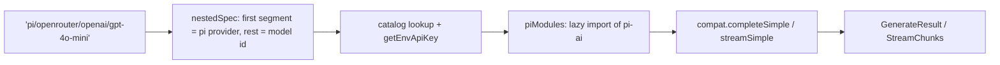

## What this is

`PiProvider` (`src/providers/pi/PiProvider.ts`) is the one built-in provider that does **not** go through the `ai` SDK. It adapts `@earendil-works/pi-ai` — the engine `pi-coding-agent` runs on — so pi's whole catalog (OpenRouter, Anthropic, OpenAI, Google, …) is reachable through the same `LLMProvider` socket every other provider plugs into.

The twist is the spec space: `'pi/<pi-provider>/<model>'` is a path with *two* levels, where the second level names a provider *inside* pi. `pi/openrouter/openai/gpt-4o-mini` means "pi → openrouter → the model `openai/gpt-4o-mini`". Where the `ai` providers need one adapter class per vendor, pi is a gateway — one adapter that reaches every vendor pi knows about.

## The mental model



Five nouns: the **nested spec** (provider + model inside pi), the **catalog** (pi's known models, plus injected `config.models`), the **env resolution** (per-nested-provider credentials), the **lazy module** (`piModules()`), and the **compat calls** (`completeSimple`/`streamSimple`).

## How it works

The flow below is the same for `generate()` and `stream()` — they differ only in which compat call they make and how the answer comes back.

1. `createAgent({ model: 'pi/...' })` routes to the `pi` registry entry (`builtinProviders.ts`, `providerSpec.ts`) — or construct `new PiProvider({ defaultModel, models?, apiKey?, headers?, timeout? })` directly; `PiProviderConfig.models` injects faux/custom catalog entries ahead of pi's built-in list.
2. `nestedSpec()` strips an optional leading `pi/` and splits on the first slash: the first segment is the pi provider id, **the rest is the catalog model id verbatim**.
3. `resolveModel()` looks the pair up in `config.models` first, then `catalog.getBuiltinModel(provider, modelId)`; unknown providers/models get `LOUSHO_PROVIDER_UNKNOWN` with a `closestMatch` suggestion. `GenerateOptions.model` may carry a full `pi/<provider>/<model>` spec too (the executor passes agent settings through) — `nestedSpec()` strips the redundant prefix either way.
4. `piModules()` (`lazyValue`) loads `@earendil-works/pi-ai/compat` and `/providers/all` together on the first `generate()`/`stream()`; a missing package is `MissingPeerDependencyError` naming `npm install @earendil-works/pi-ai@1.0.3`. A failed load is not cached — installing the package and retrying works.
5. `callOptions()` builds pi `PiStreamOptions` and `toPiContext()` (`pi/messages.ts`) builds `{ systemPrompt, messages }`; then `compat.completeSimple`/`streamSimple` runs the call.
6. The `PiAssistantMessage` maps back through `assistantText`/`assistantToolCalls`/`assistantReasoning`/`piUsage`, and streams map pi events onto the same `StreamChunk` union the `ai` providers emit — so downstream code (events, results, cassettes) can't tell pi apart from any other adapter.

## Under the hood

- **Per-nested-provider credentials.** The `pi` entry in `providerSpec.ts` is `envForInfoOnly`: `OPENROUTER_API_KEY` is never injected into the config (it would leak to `pi/anthropic/...`). Instead `compat.getEnvApiKey(provider)` runs pi's own per-provider env resolution at `resolveModel()` time; `config.apiKey` is an explicit override. A missing key becomes `LOUSHO_PROVIDER_MISSING_API_KEY` when `NESTED_ENV_NAMES` can name the provider's env var (today: `openrouter`); other nested providers let pi report auth failure at call time.
- **Request options.** `callOptions()` sets `temperature`, `maxTokens`, `timeoutMs`, `signal`, `toolChoice` (`auto`/`none` only — `required`/named rides `samplingParams.tool_choice`), reasoning via `reasoningOptions()` (catalog `reasoning` flag gates it unless `force`; `budgetTokens` → `thinkingBudgets`), and `samplingParams` for OpenAI-compatible extras (`top_p`, penalties, `seed`, `stop`, `response_format` — `json_schema` when a schema is present). **`maxRetries` defaults to 0.**
- **Messages** (`messages.ts`): a leading `system` becomes `systemPrompt`; assistant turns become `thinking` parts (reasoning blocks, signature preserved) + text + `toolCall` parts (arguments decoded from our JSON string); `tool` messages → `toolResult` linked by `toolCallId`, `isError` forwarded. pi images are base64-only: `data:` URLs and `Uint8Array`s map, `http(s)` URLs degrade to a `[image ... not sent]` text note with a one-time warning — same for `file` parts (pi has none).
- **Tools** (`schema.ts`): `toolParametersToJsonSchema` covers zod 4 / Standard Schema (`schemaToJsonSchema`), raw JSON Schema, `ai.jsonSchema()` wrappers, and hand-converts zod 3 (`zod3ToJsonSchema` — no zod-3 converter exists in the dependency set). Unrecognized nodes collapse to `true`/empty schema — a permissive prompt is a fidelity loss, not a crash. The result is cached per schema object.
- **Results and streams.** pi's `cost.total` lands in `ProviderUsage.costUsd`; catalog pricing is also `registerModel()`ed under both `pi/<p>/<id>` and `<p>/<id>` so `estimateCost()` prices the run. `stopReason` maps to our finish reasons, with `'stop'`+toolCall parts coerced to `'tool_calls'`. Streaming maps pi events (`text_delta`, `thinking_delta`/`thinking_end`, `toolcall_end`, `done`, `error`) onto `StreamChunk`s; `teeChunks` broadcasts pi's single-consumer event queue so `textStream` and `fullStream` each get their own iterable. `getModels()` lists `<pi-provider>/<model>` for every injected and catalog model; `supportsTools`/`supportsStreaming` are unconditionally `true`.
- **Structural pi types** (`piTypes.ts`): deliberately not `import type`-ed — the peer is optional, so shipped `.d.ts` may not name it.
- **Node-only.** pi is absent from `WORKER_SUPPORTED_PROVIDERS`; the Worker bundle redirects its specifiers to `deploy/shims/pi.worker.ts` and `cloudflare-worker` builds refuse `pi/...` specs.
- **Errors normalize once.** `completeSimple`/`streamSimple` failures wrap into `LLMProviderError` (so `compactProviderError` classifies them like every other provider's); `SDKError`s pass through untouched, and a pi `stopReason: 'aborted'` rethrows the signal's reason as an `AbortError` — `withRetry` then correctly refuses to retry it.

## In code

| Symbol | File | Role |
|---|---|---|
| `PiProvider` | `src/providers/pi/PiProvider.ts` | The `LLMProvider` adapter over pi-ai |
| `nestedSpec()` | `src/providers/pi/PiProvider.ts` | `pi/<provider>/<model>` → provider + model id |
| `resolveModel()` | `src/providers/pi/PiProvider.ts` | Catalog lookup + nested env credential |
| `piModules()` | `src/providers/pi/PiProvider.ts` | `lazyValue` import of `pi-ai/compat` + `/providers/all` |
| `toPiContext()` | `src/providers/pi/messages.ts` | `Message[]` → `{ systemPrompt, messages }` |
| `toolParametersToJsonSchema()` | `src/providers/pi/schema.ts` | Tool parameters → JSON Schema, cached per schema |
| `teeChunks()` | `src/providers/pi/PiProvider.ts` | Broadcast pi's single-consumer event queue |

## Example

```ts
import { createAgent, PiProvider } from '@lousho/build-ai-agent';
// npm install @earendil-works/pi-ai@1.0.3 ; OPENROUTER_API_KEY=...

// The spec carries pi provider and model id; pi resolves the credential itself.
const agent = createAgent({ model: 'pi/openrouter/openai/gpt-4o-mini' });
const result = await agent.send('Summarize this repo.');

// Direct construction with an injected catalog (a faux provider in tests):
const provider = new PiProvider({ defaultModel: 'openrouter/openai/gpt-4o-mini', models: [fauxModel] });
```

`models: [fauxModel]` shows the seam tests use: injected catalog entries are checked before pi's built-in list, so a fake model can stand in for the network. In production you would more often pass `apiKey`/`headers`/`timeout` overrides — pi still resolves each nested provider's own env credential first.

One subtlety the spec format hides: because the split happens on the first slash after `pi/`, a model id like `openai/gpt-4o-mini` travels untouched through two split levels — first `providerSpec` peels off `pi`, then `nestedSpec` peels off `openrouter`. Neither level ever needs escaping.

## Design decisions

- **pi's internal retries are pinned off** (`maxRetries: 0` in `callOptions`). `withRetry()`/`withFallback()` are the only retry layer for every built-in provider — two retry layers would double-back-off and `provider.retry` events would under-report.
- **No hosted tools.** `assertNoHostedTools` rejects before any request — `LOUSHO_HOSTED_TOOL_UNSUPPORTED`.
- **Catalog pricing registers into the model registry** so `result.usage.costUsd` works without special-casing `estimateCost()`.
- **Credentials resolve per nested provider** (`envForInfoOnly` + `getEnvApiKey`) rather than one config `apiKey` — the same `PiProvider` instance can serve `pi/openrouter/...` and `pi/anthropic/...` with different keys.
- **Missing pieces degrade, not crash.** Unknown schema nodes become permissive empty schemas, unsupported image URLs become text notes — the model sees *something* rather than the call failing on a fidelity detail *(inferred: the warnings and `true`-schema fallbacks read as deliberate degradation)*.

The net effect: one adapter class, but the whole pi catalog — with credentials, pricing, reasoning levels and retries all handled inside the same `LLMProvider` contract.

## Where next

- [Model selection](/providers/model-selection) — the `envForInfoOnly` entry and first-slash spec split.
- [Provider architecture](/providers/architecture) — where `PiProvider` sits among the adapters.
- [Reasoning](/providers/reasoning) — how `reasoning` maps onto pi thinking levels.
