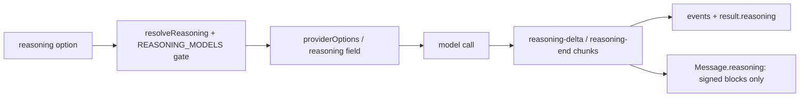

## What this is

Many models can "think" before answering — OpenAI's o-series, Anthropic's extended thinking, DeepSeek-R1 — but every vendor spells the feature differently. `reasoning` (LOU-V13) is one SDK option — `'none'|'minimal'|'low'|'medium'|'high'` or `{ effort?, budgetTokens?, summary?, force? }` — that each provider translates into its own API.

The feature has a second half too: the model's reasoning comes *back* as stream chunks, becomes `reasoning.*` events and `result.reasoning`, and — for providers that require it — signed blocks are kept on the transcript so a tool-call turn can send them back. Think of it as the model's scratchpad: you can watch it, but it never becomes prose.

## The mental model



Five nouns: the **option** (`ReasoningOption`), the **gate** (`REASONING_MODELS` — which families accept it), the **wire mapping** (`providerOptions` or pi `thinkingBudgets`), the **chunks** (`reasoning-delta`/`reasoning-end`), and the **replay** (signed blocks kept on `Message.reasoning`).

## How it works

1. `resolveReasoning()` (`src/providers/reasoning.ts`) normalizes the option (`effort` defaults to `'medium'`), then gates on `REASONING_MODELS` — per-provider regexes of families known to accept it. `'none'`, an unknown provider or an unmatched model sends nothing; `force: true` bypasses the gate.
2. `PROVIDER_OPTIONS` maps to the wire: `providerOptions.openai.reasoningEffort` (+ `reasoningSummary: 'auto'` for `summary`), `anthropic.thinking: { type: 'enabled', budgetTokens }` (`THINKING_BUDGETS` 1024/2048/8192/24576, floored at 1024 — Anthropic's minimum), `ollama.think: true` (ignored with one warning on `ai` 4). OpenRouter instead sets its unified `reasoning` body field (`{ max_tokens }` with a budget, else `{ effort }`), merged by `OpenRouterProvider`'s `withRequestChanges` fetch. Pi maps effort to a `ThinkingLevel` and `budgetTokens` to `thinkingBudgets`, gated on the catalog's `reasoning` flag. The provider packages add the budget to `max_tokens` and drop `temperature`/`topP` themselves.
3. Receiving: every wire shape converges on two `StreamChunk` types — `reasoning-delta` (text) and `reasoning-end` (`signature?`/`redactedData?`).
4. `generateViaStream()` (`streamStep.ts`) accumulates deltas into `block`/`thought`, emits `reasoning.start` on the first delta and `reasoning.done` (with `tokens` from `finish.usage.reasoningTokens`) when text or a tool call arrives; `reportReasoning()` synthesizes the same events for a non-streamed `generate()`.
5. `noteReasoning()` (`agentRunState.ts`) joins each step's blocks into `state.reasoning` → `result.reasoning`.
6. `assistantTurn()` (`agentRunState.ts`) keeps on `Message.reasoning` **only blocks with `signature` or `redactedData`** — the replay path for providers that need thinking back on a continued tool-call turn.

## Under the hood

- **The gate regexes** (`REASONING_MODELS`): OpenAI `o1+`/`gpt-5+` minus `-chat`/`o1-mini`/`o1-preview`; Anthropic `claude-3-7`/`…-4+`; OpenRouter's union; Ollama `deepseek-r1`/`qwen3`/`gpt-oss`/`magistral` — checked against the provider packages' sources.
- **Stream mapping per major.** On `ai` 6/7, `reasoning-start`/`-delta`/`-end` parts map to `reasoning-delta`/`reasoning-end` chunks; the open block's `providerMetadata` (Anthropic sends the signature on a delta) is remembered in `ChunkState` and attached at `reasoning-end`. On `ai` 4, `reasoning` parts → deltas, `reasoning-signature`/`redacted-reasoning` → ends. On pi, `thinking_delta`/`thinking_end` events carry `thinkingSignature`/`redacted`.
- **OpenRouter is the special case.** The `ai` SDK drops `reasoning`/`reasoning_details`, so `OpenRouterProvider` clones and parses the response body itself (`parseResponseBody`) and injects the observed chunks just before `finish` — only when the SDK reported none.

| `StreamChunk` | Carries | Produced from |
|---|---|---|
| `reasoning-delta` | `textDelta` | v4 `reasoning` part, v6/7 `reasoning-delta`, pi `thinking_delta`, OpenRouter `reasoning`/`reasoning_details` text |
| `reasoning-end` | `reasoning?: { signature?, redactedData? }` | v4 `reasoning-signature`/`redacted-reasoning`, v6/7 `reasoning-end` (+ held `providerMetadata`), pi `thinking_end`, OpenRouter `reasoning.signature`/`.encrypted` |

- **Replaying.** `AnthropicProvider.replaysReasoning = true` makes `toCoreMessages` emit kept blocks first in a tool-call turn (`toReasoningPart`); pi does the same via `reasoningToPi`. Anthropic requires the signed thinking back when a tool-call turn continues. Blocks survive checkpoints and resumes because they live on the saved message. Unsigned reasoning and the reasoning of a final reply are never kept in `messages`.
- **One event surface for every consumer.** `reduceAgentEvents()` stores them on `UIMessage.reasoning`, `toUIMessageStream()` emits `reasoning-start`/`-delta`/`-end` parts for `useChat`, `lousho acp` sends `agent_thought_chunk`, `lousho chat` prints them dimmed, and `recordReplay` cassettes keep the chunks so replay reproduces them. `usage.reasoningTokens` rides the normal usage path (`lousho.usage.reasoning_tokens` on the `chat` span).

## In code

| Symbol | File | Role |
|---|---|---|
| `ReasoningOption` / `ReasoningSettings` | `src/providers/reasoning.ts` | The public option (`createAgent`, `send`, `ExecuteOptions`, `GenerateOptions`) |
| `resolveReasoning()` / `REASONING_MODELS` | `src/providers/reasoning.ts` | Normalize + the known-family gate |
| `reasoningProviderOptions()` | `src/providers/reasoning.ts` | `providerOptions` for OpenAI/Anthropic/Ollama (same field on `ai` 4.3 and 6/7) |
| `openRouterReasoning()` | `src/providers/reasoning.ts` | OpenRouter's `reasoning` body field |
| `reasoningOptions()` | `src/providers/pi/PiProvider.ts` | pi `ThinkingLevel` / `thinkingBudgets` |
| `ReasoningBlock` | `src/providers/llm.ts` | `{ text, signature?, redactedData? }` on results, chunks and messages |
| `CHUNK_HANDLERS` / `reportReasoning()` | `src/execution/streamStep.ts` | Chunks → `reasoning.start`/`.delta`/`.done` events |
| `assistantTurn()` / `noteReasoning()` | `src/execution/agentRunState.ts` | Transcript replay + `result.reasoning` |

## Example

```ts
const agent = createAgent({ model: 'anthropic/claude-sonnet-4-5', reasoning: 'medium' });
for await (const event of agent.stream('Prove it.')) {
  if (event.type === 'reasoning.delta') process.stdout.write(event.text);
  if (event.type === 'reasoning.done') console.log(`${event.tokens} reasoning tokens`);
}
const result = await agent.send('Harder.', { reasoning: { effort: 'high', budgetTokens: 16_000 } });
result.reasoning; // the run's reasoning text
result.usage.reasoningTokens;
```

The same option on a non-reasoning model is silently dropped by the gate — add `force: true` only when you know the model accepts reasoning settings.

## Design decisions

- **Known-family gate, `force` escape hatch.** Sending unknown options to a non-reasoning model fails the call; the regexes cover the families the provider packages document, and `force` covers fine-tunes and new families.
- **Reasoning is not transcript text.** It reports through events/results and `Message.reasoning` for the one provider that needs it back — never concatenated into `content`, so it can't leak into prompts or compaction as prose.
- **Two acquisition paths, one chunk type.** Whether the SDK reports parts or OpenRouter's raw body is scraped, consumers see the same `reasoning-delta`/`reasoning-end` chunks — `result.reasoning`, ACP `agent_thought_chunk`, `lousho chat` dimming and cassettes all hang off that.
- **`reasoning-done` tokens come from usage, not a block field** — token counts arrive at `finish`, after the last block closed.
- **Signed blocks replay, unsigned don't.** Anthropic's API requires the thinking signature back when a tool-call turn continues; keeping only signed blocks on `Message.reasoning` meets that requirement without growing every transcript with scratchpad text.

Once both halves are in place — gated request, converged chunks — every consumer downstream (UI streams, ACP, cassettes, run results) reads reasoning the same way regardless of which provider produced it.

## Where next

- [ai-sdk compat](/providers/ai-sdk-compat) — `reasoningOf()`, `blockData()`, the v4/v6/v7 part mapping.
- [pi](/providers/pi) — thinking levels and `thinkingBudgets`.
- [Provider architecture](/providers/architecture) — `GenerateOptions.reasoning` in the contract.
