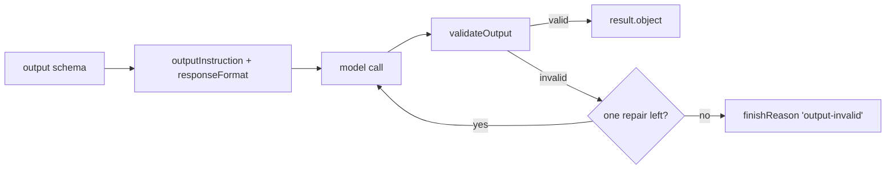

## What this is

`createAgent({ output })` / `ExecuteOptions.output` give a run a schema its final reply must satisfy — instead of prose, you get a typed `result.object`. Think of it as a contract the SDK writes into the prompt and then enforces on the reply: the schema is converted to JSON Schema, *asked for* in the system prompt, *hinted at* through a provider `responseFormat`, and *checked* after the model answers.

The machinery is small: `src/execution/structuredOutput.ts` renders the schema into a prompt block and the hint, and `AgentExecutor.checkOutput()` runs the parse → validate → one-repair-step → `'output-invalid'` sequence. There is no provider-specific enforcement anywhere in this file — the same code path serves every provider.

## The mental model



Four nouns: the **schema** (`StandardSchemaV1` — zod 3, zod 4, or any Standard Schema with JSON Schema output), the **instruction** (a `## Output format` block in the system prompt), the **hint** (`responseFormat` on the request), and the **repair step** (one extra model call with the issues listed).

## How it works

The request side runs once per call, the reply side once per `stop`-finished step — they meet at the JSON Schema both were built from.

1. `prepareGenerateRequest` (`generateStep.ts`) appends `outputInstruction(output)` last to the system prompt (after the plan-mode block) and puts `responseFormat: outputResponseFormat(output)` on every model call of the run.
2. Each provider turns `responseFormat` into its own wire option — or ignores it (it's a hint; validation is the contract).
3. When a step finishes with `stop`, `checkOutput` calls `validateOutput(schema, text)`: unfence → `JSON.parse` → the schema's own `safeParse`/`~standard.validate` (`parseWithIssues`).
4. Valid → `result.object` is the parsed data (zod defaults and transforms apply) and the run finishes `'stop'`.
5. Invalid → if `canRepair`, `outputRepairMessage(error)` is pushed as a `[output-invalid]` user message and the run takes **one** more step; otherwise `finishReason: 'output-invalid'` and `result.outputError` (`{ message, issues: [{ path, message }] }`) is set.

## Under the hood

- **Schema conversion is cached.** `jsonSchemaOf` keeps the converted JSON Schema in a `WeakMap`: zod 4 / Standard Schema via `schemaToJsonSchema()` (draft-7), zod 3 via the `ai` SDK's `zodSchema()` converter.
- **`closeObjectSchemas()` sets `additionalProperties: false`** on every object node that doesn't already set it (LOU-R7): OpenAI-compatible strict structured-output endpoints reject open object schemas, and zod 4's `toJSONSchema` doesn't emit it. An explicit `additionalProperties` (`z.strictObject`, `z.looseObject`, `record`, `catchall`) is left alone — it says what the author meant.
- **What each provider does with `responseFormat`.** `AiSdkProvider` maps it to `experimental_output` on `ai` v4 (`toOutput`, schema only when `model.supportsStructuredOutputs`) and to an `output` object on v6/v7 (`toModernOutput` — JSON mode, prompt and reply text untouched); `PiProvider` sends `response_format: json_schema`/`json_object` through `samplingParams`. A custom provider may ignore it.
- **Unfencing is narrow.** One ```` ```json ```` fence is tolerated; the schema's own validator does the real checking, so transforms and defaults land in `object`.
- **Repair counts against the budget.** `canRepair = !repaired && state.steps < maxSteps` — a spent budget goes straight to `'output-invalid'`.
- **Sub-agents surface it as a tool error.** `withSubagents.ts`'s `failureReason()` turns a sub-agent's `'output-invalid'` into a `task` tool failure naming the schema issues — the lead model can retry or adapt.

## In code

| Symbol | File | Role |
|---|---|---|
| `ExecuteOptions.output` | `src/execution/AgentExecutor.ts` | The option; `createAgent({ output })` types `result.object` as `InferSchemaOutput<T>` |
| `outputInstruction()` | `src/execution/structuredOutput.ts` | The `## Output format` system-prompt block |
| `outputResponseFormat()` | `src/execution/structuredOutput.ts` | `{ type: 'json', schema }` for `GenerateOptions.responseFormat` |
| `validateOutput()` | `src/execution/structuredOutput.ts` | unfence → `JSON.parse` → `parseWithIssues` → `{ object }` or `{ outputError }` |
| `outputRepairMessage()` | `src/execution/structuredOutput.ts` | The `[output-invalid]` user message of the repair step |
| `checkOutput()` | `src/execution/AgentExecutor.ts` | The valid / repair / `'output-invalid'` decision |
| `OutputError` | `src/execution/structuredOutput.ts` | `{ message, issues }`, surfaced as `result.outputError` |

## Example

```ts
import { z } from 'zod';
import { createAgent } from '@lousho/build-ai-agent';

const agent = createAgent({
  model: 'openai/gpt-4o-mini',
  output: z.object({ city: z.string(), tempC: z.number() }),
});

const result = await agent.send('Weather in Paris?');
if (result.object) console.log(result.object.tempC);                   // typed
else console.error(result.finishReason, result.outputError?.issues);   // 'output-invalid'
```

The zod schema does double duty: its JSON Schema form is what the model is asked for, and its `safeParse` is what the reply is checked against — so `result.object` is whatever the *parsed* schema produces, defaults and transforms included.

Note the two result fields working as a pair: `object` is populated on success, `outputError` on `'output-invalid'` — a run never has both, and a failed validation never throws.

## Design decisions

- **Exactly one repair step** (`repaired` flag in `runSteps`). More repair turns don't converge — a model that didn't match the schema after seeing its issues listed usually won't on attempt three — and each retry burns budget and latency.
- **Resolve, don't reject.** An invalid output is a result (`finishReason: 'output-invalid'`, `outputError`), not a throw — retries/fallback classify provider errors, and a schema mismatch is not one.
- **The prompt does the asking, the schema does the checking.** `injectIntoSystemPrompt`/`parseOutput` on the `ai` `Output` spec are deliberately pass-throughs — AgentExecutor owns both ends so behavior is identical across providers and `ai` majors.
- **`responseFormat` is a hint, not the contract.** Providers that can't express JSON-schema mode still get the system-prompt instruction; the validation runs regardless.

In short: the schema is asked for in the prompt, hinted at on the wire, checked on the reply, and given exactly one second chance — after that the run reports `'output-invalid'` and moves on.

## Where next

- [ai-sdk compat](/providers/ai-sdk-compat) — `toOutput`/`toModernOutput` and the zod 3/4 schema conversion.
- [pi](/providers/pi) — `samplingParams.response_format` on the pi path.
- [decisions](/providers/decisions) — `decide()` when you need a classification, not a schema.
