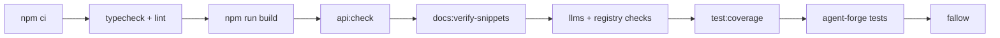

## What this is

Beyond tests, three quality gates guard the repo like inspectors at different checkpoints: **api-report** freezes the public API surface as checked-in `api/*.api.md` reports so a surface change is always a deliberate diff, **fallow** hunts dead code, duplication and overly complex functions, and **pack-smoke / registry-smoke** prove the published tarball actually installs and works. `.github/workflows/ci.yml` sequences all of them. The theme is the same as the docs pipeline: generated artifacts verified by regeneration, so nothing drifts silently.

## The mental model



Four nouns to hold: the **api report** (a generated `api/*.api.md` listing of one exports entry), a **fallow finding** (dead code, duplication or a complexity score over threshold), the **smoke tests** (pre-publish `pack-smoke`, post-publish `registry-smoke`), and the **peers matrix** (the sibling job re-testing every supported `ai`×`zod` pairing).

## How it works

The diagram is the `ci` job's real step order (`.github/workflows/ci.yml`, Node 22.19.0 — `undici` needs ≥22.19 under `require`):

1. `npm ci → tsc --noEmit → typecheck:tests → lint → build` (12 GB heap — the dual-entry DTS pass exceeds the default).
2. `api:check` — regenerates every report into a temp dir and `git diff --no-index`s it against the committed `api/*.api.md`; a difference fails the build.
3. Build `create-lousho-agent`, then `docs:verify-snippets -- --skip-build`.
4. `test:types` (test-d + `typecheck.only`), then the other generated-artifact diffs: `docs:llms:check`, `registry:check`.
5. `test:coverage` — writes `coverage/coverage-final.json` (v8).
6. agent-forge typecheck + client/server tests (runs off the root `dist/` built in step 1).
7. `fallow` — deliberately after coverage, because its health scores read the coverage file.

Siblings, not steps: the `peers` matrix re-runs typecheck + `test:types` + build + `vitest run` per `ai`/`zod` pairing (also building `create-lousho-agent` for its bin tests), and `pack-smoke` is its own job. Build precedes tests because `template.e2e.test.ts` `npm pack`s the SDK and needs `dist/`; `api:check` runs only in the main job so reports reflect default peers.

## Under the hood

- **api-report** (`scripts/api-report.ts`, `npm run api:update`/`api:check`, A7/#245). For every `package.json` `exports` entry, api-extractor runs programmatically on the entry's `dist/*.d.ts` and emits `api/<subpath>.api.md` (`index.api.md` for `.`). tsup emits *chunked* declarations — `dist/index.d.ts` imports hashed `dist/<name>-<hash>.d.ts` chunks through `.js` specifiers — so every entry gets `compiler.overrideTsconfig` with `moduleResolution: "bundler"` or nothing resolves. `ae-missing-release-tag` is suppressed (no release tags used); `ae-forgotten-export` lands in the report so unexported types referenced by public signatures stay visible. Reports are machine-stable: `newlineKind: 'lf'`, no absolute paths, `api/**` eol=lf via `.gitattributes`. Requires `npm run build` first — reports describe dist, not src.
- **fallow dead code** (`.fallowrc.json`). `entry` roots analysis at the CLI command modules, all test/type-test/eval files and one example deploy script; `dynamicallyLoaded` whitelists things static analysis can't see (worker shims, `runtime.worker.ts`, agentDir fixtures, `registry/**`); `ignoreDependencies` covers optional peers imported lazily; `usedClassMembers` keeps interface-driven members (`TriggerAdapter`, `CheckpointStore`, `ApprovalStore` — called through the interface, look unused statically); `overrides` turns `unused-enum-members` off in `src/types/**`. Duplicates are ignored in `*.test-d.ts`, `registry/**`, `examples/**`.
- **fallow health.** Complexity/cognitive/CRAP thresholds, `ignore`d for tests/fixtures/registry, plus `coverage: coverage/coverage-final.json`. CRAP (Change Risk Anti-Patterns) inflates a function's score when coverage is low, so the score is only as fresh as the coverage file — **regenerate coverage before judging fallow output**, which is why CI runs `fallow` after `test:coverage`. `thresholdOverrides` carve out files whose coverage-CRAP is structurally maximal, each with a `reason`: `examples/**` and `scripts/**` never run under the vitest coverage suite (maxCrap 150/220, scripts also maxCognitive 25 for arg-parsing mains); `registryEnforce.ts`/`workerAgentDir.ts` and `piAgent.ts` are ~94-100% covered but nested callbacks score 0% under per-function matching (maxCrap 80/130). Every override relaxes only the coverage term — cyclomatic/cognitive ceilings still gate. `npm run fallow` is bare `fallow` (fails on any finding); `fallow:score` → `fallow health --score`.
- **pack-smoke** (`scripts/pack-smoke.ts`, LOU-D49). Builds SDK + create-lousho-agent + `build:studio` (what `prepublishOnly` produces), packs both, checks the SDK tarball — entry/unpacked/packed size ceilings (~20% headroom over measured), `FORBIDDEN_PATHS` (`.env`, tests, `__cassettes__`, `.pem`/`.key`, ...), `REQUIRED_PATHS` (files `lousho build`/`studio` load from the installed package), `SECRET_PATTERNS` scanned over extracted text files — then `npm publish --dry-run` (never publishes), installs tarballs + registry peers into a temp project, and loads every export in ESM *and* CJS, runs a mock-model turn, `lousho --help`/`doctor`, and `tsc` under bundler + node16 plus a `skipLibCheck:false` pass over shipped declarations. `PACK_SMOKE_PEERS` overrides the peer set. Shared helpers live in `scripts/smokeKit.ts`.
- **registry-smoke** (`scripts/registrySmoke.ts`, R1b) is the post-publish twin: installs from the real registry (never reads the checkout), scaffolds via `npm create lousho-agent`, runs the generated project's tests, `lousho studio /health`, optional `--live` turn; run after publishes and on the weekly job.
- **Peers matrix** (LOU-M8). Every `ai`/`zod` pairing the peer ranges accept, `npm install --no-save` on top of `npm ci`: `ai4-zod4` (also runs `typecheck:tests` — the tests are written against ai 4's types), `ai6-zod3`, `ai6-zod4`, `ai7-zod3`, `ai7-zod4`. The zod-4 entries add `ollama-ai-provider-v2` via `--save-prod --legacy-peer-deps` (optional peer + v1 conflicts); v4-only tests are gated by `itOnAiV4`/`describeOnAiV4` (LOU-D28b), and `ollamaV2.contract.test.ts` runs against the real package in the two zod-4 legs. The matrix sets `fail-fast: false` (15-minute timeout per leg) so one broken pairing doesn't hide the others' results.
- **Live tests.** `vitest.live.config.ts` includes `*.live.test.ts` only and merges `loadEnv('test', ...)` into `process.env` — vitest puts `.env` on `import.meta.env` but tests check `process.env.OPENROUTER_API_KEY`. `npm run test:live` is opt-in and never in CI; each live file skips itself without a key and re-records its cassette when `LOUSHO_RECORD=1`.
- **The `pack-smoke` CI job is thin**: `npm ci` then `npm run pack-smoke` with the same enlarged heap — the script runs `npm run build` itself (LOU-D49).
- **Test configs**: `vitest.config.ts` (default; includes `**/*.eval.ts`, excludes judge/docker/live/apps), `vitest.judge.config.ts`, `vitest.live.config.ts`, `vitest.coverage.config.ts`, `vitest.docker.config.ts`.

## In code

| Symbol | File | Role |
| --- | --- | --- |
| `npm run api:update` / `api:check` | `scripts/api-report.ts` | Regenerate / diff-check `api/*.api.md` per exports entry |
| `npm run fallow`, `fallow:score` | `.fallowrc.json` | Dead-code/duplication/health gates; coverage-driven CRAP |
| `npm run pack-smoke` | `scripts/pack-smoke.ts` | Pre-publish tarball verification (LOU-D49) |
| `npm run registry-smoke` | `scripts/registrySmoke.ts` | Post-publish registry verification (R1b) |
| shared smoke helpers | `scripts/smokeKit.ts` | Temp-project install/load utilities |
| CI ordering | `.github/workflows/ci.yml` | `ci` job + `peers` matrix + `pack-smoke` job |
| test entry sets | `vitest.*.config.ts` | default / judge / live / coverage / docker |

## Example

```bash
# Public API touched? Regenerate and review the diff you're committing:
npm run api:update && git diff api/

# Before pushing health-gate-sensitive work — coverage first, so CRAP scores are fresh:
npm run test:coverage && npm run fallow

# What CI's pack-smoke job does locally:
npm run pack-smoke -- --skip-build
```

Each line mirrors a CI gate: regenerate-then-diff for the API surface, coverage-then-fallow for health, and the same script the dedicated CI job runs for the tarball.

## Design decisions

- **Reports as reviewed diffs, not snapshots**: the gate's value is that changing `index.api.md` requires a human `api:update` — accidental surface breaks can't slip through as "test tweaks".
- **Coverage-driven CRAP needs a fresh coverage file**: stale `coverage-final.json` inflates or deflates scores silently, hence CI ordering and the `thresholdOverrides` reasons documenting *why* each exception exists.
- **Smoke tests are two-sided**: `pack-smoke` tests the tarball the checkout produces (pre-publish), `registry-smoke` tests what npm actually serves (post-publish) — a tarball can be fine while the published artifact is broken by `prepublishOnly` differences.
- **`--check` never writes in place**: api-report regenerates into a temp dir and diffs, so the committed report is only ever changed by a deliberate `api:update`.

## Where next

- [Docs pipeline](/quality/docs-pipeline) — `docs:verify-snippets` and `docs:llms:check` in the same gate order.
- [record-replay](/quality/record-replay) — cassettes are what the peers matrix replays identically under zod 3 and 4.
- [contribute/release-process](/contribute/release-process) — where `registry-smoke` and `api:update` fit a release.
