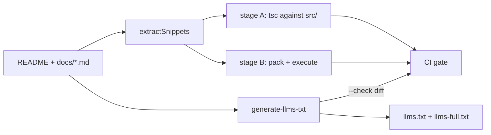

## What this is

Docs in this repo are executable artifacts — code samples are treated like tests, not prose, the way a cookbook's recipes might be cooked nightly to prove they still work. Two scripts enforce it: `scripts/verify-docs-snippets.ts` proves every ```` ```ts ```` fenced block in `README.md` + `docs/*.md` compiles against the real source (and that the quick-start actually *runs*), and `scripts/generate-llms-txt.ts` regenerates `llms.txt`/`llms-full.txt` — machine-readable doc bundles for coding agents — with a CI stale-check. The invariant: docs can never lie about the API.

## The mental model



Five nouns to hold: a **snippet** (one fenced `ts` block, tracked by file + fence line), a **fence flag** (`no-verify`/`no-run` on the opening fence), **stage A** (type-check against source), **stage B** (execute against the packed tarball), and the **llms files** (generated, never hand-edited).

## How it works

1. **Extract.** `extractSnippets` scans markdown for ```` ```ts ```` / ```` ```typescript ```` fences, recording file + 1-based fence line. Fence info flags steer what follows: `no-verify` skips both stages entirely; `no-run` type-checks but never executes (for snippets needing a real API key — LOU-D1).
2. **Stage A — source check.** Every snippet from README + all `docs/*.md` becomes `snippet-N.ts` (with a trailing `export {};` so it's a module) in a temp dir *inside* the repo — inside, so `ai`, `zod` and `typings/*.d.ts` resolve from the repo's own `node_modules`; the dir is always removed afterwards. A generated `tsconfig` maps each `package.json` `exports` entry's `types` (`./dist/x.d.ts`) to its `src/x.ts` via `paths` (`sourcePaths()`), so `@lousho/build-ai-agent` and subpath imports resolve to **source, not dist** — a docs example can never drift from the code. A `placeholders.d.ts` preamble (`PLACEHOLDERS`) declares common names (`agent`, `provider`, `toolRegistry`, `storage`, `approvalStore`, `mcpClient`, ...) as typed globals so intentionally partial snippets need no opt-out; a snippet's own `const agent` shadows the placeholder, and a new free name is covered by adding a `PLACEHOLDERS` entry. `tsc --noEmit` runs once; output lines are mapped back per snippet.
3. **Stage B — packed run.** `RUNNABLE_DOCS` (currently just `docs/quick-start.md`) goes further: `npm run build` (skippable), `npm pack`, install the tarball into a throwaway temp project with the doc'd peers (`ai`, `zod`, the optional provider packages, pinned to the repo's own dev versions — LOU-D28d), write `snippet-N.mts`, `tsc --noEmit` (strict, NodeNext) over all, then execute each non-`no-run` snippet with `tsx` (60s timeout). Credential env vars (`OPENAI_API_KEY`, `ANTHROPIC_API_KEY`, `OPENROUTER_API_KEY`, `OLLAMA_BASE_URL`) are stripped so snippets exercise the mock/offline path deterministically and can never make network calls. `--keep` preserves the temp project for debugging.
4. **llms.txt generation** (`generate-llms-txt.ts` + `llmsTxt.ts`): reads `package.json` (name/repo), `README.md`, every `docs/*.md` passing `isUserDoc` (internal follow-up pages like `eslint-baseline-followup.md` are filtered out), and every `examples/*/README.md`. `renderLlmsTxt` produces the link index; `renderLlmsFull` inlines the content. Both ship in the npm package so coding agents can read them from `node_modules`.
5. **CI enforces freshness.** `.github/workflows/ci.yml` runs `docs:verify-snippets -- --skip-build` after `npm run build`, then `docs:llms:check`, which regenerates in memory and diffs — stale output fails with "run `npm run docs:llms`".

## Under the hood

- **File arguments narrow the run.** `tsx scripts/verify-docs-snippets.ts docs/foo.md` restricts both snippet stages to those files — handy while iterating on one page; the zero-snippet case exits 1 so a fat-fingered path can't pass vacuously.
- **Failure output names the stage**: `[typecheck]` or `[run]`, plus `file:line` of the fence — so the report points at the markdown line a contributor must fix, not a generated temp file.
- **Rendering is pure** (`scripts/llmsTxt.ts`): `renderLlmsTxt`/`renderLlmsFull`/`isUserDoc`/`normalizeNewlines` take strings and return strings, which is why `scripts/llmsTxt.test.ts` can snapshot the whole output.
- **Stage A is types-only** — nothing executes, so the source check stays fast and can never run docs code with side effects; execution is reserved for stage B's sandboxed temp project.
- **Adjacent doc guards**: `docs/docs-links.test.ts` fails on dead internal links, and `docs/buildACodingAgent.test.ts` executes the guide's agent end-to-end offline — docs correctness is tested, not just compiled.
- **`--skip-build` exists for CI**: it reuses the repo's existing `dist/`, which is safe there because the `ci` job runs `npm run build` earlier; locally it just means "I already built".
- **`--keep` is the debug hatch**: it preserves the temp stage-B project (the path is printed) so a failing snippet can be re-run by hand in the exact environment that failed.
- **API reference** is separate: `npm run docs:build` → `typedoc` (`typedoc.json`).

## In code

| Symbol | File | Role |
| --- | --- | --- |
| `npm run docs:verify-snippets` | `scripts/verify-docs-snippets.ts` | Both stages; `[files...]`, `--skip-build`, `--keep` (LOU-I7) |
| `extractSnippets`, `sourcePaths`, `PLACEHOLDERS` | `scripts/verify-docs-snippets.ts` | Fence extraction, src-paths tsconfig, placeholder globals |
| `RUNNABLE_DOCS` | `scripts/verify-docs-snippets.ts` | Which pages also execute (quick-start today) |
| `npm run docs:llms` / `docs:llms:check` | `scripts/generate-llms-txt.ts` | Regenerate / diff-check `llms.txt` + `llms-full.txt` (LOU-D12) |
| `renderLlmsTxt`/`renderLlmsFull`/`isUserDoc` | `scripts/llmsTxt.ts` | Pure renderers, snapshot-tested by `scripts/llmsTxt.test.ts` |
| `npm run docs:build` | `typedoc.json` | typedoc API reference |

## Example

```bash
# After editing a docs page or the public API:
npm run docs:verify-snippets          # full run incl. build+pack
npm run docs:verify-snippets -- --skip-build   # reuse existing dist/

# Regenerate the llms files after editing README/docs/examples:
npm run docs:llms
git diff llms.txt llms-full.txt
```

The first command runs both stages end-to-end (build, pack, temp project); the second reuses an existing `dist/` for a faster loop. The third pair is the llms workflow: regenerate, then eyeball the diff you are about to commit.

Fence flags in markdown:

````markdown
```ts no-verify   // skipped entirely (pseudo-code)
```ts no-run      // type-checked, not executed (needs a real key)
```ts             // type-checked vs src/; executed if in docs/quick-start.md
````

## Design decisions

- **Two verification depths, one flag set.** Type-checking everything against `src/` catches API drift cheaply; executing only the quick-start against the *packed tarball* catches packaging/export bugs (the exact "paste it and it works" path a new user hits) without paying an `npm install` per doc page.
- **Against source, not build output, in stage A** — otherwise a stale `dist/` could bless docs for an API that no longer exists. Stage B deliberately flips: it validates what consumers actually install.
- **Env-stripped execution.** Snippets must be runnable offline; stripping keys also proves the mock-provider docs path works. This is the check that caught the `import 'vitest'` bundling bug (LOU-I7): `defineEval` was breaking every snippet run outside vitest.
- **Generated llms.txt with a diff check**, not a handwritten file — same pattern as `api/*.api.md` and `registry/dist`: generated artifacts are verified by regeneration in CI, so they can't silently rot.
- **Both llms files ship in the tarball** — a coding agent inside a consumer's `node_modules` reads the same verified content the CI gate produced.

## Where next

- [api-report + fallow](/quality/api-report-and-fallow) — the other generated-artifact gates (`api:check`, `registry:check`).
- [testing-mock-model](/quality/testing-mock-model) — the provider that makes snippets runnable offline.
- [contribute/code-conventions](/contribute/code-conventions) — writing style the docs pages follow.
