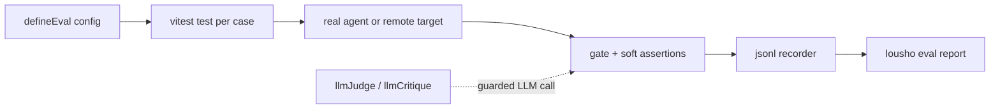

## What this is

An **eval** is a test that scores an agent's behavior instead of asserting on return values — think a driving exam rather than a unit test. The eval system in `src/evals/` is a thin layer over vitest: `defineEval()` registers eval cases as vitest tests that drive a *real* agent (`createAgent()` or `AgentExecutor.execute()`), record structured `EvalResult`s, and hand them to `lousho eval` for tables, JUnit XML and drift reports. Nothing is mocked implicitly — the test chooses `mockModel`, a cassette, a real provider or a `remoteTarget`.

## The mental model



Five nouns to hold: an **eval case** (one input plus expectations), **gate** vs **soft** assertions (failing vs merely reported), the **judge** (an LLM that grades a reply against a rubric), the **recorder** (a jsonl file of results), and the **report** (`lousho eval`'s output).

## How it works

Following the diagram:

1. **`defineEval(config)` registers vitest tests.** Two overloads:
   - **Classic** `{ name, agent, input, provider, toolRegistry?, maxSteps?, temperature?, maxTokens?, score(result), threshold, tags? }` — calls `AgentExecutor.execute()` once and asserts `score >= threshold`. The config fields are deliberately named exactly like `ExecuteOptions` so they forward without reshaping.
   - **Trajectory** `{ name, agent|target, cases?, judge?, tags?, test(t, c) }` — runs `test` once per dataset case with an `EvalTestContext`.
2. **The agent runs for real.** An agent factory (`() => agent`) is invoked lazily on first `send()` so each case gets a fresh instance; `target: remoteTarget({ url })` or `lousho eval --url` swaps the in-process agent for `POST /chat` + SSE against a deployment.
3. **Assertions are recorded, never thrown.** Each check on `EvalTestContext` (`send()`, `reply`, `result`, `toolCalls`, plus gates `completed()`, `calledTool(name, { args?, times? })`, `notCalledTool()`, `toolOrder(names)`, `maxSteps()`, `maxTokens()`, `maxCostUsd()`, `check(name, value, check)`, and non-failing `soft(...)`) appends an `AssertionResult` (`{ name, kind: 'gate'|'soft', passed, score, threshold?, message? }`); the case fails once at the end listing every failed gate (`describeFailure`).
4. **The judge grades via a configured provider.** `t.judge(rubric)` grades the latest reply; `llmJudge`/`llmCritique` send a grading prompt through the real `LLMProvider` interface — guarded, see below.
5. **Every case appends one JSON line** to the `LOUSHO_EVAL_RESULTS` file, and `lousho eval` renders the table/JUnit/JSON report from it.

## Under the hood

- **Assertion semantics.** `calledTool` supports partial deep-arg matching (`diffArgs` — expected keys must equal, extras allowed) and `times` for exact counts; `toolOrder` is a subsequence check (`isSubsequence`), so unrelated calls may sit in between. `maxCostUsd` reads `result.usage.costUsd` and *skips* (recorded passed with `skipped: true`) when no cost was reported. Remote runs fail checks needing data the SSE stream lacks (e.g. `maxTokens` without usage), naming what's missing.
- **`Check`s** (`src/evals/checks.ts`): `includes`, `matches`, `equals`, `atLeast`, `atMost`. Sync scorers for classic evals (`src/evals/scorers.ts`): `exactMatch`, `toolCallOrder`, `budget`.
- **llmJudge / llmCritique internals** (`llmJudge.ts`): builds a grading prompt ("respond with ONLY a number 0..1", or `SCORE:`/`FEEDBACK:` lines for critique — critique returns `{ score, feedback }` for evaluator-optimizer loops), sends it through `provider.generate({ model, messages: [{ role: 'user', content }], temperature })` — the real `LLMProvider` interface, there is no `.complete()`. `parseJudgeScore` clamps to `[0,1]` and returns `score: 0` with a `reason` on non-numeric output (explicit, not NaN-fail-closed-by-accident). `parseJudgeCritique` prefers the markers but degrades gracefully: missing `SCORE:` falls back to a bare-number parse, missing `FEEDBACK:` treats leftover prose as the note.
- **The judge guard.** A real LLM call must never sneak into default CI: `llmJudge`/`llmCritique` throw `LOUSHO_EVALS_INVALID` unless `LOUSHO_ALLOW_LLM_JUDGE=1`, which only `vitest.judge.config.ts` (`npm run test:evals:judge`) and `lousho eval --judge` set. The main `vitest.config.ts` includes `**/*.eval.ts` but *excludes* `**/*.judge.eval.ts` — the two file sets can never overlap. `t.judge()` bypasses the guard via `allowOutsideJudgeRunner` because the judge provider was configured explicitly on the eval.
- **Results pipeline.** `lousho eval` (`src/cli/eval.ts`) resolves vitest from the *user's* `node_modules` (exit 2 with the install command if absent), generates a temp `vitest.eval.config.mjs` (or honours `--config`, in which case globs become vitest filters), sets `LOUSHO_EVAL_RESULTS` to a temp jsonl file and `LOUSHO_EVAL_TAGS` for `--tag`. The recorder (`src/evals/recorder.ts`) is a file, not a vitest reporter, so it works across every vitest version and worker pool; `VITEST_*` vars are scrubbed from the child env so nesting inside another vitest run can't confuse it. `evalReport.ts` renders the summary table, `--json`, and JUnit XML: `testsuite` per eval, `testcase` per case, gate failures as `<failure>`, error-only cases as `<error type="EvalError">`, soft failures as `<system-out>` notes (failures under `--strict`) — so CI surfaces eval regressions in the standard test UI.
- **Targets.** `remoteTargetFromEnv()` (`--url`/`LOUSHO_EVAL_TOKEN`) overrides both `config.target` and `config.agent`; a classic score/threshold eval can't run remotely and rejects the combination with `LOUSHO_CONFIG_CONFLICTING_OPTIONS` — an in-process provider can't be pointed at a URL. A missing `agent`/`target` fails with `LOUSHO_CONFIG_MISSING_AGENT`.
- **Cassettes & drift.** `--record`/`--replay`/`--drift` set `LOUSHO_EVAL_CASSETTES`; `src/evals/cassettes.ts` wraps each case's provider via the `setProviderInterceptor()` seam, one cassette per case per provider at `__cassettes__/<eval>/<case>.json`. `--drift` re-records into a temp dir and `diffTrajectories` (`src/evals/drift.ts`) compares ordered tool names, JSON-normalized args, step count, finish reason, and tokens (`--drift-usage`) — emitted as a `Drift:` table plus a soft `drift` assertion per case.

## In code

| Symbol | File | Role |
| --- | --- | --- |
| `defineEval(config)` | `src/evals/defineEval.ts` | Classic + trajectory overloads; registers vitest tests |
| `EvalTestContext` (`t.*`) | `src/evals/trajectory.ts` | Per-case handle: `send`, gates, `soft`, `judge`, `check` |
| `includes`/`matches`/`equals`/`atLeast`/`atMost` | `src/evals/checks.ts` | `Check` predicates for `t.check`/`t.soft` |
| `exactMatch`/`toolCallOrder`/`budget` | `src/evals/scorers.ts` | Sync scorers for classic evals |
| `llmJudge` / `llmCritique` | `src/evals/llmJudge.ts` | Judge provider factories + score parsers |
| `remoteTarget` / `remoteTargetFromEnv` | `src/evals/remoteTarget.ts` | `POST /chat` + SSE target for deployments |
| `diffTrajectories` | `src/evals/drift.ts` | `--drift` comparison |
| recorder / interceptor wiring | `src/evals/recorder.ts`, `src/evals/cassettes.ts` | jsonl results; per-case cassette wrap |
| `lousho eval` + report | `src/cli/eval.ts`, `src/cli/evalReport.ts` | Runner: `[globs] [--tag] [--junit] [--json] [--strict] [--judge] [--record\|--replay\|--drift [--drift-usage]] [--url [--token]]`; tables + JUnit XML |

## Example

```ts
defineEval({
  name: 'refund flow',
  agent: createAgent({ provider: mockModel([...]), tools, prompt }),
  cases: [{ input: 'Refund order 42', orderId: '42' }],
  async test(t, c) {
    await t.send(c.input);
    t.completed();
    t.calledTool('lookup_order', { args: { orderId: c.orderId } });
    t.toolOrder(['lookup_order', 'issue_refund']);
    t.check('mentions policy', t.reply, includes('30 days'));
    t.soft('tone', await t.judge('Polite?'), atLeast(0.7));
  },
});
```

This is a trajectory eval: `cases` provides the dataset, `test(t, c)` runs once per case against a fresh agent built on a scripted [mockModel](/quality/testing-mock-model). The body narrates a refund conversation: send the input, assert the run completed, assert `lookup_order` was called with exactly `orderId: '42'` (extra args allowed), assert the two tools ran in that order, gate on the reply mentioning the policy — and record a *soft* tone score from the judge, which reports without failing unless `--strict` is passed.

## Design decisions

- **Evals are vitest tests**, not a separate runner: watch mode, `--tag` filtering via `test.skip`, IDE integration and parallel workers come for free. `defineEval` resolves the running vitest API from `globalThis.__vitest_index__` rather than `import { test } from 'vitest'` — a value import made tsup bundle vitest into `dist/`, which crashed every non-vitest consumer (LOU-I7).
- **Gate vs soft** splits "the eval is broken" from "quality regressed but tolerably" — `--strict` promotes soft failures when a release gate wants them.
- **No implicit LLM calls** anywhere: judge evals need the env var *and* the file convention.

## Where next

- [recordReplay](/quality/record-replay) — the cassette machinery `--record`/`--drift` build on.
- [mockModel](/quality/testing-mock-model) — the provider for deterministic CI evals.
- [CI topology](/quality/api-report-and-fallow) — where evals and judge-evals sit in the gate pipeline.
