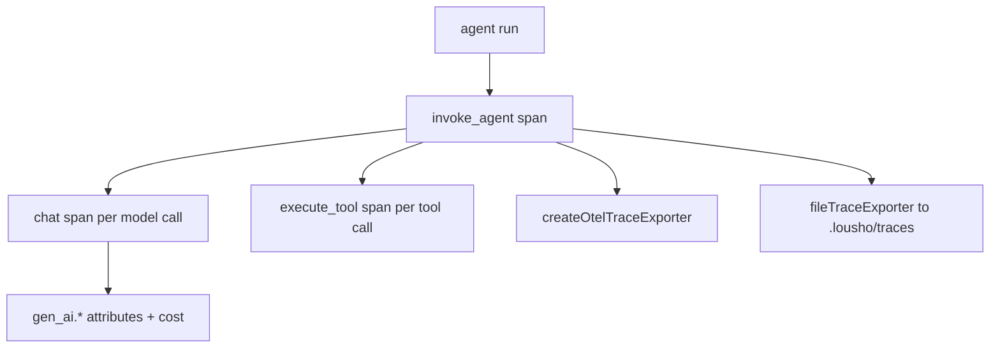

## What this is

A **span** is one timed operation in a run — one model call, one tool execution — stamped with a name, attributes and a parent, like entries on a ship's log that together reconstruct the voyage. "GenAI semantic conventions" are OpenTelemetry's standard names for LLM-related span names and attribute keys, so any OTel-compatible backend understands them without SDK-specific code. Observability here is three layers: a tiny internal span abstraction (`src/execution/tracing.ts`) that ships **no** backend, GenAI-semantic-convention span builders (`src/execution/genAiSpans.ts` + `semconv.ts`), and two ready-made exporters — `createOtelTraceExporter()` (real OpenTelemetry, optional peer) and `fileTraceExporter()` (JSONL files `lousho traces` reads). Cost and token usage ride along as span attributes and roll up to the run result.

## The mental model



Five nouns to hold: a **span** (one timed operation), the **span tree** (spans nested by `parentId`), an **attribute** (a key/value fact stamped on a span — `gen_ai.*` standard names plus SDK-private `lousho.*`), an **exporter** (a `{ onSpanStart, onSpanEnd }` sink — the only seam), and a **trace file** (the JSONL a file exporter writes, read back by `lousho traces`).

## How it works

1. **The run opens a root span.** One agent run produces `invoke_agent {agent.name}` (internal kind); flow runs use `invoke_workflow`, flow nodes `flow.node {type}` with `lousho.flow.*` attributes (`code`, `node.id`, `node.type`, `outcome`).
2. **Children nest under it.** Per model call a `chat {model}` span (**client** kind — the only client spans); per tool call an `execute_tool {name}` span. Parenting is explicit `parentId` threading, not ambient context.
3. **`withSpan` drives the lifecycle.** `withSpan(exporter, name, attributes, fn, parentId?, kind?)` — the only span mechanism — generates `newId()`, passes the mutable `Span` to `fn` (attributes enriched at start and again at end), and always ends the span in a `finally`. Errors get `recordSpanError` (`error.type` = error name or `_OTHER`, status `{ code: 'error' }`) then rethrow. With `exporter: undefined` nothing is emitted but `fn` still runs — `withSpan` never throws for a missing exporter.
4. **Exporters consume finished spans.** `createOtelTraceExporter` maps each `Span` to a real OTel span; `fileTraceExporter` appends one JSONL line per finished span under `.lousho/traces/`.

## Under the hood

- **Attributes** (`genAiSpans.ts`). `chat` spans carry `gen_ai.operation.name`, `gen_ai.provider.name`, `gen_ai.request.model|temperature|max_tokens`, then on completion `gen_ai.response.model` (read off `rawResponse`), `gen_ai.response.finish_reasons` (`tool_calls` → spec's singular `tool_call`), `gen_ai.usage.input_tokens|output_tokens`. `execute_tool` adds `gen_ai.tool.name|call.id|description|type='function'`; `invoke_agent` adds `gen_ai.agent.name|id`, `gen_ai.conversation.id`. Pre-LOU-D9 attributes (`model`, `prompt`, `toolName`, `args`, `result`, `latencyMs`, ...) are **dual-emitted** as deprecated `LegacyAttr`s.
- **Content is opt-in.** `gen_ai.system_instructions|input.messages|output.messages|tool.call.arguments|tool.call.result` are only recorded with `captureContent: true` (or env `OTEL_INSTRUMENTATION_GENAI_CAPTURE_MESSAGE_CONTENT=true`); `redactContent: true` also drops the legacy content attrs. Trace files are exempt from this framing — they store whatever spans carry, which is why `lousho dev --traces` is opt-in and documents that files can hold prompt/tool content.
- **Usage + cost.** `recordLlmResult` stamps token counts plus SDK-private attrs: `lousho.cost_usd` (from `estimateCost(usage, model)` when the price table knows the model), `lousho.usage.estimated` (provider reported no usage, executor estimated — LOU-V5), `lousho.usage.reasoning_tokens`, `lousho.hosted_tool_calls` (names of provider-run tools, which get **no** `execute_tool` span). `withSpan` maintains a per-open-span rollup: finished children add `lousho.cost_usd` to the parent, so `invoke_agent` ends with cumulative cost — but it's *absent* if any token-using child had an unknown price, and `lousho.usage.estimated` propagates upward. `ExecutionResult.usage` mirrors this (`costUsd`, `estimated`, `hostedToolCalls`).
- **OTel bridge** (`otel.ts`). Maps each `Span` via `trace.getTracer`, parenting through `context` (not ambient), kind CLIENT for `chat`, status ERROR on error; non-primitive attribute values are JSON-stringified (OTel requirement). Also records GenAI client metrics when `metrics !== false`: `gen_ai.client.token.usage` and `gen_ai.client.operation.duration` histograms with spec bucket boundaries, attributed by operation/provider/model/`error.type` (`gen_ai.token.type` = `input`/`output` splits the token records). No registered `TracerProvider`/`MeterProvider` → OTel's no-op implementations discard silently.
- **Trace files.** `fileTraceExporter({ dir? })` writes `.lousho/traces/<YYYY-MM-DD>/<traceId>.jsonl` (default `DEFAULT_TRACE_DIR`): one JSONL line per finished span (`v: 1`, `traceId` = root span id, file named for it, day folder = root's local start date), `appendFileSync` per span so each line is complete even on crash; write failures warn once (`console.warn`) and never throw into a run. `readTraces` sums `chat`/`execute_tool` spans into `TraceSummary` (modelCalls, toolCalls, tokens, `costUsd` off the root) and tolerates a truncated final line. `readTrace(idOrPrefix)` accepts a unique id prefix and throws `LOUSHO_CONFIG_INVALID` when a prefix is ambiguous. The `lousho traces` CLI (`src/cli/traces.ts`, flags `--dir`/`--limit`/`--json`, `<id> --content`) reads files only — it imports `src/traces/`, never the run loop. `lousho dev`/`chat` take `--traces[=dir]`, and `lousho init` projects ignore `.lousho/`; Agent Forge writes per-agent traces to `.lousho/agents/<id>/traces` (M5b).
- **Code-mode sub-calls stay attributable**: tools invoked from inside a code-mode script get their own `execute_tool` span stamped with `lousho.tool.parent_call_id` naming the parent tool call (`src/execution/codeMode.ts`).
- **The `Span` record** is a plain mutable object — `{ id, name, attributes, startTime, endTime?, parentId?, kind?, status? }` — which is why builders can stamp completion attributes (`gen_ai.response.*`, usage, cost) onto the same span the start callback already saw.
- **All names/keys** live in `src/execution/semconv.ts` (`GenAiOperation`, `GenAiAttr`, `GenAiMetric`, `SdkAttr`, `LegacyAttr`, `FlowAttr`).

## In code

| Symbol | File | Role |
| --- | --- | --- |
| `withSpan` | `src/execution/tracing.ts` | The only span mechanism; lifecycle + error recording |
| `TraceExporter`, `Span`, `SpanKind`, `SpanStatus` | `src/execution/tracing.ts` | The seam + record types; re-exported from `/traces` |
| span builders | `src/execution/genAiSpans.ts` | `invoke_agent`/`chat`/`execute_tool` construction + attributes |
| `recordLlmResult` | `src/execution/genAiSpans.ts` | Usage/cost attributes on `chat` spans |
| `estimateCost` | `src/models/registry.ts` | Price-table lookup behind `lousho.cost_usd` |
| `GenAiAttr`/`SdkAttr`/... | `src/execution/semconv.ts` | Every emitted name/key constant |
| `createOtelTraceExporter` | `src/execution/otel.ts` | OTel bridge; subpath `@lousho/build-ai-agent/otel` (`@opentelemetry/api` is an *optional peer* — nothing else loads it) |
| `fileTraceExporter` | `src/traces/fileTraceExporter.ts` | JSONL writer; subpath `/traces` |
| `listTraces`/`readTrace`/`findTraces` | `src/traces/readTraces.ts` | Trace file readers |
| `lousho traces` | `src/cli/traces.ts` | CLI over the readers |

## Example

```ts
import { fileTraceExporter } from '@lousho/build-ai-agent/traces';
import { createOtelTraceExporter } from '@lousho/build-ai-agent/otel';

// Local files for `lousho traces`:
const agent = createAgent({ model: 'openai/gpt-4o-mini', exporter: fileTraceExporter() });

// Real OTel (host app registers the TracerProvider):
const exporter = createOtelTraceExporter({ tracerName: 'my-agent' });
await AgentExecutor.execute({ agent, input, provider, exporter, captureContent: true });

// Reading files back without the CLI:
const recent = await listTraces({ limit: 10 });
const spans = await readTrace(recent[0].traceId.slice(0, 8));   // id prefixes work
```

The first block gives an agent an exporter that drops JSONL under `.lousho/traces/` — `lousho traces` then lists and inspects runs with no extra infrastructure. The second block bridges to a real OpenTelemetry pipeline the host application configured; `captureContent: true` additionally records prompt/tool content attributes on the spans. The third block is what `lousho traces` itself does: `listTraces` returns `TraceSummary` rows and `readTrace` resolves an id prefix to the span list.

## Design decisions

- **BYO exporter core** (`tracing.ts` imports no `node:*`, no OTel): the SDK never forces a backend, and `withSpan` with `exporter: undefined` costs almost nothing.
- **Dual emission** of legacy + GenAI attribute names: pre-D9 dashboards kept working while the conventions (still `Development` stability — `gen_ai.system` already renamed once) settle. Pin the SDK version before building dashboards on them.
- **Cost absent ≠ cost zero**: unknown model price means the attribute is omitted rather than reported as $0 — the same rule `t.maxCostUsd()` relies on when it skips instead of failing.
- **`/otel` and `/traces` are separate subpaths** precisely so their imports (`@opentelemetry/api`, `node:fs`) stay out of the root bundle — and `tracing.ts` itself imports no `node:*`, so it runs in Workers.
- **OTel parenting uses stored contexts, not ambient**: `parentId` maps to the recorded `Context` the parent span was started in, so a detached child (e.g. an approved tool call running before the resumed run's first step) still nests correctly.
- **Metrics are opt-out, not opt-in** (`metrics?: boolean`, default true): with no `MeterProvider` they're silently discarded, so enabling them costs nothing for exporters that don't care.
- **Hosted tools get a name-list, not spans** (`lousho.hosted_tool_calls`): the provider ran them inside the model call, so an `execute_tool` span would claim work the SDK never did.

## Where next

- [Streaming events](/core/streaming-events) — the event stream vs. the span tree.
- [Evals](/quality/evals) — `t.maxCostUsd()` gates on the same `usage.costUsd`.
- [Docs pipeline](/quality/docs-pipeline) — snippet verification covers these examples.
