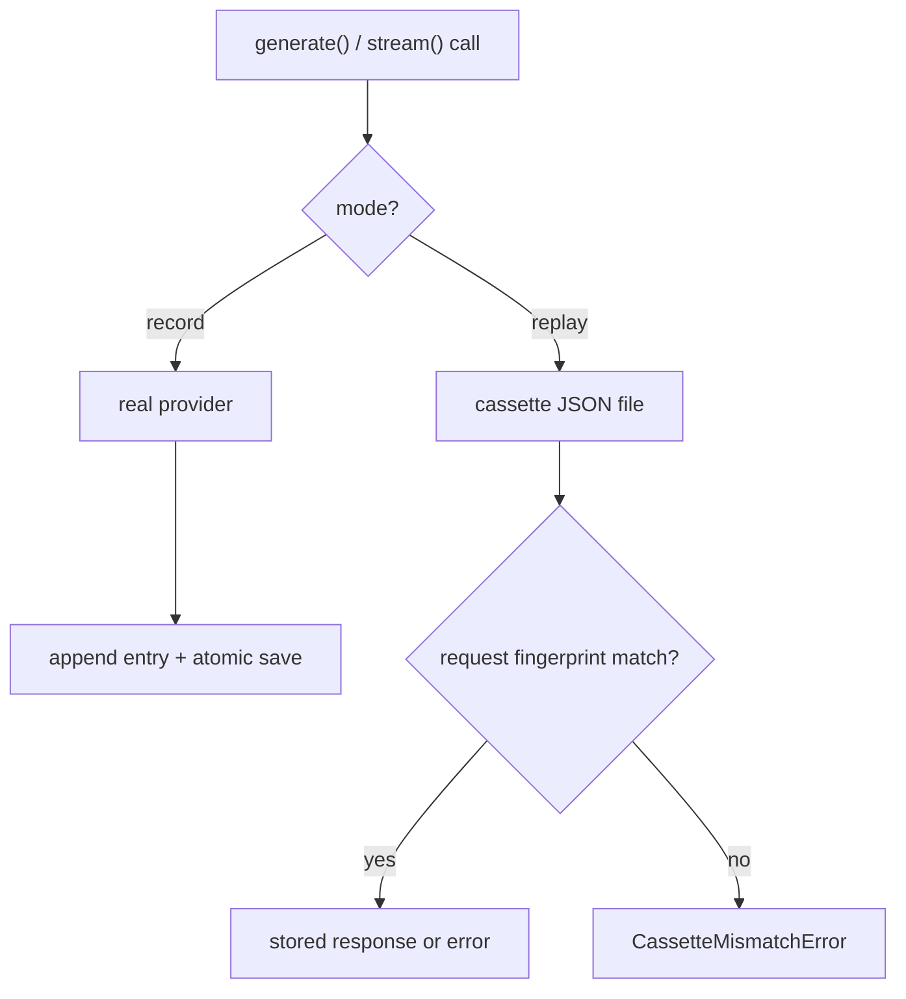

## What this is

`recordReplay()` wraps a real `LLMProvider` the way a VCR wraps a TV signal: the first run goes out to the real model and is taped to a JSON **cassette** file you commit; every later run plays the tape back, with no network and no API key. It is the mechanism behind every `*.replay.test.ts` in the repo and behind `lousho eval --record/--replay/--drift`. Unlike [mockModel](/quality/testing-mock-model), which answers with what you scripted, a cassette answers with what a real model actually said — so replay tests exercise real-shaped responses, tool calls and token counts. Think of it as snapshot testing for network calls: the "snapshot" is reviewed, committed, and diffed on every mismatch.

## The mental model



Five nouns to hold: the **cassette** (the committed JSON file), an **entry** (one recorded request/response pair), the **fingerprint** (a canonical string a request is reduced to for matching), the **mode** (`record`, `replay`, or `auto`), and the **mismatch error** (`CassetteMismatchError`, the loud failure when reality leaves the tape).

## How it works

1. **Resolve the mode at construction.** `'auto'` means replay iff the file exists. In replay the wrapped provider is never constructed — pass a factory or `undefined`, so CI needs neither the API key nor the peer package.
2. **Record path.** Every call is forwarded to the real provider, appended to an in-memory cassette, and the file is rewritten atomically (temp file + rename in `writeCassette`) after *every* call — a test that fails midway still leaves a valid cassette of everything recorded so far; there is no exit hook.
3. **Replay path.** The incoming request is reduced to the same canonical form the recorder stored, then matched. `'sequence'` (default): entry N answers call N and must match. `'request'`: lookup by `stableStringify({kind, request})` fingerprint, for parallel calls. A `normalize(request)` hook can reshape the request before canonicalization — the same sanitizer runs in record and replay — when a test legitimately varies *(inferred use: e.g. a system-prompt section that changes per run)*.
4. **Mismatch fails loudly.** A non-match throws `CassetteMismatchError` (`LOUSHO_CASSETTE_INVALID`) carrying `.cassette`, `.callNumber`, the first differing path (`firstDifference`), and the re-record hint (`RERECORD_HINT`).

## Under the hood

- **Cassette format v1** (`src/testing/cassette.ts`): header `{ version, sdkVersion, recordedAt, provider: { name, defaultModel } }` plus `entries[]` of `{ kind: 'generate'|'stream', request, response? | error? }`. The stored `request` is whitelisted — `model`, `messages` (role, text content, name/toolName/isError, attachment one-liners, tool-call names + JSON-normalized args), `tools` (name, description, canonicalized parameter schema), `temperature`, `maxTokens`. `rawResponse` is deliberately never stored (it carries headers and ids). A `stream` entry additionally stores `chunks` with per-chunk `delayMs` (replayed via `replayTiming`). Provider errors are stored as `{ name, message }` and re-thrown on replay.
- **Loading validates, never trusts.** `readCassette` zod-parses the whole file: missing file, invalid JSON, wrong `version` and malformed entries each get a distinct `LOUSHO_CASSETTE_INVALID` message saying how to fix it (usually "re-record"). `sdkVersion` is stamped at record time by walking up from the module dir to the package's `package.json` — written to work in both build formats (`__dirname` in CJS/vitest, `import.meta.url` in `.mjs`, LOU-R10).
- **Fingerprinting** (`src/testing/fingerprint.ts`): volatile values — timestamps, dates, UUIDs, `call_*/toolu_*/chatcmpl_*` ids — become `<timestamp>`/`<date>`/`<uuid>`/`<id>` placeholders before matching. Zod schemas are canonicalized to a schema fingerprint; zod 4 schemas get the *same* fingerprint zod 3 produces (check kinds remapped), so a cassette recorded under one zod major replays under the other (#333) — which is what keeps the `ai*-zod4` peers jobs green.
- **Secret hygiene.** Before anything is written, every string passes through `SECRETS` patterns (`sk-...`, `sk-ant-...`, `Bearer ...`, `AIza...`, `ghp_/gho_/ghs_/github_pat_`, `AKIA...`) → `[REDACTED]`; the `redact` option adds user patterns on top. Cassettes are meant to be committed and reviewed; `pack-smoke` additionally forbids `__cassettes__/` inside the shipped tarball and scans for secret-looking strings.
- **Capability answers differ by mode.** The `Recorder` delegates `supportsTools`/`supportsStreaming`/`supportsHostedTool`/`getModels` (and `name`/`defaultModel`) to the wrapped provider; the `Player` answers `true` to all three capability checks, takes its `name`/`defaultModel` from the cassette header when no provider was given, and reports `getModels()` as `[defaultModel]` — replay answers with whatever was recorded (N1a).
- **Eval integration.** `lousho eval --record` doesn't call `recordReplay` in test code — `src/evals/cassettes.ts` installs a `setProviderInterceptor()` hook (`src/providers/interception.ts`) so every model call of a case — streamed runs, sub-agents, approval resumes — goes through a per-case wrapper writing `__cassettes__/<eval>/<case>.json`, keyed via `AsyncLocalStorage`.
- **Real usage in repo.** `src/providers/*.replay.test.ts` replay `src/providers/__fixtures__/cassettes/*.json` and `src/__fixtures__/cassettes/`; the matching `*.live.test.ts` re-record them (`LOUSHO_RECORD=1` + `OPENROUTER_API_KEY`).
- **Streamed timing can be replayed.** A `stream` entry stores `chunks` with per-chunk `delayMs`; `replayTiming: true` re-applies those delays on replay so timing-sensitive consumers see realistic pacing — off by default.
- **Abort is honoured before matching.** `Player.take` checks `options.signal?.aborted` and throws the signal's reason before any entry lookup, so a cancelled run fails fast instead of consuming tape.
- **The executor never compacts `CassetteMismatchError`** into a provider error (LOU-R13) — a mismatch always surfaces as a cassette problem, not a model failure.

## In code

| Symbol | File | Role |
| --- | --- | --- |
| `recordReplay(provider \| () => provider \| undefined, options)` | `src/testing/recordReplay.ts` | Wrapper factory; exported from `@lousho/build-ai-agent/testing` |
| `RecordReplayOptions` | `src/testing/recordReplay.ts` | `cassette`, `mode`, `match`, `normalize(request)`, `redact(text)`, `replayTiming` |
| `CassetteMismatchError` | `src/testing/recordReplay.ts` | `LOUSHO_CASSETTE_INVALID`; `.cassette` + `.callNumber` |
| cassette schema + IO | `src/testing/cassette.ts` | v1 schema, zod validation, atomic `writeCassette` |
| `stableStringify`, `SECRETS`, placeholders | `src/testing/fingerprint.ts` | Canonicalization, volatile-value masking, secret redaction |
| `createSanitizer` | `src/testing/fingerprint.ts` | Shared request/response sanitizer used by both record and replay |
| `Recorder` / `Player` | `src/testing/recordReplay.ts` | The two internal providers `recordReplay` returns, one per mode |
| `setProviderInterceptor` | `src/providers/interception.ts` | Seam eval cassettes hook into |
| per-case cassette writer | `src/evals/cassettes.ts` | `__cassettes__/<eval>/<case>.json` via `AsyncLocalStorage` |

## Example

```ts
import { recordReplay } from '@lousho/build-ai-agent/testing';

// Live test file: records when LOUSHO_RECORD=1, replays otherwise.
// resolveProvider is only invoked in record mode.
const provider = recordReplay(() => resolveProvider('openai/gpt-4o-mini'), {
  cassette: 'src/providers/__fixtures__/cassettes/n1b-web-search.json',
  mode: process.env.LOUSHO_RECORD ? 'record' : 'replay',
  redact: (t) => t.replace(/user-\d+/g, 'user-X'),   // extra hygiene on top of built-ins
});

// Replay-only test file (CI): the provider factory is never invoked.
const replay = recordReplay(undefined, { cassette: CASSETTE, mode: 'replay' });
```

The first form is what a `*.live.test.ts` uses: a factory so the real provider is only built when recording, plus a `redact` hook layering a project-specific pattern over the built-in `SECRETS`. The second form is what CI runs: no factory at all — replay can never accidentally hit the network.

## Design decisions

- **Whitelist, don't dump.** Only fields that decide what the model says are fingerprinted and stored; everything else (signals, headers, raw responses) is dropped — smaller diffs, fewer false mismatches, fewer secrets.
- **Match even in sequence mode.** Order alone is not enough: the request must still equal the recording, so a behavioral drift fails loudly instead of silently answering with the wrong response.
- **Atomic write per call.** Costs a file rewrite per call during recording but means a crashed record run still yields a usable cassette. Writes are chained on a promise (`Recorder.save()`), so overlapping calls serialize; `save()` is a no-op in replay and otherwise only needed to force a write when no call was made.
- **Errors are entries.** A recorded provider failure replays as a rejection with the same name/message, keeping retry/fallback tests honest.
- **`match: 'request'` tracks a `used` set.** Each recorded entry serves at most one replayed call, so two identical requests consume two recordings; an aborted `options.signal` is honoured before any lookup.

## Where next

- [mockModel](/quality/testing-mock-model) — when a hand-scripted script beats a recording.
- [Evals](/quality/evals) — `--record`/`--replay`/`--drift` are built on this.
- [api-report + fallow](/quality/api-report-and-fallow) — `pack-smoke` keeps cassettes out of the published tarball.
