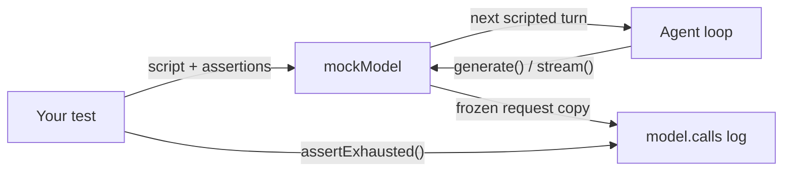

## What this is

`mockModel()` is a fake LLM for tests — a "model double" in the same sense a stunt double stands in for an actor: it implements the real `LLMProvider` interface, but instead of calling an API it answers each call with the next entry in a script you wrote, like an actor reading cue cards. It also records every request it received so the test can assert on them, and it never touches the network. Determinism is the point — no randomness, no clock dependence (except opt-in `delayMs`), so a failing test diffs exactly.

## The mental model



Four nouns to hold: the **script** (the array of `MockTurn`s you pass in), a **turn** (one scripted response — text shorthand, a full object, or a function of the request), the **calls log** (`model.calls`, every request deep-frozen), and **exhaustion** (what happens when calls outnumber scripted turns).

## How it works

`ScriptedMockModel` keeps the script array plus an index into it. Following the diagram, each `generate()` or `stream()` call:

1. **Records the request.** `cloneFrozen` snapshots `GenerateOptions` into `model.calls`: plain objects and arrays are deep-copied and `Object.freeze`n; non-plain values (functions, zod schemas inside tool definitions) are kept by reference because they cannot be structurally cloned.
2. **Draws the next turn** via `script[index++]`. If the script is exhausted it throws a descriptive error naming the call number and the last message (`describeLastMessage`) — unless `onExhausted: 'repeat-last'` replays the final turn forever.
3. **Resolves the turn.** Function turns are awaited (sync or async) so a reply can be built from the frozen request; `delayMs` is honoured; then `turn.error` is thrown if set — that is how tests inject a provider failure mid-run.
4. **Shapes the response.** `toolCalls` become real `ToolCall`s (`{ id: 'call_N', type: 'function', function: { name, arguments: JSON.stringify(args ?? {}) } }`); `hostedToolCalls` become `HostedToolCall`s with `hosted_N` ids sharing the same counter. `finishReason` defaults to `'tool_calls'` when calls exist, else `'stop'`. `usage` maps `{ inputTokens, outputTokens }` to the provider's `promptTokens`/`completionTokens`/`totalTokens` shape and is omitted entirely when not scripted.
5. **Answers assertions afterwards.** The test reads `model.calls` / `model.lastCall` and calls `model.assertExhausted()`.

## Under the hood

- **Streaming mirrors non-streaming.** `stream()` emits the same turn as chunks — `hosted-tool-call` + `hosted-tool-result` pairs first, then word-sized `text-delta`s (split on `/\S+\s*|\s+/g`), then `tool-call`s, then `finish` — so streamed and non-streamed runs behave identically (the M9 invariant the older `MockLLMProvider` also keeps).
- **Missing `usage` is a feature.** When a turn scripts no usage, the mock behaves like a backend that reports none — the executor then estimates and flags `lousho.usage.estimated`, which tests can assert on.
- **`assertExhausted()` throws `LOUSHO_TEST_FAILED`** when scripted turns remain — it catches agents that stopped calling the model earlier than the test expected.
- **`supportsHostedTool()` returns true for everything.** The mock accepts any hosted tool; a turn scripts which calls the "provider" ran via `hostedToolCalls`, reported with `executedBy: 'provider'` and never executed by the agent (N1a).
- **The older `MockLLMProvider` (`src/providers/mock.ts`) still exists** for spec-file/`lousho dev` smoke paths — it cycles canned strings and guesses tool calls by name-matching the last user message. New tests should use `mockModel`; the provider registry registers `mock` centrally via `builtinProviders.ts`, not a module side effect (LOU-R1).

## In code

| Symbol | File | Role |
| --- | --- | --- |
| `mockModel(script, options?)` | `src/testing/mockModel.ts` | Factory; exported from `@lousho/build-ai-agent/testing` (`src/testing/index.ts`) |
| `MockTurn` / `MockStaticTurn` / `MockTurnObject` | `src/testing/mockModel.ts` | Turn forms: string, object (`text`, `toolCalls`, `hostedToolCalls`, `error`, `usage`, `finishReason`, `delayMs`), or `(request: MockRequest) => ...` |
| `ScriptedMockModel` | `src/testing/mockModel.ts` | Implementation; exposes `calls`, `lastCall`, `assertExhausted()`, `reset()` |
| `testToolContext()` | `src/testing/testToolContext.ts` | Minimal `ToolExecutionContext` for calling `tool.execute` directly |
| `hashEmbedder()` | `src/testing/hashEmbedder.ts` | Deterministic offline embeddings |
| `setProviderInterceptor()` | `src/providers/interception.ts` | Interception seam eval cassettes use |
| `MockLLMProvider` | `src/providers/mock.ts` | Older canned-string mock for smoke paths |

## Example

```ts
import { createAgent } from '@lousho/build-ai-agent';
import { mockModel } from '@lousho/build-ai-agent/testing';

// A two-turn script: first turn asks for a tool, second answers with text.
const model = mockModel([
  { toolCalls: [{ name: 'get_weather', args: { city: 'Paris' } }] },
  'It is 21°C in Paris.',
]);

const agent = createAgent({ prompt: '...', provider: model, tools });
await agent.send('Weather in Paris?');

expect(model.calls).toHaveLength(2);   // every request the agent sent, deep-frozen
model.assertExhausted();               // fails if scripted turns were never used

// Error turns and request-aware turns:
const flaky = mockModel([
  (req) => `echo: ${req.messages.at(-1)?.content}`,
  { error: new Error('provider blew up') },
]);
```

The first script drives a multi-turn tool-call sequence: turn one returns a `get_weather` call (so the agent runs the tool and calls the model again), turn two returns plain text. The `flaky` script shows the other two turn forms — a function reading the frozen request, then an inline error that fails the second call.

## Design decisions

- **Requests are deep-frozen snapshots.** A test asserting on `model.calls[0]` cannot be corrupted by the agent mutating its own options afterwards, and the readonly `MockRequest` type (`DeepReadonly<GenerateOptions>`) makes mutation a type error too.
- **Errors are scripted turns, not a mode.** `{ error: new SDKError(...) }` sits inline in the script, so multi-step runs can fail on step 3 after two successful tool calls — much more useful than `MockLLMProvider.simulateError`, which fails every call.
- **Exhaustion defaults to `throw`.** A too-short script is a test bug; `'repeat-last'` is the explicit opt-out for loops with unknown step counts.

## Where next

- [recordReplay: cassettes](/quality/record-replay) — the other half of offline testing: recorded real-model runs.
- [Evals](/quality/evals) — `defineEval` uses `mockModel` as the deterministic provider for trajectory evals.
- [Observability](/quality/observability) — `usage`/cost attributes the mock's scripted `usage` feeds.
