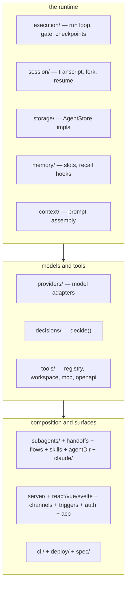

## What this is

The repo is ~450 non-test TypeScript files under `src/`, organised so each subsystem owns a directory. Learning the map first means every later page's "Entry points" table lands somewhere you recognise. Think of it as a building's floor plan — the machinery pages are the room tours.

## The `src/` tree at a glance

Tests sit next to sources: `*.test.ts` units, `*.test-d.ts` type tests, `*.live.test.ts` real-provider runs, `*.replay.test.ts` cassette replays.

## Directory by directory

| Directory | Subsystem | Internals page |
|---|---|---|
| `execution/` | Run loop, events, approvals, hooks, permissions, checkpoints, budgets, code-mode isolate | [the run loop](/core/execution-loop) |
| `session/` | AgentSession, transcript/fork/pending-turn resume | [sessions](/state/sessions) |
| `storage/` | AgentStore contract, file/sqlite stores | [stores](/state/storage-stores) |
| `memory/` | defineMemory slots, remember/recall tools | [memory](/state/memory) |
| `context/` | Prompt assembly, compaction helpers | [context](/state/context-assembly) |
| `providers/` | Provider abstraction, ai-SDK compat, pi, reasoning, mock | [providers](/providers/architecture) |
| `decisions/` | `decide()` — OpenAI Decisions API client | [decisions](/providers/decisions) |
| `tools/` | defineTool, ToolRegistry, built-ins, workspace, hosted, mcp/, openapi/ | [tools](/tools/tool-system) |
| `subagents/` | task tool, background tasks, remote/pi sub-agents | [sub-agents](/compose/subagents) |
| `handoffAgents.ts`, `handoffs.ts` | Conversation transfer | [handoffs](/compose/handoffs) |
| `flows/` | FlowBuilder, FlowExecutor, safeExpression | [flows](/compose/flows) |
| `skills/` | SKILL.md loading | [skills](/compose/skills) |
| `agentDir/` | `loadAgentDir()` — directory-defined agents | [agent directories](/compose/agent-directories) |
| `claude/` | `claudeProject()` — `.claude/` convention loader | [claude projects](/compose/claude-projects) |
| `server/` | routeHandler, fetch/chat routes, SSE, session client | [server](/interfaces/server-and-routes) |
| `react/` `vue/` `svelte/` `ui/` | UI bindings + shared event reducer | [UI bindings](/interfaces/ui-bindings) |
| `channels/` | Slack/Discord/Teams/GitHub/HTTP/webhook inbound | [channels](/interfaces/channels) |
| `triggers/` `schedules/` | Webhook triggers, cron schedules | [triggers](/interfaces/triggers-and-schedules) |
| `acp/` | Agent Client Protocol (editors) | [acp](/interfaces/acp) |
| `auth/` `oauth/` | principal auth, PKCE OAuth + token stores | [auth](/interfaces/auth), [oauth](/interfaces/oauth) |
| `spec/` | agent.yaml / agent.json parsing | [spec files](/ship/spec-files) |
| `cli/` | `lousho` commands | [cli](/ship/cli) |
| `deploy/` | node-server / docker / worker build targets | [build targets](/ship/build-targets) |
| `evals/` `testing/` `traces/` | eval harness, mockModel, OTel | [quality](/quality/testing-mock-model) |
| `utils/` | SDKError, error codes, branding, validators | [errors](/core/errors) |

## The rest of the repo

| Path | Role |
|---|---|
| `src/index.ts` | Root barrel — `@lousho/build-ai-agent` |
| `packages/create-lousho-agent/` | `npm create lousho-agent` template |
| `examples/` | Runnable examples (`npm run example:*`), each with a README + tests |
| `docs/` | User-facing docs (source of truth — synced to lousho.com) |
| `api/*.api.md` | API Extractor reports per subpath export; CI fails on drift |
| `scripts/` | Gate scripts: verify-docs-snippets, generate-llms-txt, api-report, pack-smoke |
| `registry/` | Installable kits (`coding-kit`, `coding-pi`, `inbox-triage`, `incident-response`, …) |
| `apps/agent-forge/` | Agent Forge studio (E2E-tested in CI) |
| `llms.txt` / `llms-full.txt` | Generated doc corpus for LLMs — regenerated by `docs:llms`, checked in CI |

## Subpath exports

`package.json` exports 20 entries: `.` (root barrel), `executor`, `tools`, `flows`, `integrations`, `utils`, `mcp`, `types`, `testing`, `otel`, `hooks`, `sqlite`, `auth`, `kv`, `worker`, `traces`, `triggers`, `react`, `vue`, `svelte`. New public APIs go on the root barrel **or** an existing subpath — check [code conventions](/contribute/code-conventions) before adding one.
