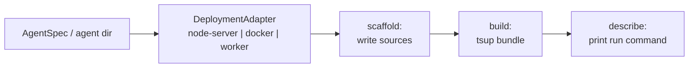

## What this is

`lousho build` turns one agent description into a runnable artifact for one platform. The plug-in that knows how is a **deployment adapter**: an object with three methods — `scaffold` (write source files), `build` (compile them), `describe` (say what to run next). Think of it like a printer driver: same document in, different device-specific output out.

## The mental model

Five nouns: the **input** (an `AgentSpec` file or an agent directory — same thing `lousho dev` loads), the **adapter**, and its three lifecycle steps — **scaffold**, **build**, **describe**.

## How it works

1. `runBuild` calls `registerBuiltInAdapters()` (`src/deploy/index.ts`) — an explicit call, not a module side effect, so bundlers can't tree-shake it away — then `getAdapter(--target)` looks the name up (`node-server`, `cloudflare-worker`, `docker`; `registerAdapter`/`listAdapters` live in `src/deploy/types.ts`).
2. `scaffold(agentPath, outDir)` validates the input up front and writes the target's source files: `agent.config.js` (the validated spec as an ESM export), a generated `server.ts`/`worker.ts` entrypoint, plus `package.json`, `wrangler.toml`, or a `Dockerfile` per target. Output defaults to `.lousho/build/<target>`.
3. `build(outDir)` compiles those sources with tsup (lazy-loaded via `loadTsup()`), inlining everything except the SDK's *optional* peers, which stay lazy `import()`s.
4. `describe(outDir)` returns the run/deploy command printed to stdout — e.g. `docker build -t lousho-agent . && docker run -p 3000:3000 lousho-agent`.

## Under the hood

**The virtual runtime specifier.** Scaffolded `server.ts`/`worker.ts` import `@lousho/build-ai-agent/deploy-runtime` (or `-worker`) — a specifier that exists in no package.json. At build time `sdkRuntimePlugin()` (`src/deploy/bundle.ts`, constants `RUNTIME_SPECIFIER`/`WORKER_RUNTIME_SPECIFIER`) resolves it to `src/deploy/runtime.ts`/`runtime.worker.ts` inside the SDK copy running `lousho build` (`findSdkRoot()` walks up to the `@lousho/build-ai-agent` package.json). The artifact is therefore always bundled against the exact SDK version that generated it, and builds work from any `outDir`, even a temp dir with no `node_modules`. `bundleExternals()` inlines everything except the SDK's optional peers (from `peerDependenciesMeta`, minus `@opentelemetry/api`).

**node-server** (`adapters/node-server.ts`): `scaffold()` validates the spec first (`loadSpec`, `resolveSpecTool` per tool, `specSchedules` for triggers), writes `agent.config.js`, `server.ts` (flag/env parsing, `createDeployedServer`, 127.0.0.1 default with a no-token warning off loopback, SIGINT/SIGTERM → `agent.close()`), and a `package.json` that pins `@lousho/build-ai-agent` to `^<building version>` plus the spec's provider peer at the range matching the build's `ai` major (`deployDependencies()`, `bundledAiMajor`). `build()` emits a single CJS `dist/server.js`, `platform: 'node'`, `target: 'node18'`.

For an **agent directory**, `writeAgentDirPointer` records the source in `agent-dir.json` (how `build()` finds it across the two calls), and `build()` compiles every code file — root `agent`/`auth`/`hooks`/`approve.*` plus `tools/`/`schedules/`/`channels/`/`memory/` and each `subagents/<name>/` recursively, skipping `*.d.*ts`/`*.test.*` — into `dist/agent/` as one ESM build with shared chunks and a `createRequire` banner; `copyAgentDirAssets` copies the rest. The server then runs `resolveAgentDir('dist/agent')` on plain JS — no tsx, no `node_modules`. The runtime (`nodeServer.ts`: `createDeployedAgent`, `createDeployedServer`, `storeFromEnv`) adds `LOUSHO_API_TOKEN` bearer auth (an agent dir's `auth.ts` takes precedence), `LOUSHO_STORE=memory|sqlite:<path>` stores, and the same `/chat` routes as `lousho dev`. `specExecution.ts`'s `prepareSpecExecution` is the platform-free spec→execute-options mapping both runtimes share.

**docker** (`adapters/docker.ts`): `scaffold()` delegates to `NodeServerAdapter.scaffold()` plus a `Dockerfile` (`node:22-slim` — 22 has the `node:sqlite` `LOUSHO_STORE=sqlite:` needs; `npm install --omit=dev`; `ENV HOST=0.0.0.0` because loopback inside a container is unreachable through `-p`; `EXPOSE 3000`; `CMD ["node","dist/server.js"]`) and `.dockerignore`. `build()` reuses the node-server bundle.

**cloudflare-worker** (`adapters/cloudflare.ts`, `cloudflare-dir.ts`): `scaffold()` rejects what Workers can't run before writing anything — `assertProviderSupported` (`WORKER_SUPPORTED_PROVIDERS` = `mock`, `openai`, `anthropic`, `openrouter`; no `ollama`, no `pi`) and `assertToolsSupported` (`WORKER_SUPPORTED_TOOLS` = `current-date`, `day-name`, `http`) — then writes `agent.config.js`, a `worker.ts` whose `fetch`/`scheduled` delegate to `handleWorkerRequest`/`handleWorkerScheduled`, and `wrangler.toml` (DNS-safe `name`, `main = "dist/worker.js"`, pinned `compatibility_date`, `no_bundle`, `[triggers] crons` — UTC only, five fields — plus commented `AGENT_CHECKPOINTS` KV and `LOUSHO_HTTP_ALLOW`/`LOUSHO_API_TOKEN` guidance).

`build()` bundles ESM `platform: 'browser'` with `noExternal: [/.*/]` and a plugin stack:

- `workerSandboxShimPlugin` — `security/sandboxCore` → `shims/sandboxCore.worker.ts` (the real NoopSandbox needs `node:child_process`), `quickjs-emscripten` → `shims/quickjs.worker.ts`.
- `workerNodeShimPlugin` — `node:*` imports of the five `NODE_SHIMMED_IMPORTERS` modules → `shims/node.worker.ts`; a builtin imported anywhere else is left to fail the leak check.
- `sdkRuntimePlugin({ sdkEntry: 'worker' })` — bare `@lousho/build-ai-agent` imports in agent code resolve to `workerSdk.ts`, the Node-free export subset; anything else fails the build with a list of allowed names.
- `workerUnsupportedPeerPlugin` — `ollama-ai-provider*` and `@earendil-works/pi-ai` stay external lazy specifiers (unreachable: scaffold rejects those providers).
- `workerBuiltinImportersPlugin` — records specifier → importer files for builtins nothing else resolved.

Afterwards `findNodeBuiltinReferences()` scans `dist/worker.js` — any remaining `node:` specifier or bare builtin import (outside the `WORKER_SAFE_BUILTIN_PROBE` calls `ai`/`@ai-sdk/provider-utils` make for `module`/`dns`/`diagnostics_channel`/`async_hooks`) fails the build naming the importing file. `measureBundleSize()` warns — doesn't fail — past `WORKER_SIZE_LIMIT_BYTES` (**64 MiB raw**, the post-2026 uncompressed limit; gzip is informational) and `describe()` reports the measured size and verdict.

The Worker runtime (`runtime.worker.ts`) registers the four providers directly (no lazy side effects in a bundle), reads keys from `<TYPE>_API_KEY` bindings, keeps state in the `AGENT_CHECKPOINTS` KV namespace (`workerStore()` → `KVStore`, fail-open to isolate memory; OAuth tokens encrypted with `LOUSHO_TOKEN_KEY`), serves `serveFetch` with `LOUSHO_API_TOKEN` auth, gives `http` a *different* tool (`workerHttp`: `LOUSHO_HTTP_ALLOW` host allowlist — Workers have no DNS pin for the Node tool's SSRF checks), binds `kvMemory()` per request (`kvStore.ts`/`kvCheckpointStore.ts`/`kvTokenStore.ts`/`kv.ts`), and serves agent directories via `handleWorkerAgentDirRequest` (`ctx.waitUntil` for overruns). Agent directories become `agent.module.ts` — static imports plus embedded JSON — because Workers have no fs or dynamic `import()`; `evalModule()` esbuild-bundles a schedule/config file at scaffold time and imports it via `data:` URL.

## In code

| Symbol | File | Role |
| --- | --- | --- |
| `DeploymentAdapter`, `registerAdapter`, `getAdapter` | `src/deploy/types.ts` | The adapter interface + registry |
| `registerBuiltInAdapters` | `src/deploy/index.ts` | Registers the three targets (+ CLI's `stub`) |
| `NodeServerAdapter`, `loadAgentSpecForDeploy`, `deployDependencies` | `src/deploy/adapters/node-server.ts` | Node artifact; helpers the other targets reuse |
| `DockerAdapter` | `src/deploy/adapters/docker.ts` | Node-server + `Dockerfile` |
| `CloudflareWorkerAdapter`, `findNodeBuiltinReferences`, `WORKER_SIZE_LIMIT_BYTES` | `src/deploy/adapters/cloudflare.ts` | Worker artifact + leak check + 64 MiB limit |
| `sdkRuntimePlugin`, `loadTsup`, `bundleExternals` | `src/deploy/bundle.ts` | Virtual runtime specifier + shared bundling |
| `runtime.ts` / `runtime.worker.ts` | `src/deploy/` | The Node / Worker runtimes generated entrypoints bundle |
| `createDeployedAgent`, `createDeployedServer`, `storeFromEnv` | `src/deploy/nodeServer.ts` | Generated Node server's runtime half |
| `workerStore`, `KVStore` | `src/deploy/runtime.worker.ts`, `kvStore.ts` | KV-backed store, fail-open when unbound |
| `prepareSpecExecution` | `src/deploy/specExecution.ts` | Platform-free spec → execute-options mapping |

## Example

`lousho build ./agent --target=cloudflare-worker` narrated: `runBuild` registers adapters and resolves `CloudflareWorkerAdapter`. `scaffold()` checks your spec's provider is in `WORKER_SUPPORTED_PROVIDERS` (an `ollama` spec fails here, naming the supported four), checks every tool against `WORKER_SUPPORTED_TOOLS`, then writes `agent.config.js`, `worker.ts`, and `wrangler.toml` into `.lousho/build/cloudflare-worker`. `build()` runs tsup with the shim plugins, bundles one ESM `dist/worker.js`, scans it for `node:` leaks, and measures it against the 64 MiB limit — a 70 MiB bundle prints a warning, not an error. `describe()` prints the verdict plus the `wrangler deploy` hint.

For a real end-to-end ship, `examples/hostinger-deploy/deploy.mjs` does: verify the VM via the Hostinger API → `lousho build agent/ --target=docker` → `tar`/`scp` the context → remote `docker build` + `docker run -d -p 3000:3000 -e OPENROUTER_API_KEY -e LOUSHO_API_TOKEN -e LOUSHO_STORE=sqlite:/data/lousho.db -v lousho-data:/data` → poll `/health`, then one bearer-authed `POST /chat` round-trip. The sqlite volume makes sessions and paused approvals survive container restarts; destructive ops (`--recreate`) are deliberately absent — provisioning belongs to the Hostinger API.

## Design decisions

- **Scaffold → build → describe, not one step.** Scaffold writes inspectable source-of-truth files; build is pure compilation; describe prints the next command. A test `stub` adapter asserts the order.
- **The spec is the deploy source.** Resolution is shared with `lousho dev` — `specToAgent` on Node, `workerResolvers`/`workerAgent` mirroring it with platform-safe substitutes — so what dev served is what ships.
- **Pin to the building SDK, not a range** — the virtual runtime specifier makes a build reproducible even from an unpublished checkout.
- **Fail at build time, not first request** — tool/provider/cron/KV problems are scaffold errors; Node-builtin leaks fail `build()` naming the importing file.
- **The manifest of limits is honest** — the Worker `http` tool is fail-closed (`LOUSHO_HTTP_ALLOW` or nothing) precisely because the Node tool's pinned-`lookup` SSRF defense has no Worker equivalent.
- **Docker reuses node-server wholesale** — only the `Dockerfile` differs.
- **Worker state is opt-in and fail-open** — without `AGENT_CHECKPOINTS` the Worker runs on per-isolate memory (`isKVBinding` checks the binding structurally; a misconfigured binding counts as absent), and `kvMemory()` providers are symbol-marked for late binding because `env` only exists per request.
- **Build errors are translated, not raw** — `explainWorkerBuildError` names the unsupported import, and `workerBuiltinImportersPlugin` feeds the leak check the importing file so the error says *who* pulled `node:fs` in.

## Where next

- [The lousho CLI](/ship/cli) — how `runBuild` dispatches to the adapter registry.
- [Spec files](/ship/spec-files) — the `AgentSpec` these adapters compile.
- [Agent directories](/compose/agent-directories) — the richer deploy source (tools, schedules, channels, sub-agents).
- [Server and routes](/interfaces/server-and-routes) — `serveFetch`/`handleChatRequest`, shared by `dev`, `nodeServer`, and the Worker.
