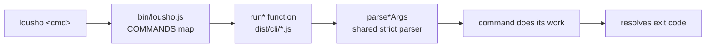

## What this is

`lousho` is the SDK's command-line tool — the one binary behind `lousho dev`, `lousho build`, `lousho doctor`, and friends. Think of it as a receptionist: it doesn't do the work itself, it reads the command name, walks the request to the right room, and reports back how it went (the exit code).

## The mental model

Four nouns to hold: the **dispatcher** (`bin/lousho.js`, a thin CommonJS file), the **run functions** (`runDev`, `runBuild`, …), the **shared parser** (`src/cli/args.ts`), and the **exit code** every run function resolves.

## How it works

1. `bin/lousho.js` reads `process.argv` and looks the command up in `COMMANDS` — a `Map` of `init`, `dev`, `chat`, `acp`, `add`, `build`, `studio`, `mcp`, `doctor`, `eval`, `traces`, plus `help`/`-h`/`--help`. An unknown or missing command prints `USAGE` to stderr and exits 1.
2. The map's handler lazy-`require()`s exactly one bundled file — e.g. `require('../dist/cli/build.js')` — so `lousho doctor` never pays for `dev`'s imports.
3. That file's `run*(rest, io?)` first calls its own `parse*Args`, which delegates to `parseCommand(spec, args)` in `src/cli/args.ts`: `node:util` `parseArgs` in strict mode, so every flag mistake looks the same.
4. The run function does the command's real work (below), catches errors, prints them in the command's own voice, and **resolves with a number** — `bin` assigns it to `process.exitCode`. No command calls `process.exit()` itself, which is why every command is unit-testable in-process with injected IO (`EvalDeps`, `AddIo`, `ChatIo`, `InitEnvironment`).

## Under the hood

**The parser** (`src/cli/args.ts`): `--flag value` and `--flag=value` both work; `multiple: true` flags accumulate; `--` ends flag parsing; `-h`/`--help` is added to every command and short-circuits validation (a `help: true` result, not a side effect). A value starting with `-` needs the `=` form (`--model=-x`). `usageError()` throws `SDKError` code `LOUSHO_CONFIG_INVALID` with the usage line as the `hint`. `takeOptionalValueFlag()` exists for `--traces[=dir]` — the one flag whose value only binds via `=`, so `--traces agent.yaml` stays flag + positional path. `portValue()` validates 0–65535.

**What each command does** (each lives in `src/cli/<name>.ts` and follows the same `USAGE` string + `CommandSpec` + `parse*Args` + `run*` shape):

- **`dev`** (`dev.ts` + `devReload.ts`): `detectTarget()` classifies the positional path — directory → agent dir, `.yaml`/`.yml`/`.json` → spec file, `.ts`/`.js` → module export. `startReloader()` loads it, watches its sources, and hot-swaps a rebuilt agent into a mutable `DevState` holder; a failed reload is logged and surfaced in the UI while the last good agent keeps serving. `startDevServer()` binds `127.0.0.1:3737` by default (`--host` opts into LAN), pre-flights `EADDRINUSE`, and routes `GET /health`, `GET /dev/status`, `GET /` (the `dev-ui` chat UI), channel mounts, and `/chat` — the same `handleChatRequest`/`serveFetch` routes the deployed server uses (`src/server/chatRoutes.ts`, `fetchRoutes.ts`). `--traces[=dir]` injects a `fileTraceExporter`; `--no-schedules` skips `startSchedules`. Module targets get extra handling: `loadModuleAgent` imports with a `?t=` cache-busting query so reloads see new code; the default/`agent` export may be a built `SimpleAgent` (`isSimpleAgent` checks `send`+`close`) or a `createAgent()` config (`isAgentConfig` checks `instructions`/`prompt`); `createAgentConfigOf` remembers a prebuilt agent's config so `--traces` can still reach it via rebuild; `storeOwners` (a `WeakSet`) keeps `dev`'s shared session store from doubling up.
- **`chat` / `acp`**: `buildAgent()` (exported from `chat.ts`, shared by `acp`) reuses `detectTarget`/`loadTarget`; `--model provider/model` rewires a spec's provider or overrides a dir/module agent's model. `chat` runs `runChatRepl` — streams each turn's events, handles approvals/questions/sign-ins inline, and runs slash commands (`/new`, `/compact`, `/clear`, `/model`, `/history`, `/quit`); `--session` resumes an id, `--store sqlite:<file>` lazily imports `SqliteStore`, `--traces[=dir]` attaches a `fileTraceExporter`. `acp` serves `serveAcp` on stdio — stdout carries only protocol frames, everything else goes to stderr.
- **`build`**: registers the built-in adapters plus a `stub` test adapter, then drives `getAdapter(--target)` through `scaffold() → build() → describe()`; output defaults to `.lousho/build/<target>`. See [build targets](/ship/build-targets).
- **`eval`** (`eval.ts` + `evalReport.ts`): resolves the *project's* vitest via `createRequire(cwd).resolve('vitest/package.json')` (exit 2 with the install line when absent), writes a generated `vitest.eval.config.mjs` plus an empty `results.jsonl` into a fresh `os.tmpdir()` dir, and spawns `vitest run` with `VITEST_*` vars scrubbed and `RESULTS_ENV`/`TAGS_ENV`/cassette/`REMOTE_URL_ENV` injected. Results come back over the JSONL file (not a custom reporter — see `src/evals/recorder.ts`), then `renderTable`, `renderDriftTable`, `renderJunit` (`--junit`), `renderJson` (`--json`). Exit: 0 pass, 1 gate failure (or `--strict` soft failure, or vitest itself failing), 2 cannot run. `--record`/`--replay`/`--drift` are mutually exclusive (`LOUSHO_CONFIG_INVALID`) and incompatible with `--url` (`LOUSHO_CONFIG_CONFLICTING_OPTIONS`); under `CI`, cassette mode defaults to `auto`. `--judge` flips include globs to `*.judge.eval.*` and sets `LOUSHO_ALLOW_LLM_JUDGE=1`; `--url <base> [--token]` reroutes cases at a deployed agent (token defaults to `LOUSHO_EVAL_TOKEN`, never printed); `--config` substitutes the user's vitest config.
- **`doctor`** (`doctor.ts` + `doctorCore.ts` + `doctorChecks.ts` + `doctorSpec.ts`): `buildEnvironment()` injects the real `DoctorEnvironment` (process.versions, env, `createRequire`-based package resolution — `resolveVersion` walks up to the manifest *named* the package because exports maps can land on a nested package.json, `fetch`, `commandExists` scanning `PATH`/`PATHEXT`, a 2 s `dockerode` ping). `runDoctor()` is pure over that: Node `engines`, required peers (`ai`, `zod`), optional provider/feature peers paired to the installed `ai` major, provider env vars (reports set/not-set — never values), the default provider via `modelFromEnv`, Ollama reachability, Docker when the spec uses a sandboxed tool, and spec checks via `inspectSpec`. `--json` renders machine-readable; `renderReport` colors on TTY unless `NO_COLOR`; exit 1 if any check fails.
- **`mcp`**: `loadSpec` → `specToAgent` → `serveMcp` on stdio (default, stdout is protocol-only) or `--http --port 3920`.
- **`add`**: registry install — index/item loading, manifest print, code-vs-manifest check, safe writes, receipt. See [registry and kits](/ship/registry-kits).
- **`init`**: the scaffolder. See [create-lousho-agent](/ship/create-lousho-agent).
- **`studio`**: `resolveAgentForgeDir` locates `apps/agent-forge`, then `startStudio` auto-detects prod (prebuilt `dist-server`, one process for API + UI) vs dev (`tsx` server + Vite HMR, monorepo only); `--prod`/`--dev` force. Child processes deliberately — Agent Forge is a separate workspace package.
- **`traces`**: reads only the `fileTraceExporter()` output dir via `findTraces`/`listTraces`/`readTrace` — lists runs newest-first, `lousho traces <id|prefix>` prints one as a span tree (`--content`, `--json`). Imports `src/traces/` only, never the run loop.

## In code

| Symbol | File | Role |
| --- | --- | --- |
| `COMMANDS`, `USAGE` | `bin/lousho.js` | Name → lazy `run*` dispatcher; unknown → exit 1 |
| `parseCommand`, `usageError`, `takeOptionalValueFlag`, `portValue` | `src/cli/args.ts` | The strict shared parser every `parse*Args` uses |
| `runDev`, `detectTarget`, `startReloader`, `startDevServer` | `src/cli/dev.ts`, `devReload.ts` | Hot-reload dev server |
| `runChat`, `buildAgent`, `runChatRepl` | `src/cli/chat.ts`, `chatRepl.ts` | Terminal REPL; `buildAgent` shared with `acp` |
| `runAcp` | `src/cli/acp.ts` | Agent Client Protocol on stdio |
| `runBuild` | `src/cli/build.ts` | Drives the adapter lifecycle |
| `runEval`, `renderTable`/`renderJunit`/`renderJson` | `src/cli/eval.ts`, `evalReport.ts` | Spawns the project's vitest, renders verdicts |
| `runDoctorCommand`, `buildEnvironment`, `runDoctor` | `src/cli/doctor.ts`, `doctorCore.ts` | Environment + spec checks over an injected env |
| `runAdd` | `src/cli/add.ts` | Registry install pipeline |
| `runInit` | `src/cli/init.ts` | Project scaffolder |
| `runMcp`, `runStudio`, `runTraces` | `mcp.ts`, `studio.ts`, `traces.ts` | Serve over MCP; launch Agent Forge; inspect traces |
| `handleChatRequest`, `serveFetch` | `src/server/chatRoutes.ts`, `fetchRoutes.ts` | The `/chat` seam `dev`, `mcp`, and deployed servers share |

## Example

`lousho build ./agent --target=docker` flows end to end:

1. `bin/lousho.js` → `COMMANDS.get('build')` → lazy `require('../dist/cli/build.js')` → `runBuild(rest)`.
2. `parseBuildArgs` — positional `./agent` becomes the agent path; `--target=docker` binds via `=`.
3. `getAdapter('docker')` — `DockerAdapter`, registered by `registerBuiltInAdapters()` at module load alongside the `stub` test adapter.
4. `driveAdapter` → `scaffold(agentDir, '.lousho/build/docker')` → `build(outDir)` → `describe()` printed on stdout: `docker build -t lousho-agent . && docker run -p 3000:3000 lousho-agent`. Exit 0; any thrown error prints `Error: <message>` on stderr and exits 1.

The same skeleton — `parse*Args` → `run*` → exit code — is the shape of every command; learn one and you've learned the CLI.

## Design decisions

- **Lazy `require()` per command** keeps `lousho` startup cheap; each `dist/cli/*.js` is a self-contained bundled entry.
- **Exit codes, not `process.exit()`** — `run*` resolves the code and `bin` assigns `process.exitCode`, so tests call commands in-process.
- **One parser, one error style** — every flag mistake is `LOUSHO_CONFIG_INVALID` with the usage as the hint. `init` is the deliberate exception (`InitUsageError`, plain message) because its prompts make usage-hints noise.
- **vitest is the user's dependency** — `eval` never bundles a runner; it resolves vitest from the project so eval files compile against the project's own toolchain.
- **Localhost by default** — `dev`, `mcp --http`, and the generated server all bind `127.0.0.1` unless a host is explicit.
- **Commands own their USAGE string** — it lives next to each `CommandSpec`, so flag docs and parse errors can't drift apart.
- **Doc comments name their tickets** — command module headers carry LOU-* references (LOU-H6 dev, LOU-D8 eval, LOU-I1 build, LOU-D50 add, LOU-Z6 acp, LOU-D3 init); `src/cli/__fixtures__/` holds the trees the command tests run against.

## Where next

- [Build targets](/ship/build-targets) — what `lousho build` produces per target.
- [Spec files](/ship/spec-files) — the `AgentSpec` format `dev`/`chat`/`mcp`/`doctor`/`build` all load.
- [Registry and kits](/ship/registry-kits) — `lousho add`'s install pipeline.
- [create-lousho-agent](/ship/create-lousho-agent) — `init` and the npm-create wrapper.
- [Evals](/quality/evals) — what `*.eval.ts` files look like on the other side of `lousho eval`.
- [Observability](/quality/observability) — `fileTraceExporter()`, whose files `lousho traces` reads.
