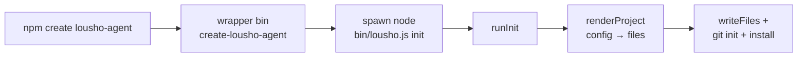

## What this is

`npm create lousho-agent` is `lousho init`. There is exactly one generator — `src/cli/init.ts` inside the SDK — and the published `create-lousho-agent` package is a thin wrapper that spawns the installed SDK's `lousho` binary with `init` prepended. Think of the wrapper as a door that exists only because npm's `create` convention requires a package named `create-*`; the room behind it is the same either way, so the scaffolder and the SDK it scaffolds against always ship on the same version line.

## The mental model



Five nouns: the **npm convention**, the **wrapper package**, the **spawned `lousho init`**, the **renderer** (`renderProject`), and the **finisher** (write/git/install).

## How it works

1. `packages/create-lousho-agent/bin/cli.js` calls `main(process.argv.slice(2))` and propagates the exit code. `loushoBin()` (`packages/create-lousho-agent/src/index.ts`) resolves `@lousho/build-ai-agent`'s `.` export via `require.resolve` — the exports map hides package.json, but `bin/` is a sibling of `dist/` — and finds `bin/lousho.js`.
2. `main(argv)` spawns `node <lousho.js> init <argv>` with `stdio: 'inherit'` and resolves to its exit code. The package ships only `dist` + `bin`; deps are the SDK plus `prompts`.
3. `runInit` (`src/cli/init.ts`) calls `parseInitArgs` (`init/options.ts` — its own `parseArgs` and `InitUsageError`, deliberately not `LOUSHO_CONFIG_INVALID`), then `validateFlags` (`expectOneOf` against provider/`TEMPLATES`/`PACKAGE_MANAGERS` allowlists).
4. `resolveChoices` fills what flags didn't say, in order: flags win; then interactive prompts — `askMissing` (`init/prompts.ts`) loads the `prompts` package through `loadOptionalPeer`, only when stdin *and* stdout are TTYs and `--yes` is absent, asking just the questions left open, pre-selected with the defaults and `TEMPLATE_HINTS`; then defaults (`my-agent`, `detectProviderFromEnv` or `openai`, `minimal`; package manager via `npm_config_user_agent`).
5. `assertWritable` (`init/scaffold.ts`) refuses a non-empty dir (`InitUsageError` unless `--force`); `resolveSdkDependency` (`init/sdkDependency.ts`) computes the SDK dependency (below).
6. `renderProject` (`init/templates.ts`) — a pure `ProjectConfig → Record<path, contents>` — produces every file; `writeFiles` writes them.
7. `finish()` runs `git init` then `<pm> install`, both non-fatal: a `git init` failure prints a warning; an install failure prints `INSTALL_FAILED_HINT` pointing at `--sdk-path`; only a failed install changes the exit code to 1.
8. `nextSteps` prints what to do now: `cd`, `cp .env.example .env`, `<pm> run dev`.

## Under the hood

**What the template renders** (`templates.ts`). Every template shares a base set: `package.json` (`packageNameFor` slugs the dir's base name, `type: module`, `engines.node >=22.19.0`, scripts `dev`/`test`/`typecheck`/`doctor`), `tsconfig.json` (strict NodeNext), `.gitignore`, `.env.example` (the chosen provider's `envKey` — `envForInfoOnly` providers like `pi` get a "credential of the nested provider" hint instead of "API key"), `README.md` (the "next 3 commands"), and an offline `src/agent.test.ts`.

Then per template:

- `minimal` — `src/agent.ts` (`createAgent({ model: '<provider>/<defaultModel>', instructions, tools })` with a `current_time` example tool, wrapped in `buildAgent(provider?)` so tests can inject `mockModel`) + `src/index.ts` (a readline chat loop); `dev` runs `tsx --env-file-if-exists=.env src/index.ts`.
- `tools` — same, plus `roll_die` and `word_count` tools (`EXTRA_TOOLS`).
- `yaml` — `agent.yaml` (an `AgentSpec` with `current-date`) + a spec-loading test (`loadSpec` offline); `dev`/`doctor` run `lousho dev agent.yaml` / `lousho doctor agent.yaml` instead.

Dependencies are computed, not fixed. The generated `package.json` gets `@lousho/build-ai-agent` (see pinning below), `zod` narrowed to the major the scaffolded provider peer accepts, and `ai` + exactly the chosen provider's package at the range pairing with `SCAFFOLD_AI_MAJOR` (currently 7 for openai/anthropic/openrouter/ollama/pi — the `providerSpec` matrix keeps `ai` major ↔ provider package consistent).

**Version pinning.** Two levels.

First, the `create-lousho-agent` package itself declares `@lousho/build-ai-agent: ^<version>` in lockstep (`scripts/sync-version.mjs` sets both the `VERSION` export and the scaffold pin across releases), so `npm create lousho-agent@x` installs a matched pair.

Second, `resolveSdkDependency(sdk.version, dir, sdkPath)` — `sdk.version` read from the SDK's own `package.json` two levels up (`readSdkManifest`) — writes `^<sdk.version>` into the generated `package.json`: caret-of-the-generating-version, so a scaffold from an unpublished dev version resolves to the nearest published release (the same convention `deployDependencies` uses for `lousho build` output).

`--sdk-path`/`LOUSHO_SDK_PATH` switches to local development: a checkout dir is `npm pack`ed into the project (`vendorSdk`/`packSdk`), a `.tgz` is copied verbatim, and the dependency becomes `file:./<tarball>` — anything else is a `ConfigurationError`.

## In code

| Symbol | File | Role |
| --- | --- | --- |
| `main`, `loushoBin` | `packages/create-lousho-agent/src/index.ts` | Wrapper: find the SDK's bin, spawn `init` |
| bin shim | `packages/create-lousho-agent/bin/cli.js` | `main(argv)` + exit-code propagation |
| `runInit`, `resolveChoices`, `finish` | `src/cli/init.ts` | The real generator |
| `parseInitArgs`, `TEMPLATES`, `PACKAGE_MANAGERS`, `PROVIDER_NAMES`, `detectPackageManager` | `src/cli/init/options.ts` | Flags + allowlists (`InitUsageError`) |
| `askMissing`, `TEMPLATE_HINTS` | `src/cli/init/prompts.ts` | Interactive prompts via lazy `prompts` |
| `assertWritable`, `packageNameFor`, `writeFiles` | `src/cli/init/scaffold.ts` | Dir safety + file writes |
| `resolveSdkDependency`, `vendorSdk` | `src/cli/init/sdkDependency.ts` | `^version` vs `file:./<tarball>` |
| `renderProject`, `SCAFFOLD_AI_MAJOR`, `providerSpec` | `src/cli/init/templates.ts` | Pure config → file map (snapshot-tested) |

## Example

```bash
npm create lousho-agent my-agent -- --provider openrouter --template tools --yes
```

Narrated: npm runs the `create-lousho-agent` bin; `loushoBin()` resolves the SDK's `bin/lousho.js` and spawns `node bin/lousho.js init my-agent --provider openrouter --template tools --yes`. `runInit` parses the flags, skips prompts entirely (`--yes`), defaults the dir to `my-agent` and detects the package manager, then `renderProject` produces `package.json`, `tsconfig.json`, `.gitignore`, `.env.example`, `README.md`, `src/agent.ts`, `src/index.ts`, `src/agent.test.ts` — with `@lousho/build-ai-agent` pinned `^<sdk.version>` plus `ai`, `@ai-sdk/openai`, and `zod` at the pairing ranges. Finally `git init` + `npm install` run best-effort, and next steps print (`cd`, `cp .env.example .env`, `npm run dev`).

For an SDK checkout instead of the published package: `lousho init my-agent --sdk-path ../agent-sdk` runs `npm pack` in the checkout, drops the `.tgz` next to the new `package.json`, and writes `"@lousho/build-ai-agent": "file:./lousho-build-ai-agent-<version>.tgz"`.

## Design decisions

- **One generator, two front doors.** The logic lives in the SDK so `lousho init` and `npm create lousho-agent` can never drift; the wrapper exists only because npm's `create` convention needs a `create-*` package.
- **Templates are pure functions** — `renderProject` maps `ProjectConfig` to strings, so every provider × template combination is snapshot-tested (`init/__snapshots__/templates.test.ts.snap`) rather than exercised end-to-end.
- **Everything after `writeFiles` is best-effort** — `git init` and `install` failures print hints and continue; the scaffolded files are the product, not the side effects.
- **Non-interactive is a first-class path** — `--yes` + flags produces a deterministic scaffold for CI; prompts only fill what flags left out.
- **`init` opts out of the shared CLI parser** — it throws `InitUsageError` (plain message, exit 1) rather than `LOUSHO_CONFIG_INVALID`, a documented exception in the CLI's otherwise uniform error style.
- **The environment is injectable** — `InitEnvironment` (env, cwd, `interactive`, `sdk` manifest, `exec`) is a parameter with `realInitEnvironment()` as the default, so `init.test.ts` drives the whole flow without touching disk or spawning processes.

## Where next

- [The lousho CLI](/ship/cli) — `init`'s place in command dispatch (and its parser exception).
- [Spec files](/ship/spec-files) — what the `yaml` template's `agent.yaml` is.
- [Providers](/providers/architecture) — the `SCAFFOLD_AI_MAJOR` pairing and `detectProviderFromEnv`.
- [Build targets](/ship/build-targets) — where a scaffolded project goes next (`lousho build`).
