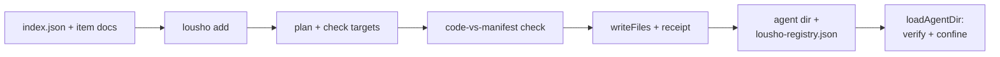

## What this is

A **registry** is a plain static JSON catalog — an `index.json` plus one document per item carrying the item's files inline. `lousho add <name>` copies those files into your agent directory as *source you now own*: nothing from a registry is executed or imported during install. Think of it like copying a recipe into your own cookbook, with a **receipt** (`lousho-registry.json`) stapled in so the SDK can later tell whether the page was edited. A `kit` item is a whole agent directory in one item, which is how `coding-kit`, `coding-pi`, `inbox-triage`, and `incident-response` ship complete harnesses under one permission manifest.

## The mental model



Six nouns: the **registry**, the **installer** (`runAdd`), the **manifest check**, the **safe writes**, the **receipt**, and the **runtime enforcement**.

## How it works

1. `runAdd` (`src/cli/add.ts`) parses args, resolves the registry (`registrySource()` in `src/cli/registry.ts`: `--registry` → `LOUSHO_REGISTRY` → `DEFAULT_REGISTRY` = `https://registry.lousho.com/index.json`; `'none'` disables), and calls `loadIndex`. `--list` prints and exits; `loadItem` fetches one item document (a miss is `LOUSHO_REGISTRY_ITEM_NOT_FOUND` with a `closestMatch` did-you-mean).
2. `install()` runs `planFiles` (`src/cli/addWrite.ts`) — every file path must be normalized, relative, free of NUL/`\\`/drive/`..`/`.`, and inside the folder its type owns (`tools/`/`channels/`/`schedules/`/`memory/`/`skills/<name>/`; a `kit` has no folder constraint). Caps: 256 KB per file, 1 MB per item.
3. `checkTargets` `realpath`s the agent dir and `realAncestor`s each target — a symlink escaping the dir is `LOUSHO_REGISTRY_UNSAFE_PATH`, symlink targets are refused, and existing files need `--overwrite` (`LOUSHO_REGISTRY_FILE_EXISTS`).
4. The manifest prints (elevated permissions marked `[elevated: ...]`), plus the planned files and `dependencies` as an `npm install` line — deps are *printed*, never installed.
5. `enforceManifest` runs `checkItem` (`src/cli/addCheck.ts`): a small hand-rolled lexer scans every JS/TS file (comments and string/template/regex text blanked, literals kept) and compares what the code visibly reaches for against the manifest — the details below. `refuse` findings abort with `LOUSHO_REGISTRY_MANIFEST_MISMATCH`.
6. `--dry-run` stops here. `--yes` runs `enforceAllow` — each elevated permission the manifest asks (`exec: true`, `filesystem: "write"`, any `network`, any `env`) must appear in `--allow`. Without `--yes`, an interactive TTY gets a `[y/N]` prompt (non-TTY stdin is a usage error).
7. `writeFiles`, then `writeReceipt` (`src/cli/addReceipt.ts`) records `{ v: 1, items: { <name>: { type, registry, installedAt, permissions, files: [{ path, sha256 }] } } }` in `lousho-registry.json`, sorted-key JSON.
8. At runtime, `loadAgentDir` (`src/agentDir/loadAgentDir.ts`) wires in `registryEnforce.ts`. `verifyReceipt` re-hashes every receipt file — changed or missing files mark the item `unattested` (a printed warning per item; the load is *not* refused — the files are the owner's to edit).
9. `confineToolsToReceipt` wraps each receipt-owned tool so calls stay inside the last accepted manifest regardless of attestation — the details below.

## Under the hood

**The format.** Index: `{ items: [{ name, type, description, url | path }] }` — `type` ∈ `tool | skill | channel | schedule | memory | kit`; a relative `url`/`path` resolves against the index's own location.

Item: `{ name, type, description, files: [{ path, content }], permissions, dependencies? }` where `permissions` declares `network` (host patterns — hostname or `*.` wildcard, no scheme/port/path), `env` (variable names `A-Z0-9_`), `filesystem: none|read|write`, `exec: boolean`, `needsApproval: boolean`. Reads are bounded: 15 s fetch timeout, 2 MB document cap; an item's declared `name`/`type` must match the index entry. Schemas live as `IndexSchema`/`ItemSchema` in `registry.ts`.

**The static check** (`checkItem`): `child_process`/`execa`/`shelljs`/`createShellTool`/`SubprocessSandbox` needs `exec`; fs imports/`createFsTools` need `filesystem`; file-writing calls need `"write"`; `fetch(`/net modules need non-empty `network`; every literal `http(s)://` host must match a `network` entry; every `process.env.NAME` must be in `env`. `eval(`, `new Function(`, computed `process.env[...]`, and non-literal `import()`/`require()` are always refused. `refuse` findings abort; `note`s are printed.

**Runtime confinement** (`registryEnforce.ts`) — the envelope never widens on a stale receipt:

- `exec`/`needsApproval` manifests — and *any* unattested item — get `enforcedApproval`: every call asks (a tool's own `deny` still denies).
- `network`: an `AsyncLocalStorage` envelope plus a one-time patch of `globalThis.fetch` limits fetches during the tool's `execute`/`sandboxExecute` to the declared hosts (async-generator bodies are confined per `next()`).
- `env`: `process.env` becomes a `Proxy` showing only the declared names inside a confined call (Windows-insensitive).
- `requiresSandbox` tools get a narrowed adapter: `run()` refused without `exec`, `writeFile()` without `filesystem: "write"`, command env = non-secret base + declared vars only.

Honest limits: the guards intercept `fetch` and `process.env`, not `http`/`net`/`axios`, the filesystem, or module-scope captures — a manifest is not a sandbox, which is why the static check exists alongside it.

`lousho add <name> --overwrite` re-attests the current files after an intentional edit.

## In code

| Symbol | File | Role |
| --- | --- | --- |
| `IndexSchema`, `ItemSchema`, `registrySource`, `loadIndex`, `loadItem` | `src/cli/registry.ts` | Registry format + fetching (`ELEVATED` lives in `add.ts`) |
| `runAdd`, `install`, `enforceAllow` | `src/cli/add.ts` | The install pipeline and `--allow` grant logic |
| `planFiles`, `checkTargets`, `writeFiles` | `src/cli/addWrite.ts` | Safe-path validation and writes |
| `checkItem` | `src/cli/addCheck.ts` | Install-time code-vs-manifest static check |
| `RECEIPT_FILE`, `readReceipt`, `writeReceipt` | `src/cli/addReceipt.ts` | `lousho-registry.json` bookkeeping |
| `verifyReceipt`, `registryWarnings`, `confineToolsToReceipt` | `src/agentDir/registryEnforce.ts` | Runtime attestation + ALS confinement |
| `loadAgentDir` | `src/agentDir/loadAgentDir.ts` | Where enforcement is wired in |
| `build-registry.ts` | `scripts/` | Builds `registry/dist/`; `--check` fails on staleness |

## Example

```bash
lousho add coding-kit --dir ./my-agent --yes --allow exec,fs-write
```

Narrated: `loadIndex` fetches the default registry's index and finds `coding-kit` (type `kit`); `loadItem` fetches its document — files for `tools/`, `skills/`, `subagents/`, `instructions.md`, `agent.json`, and a manifest `{ exec: true, filesystem: "write" }`. `planFiles`/`checkTargets` prove every path lands safely inside `./my-agent`; the manifest prints with `[elevated: exec, fs-write]`; `checkItem` scans the code and confirms nothing reaches past the manifest. Because `--yes` was given, `enforceAllow` checks that `exec,fs-write` covers the elevated asks — it does — so `writeFiles` copies the files and `writeReceipt` records their sha256s.

Later, `lousho dev ./my-agent` calls `loadAgentDir`: `verifyReceipt` re-hashes the files and `confineToolsToReceipt` wraps the kit's tools. Edit an installed file and the item goes `unattested` — you get a printed warning and its tools always ask before running.

## Design decisions

- **Copy-in, not plugin loading.** Installed code is the user's source to read, edit, and own; the receipt + enforcement exists so edits are *visible* (unattested → always-ask) rather than silently privileged.
- **`--allow` grants are per-permission, per-invocation.** `--yes` alone never grants `exec`/`fs-write`/`network`/`env` — CI must name what it accepts, making the grant auditable in the command line.
- **Kit = one manifest for a whole directory.** Kits inherit the same enforcement as single tools: `coding-kit` (`exec`, `fs-write`) installs with `--allow exec,fs-write`; `coding-pi` adds `network api.openrouter.ai` + `env OPENROUTER_API_KEY`; `inbox-triage`/`incident-response` take `fs-write` + `env` lists.
- **Registry build validates like the CLI** — `build-registry.ts` runs `planFiles` path rules and `checkItem` on every item, so a `refuse` finding fails the registry build before it can fail a user's install. Output is deterministic (sorted, LF) for `--check`.

## Where next

- [Agent directories](/compose/agent-directories) — what a kit's files become once installed.
- [The lousho CLI](/ship/cli) — `runAdd`'s place in command dispatch.
- [Approvals](/core/approvals) — the `enforcedApproval` gate confined tools sit behind.
- [Tool system](/tools/tool-system) — `DefinedTool.execute`/`sandboxExecute`/`needsApproval`, the seams enforcement wraps.
