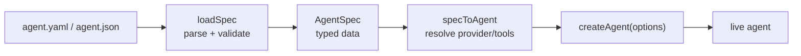

## What this is

An `AgentSpec` is a declarative, data-only way to describe an agent — `name`, `prompt`, `provider {type, model}`, optional `tools`, `policy`, `triggers`, `mcpServers` — authored as YAML or JSON. Think of it as a form you fill in rather than a program you write: no functions, no credentials, no imports — which is exactly why it's shareable, diffable, and deployable. It is the input format `lousho dev`, `lousho chat`, `lousho mcp`, `lousho doctor`, and `lousho build` all share.

## The mental model



Five nouns: the **file** on disk, the **loader** (`loadSpec`), the typed **spec** it returns, the **translator** (`specToAgent`), and the **live agent** `createAgent()` builds.

## How it works

1. `loadSpec(filePath)` (`src/spec/loadSpec.ts`) reads the file — a missing file is `ConfigurationError` `LOUSHO_SPEC_NOT_FOUND`, never a raw ENOENT. The extension picks the parser: `.yaml`/`.yml` via `yaml`, `.json` via `JSON.parse`, anything else `LOUSHO_SPEC_UNSUPPORTED_FORMAT`.
2. `unknownFieldTypos()` compares each top-level key against `agentSpecSchema.shape` via `closestMatch` — computed *before* validation so a `promt` can be named in either error.
3. `agentSpecSchema.safeParse(data)` validates; failure throws `ValidationError` `LOUSHO_SPEC_INVALID` listing every issue as `'<field.path>': <message>` (issue paths/messages normalized by `issuePath`/`issueMessage` in `src/utils/zodCompat.ts`, stable across zod majors).
4. If the spec *validates* but typo-close unknown fields remain, `LOUSHO_SPEC_UNKNOWN_FIELD` throws with a did-you-mean (`promt` → `prompt`). Unknown fields that aren't typo-close are ignored — forward compatibility by design.
5. `specToAgent(spec)` (`src/spec/specToAgent.ts`) resolves the provider and tools (below), compiles the policy, and calls `createAgent({ name, prompt, provider, tools, mcpServers, ...compilePolicy(policy) })`. The returned `SpecAgent` keeps `mcpServers` readable; `agent.ready()`/`close()` own their lifecycle.

## Under the hood

**The schema** (`src/spec/schema.ts`): required `name`, `prompt`, `provider {type, model}`; optional `tools: string[]`. `policy` validates known fields — `requiresApproval: boolean | string[]`, `guardrails`, `limits` (a *strict* `runLimitsSchema`), `askQuestion`, `compaction: boolean | { thresholdPercent: 0–1 }` — then `.passthrough()`s the rest, because harness-specific fields (Claude Code, Codex, Pi) legitimately differ and the generators in `src/spec/generators/` read them raw. `triggers` entries are `{ type, ...passthrough }`.

`mcpServers` is a record of name → stdio (`command`, `args`, `env`, `approval`, `deferLoading`) or HTTP (`url`, `headers`, `approval`, `deferLoading`, `oauth`): a `superRefine` (`mcpServerProblem`) enforces exactly one of `command`/`url` and names cross-shape fields as errors; a `preprocess` upgrades the legacy `[{ name, ... }]` list form. `approval` accepts `'annotations' | 'always' | 'never'` — or a predicate function, reachable only from code, not YAML/JSON. `oauth` requires a URL `redirectUri`; `clientSecret` without `clientId` is rejected (a secret implies a pre-registered client).

The `AgentSpec` interface and the zod schema are kept in lockstep by hand, published through the structural `SpecSchema`/`SpecObjectSchema` facades (`agentSpecProviderSchema`, `agentSpecPolicySchema`, `agentSpecTriggerSchema`, `mcpServerSpecSchema`) so the public `.d.ts` doesn't depend on the installed zod major.

**Becoming an agent** (`specToAgent.ts`): `resolveSpecProvider` routes `openai`/`anthropic`/`ollama`/`openrouter` through `resolveProvider('type/model')` (env-var credentials as usual); any other registered type — notably `mock` — goes straight to `LLMProviderRegistry.create()`, which lazily registers the built-ins so spec files work in CLI bundles that never load `src/index.ts`. `resolveSpecTool` maps names to `RESOLVABLE_BUILT_IN_TOOLS` (`http`, `web-fetch`, `current-date`, `day-name`); `github`/`jira` throw `LOUSHO_TOOL_NEEDS_CREDENTIALS` pointing at `createAgent()` code config, anything else `LOUSHO_TOOL_NOT_FOUND`.

`compilePolicy` (`src/spec/policy.ts`) then turns `requiresApproval` into permission rules, `guardrails` into guardrail entries (`SPEC_GUARDRAIL_NAMES`/`GUARDRAIL_OPTIONS` in `guardrailOptions.ts`), `limits` into `RunLimits`, `askQuestion` into the built-in tool, `compaction` into compaction config; an invalid policy is a `ValidationError`. `summarizePolicy` backs `lousho doctor`'s spec report.

**Spec vs. code config.** A spec is *data*: no functions, no credentials, no arbitrary imports — which is what makes it shareable, diffable, deployable by every target, and consumable by `doctor`/`eval` tooling. When you outgrow data — credentialed tools, programmatic approvals, custom stores — move to a `createAgent()` call or an agent directory's code config (`agent.ts`).

An agent directory's *data* config (`agent.json`/`agent.yaml`) is a different, richer schema (`AgentDirConfig` in `src/agentDir/validateConfig.ts` — `model` as one string, `permissions`, `hooks`/`approve` file refs, `store`, …) — don't confuse the two. Deploy adapters accept only `AgentSpec` files for spec builds (`loadAgentSpecForDeploy` rejects everything but `.yaml`/`.yml`/`.json`).

## In code

| Symbol | File | Role |
| --- | --- | --- |
| `AgentSpec`, `agentSpecSchema` | `src/spec/schema.ts` | The format: interface + zod, kept in sync by hand |
| `loadSpec` | `src/spec/loadSpec.ts` | The one loader every consumer uses |
| `specToAgent`, `resolveSpecProvider`, `resolveSpecTool` | `src/spec/specToAgent.ts` | Spec → `createAgent()` options → live `SpecAgent` |
| `compilePolicy`, `summarizePolicy` | `src/spec/policy.ts` | `policy` block → permissions/guardrails/limits |
| `SPEC_GUARDRAIL_NAMES`, `GUARDRAIL_OPTIONS` | `src/spec/guardrailOptions.ts` | Named guardrails + their option schemas |
| `claude-code.ts`, `codex.ts`, `pi.ts` | `src/spec/generators/` | Compile the same spec outward to other harnesses |
| barrel | `src/spec/index.ts` | Re-exports, published from the package root |

## Example

```yaml
name: support-bot
prompt: You are a friendly support agent.
provider:
  type: openai
  model: gpt-4o-mini
tools: [current-date, http]
policy:
  requiresApproval: [http]
  limits: { maxSteps: 8 }
mcpServers:
  fs: { command: npx, args: ["-y", "@modelcontextprotocol/server-filesystem", "."] }
```

Reading it top to bottom: `name`/`prompt`/`provider` are the required trio; `tools` names two resolvable built-ins; `policy` gates `http` behind approval and caps the run at 8 steps; `mcpServers` declares one stdio server. `loadSpec('support-bot.yaml')` validates it — a `promt` typo would throw `LOUSHO_SPEC_UNKNOWN_FIELD` suggesting `prompt` — and `specToAgent(spec)` builds the agent: `openai/gpt-4o-mini` via `OPENAI_API_KEY`, the two tools, `http` approval-gated, `maxSteps` enforced, `fs` connecting on `agent.ready()`. The same file is what `lousho dev support-bot.yaml` serves and `lousho build support-bot.yaml --target=node-server` deploys.

## Design decisions

- **Interface and schema in sync by hand** — zod is already a dependency and no codegen is configured; the `SpecSchema` facade keeps published `.d.ts` files zod-major-agnostic (LOU-V4.2).
- **Errors name field paths** — `'prompt': Required` — because spec files are edited by hand and the fix should be obvious from the message.
- **Passthrough, not strict** for `policy`/`triggers` — the spec is a cross-harness format; strictness would make every generator's extension a schema change.
- **No credentials in spec** — deliberately: `github`/`jira` fail loudly instead of silently registering a tool that would die at call time.
- **Backward-compatible growth** — `policy`, `triggers`, `mcpServers` are all optional, so the original `{name, prompt, provider, tools}` shape still validates unchanged; the pre-record `mcpServers` list form is preprocessed forward.
- **One loader, every surface** — `dev`, `chat`, `mcp`, `doctor`, and both spec-accepting deploy adapters all call `loadSpec`, so a spec behaves identically in dev, diagnostics, and the deployed artifact.

## Where next

- [Build targets](/ship/build-targets) — `loadAgentSpecForDeploy` and how the spec compiles per target.
- [The lousho CLI](/ship/cli) — every command that loads a spec.
- [Configuration](/state/context-assembly) — the `createAgent()` options `compilePolicy` produces.
- [MCP](/tools/mcp) — what `mcpServers` entries become at runtime.
