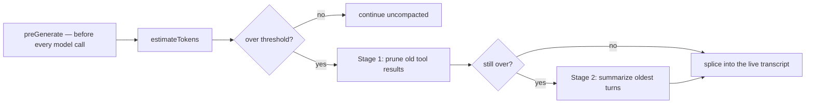

## What this is

Compaction keeps a long run inside its model's context window — like squeezing a stuffed suitcase: first take out the bulky items you no longer need (old tool results, replaced by a short marker — cheap, no model call), and only if that isn't enough, fold the oldest turns into a summary written by a cheaper model. It ships as an `AgentHook` — no changes to the execution loop — because `ctx.request.messages` *is* the run's transcript array, so the hook rewrites reality in place.

## The mental model



Five things exist: the **threshold** (`thresholdPercent` of the context window), the **protected tail** (the newest messages, never touched), the **prune marker** (`[pruned: …]`), the **summary** (a model-written `user` message replacing folded turns), and the **pin** (`pinMessage`, a do-not-touch flag).

## How it works

1. **Before every model call, the hook counts tokens.** `createCompactionHook` registers `preGenerate`; it estimates the tokens of `ctx.request.messages` and acts only above `thresholdTokens = thresholdPercent × contextWindow` (defaults: `0.9`; window from the model registry via `request.model`, else `FALLBACK_CONTEXT_WINDOW` = 128,000; `protectedTokens` default 40,000).
2. **Below the threshold, nothing happens.** The strategy runs only when the estimate is over — an uncompacted run pays just the estimate.
3. **Stage 1 prunes old tool results.** `protectedTailStart` finds the index of the protected tail — the newest messages fitting `protectedTokens`, extended to cover everything after the last assistant message (results the model hasn't seen are never pruned). Before that index, each `tool` message's content becomes `[pruned: <toolName> result, <n> chars]` — only when the marker is shorter.
4. **Stage 2 summarizes — only if pruning wasn't enough.** `twoPhaseStrategy` (what `createAgent({ compaction: { summarizer } })` selects) runs prune first and summarizes only if the pruned result still exceeds `thresholdTokens`. `splitForSummary` groups messages before the tail into atomic units — an assistant turn plus its following tool results is one group, kept or folded *whole* — and keeps any group holding a `system` or pinned message. Folded groups are rendered (`renderForSummary`) and sent to `options.model` under `DEFAULT_SUMMARY_PROMPT` (goal / instructions / progress / state / details); the reply replaces them as one `user` message, `SUMMARY_HEADER` + `\n` + summary, spliced at `summaryAt` (the first folded group's position).
5. **The result is committed in place.** When the strategy returns a different array, the hook `splice`s it into `ctx.request.messages` — which `prepareGenerateRequest` passed as `state.messages` itself. So the compacted transcript is what the next step sees, what `saveStepCheckpoint` persists, and what `ExecutionResult.messages` returns; a pruned result is never pruned twice.

## Under the hood

**What `createAgent({ compaction })` installs.** `compactionHookFor` maps the option to the hook: `true` → the default `pruneToolResultsStrategy`, `{ summarizer }` → `twoPhaseStrategy({ model: summarizer })`, `{ strategy }` → your own. Passing both `summarizer` and `strategy` throws `LOUSHO_CONFIG_CONFLICTING_OPTIONS`.

**Pruning invariants.** Pinned, already-marked and short results are skipped, so re-running is idempotent. Assistant messages (and their `toolCalls`) are untouched: every call keeps a result and the transcript stays provider-valid.

**Failure paths.** A throwing strategy → the run continues uncompacted with `error` reported on `compaction.done`/`onCompaction`. A failing summarizer → falls back to `pruneToolResults` with `error` set. LOU-R11: a summary that doesn't shrink the conversation below the threshold is *rejected* — the transcript array is recorded in a `WeakSet` and compacts prune-only for the rest of that run, so a bad summarizer isn't retried every step.

**Manual compaction.** `session.compact()` → `compactTranscript` runs the same strategies with `thresholdPercent: 0` (always acts), emits `compaction.start`/`compaction.done` with `trigger: 'manual'`, saves the result via the `SessionStore` if anything changed, and returns `SessionCompactResult` (`messagesBefore/After`, `tokensBefore/After`, `strategy`, `error?`). It rejects `LOUSHO_SESSION_BUSY`/`LOUSHO_SESSION_TURN_PENDING`/`LOUSHO_SESSION_AWAITING_APPROVAL` while a turn is in flight or pending.

**Pinned messages.** `pinMessage(message)` sets `metadata.pinned: true`; neither stage prunes or folds it — pin stable facts the run must never lose.

**Standalone and custom strategies.** `compactMessages(messages, options)` runs the pipeline on any transcript outside a run — `prepareCompaction` builds the shared `CompactionInput` (`messages`, `estimateTokens`, `contextWindow`, `protectedTokens`, `thresholdTokens`, `signal`). A `CompactionStrategy` is just `{ name, compact(input) }`: return a new array (never mutate the input), report `tokensBefore`/`tokensAfter`, the `prunedToolCallIds` you replaced, and any `summary` or `error`.

## In code

| Symbol | File | Role |
|---|---|---|
| `createCompactionHook`, `compactMessages`, `prepareCompaction`, `CompactionInput`, `CompactionResult`, `CompactionStrategy`, `CompactionInfo`, `CompactionHookOptions` | `src/context/compaction.ts` | the hook, the standalone API, and the strategy contract |
| `pruneToolResultsStrategy`, `summarizeStrategy`, `twoPhaseStrategy`, `pinMessage`/`isPinned`, `DEFAULT_SUMMARY_PROMPT`, `SUMMARY_HEADER` | `src/context/compaction.ts` | the two stages, the pin flag, the summary prompt/header |
| `AgentCompaction`, `AgentCompactionOptions`, `compactionHookFor`, `manualCompactionOptions` | `src/context/agentCompaction.ts` | `createAgent({ compaction })` wiring |
| `compactTranscript`, `SessionCompactOptions`, `SessionCompactResult` | `src/session/sessionCompact.ts` | `session.compact()` |
| `estimateTokens`, `setTokenEstimator` | `src/models/estimateTokens.ts` | the token counter |
| `getModelInfo` | `src/models/registry.ts` | context-window lookup |

## Example

```ts
import { createAgent, compactMessages, twoPhaseStrategy, pinMessage } from '@lousho/build-ai-agent';

const agent = createAgent({
  model: 'openai/gpt-4o',
  compaction: { thresholdPercent: 0.8, protectedTokens: 20_000, summarizer: 'openai/gpt-4o-mini' },
});

// Standalone, on any stored transcript:
const { messages, tokensBefore, tokensAfter } = await compactMessages(history, { protectedTokens: 8_000 });

// Manual, on a session (events carry trigger: 'manual'):
const result = await session.compact({ strategy: twoPhaseStrategy({ model: 'openai/gpt-4o-mini' }) });
```

The agent compacts automatically once an estimated request exceeds 80% of the model's context window, always keeping the newest ~20,000 tokens intact and using `gpt-4o-mini` to write summaries. `compactMessages` runs the same pipeline on any message list you already have — no agent or session needed. `session.compact()` forces it on a live session (`thresholdPercent: 0`, so it always acts), emits `compaction.start`/`compaction.done` events with `trigger: 'manual'`, persists the result through the `SessionStore`, and refuses to run while a turn is in flight or pending.

## Design decisions

- **Hook, not loop code.** `preGenerate` sees the real transcript array (`prepareGenerateRequest` hands `state.messages` over, no copy) — one deliberate aliasing decision gives compaction reach into later steps, checkpoints and results for free.
- **Prune before summarize.** Tool results dominate long transcripts and the model already acted on them; pruning costs nothing. Summarizing costs a model call and loses detail, so it's the fallback — and it prunes first so the summary is smaller and cheaper.
- **Atomic turn groups in `splitForSummary`.** Folding an assistant message without its tool results would orphan calls and break provider validity; groups keep the invariant structurally, not by convention.
- **Heuristic tokens.** `estimateTokens` (~4 chars/token Latin, per-message overhead, flat 1,000/image part) is for budgeting, not billing — over-estimating is safe, and `setTokenEstimator` accepts a real tokenizer.
- **Char counts in markers.** `[pruned: x result, n chars]` tells the model exactly what was removed and lets it re-fetch (re-run the tool) if it turns out to need it.

## Where next

- [Context assembly](/state/context-assembly) — the request this hook rewrites.
- [Sessions](/state/sessions) — `session.compact()` and what it saves.
- [Durable execution](/core/durable-execution) — compacted transcripts are what checkpoints persist.
- [Execution loop](/core/execution-loop) — where `preGenerate` sits in a step.
