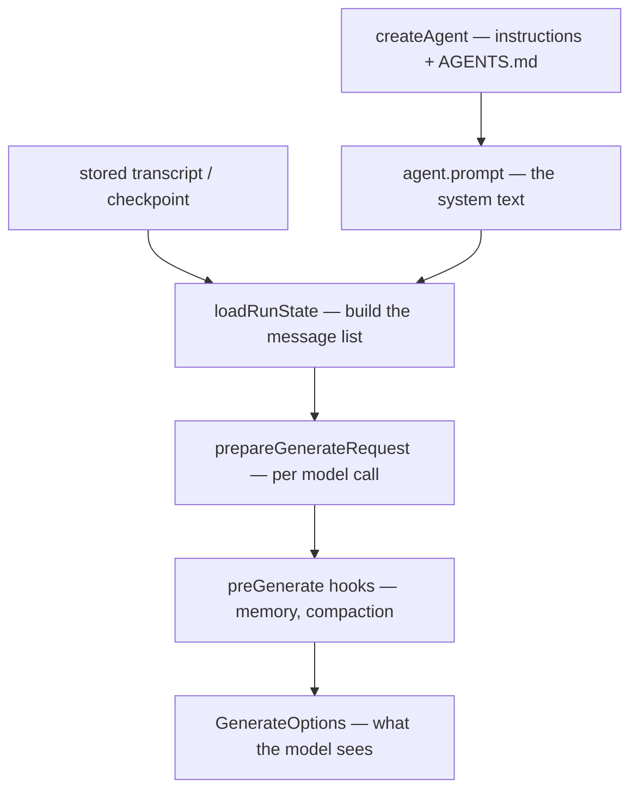

## What this is

Nothing in this SDK stores a prompt. A run's context is *assembled* — like a form letter refilled every time: the system message is rebuilt on every turn from the agent's current config, the durable transcript is appended underneath it, and `preGenerate` hooks (memory recall, compaction) mutate the live array right before each model call. This page traces that pipeline end to end.

## The mental model



Four things exist: the **system prompt** (`agent.prompt`, rebuilt per turn), the **transcript** (the durable conversation), the **message list** (`state.messages`, system prompt on top), and the **request** (`GenerateOptions`, the list plus tools and settings).

## How it works

1. **Agent definition time.** `instructions` (alias `prompt`; both given → `LOUSHO_CONFIG_CONFLICTING_OPTIONS`) may be a string or a per-run function of `RunConfigContext` (`{ sessionId, input, metadata, principal }`). `specOf` builds `agent.prompt` as `(prompt ?? 'You are a helpful assistant.') + projectBlock`, where `projectInstructionsBlock` appends `\n\n## Project instructions (from AGENTS.md)\n\n<content>` — `loadProjectInstructions` walks up from `cwd` to the first dir containing `AGENTS.md` or `CLAUDE.md` (stops at `.git` or root, truncates at 32,000 chars). A resolved dynamic run pins `{ ctx, model }` into `agent.metadata.loushoRunConfig` so a checkpointed run re-resolves identically.
2. **Run start — `extendRunOptions`.** Composed in order: `withSkills` appends a `## Available skills` index block (name + description only) and registers `load_skill`; `withSubagents` similarly adds the `task` block/tool; `withToolSearch` and `withCodeMode` add theirs; finally `PLAN_MODE_INSTRUCTION` (when starting in plan mode) and `outputInstruction(output)` are appended *last* in the system prompt.
3. **Message-list construction — `loadRunState`.** Fresh run: `buildMessages` puts `agent.prompt` as `messages[0]` (`role: 'system'`) followed by `inputMessages(input)` — unless `skipSystemPromptInjection` (resume.ts rebuilds from a snapshot that already has one). Checkpointed run: `stateFromCheckpoint` takes `checkpoint.messages` and appends `newSessionMessages(...)` — input that re-sends the stored transcript contributes only its suffix; system messages in input are dropped; for an unfinished run, re-sending the user turn it started from is treated as a retry and contributes nothing. `splitPendingTurn` then extracts unanswered tool calls into `pendingToolCalls` and holds back `queuedInput`, so a user message never sits between a tool-call turn and its results.
4. **Per step — `prepareGenerateRequest`.** Builds `GenerateOptions`: `model` = `agent.settings.model` > `provider.defaultModel`; `messages` = `state.messages` **by reference**; `tools` = `visibleTools(tools, messages, deferral)` (deferred tools filtered out until `tool_search` loads them); plus `hostedTools` (filtered by permission mode), `responseFormat`, `reasoning`, `signal`, `temperature`, `maxTokens`. Then `onLLMRequest`, then `hooks.runPreGenerate` — and `reloadTools` recomputes visible tools afterward (a compaction that pruned a `tool_search` result unloads its tools).
5. **What the hooks add.** `memory-recall` (first call only, skipped for sub-agents) appends `<memory name="...">` blocks to `messages[0]`; the `compaction` hook may `splice` the whole array smaller. Both mutate the real transcript — that's the point (see below).
6. **The loop grows the list.** `assistantTurn(result)` pushes the assistant message (keeping only signed/redacted reasoning blocks providers need back); `pushToolResult` appends one `tool` message per call in call order; queued/steered input lands at safe points; a surfaced provider failure becomes a `[provider-error]` user message. `saveStepCheckpoint` writes `messages + queuedInput + inputQueue.messages` so nothing pending is lost.

## Under the hood

Where each piece lands in the request:

```text
request.messages[0]  system:  instructions
                              + ## Project instructions (from AGENTS.md)
                              + ## Available skills / task / tool_search / plan / output blocks
                              + <memory name="…"> recall blocks (run-local, never persisted)
request.messages[1..]         transcript: user ↔ assistant(+toolCalls, reasoning) ↔ tool results
                              (+ [Conversation summary] user msgs, [provider-error] notes, queued input)
request.tools                 visible agent tools + remember_/recall_ + load_skill + task + tool_search + run_code
                              minus deferred-not-loaded; hostedTools separate (plan mode: read-only)
```

**Durability vs liveness.** Sessions store the transcript minus `messages[0]`; checkpoints store messages but a *session turn* always re-injects the current prompt. Edit instructions, AGENTS.md or memory items and every continued conversation picks them up — durability lives in the transcript, liveness in the prompt.

**The aliasing contract.** `ctx.request.messages` IS `state.messages` — no defensive copy. `preGenerate` hooks rewrite the actual run transcript, so compaction persists to checkpoints and `ExecutionResult.messages` for free. The aliasing is deliberate and documented in `compaction.ts`'s file header.

## In code

| Symbol | File | Role |
|---|---|---|
| `agentSpecs` / `specOf` / `instructionsOption` / `projectInstructionsBlock` | `src/createAgent.ts` (~lines 1112–1143, 1306–1330) | instructions + project block → `agent.prompt` |
| `loadProjectInstructions` | `src/projectInstructions.ts` | AGENTS.md/CLAUDE.md discovery |
| `extendRunOptions` | `src/execution/AgentExecutor.ts` (~line 677) | skills, sub-agents, tool search, code mode, plan-mode and `output` blocks |
| `buildMessages`, `freshState`, `stateFromCheckpoint`, `loadRunState` | `src/execution/agentRunState.ts` | message-list construction and rehydration |
| `inputMessages`, `newSessionMessages`, `splitPendingTurn` | `src/execution/transcript.ts` | transcript merge rules |
| `prepareGenerateRequest`, `buildTools`, `visibleTools`/`reloadTools` | `src/execution/generateStep.ts`, `src/execution/toolDeferral.ts` | per-step request assembly |
| `withSkills`, `withPromptTool` (`load_skill`, `## Available skills` block) | `src/skills/withSkills.ts` | skills index + loader tool |
| `recallHook`/`setBlocks` | `src/memory/withMemory.ts` | `<memory>` blocks into `messages[0]` |

## Example

```ts
const agent = createAgent({
  model: 'openai/gpt-4o-mini',
  instructions: 'You are a helpful assistant.',
  projectInstructions: true,                        // appends nearest AGENTS.md/CLAUDE.md
  skills: await loadSkills('./skills'),             // '## Available skills' + load_skill tool
  memory: [defineMemory({ name: 'notes', scope: 'session', provider: fileMemory({ dir: './.lousho/memory' }) })],
  compaction: true,
});

const session = agent.session({ id: 'user-42', store });
await session.send('Hi');
// session.messages  → [user 'Hi', assistant '…'] — transcript only;
// the system prompt, skills index and <memory> block are rebuilt per turn, never stored.
```

This agent's system prompt is four layers: the `instructions` string, the nearest `AGENTS.md`/`CLAUDE.md` found walking up from `cwd`, the `## Available skills` index, and — on the first model call of each turn — the `<memory name="notes">` recall block. `session.messages` after `send('Hi')` holds only `[user 'Hi', assistant '…']`: everything above the transcript is rebuilt from live config every turn, so editing a memory item or AGENTS.md changes what the *next* turn sees without touching saved history.

## Design decisions

- **The system prompt is never persisted.** Sessions store the transcript minus `messages[0]`; checkpoints store messages but a *session turn* always re-injects the current prompt. Edit instructions, AGENTS.md or memory items and every continued conversation picks them up — durability lives in the transcript, liveness in the prompt.
- **`ctx.request.messages` IS `state.messages`.** No defensive copy: `preGenerate` hooks rewrite the actual run transcript so compaction persists to checkpoints and `ExecutionResult.messages` for free. The aliasing is deliberate and documented in `compaction.ts`'s file header.
- **Progressive disclosure over bigger prompts.** Skills enter as a one-line index + `load_skill`; deferred tools enter via `tool_search`; full content arrives as *tool results* — compressible by stage-1 pruning exactly when they're stale.
- **Provider-validity is structural.** `splitPendingTurn`, `providerValidPrefix` and atomic summary groups all enforce "every tool call has its result" so a checkpoint reloaded in another process is always a request providers accept.
- **Per-run config pinning.** Dynamic `model`/`instructions`/`tools` are re-resolved from the checkpointed `ctx` (`RUN_CONFIG_KEY`), not re-asked — a resumed run sees the same agent it started with (drift checking handles deliberate changes).

## Where next

- [Execution loop](/core/execution-loop) — the steps this assembled request feeds.
- [Memory](/state/memory) — how `<memory>` blocks are produced.
- [Compaction](/state/compaction) — the hook that rewrites the assembled list.
- [Durable execution](/core/durable-execution) — checkpoint rehydration (`stateFromCheckpoint`).
