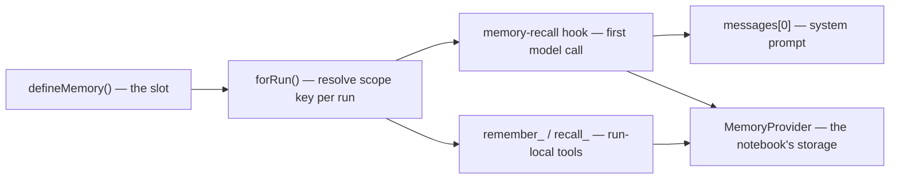

## What this is

A session remembers one conversation; memory slots are what an agent keeps *across* conversations — like labeled notebooks the agent carries from one job to the next. `defineMemory()` declares a named, scoped slot backed by a `MemoryProvider`; `createAgent({ memory })` wires each slot into every run as a recall block in the system prompt plus two model-facing tools, `remember_<name>` and `recall_<name>`.

## The mental model



Five things exist: the **slot** (a named notebook: `MemorySlot`), the **scope key** (which user's/session's notebook this run opens), the **provider** (where items are stored: `MemoryProvider`), the **recall block** (`<memory name="…">` injected into the system prompt), and the **tools** (`remember_`/`recall_`).

## How it works

1. **You define a slot.** `defineMemory` validates `name` (`/^[a-zA-Z0-9_-]{1,55}$/` — it becomes a tool-name suffix), checks the provider has `list`/`add`, and returns a frozen `MemorySlot` with defaults: `recall: { onSessionStart: true, maxItems: 10, query: 'none' }`, `expose: { remember: true, recall: true }`.
2. **Each run resolves the slot's scope key.** `agentMemory(slots).forRun(ctx, toolRegistry, hooks)` maps each slot to a key: `'global'` → `'global'`; `'session'` → `session:<ctx.sessionId>`; a function scope → whatever it returns from `{ sessionId, metadata, principal }`. A slot with no key (no session, function returned `undefined`) simply does not exist for that run — no recall block, no tools.
3. **The first model call recalls into the prompt.** `forRun` prepends a `memory-recall` `AgentHook` to the run's hooks. On the run's *first* `preGenerate` (skipped for sub-agents via `ctx.subagent`), for every slot with `recall.onSessionStart` it calls `provider.list(key, { limit: maxItems, query })` — `query` is the last user message's text when `query: 'last-input'`. Non-empty lists become `<memory name="...">\n- item text\n</memory>` blocks, and `setBlocks` appends them to `messages[0]` (the system message), regex-replacing blocks of the same names so a resumed run doesn't duplicate.
4. **The model gets two tools.** `memoryTools` builds `remember_<name>` (`{ text }` → `provider.add(key)` → `{ remembered: id }`) and `recall_<name>` (`{ query?, limit? }` → `{ items: [{ id, text, createdAt }] }`, default `limit` = `slot.recall.maxItems`; `readOnlyHint`, so plan mode allows it). Both are bound to *this run's* scope key, registered on a `RunToolRegistry` overlaying the agent's registry, and marked `transient`.
5. **The provider does the storing.** Both the recall hook and the tools talk only to the `MemoryProvider` contract — `list`, `add`, `remove`, optional `ranking` — so the same slot works over memory, files, SQLite, KV, or a vector index.

## Under the hood

**Recall blocks are never persisted.** Because session transcripts never store the system message, injected `<memory>` blocks don't land in saved history — recall is rebuilt fresh each run.

**`itemsProvider` — the default shape.** `itemsProvider(store)` implements `MemoryProvider` over a per-key `load`/`save` pair: updates are serialized per scope key via `keyedQueue` (concurrent `remember` calls don't lose items), the stored list is capped at `maxItems` (oldest dropped, default 1,000), and `list` returns newest-first with an optional word-match `query` (3+ letter words, substring match) unless `ranking: 'relevance'`.

**Concrete providers.** `fileMemory` stores one JSON file per scope key (atomic temp+rename); `sqliteMemory` keeps the same JSON-array shape in the agent's `SqliteStore` file (table `memory_items`); `inMemoryMemory` is the ephemeral default; `inMemoryVectorMemory` + `aiSdkEmbedder` give `ranking: 'relevance'` providers.

**`kvMemory` is deferred.** A memory module is evaluated at Worker load time, before `env` exists, so `bindWorkerMemoryProvider` swaps it per request for a KV-backed `itemsProvider` on `env[binding]` (default `AGENT_CHECKPOINTS`, keys `memory/<key>`) or falls back to in-memory.

**Item shape.** A `MemoryItem` is `{ id, text, createdAt, metadata? }` — the provider assigns `id` and `createdAt` on `add`, so `remember_<name>` can report `{ remembered: id }` and `remove` can target one entry.

## In code

| Symbol | File | Role |
|---|---|---|
| `defineMemory`, `MemorySlot`, `MemoryScope`, `MemoryScopeContext`, `DefineMemoryOptions` | `src/memory/defineMemory.ts` | slot definition; `MemoryScope` = `'global' \| 'session' \| (ctx) => string \| undefined` |
| `MemoryProvider`, `MemoryItem` | `src/memory/defineMemory.ts` | the storage contract: `list(scopeKey, { limit?, query? })`, `add`, `remove`, `ranking?` |
| `agentMemory(slots)` → `AgentMemory` (`addTools`, `forRun`), `RunToolRegistry`, `recallHook`, `setBlocks` | `src/memory/withMemory.ts` | per-run wiring: scope keys, recall hook, tools |
| `inMemoryMemory`, `itemsProvider`, `MemoryProviderOptions`, `keyedQueue` | `src/memory/providers.ts`, `src/memory/keyedQueue.ts` | list-backed provider (`maxItems` default 1000), per-key serialization |
| `fileMemory({ dir })`, `sqliteMemory(store)` | `src/memory/fileMemory.ts`, `src/storage/sqlite/sqliteMemory.ts` | file and SQLite providers |
| `inMemoryVectorMemory`, `aiSdkEmbedder` | `src/memory/vectorProvider.ts`, `src/memory/embeddings.ts` | `ranking: 'relevance'` providers |
| `kvMemory()`, `bindWorkerMemoryProvider` | `src/deploy/workerMemory.ts` | deferred KV provider for Workers |

## Example

```ts
import { createAgent, defineMemory, fileMemory } from '@lousho/build-ai-agent';

const preferences = defineMemory({
  name: 'preferences',
  description: "the user's preferences: language, tone, tools they like",
  scope: (ctx) => ctx.metadata?.userId as string | undefined, // per-user memory
  provider: fileMemory({ dir: './.lousho/memory' }),
  recall: { maxItems: 5, query: 'last-input' },
});

const agent = createAgent({ model: 'openai/gpt-4o-mini', memory: [preferences] });
// First model call of a run: system prompt gains
// <memory name="preferences">- newest items…</memory>
// and the model gets remember_preferences / recall_preferences.
```

The slot is named `preferences` and scoped per user — the scope function reads `ctx.metadata.userId`, so each user's notebook is a separate scope key (a run without `userId` gets no memory at all). Items persist as JSON files under `./.lousho/memory`. At each run's first model call, `recall` asks the provider for up to 5 items matching the last user message and injects them as a `<memory name="preferences">` block; the model can also write with `remember_preferences` or search with `recall_preferences`.

## Design decisions

- **Scope keys, not stores.** One slot definition serves every user/session because the *key* is resolved per run — per-user memory is a scope function reading `ctx.principal` (key on `issuer` + `id`; ids collide across issuers).
- **Recall lands in the system prompt, not the transcript.** Memory is cross-session state; writing it into the transcript would freeze stale items into one session's saved history. `setBlocks` replaces only same-named blocks, leaving other slots' blocks intact.
- **Tools are run-local and transient.** Binding `remember_`/`recall_` to a resolved key inside `forRun` means a tool can never write to the wrong scope, and `transient` keeps them out of `fingerprintOf` — otherwise every approval resume would report "agent drift" for missing memory tools.
- **Two read paths on purpose.** `recall` in the system prompt is ambient (always on, cheap); `recall_<name>` is deliberate search. A provider can declare `ranking: 'relevance'` (vector stores) and only the tool description changes — the contract is identical.
- **Memory survives `session.clear()`** — slots are cross-session by definition; clearing wipes only the transcript.

## Where next

- [Sessions](/state/sessions) — `scope: 'session'` keys on the session id.
- [Storage stores](/state/storage-stores) — `sqliteMemory` shares the agent's database file.
- [Context assembly](/state/context-assembly) — where the `<memory>` block lands in the request.
- [Durable execution](/core/durable-execution) — why memory tools are `transient`.
